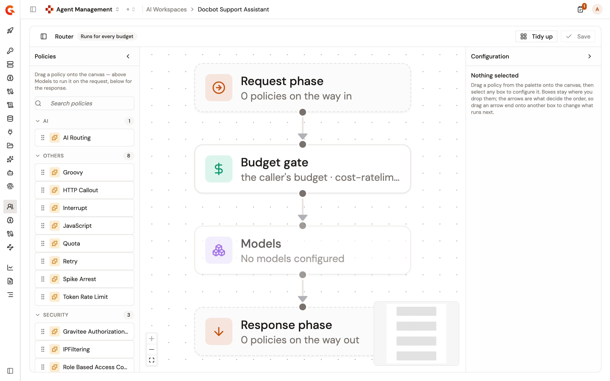
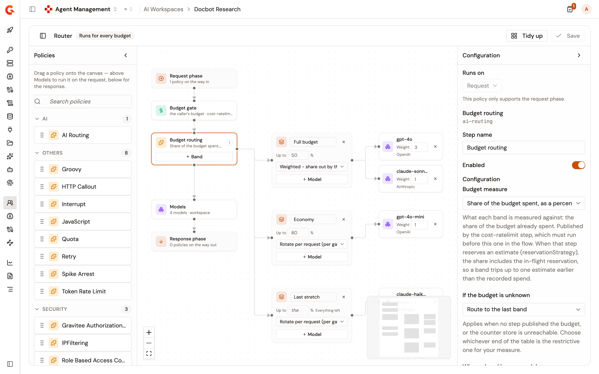
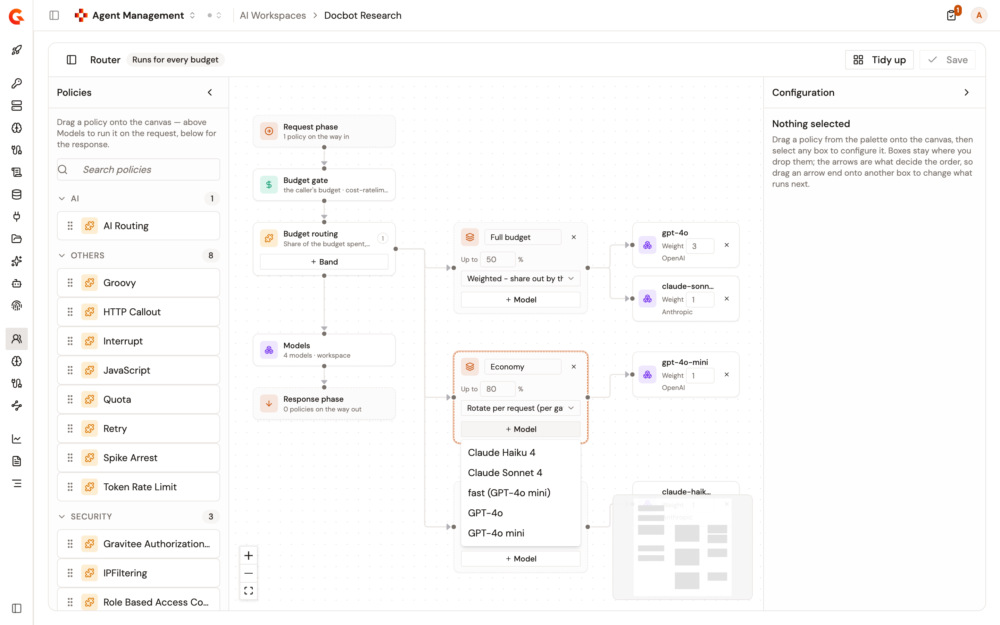
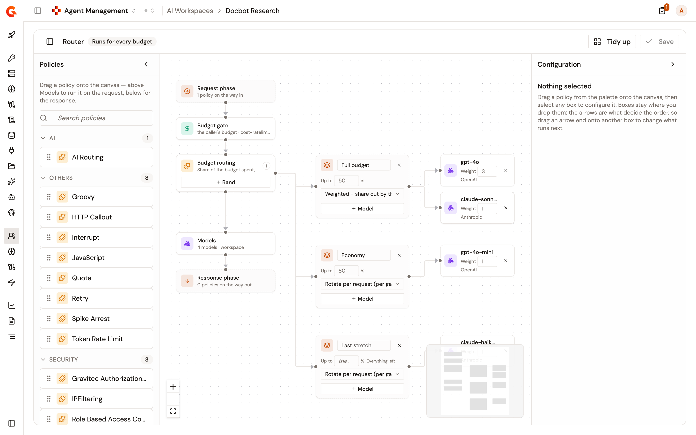

# Configure AI workspace routing

The **Router** page of an AI Workspace holds the policies that run on every call to the workspace, whatever budget the member is on. An **AI Routing** step on that page chooses the model that serves a request from the share of the member's budget already spent. As a member spends, their requests move to the models you set for the next band. The cost budget still stops them at its ceiling. See [Manage AI workspace budgets](manage-ai-workspace-budgets.md).

## How routing chooses a model

An **AI Routing** step holds bands, ordered from a full budget to a spent one. Each band starts where the band above it stops, and lists the models it routes to:

* A request goes to the first band whose limit is above the member's spent share. With a first band limited at `50`, members who have spent less than 50% of their budget are served by that band.
* The last band has no limit and serves everything left.
* The share counts the spend the budget has recorded plus an estimate for each of the member's calls still in progress, the current one included. A band can therefore apply earlier than the recorded spend alone suggests.
* The model the band picks replaces the model named in the request, even a model the workspace doesn't hold. This applies on the `/chat/completions`, `/responses`, `/embeddings`, and `/count_tokens` paths alike, so a band of chat models also takes the members' `/embeddings` calls.
* Only the model the band picks is called. The other models of the band aren't tried when that call fails.

When a band lists several models, its strategy picks one per request. A band with no strategy selected rotates per request:

<table>
    <thead>
        <tr>
            <th width="260">Strategy</th>
            <th>How the model is picked</th>
        </tr>
    </thead>
    <tbody>
        <tr>
            <td><strong>Rotate per request (per gateway node)</strong></td>
            <td>Each model in turn. Every gateway node keeps its own rotation.</td>
        </tr>
        <tr>
            <td><strong>Weighted - share out by the weights below</strong></td>
            <td>In proportion to each model's <strong>Weight</strong>. A model weighted <code>3</code> serves three times as many requests as a model weighted <code>1</code>. Only this strategy reads the weights.</td>
        </tr>
        <tr>
            <td><strong>Random</strong></td>
            <td>At random.</td>
        </tr>
    </tbody>
</table>

Two settings of the step cover the requests the bands don't decide:

* **If the budget is unknown** applies when the spent share can't be read, for example when the budget's counter can't be reached. The default is **Route to the last band**. The other options are **Route to the first band** and **Leave the request on the model it asked for**.
* **When a band has no models** defaults to **Leave the request on the model it asked for**. Choose **Reject the request with 503** to refuse the requests that reach a band with no models.

If the step itself fails, the request goes to the model it asked for. A band that routes to a model the workspace no longer holds gets the same `model_not_found` refusal as a request that names an unknown model. See [What members can call](add-models-to-an-ai-workspace.md#what-members-can-call).

## Open the Router page

To open the **Router** page of a workspace, complete the following steps:

1. From the Gamma console sidebar, open **Agent Management**.
2. Under **Secure**, open **AI Workspaces**.
3. Select the workspace.
4. Under **Access**, click **Router**.

    <figure><figcaption>
The Router page before any policy is added
</figcaption></figure>

A policy placed above **Models** runs on the request, after the **Budget gate** checks the member's budget. A policy placed below **Models** runs on the response. The arrows between the boxes set the order.

## Add an AI Routing step

To route requests by the share of budget spent, complete the following steps:

1. In **Policies**, drag **AI Routing** onto the canvas above **Models**. The policy runs on the request only.
2. Select the **AI Routing** box, and in **Configuration**, set **If the budget is unknown** and **When a band has no models**.

    The form also lists **Bands**, but the band boxes on the canvas replace them when you save. Edit bands on the canvas.

    <figure><figcaption>
The Configuration panel of the AI Routing step
</figcaption></figure>

3. On the **AI Routing** box, click **Band**. Repeat for each band you need.
4. In **Up to** on each band, set the share of the budget spent, as a percentage, where the band stops. A new band arrives with a limit already filled in. Give each band a higher limit than the band above it.
5. On the last band, clear **Up to** or enter `100`. The band then reads **Everything left**.
6. Optional: Enter a name for a band. The name replaces the band's default title, and the policy uses it in its logs.
7. In **Strategy**, select how the band picks a model.
8. Click **Model** on the band, and select a model. Repeat to add more. The list holds the models of the workspace and their aliases.

    <figure><figcaption>
The Model list of a band
</figcaption></figure>

9. For the **Weighted - share out by the weights below** strategy, set the **Weight** of each model.
10. Click **Save**.
11. In the **This API is out of sync** banner, click **Deploy**.
12. In the **Deploy your API** dialog, click **Deploy**.

Saving writes the router to every budget of the workspace, and a budget you create later starts with it. Saving doesn't deploy, so the change reaches the gateway only when you deploy the workspace.

When a budget carries routing that differs from the router, the page reports **Some budgets are running different routing** and names the budgets. The alert names only the budgets you can view, but saving rewrites every budget of the workspace.

## Fix the messages that block Save

**Save** stays unavailable while the canvas reports a problem, and while the **Configuration** form of the selected step holds an invalid value. A badge beside **Router** counts the problems, and its tooltip lists them:

<table>
    <thead>
        <tr>
            <th width="330">Message</th>
            <th>Fix</th>
        </tr>
    </thead>
    <tbody>
        <tr>
            <td><code>"&lt;box&gt;" leads to &lt;n&gt; boxes.</code></td>
            <td>Keep one outgoing arrow on each box.</td>
        </tr>
        <tr>
            <td><code>The chain never reaches Models.</code></td>
            <td>Draw the arrows from <strong>Request phase</strong> through to <strong>Models</strong>.</td>
        </tr>
        <tr>
            <td><code>The arrows loop back on themselves.</code></td>
            <td>Remove the arrow that closes the loop.</td>
        </tr>
        <tr>
            <td><code>"&lt;policy&gt;" is wired ahead of the Budget gate.</code></td>
            <td>Move the policy after <strong>Budget gate</strong>.</td>
        </tr>
        <tr>
            <td><code>"&lt;band&gt;" is limited at &lt;n&gt;%, which is no share of the budget.</code></td>
            <td>Enter a limit above <code>0</code>.</td>
        </tr>
        <tr>
            <td><code>"&lt;band&gt;" is limited at &lt;n&gt;%, which the band above it already covers.</code></td>
            <td>Raise the limit above the limit of the band before it.</td>
        </tr>
        <tr>
            <td><code>Two bands are named "&lt;name&gt;".</code></td>
            <td>Rename one of the bands. Names are compared without regard to case.</td>
        </tr>
        <tr>
            <td><code>"&lt;band&gt;" routes to &lt;model&gt; twice.</code></td>
            <td>Remove the duplicate model from the band.</td>
        </tr>
    </tbody>
</table>

The canvas only warns, without blocking **Save**, when the last band has a limit. Clear that limit. If the last band keeps a limit, the gateway skips the **AI Routing** step, and no request is routed.

## Verification

To verify routing is working as expected, follow these steps:

1. Deploy the workspace after saving the router.
2. Call the workspace entrypoint with a member's API key. See [Assign users to an AI workspace](assign-users-to-an-ai-workspace.md).
3. Read the `X-Cost-Rate-Limit-Limit` and `X-Cost-Rate-Limit-Remaining` headers of the response to work out the share of the budget the member has spent.
4. Confirm the `model` field of the response names a model of the band that share falls in.

    <figure><figcaption>
A router with three bands
</figcaption></figure>
