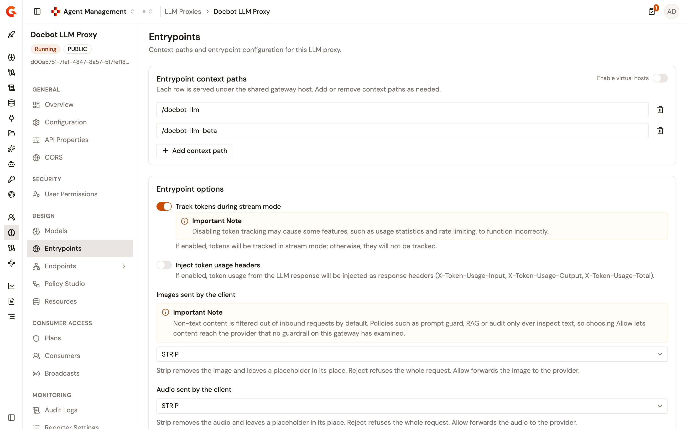
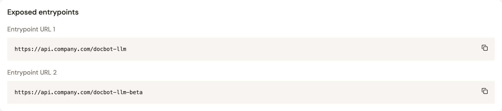

# Configure LLM Proxy entrypoints

The **Entrypoints** page configures how consumers reach an LLM Proxy through the AI Gateway. The proxy listens either on one or more context paths under the shared gateway host, or on virtual hosts, where each row binds a host to a path. The same page edits the options of the LLM Proxy entrypoint plugin, such as token tracking, which you first set in the creation wizard.

## Prerequisites

Before you begin, confirm that you have the following:

* An LLM Proxy. For more information, see [Create an LLM Proxy](create-an-llm-proxy.md).
* Permission to update the API definition of the proxy. The page is read-only without it: the fields, the switches, and the save bar stay disabled.

To open the page, follow these steps:

1. From the Gamma console sidebar, select **Agent Management**.
2. Under **Secure**, select **LLM Proxies**.
3. Select your LLM Proxy.
4. Under **Design**, click **Entrypoints**.

The page reads the listener of the deployed API definition, so a context path added outside Gamma appears here as well. When the deployed listener can't be read, the page shows the alert **Showing the last configuration Gamma stored** above the last configuration Gamma saved. Editing stays disabled until the listener can be read again.

<figure><figcaption>
The Entrypoints page
</figcaption></figure>

## Manage context paths

The **Entrypoint context paths** card defines the URL prefixes consumers use to reach the LLM Proxy. Each row is served under the shared gateway host.

* Add a row with **Add context path**. Add more than one path when the proxy is exposed under several routes.
* Each **Context path** starts with `/`, is longer than three characters, and uses only letters, digits, and the `/`, `.`, `-`, and `_` characters. A path can't contain `//` or end with `/`, and two rows can't carry the same path.
* Remove a row with its remove button. The button appears only while the card holds more than one row.
* A row that breaks a rule shows the reason under the row, and the save bar reads **Fix the highlighted context paths to save.** until you fix it.

The following table lists the messages a row can show.

| Message                                                   | Cause                                                                                                              |
| --------------------------------------------------------- | ------------------------------------------------------------------------------------------------------------------ |
| **Context path is required.**                             | The path is empty.                                                                                                 |
| **Context path is not valid.**                            | The path doesn't start with `/`, contains `//`, or uses a character other than letters, digits, `/`, `.`, `-`, and `_`. |
| **Context path has to be more than 3 characters long.** | The path is three characters or shorter.                                                                           |
| **Context path must not end with a slash.**              | The path ends with `/`.                                                                                            |
| **This context path is already used.**                    | Another row carries the same path.                                                                                 |

## Switch to virtual hosts

Turn on the **Enable virtual hosts** switch to bind each row to a host. The card is renamed **Virtual hosts**, the paths you entered stay in place, and each row carries the following fields.

| Field               | Description                                                                                                                                                                    |
| ------------------- | ------------------------------------------------------------------------------------------------------------------------------------------------------------------------------ |
| **Virtual host**    | The host consumers must call to reach this row, for example `api.example.com`. The field is required, and an empty host shows **Virtual host is required.**                     |
| **Context path**    | The path served under that host. The rules of context-path mode apply.                                                                                                         |
| **Override access** | When on, the exposed entrypoint URL of this row is built from the virtual host itself. When off, it's built from the gateway access points of the environment, like a plain context path. |

In virtual-host mode, two rows can't carry the same host and path pair. A duplicate shows **This virtual host and path pair is already used.**

Turning the switch off removes every host binding while the paths stay. When at least one row has a host, the **Turn off virtual hosts?** dialog warns that the hosts aren't kept anywhere. Click **Turn off virtual hosts** to confirm, or **Cancel** to keep them.

## Edit the entrypoint options

The **Entrypoint options** card renders the options that the LLM Proxy entrypoint plugin declares, with the labels and help text the plugin ships, and shows the values currently deployed. An option that a later plugin version adds appears on this card without a console update, and its value is kept when you save.

With the plugin version bundled in Gamma 4.13, the card lists the following options.

| Option                              | Plugin default | Description                                                                                                                                                                                  |
| ----------------------------------- | -------------- | -------------------------------------------------------------------------------------------------------------------------------------------------------------------------------------------- |
| **Track tokens during stream mode** | On             | Tracks token usage on streamed responses. When off, tokens sent in stream mode aren't tracked, and features such as usage statistics and rate limiting might not function correctly.       |
| **Inject token usage headers**      | Off            | Adds the `X-Token-Usage-Input`, `X-Token-Usage-Output`, and `X-Token-Usage-Total` response headers with the token usage of the LLM response.                                                |
| **Images sent by the client**       | `STRIP`        | What the gateway does with an image in a request. `STRIP` removes it and leaves a placeholder in its place, `REJECT` refuses the whole request, and `ALLOW` forwards it to the provider.     |
| **Audio sent by the client**        | `STRIP`        | The same choices, for audio content.                                                                                                                                                         |
| **Video sent by the client**        | `STRIP`        | The same choices, for video content.                                                                                                                                                         |
| **Files sent by the client**        | `STRIP`        | The same choices, for files.                                                                                                                                                                 |

A proxy created from the wizard starts with both token options on, because the wizard turns them on by default.


Content other than text is stripped from requests by default. Policies such as prompt guard rails inspect only text, so choosing `ALLOW` lets content reach the provider that no guardrail on the gateway has examined.


## Save and deploy

A change on the page shows the save bar. Click **Save changes** to apply, or **Discard** to revert. A successful save shows **Entrypoints saved.** The first row is the context path shown in the **Context path** column of the LLM Proxies list.

Saving updates the API definition but doesn't deploy it. The **This API is out of sync** banner appears at the top of the detail view. Click **Deploy**, optionally enter a deployment label in the **Deploy your API** dialog, and click **Deploy** to push the change to the gateway.

## Preview the exposed entrypoints

The **Exposed entrypoints** card lists the gateway URLs the proxy answers on, one **Entrypoint URL** block per row, each with a copy button. The same URLs appear in the **Connection** card of the **Overview** page.

A URL is built from the gateway access points of the environment when they're configured, and otherwise from the default gateway entrypoint of the environment. A row with **Override access** on uses its virtual host instead. When Gamma can't resolve the URLs, the card prefixes each context path with the gateway URL from the portal settings of the environment. When that URL isn't set either, the prefix is `https://gateway.example.com`.

## Verification

To verify a new context path, follow these steps:

1. Add a context path and click **Save changes**.
2. Click **Deploy** in the **This API is out of sync** banner, and then click **Deploy** in the **Deploy your API** dialog.
3. Send a prompt to the URL shown in the **Exposed entrypoints** card, as described in [Publish your LLM Proxy](../publish/publish-your-llm-proxy.md). The gateway routes the request to the proxy.

<figure><figcaption>
The Exposed entrypoints card
</figcaption></figure>

## Next steps

* [Create an LLM Proxy](create-an-llm-proxy.md). Set the first context path and the entrypoint options in the creation wizard.
* [Configure an LLM Proxy](configure-an-llm-proxy.md). Add guardrails, security plans, and policies.
* [Publish your LLM Proxy](../publish/publish-your-llm-proxy.md). Deploy the proxy and check consumer access.
