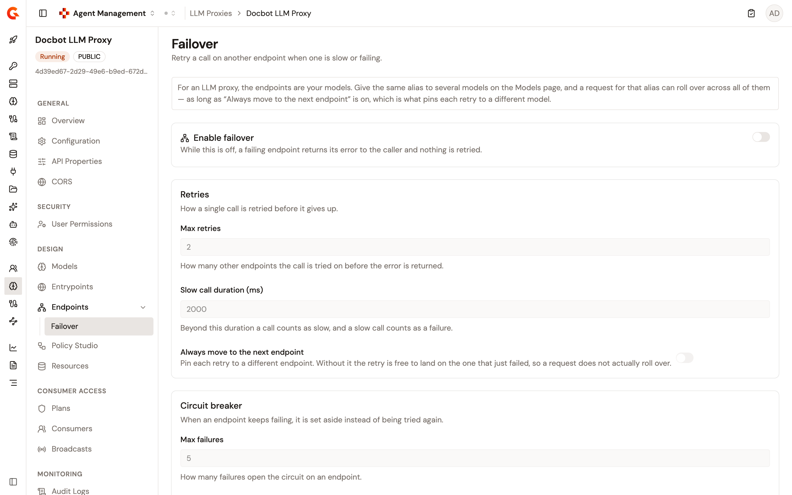
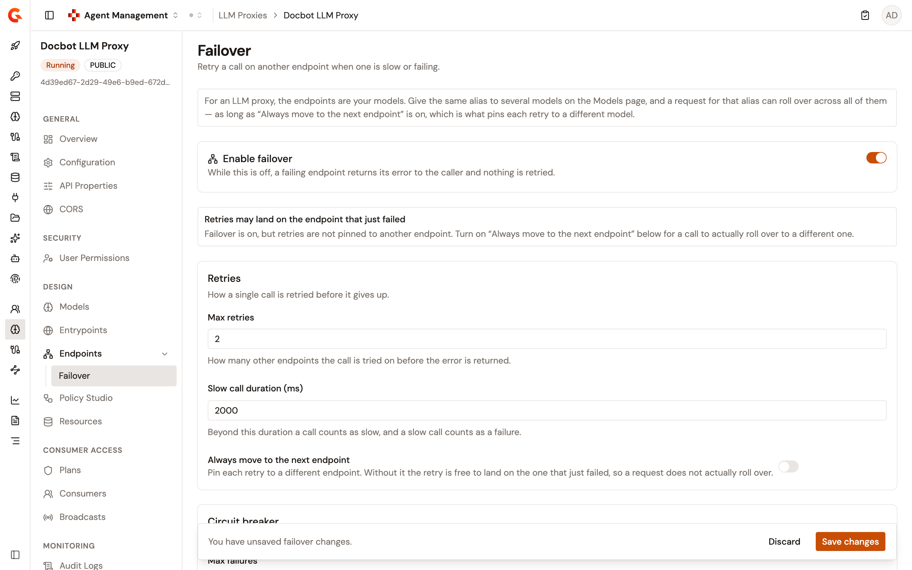
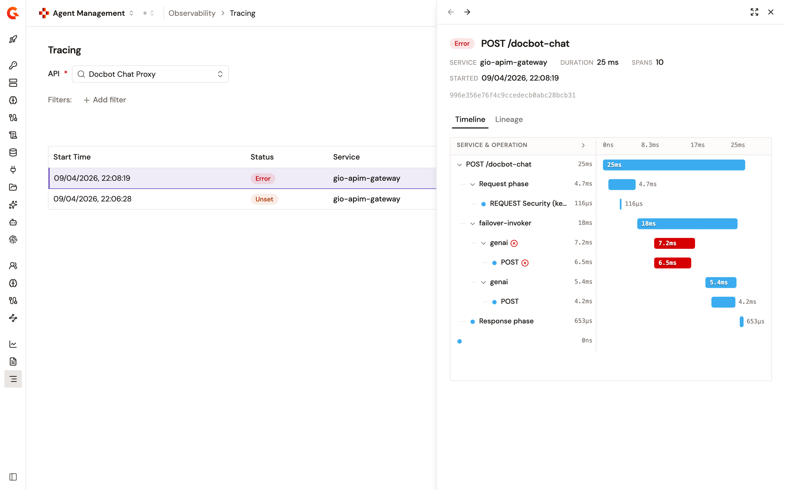

# Configure LLM Proxy failover

The **Failover** page retries a call on another endpoint when one is slow or failing. It also opens a circuit on an endpoint that keeps failing, so that endpoint is left aside for a while. Every provider you add to an LLM Proxy becomes one endpoint of a single endpoint group, so a retry moves the call to another provider of the same proxy.

Failover is off until you turn it on, and the rest of the page stays disabled while it's off.

## Prerequisites

Before you begin, confirm that you have the following:

* An LLM Proxy with more than one provider. A proxy with a single provider has nothing to roll over to, and its retries go back to the same provider. For more information, see [Create an LLM Proxy](create-an-llm-proxy.md).
* Permission to update the API definition of the proxy. Without it the page is read-only: every switch and field stays disabled, and the save bar never appears.

To open the page, follow these steps:

1. From the Gamma console sidebar, select **Agent Management**.
2. Under **Secure**, select **LLM Proxies**.
3. Select your LLM Proxy.
4. Under **Design**, click **Endpoints**.
5. Click **Failover**.

A proxy that never configured failover opens with failover off and the values the gateway applies by default, rather than an empty form.

<figure><figcaption>
The Failover page
</figcaption></figure>

## Roll over across providers with a shared alias

Failover moves a call between the endpoints of the proxy, and each endpoint is one provider. For a caller to reach the same model on another provider, that model needs the same alias on each provider that serves it.

* Set aliases per model on the **Models** page of the proxy, or when you add the provider. For more information, see [Create an LLM Proxy](create-an-llm-proxy.md).
* An alias routes, and fails over, only across the providers that declare it. When the aliases differ between providers, the **Models** page shows the **Model aliases differ across providers** alert and lists the aliases each provider carries.
* When several providers declare the same alias, the first provider declared serves it, and the others take the call when failover rolls over.

Turn on **Always move to the next endpoint** for a retry to reach a different provider. Without it a retry goes back through the load balancer, which is free to pick the provider that just failed.

## Enable failover

Turn on the **Enable failover** switch. While it's off, a failing provider returns its error to the caller and nothing is retried, and the retry and circuit breaker settings stay disabled.

## Set the retry behavior

The **Retries** card controls how a single call is retried before it gives up.

| Setting                              | Default | Description                                                                                                                            |
| ------------------------------------ | ------- | -------------------------------------------------------------------------------------------------------------------------------------- |
| **Max retries**                      | `2`     | How many other endpoints the call is tried on before the error is returned. The lowest accepted value is `1`.                          |
| **Slow call duration (ms)**          | `2000`  | Beyond this duration a call counts as slow, and a slow call counts as a failure. The attempt is also abandoned at this duration. The lowest accepted value is `0`. |
| **Always move to the next endpoint** | Off     | Pin each retry to a different endpoint. Without it the retry is free to land on the one that just failed, so a request doesn't actually roll over. |

While failover is on and **Always move to the next endpoint** is off, the page shows the **Retries may land on the endpoint that just failed** alert.

<figure><figcaption>
Failover enabled, with retries not yet pinned to another endpoint
</figcaption></figure>

With **Always move to the next endpoint** on, each retry moves to the next endpoint in the order the providers are declared on the proxy. The rotation cycles back to the first endpoint after the last, and it needs more than one endpoint. The load balancer still picks the endpoint of the first attempt. When every attempt fails, the gateway answers `502`.

## Tune the circuit breaker

The **Circuit breaker** card sets when an endpoint is set aside instead of being tried again.

| Setting                      | Default | Description                                                                                                        |
| ---------------------------- | ------- | -------------------------------------------------------------------------------------------------------------------- |
| **Max failures**             | `5`     | How many failures open the circuit on an endpoint. The lowest accepted value is `1`.                               |
| **Open state duration (ms)** | `10000` | How long the endpoint stays set aside before it's tried again. The lowest accepted value is `0`.                   |
| **Track per subscription**   | On      | Count failures per subscription rather than for the whole proxy, so one consumer doesn't open the circuit for everyone. |

A number box you leave empty or set below its lowest accepted value snaps back to the last accepted value when you leave the field.

## Set a failure condition

The **Advanced** card holds the **Failure condition** field, an Expression Language expression deciding what counts as a failure worth retrying. Leave it empty to use the connector's own definition of a failure.

For example, `{#response.status >= 500}` marks every `5xx` response as a failure.

An expression that doesn't evaluate to `true` leaves the call as it is, and so does an expression that fails to evaluate.

## Save and deploy the change

The save bar appears at the bottom of the page as soon as you change a setting, and reads **You have unsaved failover changes.**

1. Click **Save changes**. To drop the edits and return to the saved settings, click **Discard** instead.
2. When the out-of-sync banner appears, deploy the proxy.

Saving replaces the whole failover block and doesn't deploy the proxy on its own, so the change reaches the gateway only once you deploy.

## Verification

To verify failover is working as expected, follow these steps:

1. Give the same alias to a model on at least two providers of the proxy.
2. Turn on **Enable failover** and **Always move to the next endpoint**, click **Save changes**, and deploy the proxy.
3. Make the first provider fail, or make it take longer to answer than the **Slow call duration (ms)** value.
4. Send a request for the shared alias. The response comes back from the next provider in the rotation.
5. Keep the provider failing for more calls than the **Max failures** value. The circuit opens on it, and it's left aside for the **Open state duration (ms)** value before it's tried again.

With tracing enabled for the proxy, the **Tracing** page under **Observability** shows the request as one trace. In it, the attempt on the first provider fails, and the next provider serves the call. To enable tracing, see [Configure LLM Proxy logging and tracing](configure-llm-proxy-logging-and-tracing.md).

<figure><figcaption>
The trace of a request served after a rollover
</figcaption></figure>
