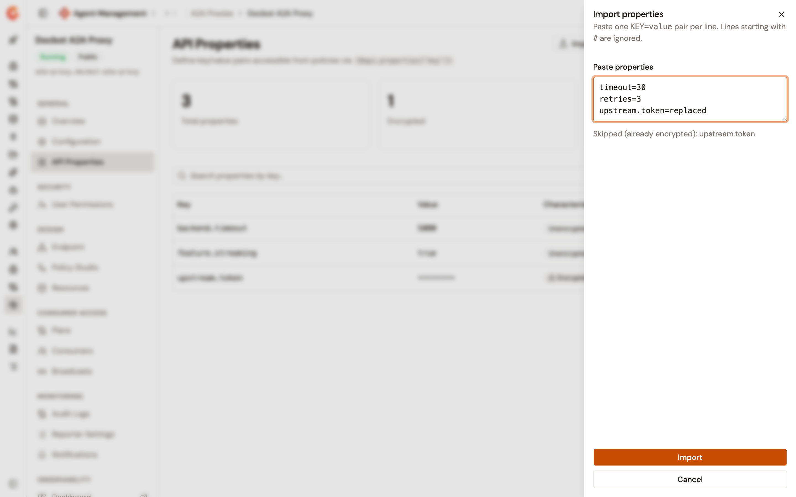
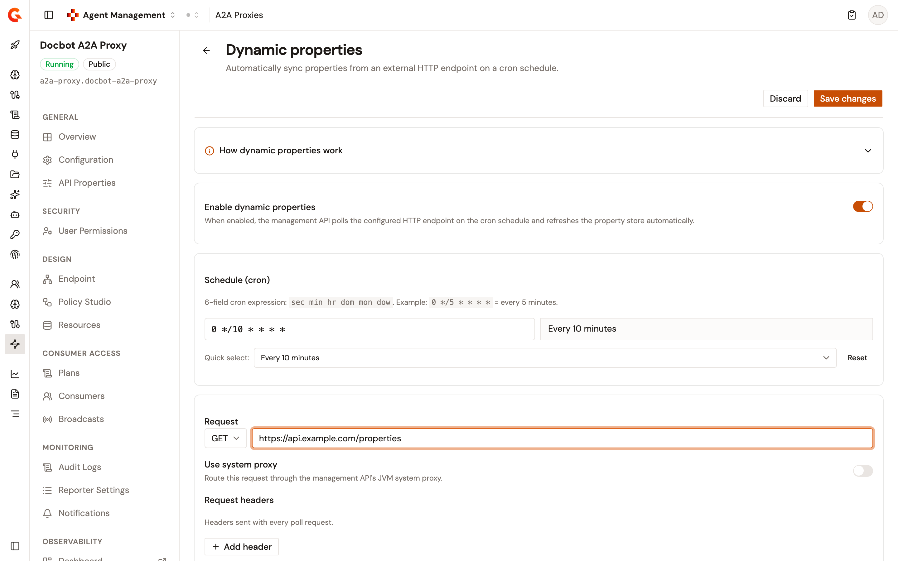

# Configure properties for your proxies

Each LLM Proxy, MCP Proxy, and A2A Proxy detail view includes an **API Properties** page. A property is a key/value pair that policies read at runtime through the Expression Language, with the syntax `{#api.properties['key']}`. Properties externalize configuration such as timeouts, feature flags, and secrets, so a policy reads the value instead of embedding it.

You can add properties one at a time, import a list of them, or sync them from an HTTP endpoint on a schedule.

## Open the API Properties page

1. Under **Secure** in the module sidebar, select **LLM Proxies**, **MCP Proxies**, or **A2A Proxies**.
2. Select the proxy you want to configure.
3. Under **General**, select **API Properties**.

<figure><figcaption>
The API Properties page with the Import properties panel
</figcaption></figure>

Until the proxy has a property, the page shows a **Why define properties?** card instead of the table.

## Read the property list

The page shows three counters, **Total properties**, **Encrypted**, and `Dynamic (auto-synced)`, above a table with the following columns:

| Column              | Description                                                                                          |
| ------------------- | ---------------------------------------------------------------------------------------------------- |
| **Key**             | The name that policies reference.                                                                    |
| **Value**           | The value of the property. An encrypted value is shown as dots.                                      |
| **Characteristics** | `Unencrypted`, `Encrypted`, or `Dynamic` for a property that a sync created.                         |

Each row ends with an actions menu that offers **Edit** and **Delete**. The search field filters the table by key, and the table shows 10 properties per page by default.

## Add a property

To add a property, follow these steps:

1. Click **Add property**.
2. In the **Add property** panel, enter a **Key**. Keys are unique per proxy. Entering a key that already exists shows **Key already exists.** and disables the **Add property** button.
3. Enter a **Value**.
4. Optional: turn on **Encrypt value**. The value is encrypted when the property is saved and can't be retrieved afterward.
5. Click **Add property**.

The property is saved immediately, and the page confirms with **Property added**.

## Edit or delete a property

To edit a property, follow these steps:

1. Open the actions menu of the property, and then click **Edit**.
2. In the **Edit property** panel, change the **Key** or the **Value**. For an encrypted property, the **Value** field starts empty. Leave it empty to keep the current encrypted value, or enter a new value to replace it. The **Encrypt value** switch is on for an encrypted property, so the new value is encrypted on save. Turn the switch off to store the new value unencrypted.
3. Click **Save changes**.

To delete a property, open its actions menu, click **Delete**, and then click **Remove property** in the **Remove this property?** dialog. Removing a property you defined can't be undone.

## Import properties in bulk

To import a list of properties, follow these steps:

1. Click **Import**.
2. In the **Import properties** panel, paste the list in the **Paste properties** field, one `KEY=value` pair per line. A line that starts with `#` is ignored. To include line breaks in a value, wrap the value in single or double quotes that open right after the `=`.
3. Click **Import**.

The import merges the pasted keys into the existing list, with the following rules:

* A key that doesn't exist yet is added as an unencrypted property.
* A key that matches an existing unencrypted property replaces the value of that property.
* A key that matches an existing encrypted property is skipped, and the panel lists it under **Skipped (already encrypted):** as soon as you paste it.

The import never encrypts a value. To encrypt an imported property, edit it and turn on **Encrypt value**.

The panel reports each malformed line with its line number: a line without an `=`, a line with an empty key, and a key that appears twice in the paste. The **Import** button stays disabled until the paste contains at least one valid line.


A malformed line is left out of the import while the valid lines are still imported. Check the reported lines before you click **Import**.


The page confirms with **Properties imported** and refreshes the list. **Cancel** closes the panel without changing any property.

## Sync properties from an HTTP endpoint

The **Manage dynamically** button opens the **Dynamic properties** page. When the sync is enabled, the Management API calls the HTTP endpoint you configure on a cron schedule. It transforms the response into key/value pairs and writes them to the proxy as dynamic properties.

<figure><figcaption>
The Dynamic properties page
</figcaption></figure>

Saving the Dynamic properties page doesn't change the proxy definition, so it doesn't require a deployment. The schedule starts as soon as you save.

### How a sync updates the property list

A sync applies the following rules to the property list:

* The synced batch replaces every property that a previous sync created. A key that the endpoint stops returning is removed on the next sync.
* A synced key that matches a property you defined manually is skipped. The manual property keeps its value.
* A property that a sync created carries the `Dynamic` badge. You can delete it, and the next sync recreates it if the endpoint still returns the key.
* When the sync changes the property list and the proxy was in sync at that moment, the proxy is deployed automatically. When the proxy was out of sync, it stays out of sync until you deploy it.
* A failed sync leaves the property list unchanged. The **Last run** card shows **Success** or **Failure**, the time of the last run, and the error message when the run failed.

### Configure the sync

To configure the sync, follow these steps:

1. Turn on **Enable dynamic properties**. The other fields are editable only when the switch is on.
2. Enter the **Schedule (cron)** as a 6-field cron expression, in the order `sec min hr dom mon dow`. For example, `0 */5 * * * *` runs every 5 minutes. A summary next to the field describes the schedule. **Quick select** offers **Every 5 minutes**, **Every 10 minutes**, **Every 30 minutes**, **Every hour**, **Every 6 hours**, and **Every day at midnight**. **Reset** restores `0 */5 * * * *`. The schedule can't run more often than every 60 seconds.
3. Under **Request**, select the HTTP method, **GET**, **POST**, **PUT**, **PATCH**, or **DELETE**, and enter the URL. The URL uses `http` or `https` and resolves to a public address. A host that resolves to a private, loopback, or link-local address is rejected when you save.
4. Optional: turn on **Use system proxy** to route the request through the system proxy of the Management API.
5. Under **Request headers**, click **Add header** for each header to send. A header value is stored encrypted and isn't shown again. Leave the value empty to keep the stored value. Header names are unique, without regard to case.
6. Optional: enter a **Request body**. The form notes that the body applies to the **POST**, **PUT**, and **PATCH** methods.
7. In **JOLT transformation specification**, enter the JOLT specification that turns the response into an array of `{"key": "k", "value": "v"}` objects. The field starts with the default `[{"operation": "default", "spec": {}}]`, which leaves the response unchanged. Keep it when the endpoint already returns that shape. The field must contain valid JSON. Expand **How dynamic properties work** at the top of the page for an example response and specification.
8. Optional: expand **HTTP client options**, **Proxy**, and **SSL / TLS** to tune the connection. The settings are described in the following sections.
9. Click **Save changes**, or **Discard** to revert.

The page confirms with **Dynamic provider saved**.

After the JOLT transformation, the response is a JSON array. Each item is an object with a `key`, and its `value` is a scalar rather than an object or an array. An item without a `value` produces an empty value. A response larger than 1 MiB, or a response with a status outside the 2xx range, fails the sync.

#### HTTP client options

The **HTTP client options** section carries the following settings:

| Setting                                   | Default | Description                                                                                                                                                                                                                              |
| ----------------------------------------- | ------- | ---------------------------------------------------------------------------------------------------------------------------------------------------------------------------------------------------------------------------------------- |
| **Connect timeout (ms)**                  | `5000`  | Maximum time to establish the connection.                                                                                                                                                                                                |
| **Read timeout (ms)**                     | `10000` | Maximum time to receive the full response.                                                                                                                                                                                               |
| **Keep-alive timeout (ms)**               | `30000` | Maximum idle time before an unused connection is evicted from the pool.                                                                                                                                                                  |
| **Idle timeout (ms)**                     | `60000` | Maximum time a TCP connection stays active with no data. `0` means no timeout.                                                                                                                                                           |
| **Max concurrent connections**            | `20`    | Maximum number of simultaneous connections to the endpoint.                                                                                                                                                                              |
| **Max wait queue size**                   | `-1`    | `-1` for unbounded.                                                                                                                                                                                                                      |
| **Max connection lifetime (ms)**          | `0`     | `0` for unbounded.                                                                                                                                                                                                                       |
| **Keep-alive**                            | On      | Reuse TCP connections across multiple HTTP requests.                                                                                                                                                                                     |
| **Enable HTTP pipelining**                | Off     | Send multiple requests without waiting for each response.                                                                                                                                                                                |
| `Enable compression (gzip, deflate)`      | On      | Advertise compression support to the endpoint and decompress the response.                                                                                                                                                               |
| **Follow HTTP redirects**                 | Off     | Follow 3xx redirects, up to 5 hops. Each hop resolves to a public address, and the `Authorization`, `Proxy-Authorization`, and `Cookie` headers are dropped when a redirect leaves the original host. |

#### Proxy

The **Proxy** section carries the following settings:

| Setting              | Description                                                                                                                        |
| -------------------- | ---------------------------------------------------------------------------------------------------------------------------------- |
| **Enable proxy**     | Route the request through a proxy.                                                                                                 |
| **Use system proxy** | Inherit the proxy settings of the Management API instead of entering them.                                                          |
| **Proxy type**       | **HTTP**, **SOCKS4**, or **SOCKS5**.                                                                                                |
| **Host**             | The proxy host. Required when **Use system proxy** is off.                                                                          |
| **Port**             | The proxy port, from `1` to `65535`. Required when **Use system proxy** is off.                                                     |
| **Username**         | Optional.                                                                                                                          |
| **Password**         | Optional. Stored encrypted and never shown again. Leave the field empty to keep the stored password.                               |

#### SSL / TLS

The **SSL / TLS** section carries the following settings:

| Setting                    | Description                                                                                                                                                                                                                                                                                                                           |
| -------------------------- | ------------------------------------------------------------------------------------------------------------------------------------------------------------------------------------------------------------------------------------------------------------------------------------------------------------------------------------- |
| **Verify hostname**        | On by default. Verify that the server certificate matches the hostname of the endpoint.                                                                                                                                                                                                                                                |
| **Trust all certificates** | Off by default. Accept any certificate without validation. The form warns that this setting isn't for production.                                                                                                                                                                                                                      |
| **Trust store**            | The store that verifies the certificate chain of the endpoint. Select a **Trust store type** of **None**, **PEM**, **JKS**, or **PKCS12**, and then provide the store as a **Path** or as **Content**, PEM text or Base64 for JKS and PKCS12. For JKS and PKCS12, provide exactly one of the two, and a **Password**.               |
| **Key store**              | The client certificate for mutual TLS. Select a **Key store type** of **None**, **PEM**, **JKS**, or **PKCS12**. For PEM, provide the **Certificate (public)** and the **Private key**, each as a path or as content. Encrypted PEM private keys aren't supported. For JKS and PKCS12, provide the store as a path or as Base64 content, exactly one of the two, and a **Password**. |

A store password and a private key are stored encrypted and never shown again. Leave the field empty to keep the stored value.

### Stop the sync

To stop the sync, turn off **Enable dynamic properties**, and then click **Save changes**. The polling stops and the saved settings are kept. The properties that earlier syncs created stay in the list until you delete them.

## Deploy the change

Adding, editing, deleting, or importing a property saves the proxy definition but doesn't deploy it. The proxy shows the **This API is out of sync** banner. Click **Deploy** on the banner, and then confirm in the **Deploy your API** dialog to push the configuration to the gateway.

## Verification

To verify a property is available to policies, follow these steps:

1. Add a property, for example `backend.timeout` with the value `5000`.
2. In the Policy Studio, reference the property from a policy configuration field with `{#api.properties['backend.timeout']}`.
3. Deploy the proxy. The policy reads the value at runtime.
