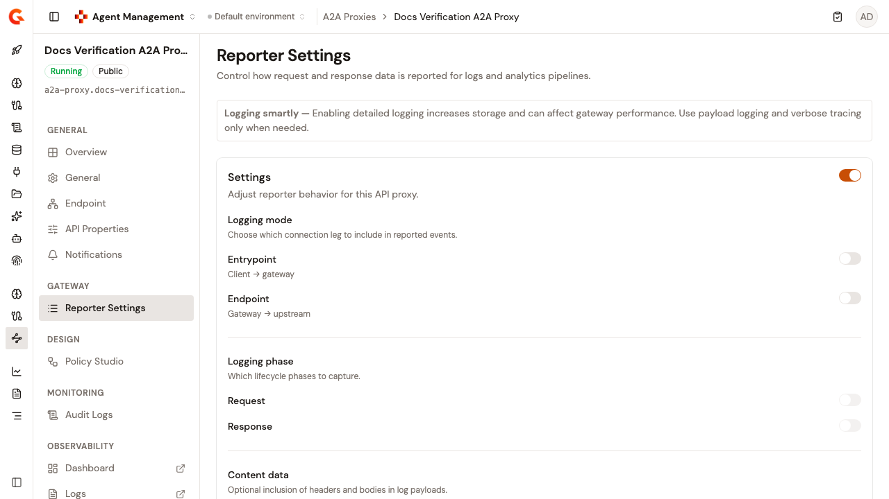
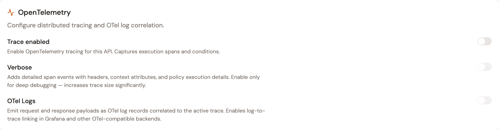
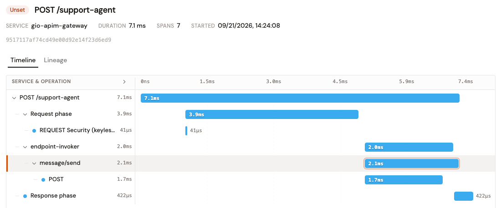
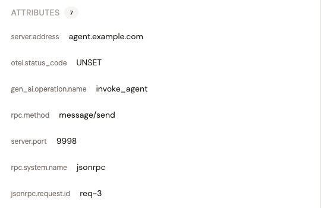

# Configure logging and tracing

The **Reporter Settings** page controls how request and response data is reported for logs and analytics pipelines, and configures OpenTelemetry tracing for this A2A Proxy.

To open the page, follow these steps:

1. Click **A2A Proxies** in the module sidebar.
2. Select your A2A Proxy.
3. Click **Reporter Settings** in the A2A Proxy sidebar.

When you change any setting, the **Discard** and **Save changes** buttons appear.

After you save, a confirmation notification appears and both buttons disappear until you edit the form again.

<figure><figcaption>
The Reporter Settings page
</figcaption></figure>


Detailed logging increases storage and can affect gateway performance. Use payload logging and verbose tracing only when needed.


## Configure the reporter

The **Settings** card adjusts reporter behavior for this A2A Proxy. The card's own switch enables analytics. While it's off, every other setting on the card is disabled.

The card groups the logging settings as follows:

| Group                  | Settings                     | Description                                                                                    |
| ---------------------- | ---------------------------- | ---------------------------------------------------------------------------------------------- |
| **Logging mode**       | **Entrypoint**, **Endpoint** | Which connection leg to include in reported events: client to gateway, or gateway to upstream. |
| **Logging phase**      | **Request**, **Response**    | Which lifecycle phases to capture.                                                             |
| **Content data**       | **Headers**, **Payload**     | Optional inclusion of headers and bodies in log payloads.                                      |
| **Display conditions** | **Request phase condition**  | An optional Expression Language filter for the request phase. Leave empty to log all requests.  |

The phase, content, and condition settings stay disabled until at least one logging mode, **Entrypoint** or **Endpoint**, is enabled.

For example, the condition `{#request.headers['Content-Type'][0] == 'application/json'}` only logs JSON requests.

## Configure OpenTelemetry tracing

The **OpenTelemetry** card configures distributed tracing and OpenTelemetry log correlation with the following settings:

* **Trace enabled**. Enable OpenTelemetry tracing for this A2A Proxy. Captures execution spans and conditions.
* **Verbose**. Adds detailed span events with headers, context attributes, and policy execution details. Requires **Trace enabled**. Enable only for deep debugging, because it increases trace size significantly, and disable it after debugging is complete.
* **OTel Logs**. Emit request and response payloads as OpenTelemetry log records correlated to the active trace, which enables log-to-trace linking in Grafana and other OpenTelemetry-compatible backends. Requires **Trace enabled**.

<figure><figcaption>
The <strong>OpenTelemetry</strong> card of an A2A Proxy. <strong>Verbose</strong> and <strong>OTel Logs</strong> are unavailable until <strong>Trace enabled</strong> is on.
</figcaption></figure>

### What an A2A trace contains

With **Trace enabled** on, the proxy records one span for each call it forwards to the upstream agent. The span sits under the gateway's invoker span, and the HTTP client span nested below it reports the transport.

The span is named after the JSON-RPC method of the call, such as `message/send`. When the request carries no readable JSON-RPC method, the span is named `a2a` instead.

<figure><figcaption>
An A2A span in the trace timeline, named after its JSON-RPC method.
</figcaption></figure>

The span carries the following attributes:

| Attribute | Value |
| --- | --- |
| `rpc.system.name` | Always `jsonrpc`. |
| `gen_ai.operation.name` | Always `invoke_agent`. |
| `rpc.method` | The JSON-RPC method of the call. Absent when the request carries none. |
| `jsonrpc.request.id` | The JSON-RPC request id. Absent when the request carries none. |
| `server.address` | The upstream agent's host, without scheme, port, or path. |
| `server.port` | The upstream agent's port, filled in from the scheme when the target leaves it implicit. |

<figure><figcaption>
The attributes of an A2A span.
</figcaption></figure>

The span records the host and the port, never the full target address, because a target can contain credentials.

Requests that aren't JSON-RPC calls, such as fetching the agent card, are recorded as a span named `a2a` without `rpc.method` or `jsonrpc.request.id`. When the host or port can't be read from the target, the span omits `server.address` or `server.port`. Tracing never changes the outcome of a request.

For a streaming call such as `message/stream`, the span ends before the stream does, so its duration doesn't cover the whole stream.

### Redact span attributes

With **Trace enabled** and **Verbose** both on, the **Span Attribute Redaction** section masks sensitive attribute values before spans are exported. Without rules, span attributes are exported as-is. Global redaction rules are applied first, and the rules defined here are specific to this A2A Proxy and appended after them.

Each rule carries an **Attribute Name Pattern**, a **Masking Type**, and type-specific fields such as **Replacement Text**, **Prefix chars**, **Suffix chars**, and **Mask char**. A rule can also match on the attribute value with a partial-match regular expression.

Adding a rule updates the list on the page only. Click **Save changes** to persist the rule list.

## Verification

To verify the reporter settings are working as expected, follow these steps:

1. Enable analytics, turn on the **Entrypoint** logging mode and the **Request** phase, and click **Save changes**.
2. Deploy the A2A Proxy and send a request to it.
3. Open the logs. The request appears with the captured data. See [Inspect your agent log](../../observe/inspect-your-agent-log.md).
