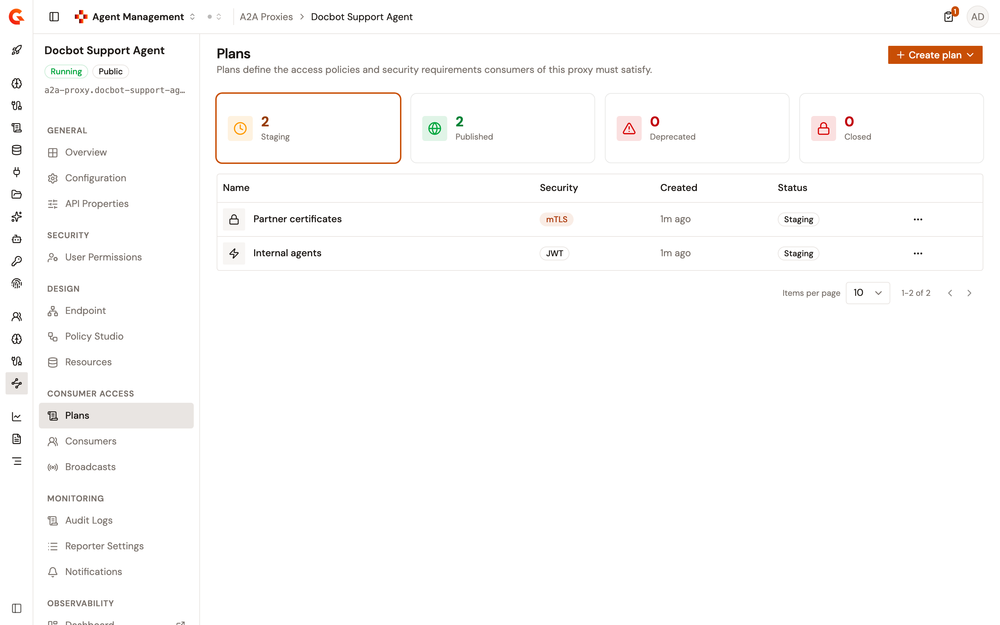
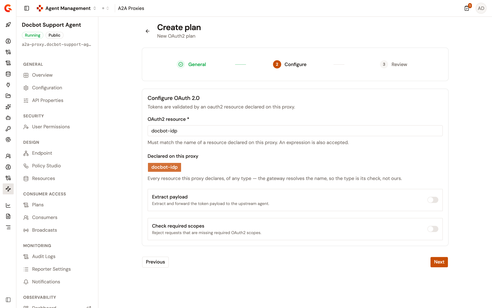

# Manage A2A Proxy plans

Each A2A Proxy detail view includes a **Plans** page under **Consumer Access**. Plans define the access policies and security requirements that consumers of the proxy must satisfy. A consumer subscribes to a published plan, and the gateway authenticates each call against that plan.

The A2A Proxy wizard creates and publishes a default plan when you create the proxy. Use the **Plans** page to add plans of other security types, to publish them, and to close them.

## Open the Plans page

1. From the Gamma console sidebar, select **Agent Management**.
2. Under **Secure**, select **A2A Proxies**.
3. Select your A2A Proxy.
4. Under **Consumer Access**, select **Plans**.

<figure><figcaption>
The Plans page
</figcaption></figure>

Until the proxy has a plan, the page shows a **No plans configured** card instead of the status cards and the table.

## Read the plan list

Four cards, **Staging**, **Published**, **Deprecated**, and **Closed**, show how many plans are in each status. Select a card to list the plans in that status. The **Staging** card is selected when you open the page.

The table lists one row per plan, with the following columns:

| Column       | Description                                                                                                                                  |
| ------------ | -------------------------------------------------------------------------------------------------------------------------------------------- |
| **Name**     | The name of the plan, next to the icon of its security type.                                                                                 |
| **Security** | The security type: **Keyless**, **API Key**, **JWT**, **OAuth2**, or **mTLS**. A plan whose security type isn't one of these shows **Unknown**. |
| **Created**  | The creation date of the plan.                                                                                                               |
| **Status**   | **Staging**, **Published**, **Deprecated**, or **Closed**.                                                                                   |

Each row of a plan that isn't closed ends with an actions menu. The menu offers **Publish** for a staging plan, and **Close** for a staging, published, or deprecated plan. The table shows 10 plans per page by default.

Plans created outside Gamma, for example in the API Management console, are listed too when they use one of the five security types. Push plans aren't listed.

## Plan lifecycle

A plan moves through the following statuses:

* **Staging**. Every plan starts in staging when you create it, and stays there until you publish it. Consumers can't subscribe to a staging plan.
* **Published**. Consumers can subscribe to the plan.
* **Deprecated**. Consumers can't subscribe to the plan anymore. The **Plans** page can't deprecate a plan, but a plan deprecated in the API Management console is listed under the **Deprecated** card.
* **Closed**. Every subscription on the plan is terminated, and the plan can't be reopened.

## Create a plan

To create a plan, follow these steps:

1. Click **Create plan**, and then select a security type: **Keyless**, **API Key**, **JWT**, **OAuth2**, or **mTLS**. The **Create plan** page opens.
2. In the **General** step, enter a **Name**. The name is shown to consumers subscribing to the proxy. Click **Next**.
3. In the **Configure** step, complete the settings of the security type, and then click **Next**. A **Keyless** plan has no **Configure** step.
4. In the **Review** step, check the plan settings, and then click **Create plan**.

The plan is created in staging and appears in the table. If the plan can't be created, the page shows **Failed to create plan** with the reason, and keeps what you entered.

An A2A plan holds a name and a security configuration. Plans created on the **Plans** page use manual validation, so a subscription request waits for your approval.

### Configure an API Key plan

Choose how consumers send their API key:

* **Authorization: Bearer**. The consumer sends `Authorization: Bearer <api-key>`. This is the recommended mode, and the default.
* **Custom header**. The consumer sends the key in the request header you enter in **Header name**. The header name is required.
* **Query parameter**. The consumer appends the key as the `api-key` URL query parameter. This mode isn't recommended.

Turn on **Propagate key to upstream** to forward the API key to the backend service after validation.

### Configure a JWT plan

To configure a JWT plan, follow these steps:

1. Select the **Signature algorithm**: **RS256**, **RS384**, **RS512**, **HS256**, **HS384**, or **HS512**.
2. Select the **Public key resolver**: **JWKS URL**, **Given key (PEM, single key)**, or **Gateway keys (configured globally)**.
3. For **JWKS URL**, enter the **JWKS URL** that the gateway fetches the signing keys from. For **Given key**, paste the **Public key (PEM)**. **Gateway keys** needs no value.

### Configure an OAuth2 plan

An OAuth2 plan validates tokens with an OAuth2 resource declared on the proxy. Declare the resource on the **Resources** page first. See [Configure resources for your proxies](../configure-resources-for-your-proxies.md).

<figure><figcaption>
The OAuth 2.0 configuration step
</figcaption></figure>

To configure an OAuth2 plan, follow these steps:

1. In **OAuth2 resource**, enter the name of a resource declared on the proxy, or select one of the names listed under **Declared on this proxy**. The list holds every enabled resource of the proxy, whatever its type. The field also accepts an Expression Language expression, which is resolved on each request.
2. Optional: turn on **Extract payload** to forward the token payload to the upstream agent.
3. Optional: turn on **Check required scopes**, and then add at least one scope under **Required scopes**. Press Enter or a comma to add a scope.

When the proxy declares no resource, the step shows **This proxy declares no resources**, with a **Manage resources** link to the **Resources** page. Creating the plan is refused until you declare a resource or enter an expression.

The plan is refused at creation when the resource name matches no enabled resource of the proxy. The message lists the declared resources. The same check runs again when you publish the plan, so a resource that was removed or disabled after the plan was created blocks the publication. An expression is never checked against the declared resources.

### Configure an mTLS plan

An mTLS plan has no settings of its own. Clients present an X.509 certificate during the TLS handshake. Configure the trusted certificate authorities and the certificate validation rules in the gateway-level TLS settings.

## Publish a plan

To publish a plan, open the actions menu of a staging plan, and then click **Publish**. A message confirms **Published** followed by the plan name, and the plan moves to the **Published** card.

Publishing is refused in the following cases, and the message shows the reason:

* The plan isn't in staging.
* The plan is an OAuth2 plan that names a resource the proxy doesn't declare.
* The plan is a Keyless plan, and the proxy already has a published or deprecated Keyless plan.

## Close a plan

Closing a plan terminates every subscription on it, and can't be undone. To close a plan, follow these steps:

1. Open the actions menu of the plan, and then click **Close**.
2. In the **Close plan?** dialog, click **Close plan**.

A message confirms **Closed** followed by the plan name, and the plan moves to the **Closed** card. Subscriptions that were already closed or rejected are left as they are. To restore access, create a new plan, and ask the consumers to subscribe again.

## Deploy the change

Publishing or closing a plan marks the proxy out of sync. Creating a plan doesn't. The proxy shows the **This API is out of sync** banner until you deploy it. Click **Deploy** on the banner, optionally enter a **Deployment label**, and then click **Deploy** in the **Deploy your API** dialog.

## Verification

To verify a plan is available to consumers, follow these steps:

1. Create a plan of any type except Keyless, publish it, and then deploy the proxy.
2. Under **Consumer Access**, select **Consumers**, and then click **Create subscription**.
3. Open the **Subscription Plan** list. The plan is listed. For the steps to complete the subscription, see [Manage subscriptions](../../publish/manage-subscriptions.md).

## Next steps

* [Manage subscriptions](../../publish/manage-subscriptions.md). Create, approve, reject, and close the subscriptions to your plans.
* [Configure resources for your proxies](../configure-resources-for-your-proxies.md). Declare the OAuth2 resource that an OAuth2 plan references.
* [Expose your agent with the A2A Proxy](../expose-agent-with-a2a-proxy.md). Choose the security type of the default plan when you create the proxy.
