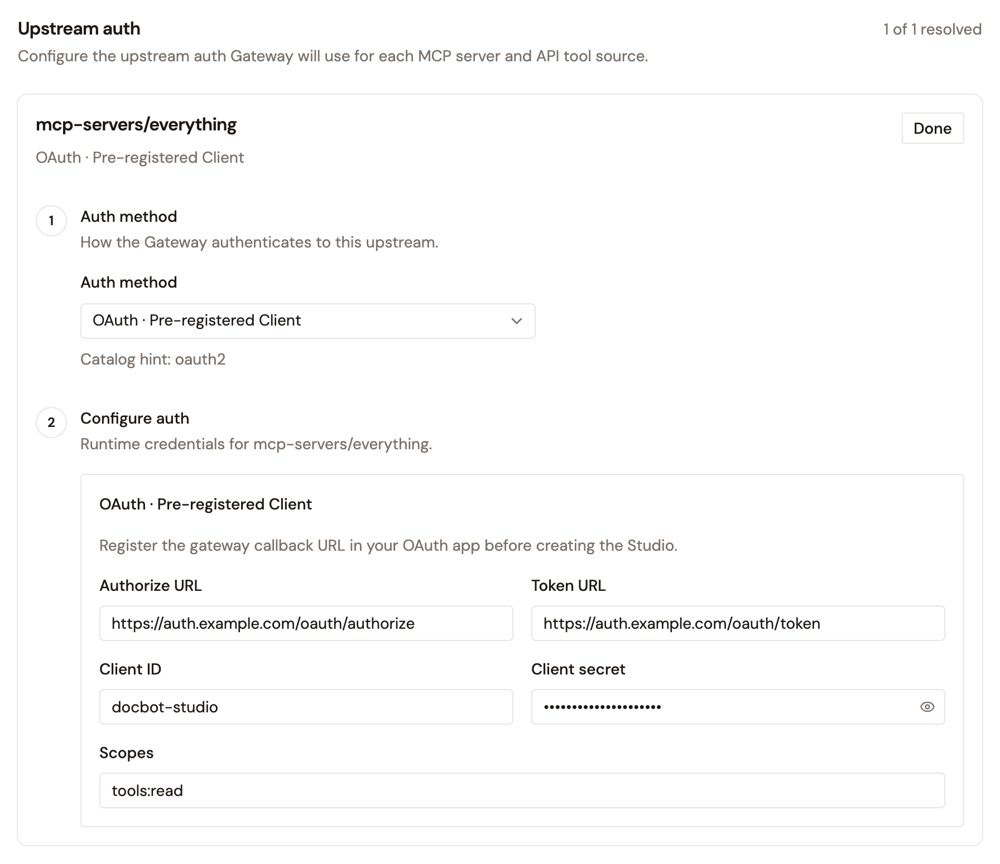

# Configure your MCP proxy

After you create an MCP Proxy, configure how it handles upstream authentication. These settings control how the proxy authenticates with upstream MCP servers on behalf of your users and agents.

## Upstream Authentication

One of the most important problems the MCP Proxy solves is securing third-party MCP servers such as HubSpot, Salesforce, GitHub, Slack, and Jira. The MCP Proxy handles authentication by injecting the necessary credentials before forwarding the request to the upstream server.

The MCP Proxy currently supports injecting static credentials into the request headers.

To call the upstream server with a token that its own authorization server issues in exchange for the consumer's token, see [Exchange tokens for upstream MCP servers](exchange-tokens-for-upstream-mcp-servers.md).

In an MCP Studio, a source can also use OAuth. For more information, see [Use OAuth for an MCP Studio source](#use-oauth-for-an-mcp-studio-source).

## Configure Upstream Authentication

1. In the Gravitee console, navigate to **MCP Proxies**, and then open your MCP Proxy.
2. In the menu under **General**, select **Endpoint**. This page contains the **Upstream authentication** section.
3. Select one of the following authentication methods:
    * **Static credential**. Inject a static credential into a request header on every call.
    * **No upstream auth**. Call the upstream without injecting credentials.
4. If you chose **Static credential**, open the **Credential type** list, and then select one of the following:
    * **API key**. Select an **Injection location** of **Authorization header**, **x-api-key header**, or **Custom header**. If you select **Custom header**, enter the **Header name**. Enter the key in the **Credential** field.
    * **Bearer token**. Enter the token in the **Credential** field. The Gateway injects it as `Authorization: Bearer <token>`.
    * **Basic auth**. Enter the **Username** and **Password / token**. The Gateway injects them as `Authorization: Basic <base64>`.
    * **Custom secret**. Select an **Injection location** of **Authorization header**, **x-api-key header**, or **Custom header**. If you select **Custom header**, enter the **Header name**. Enter the secret in the **Credential** field.
5. Click **Save changes**.

## Use OAuth for an MCP Studio source

In an MCP Studio, a source can use the **OAuth · Pre-registered Client** auth method. Access to the source is then authorized through your OAuth provider, and the Gateway calls the source with the token that it receives.

1. In your OAuth provider, register the Gateway callback URL as a redirect URI of your OAuth app:

    ```
    https://<gateway-host>/<context-path>/.auth/callback
    ```

    `https://<gateway-host>` is the address that your MCP clients use to reach the Gateway, and `<context-path>` is the **Context path** of the MCP Studio.
2. When you create the MCP Studio, in the **Connect** step, open the **Auth method** list of the source, and then select **OAuth · Pre-registered Client**.
3. Enter the **Authorize URL** and **Token URL** of your OAuth provider, and the **Client ID** and **Client secret** of your OAuth app. Optionally, enter the **Scopes** to request.

    <figure><figcaption></figcaption></figure>

Until access is authorized, a call to a tool from the source returns a link to authorize it. To confirm the redirect URI that the Gateway sends, open that link, and then read the `redirect_uri` parameter in the address of your OAuth provider's page.

## Next steps

* [Add policies to your MCP server](add-policies-to-mcp-server.md). Apply fine-grained authorization at the tool level.
* [Configure resources for your proxies](../configure-resources-for-your-proxies.md). Manage the resources that the policies of the MCP Proxy reference at runtime.
* [Broadcast messages to proxy consumers](../broadcast-messages-to-proxy-consumers.md). Send a one-way announcement to the consumers of the MCP Proxy.
* [Configure properties for your proxies](../configure-properties-for-your-proxies.md). Add the key/value properties that policies read at runtime, import them in bulk, or sync them from an HTTP endpoint.
* [Manage metadata for your proxies](../manage-metadata-for-your-proxies.md). Add the metadata entries that describe the MCP Proxy, and override the entries it inherits from its environment.
* [Layered governance for MCP tools](govern-mcp-tool-access.md). Combine authorization, rate limits, and response redaction on one server.
* [Configure logging and tracing](configure-logging-and-tracing.md). Control the reported request and response data, and enable OpenTelemetry tracing.
