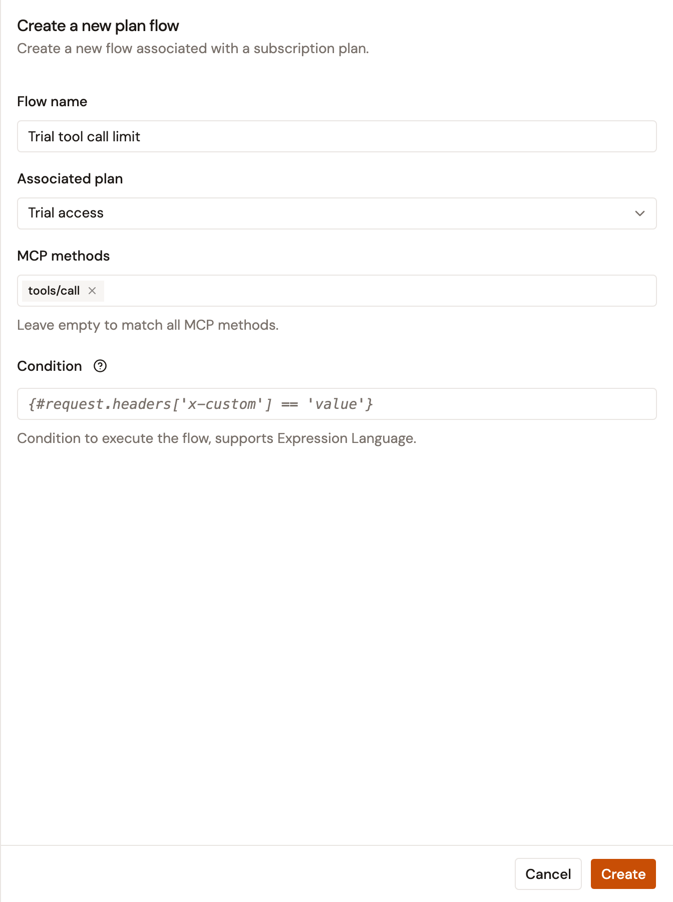
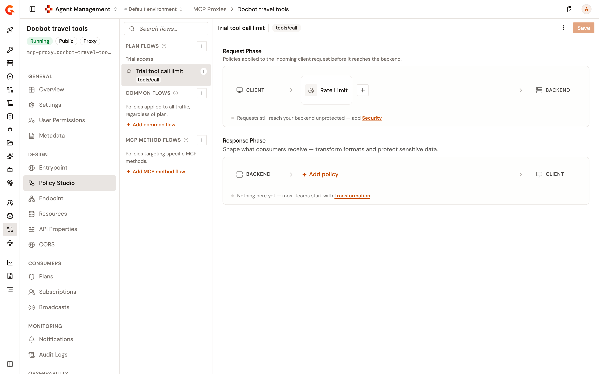

# Apply policies to specific plans

A plan flow runs its policies only on the calls that one plan of an MCP Proxy or MCP Studio secures. Use it to give each plan its own limits or transformations, such as a stricter rate limit for a trial plan. The **Policy Studio** lists plan flows under **Plan Flows**, grouped by plan, above **Common Flows** and **MCP Method Flows**.

## Before you begin

**Plan Flows** offers only the published and deprecated plans of the proxy. Publish the plan on the **Plans** page under **Consumers** before you create its flow.

## Create a plan flow

To create a plan flow, follow these steps:

1. In the Gamma console, open **Agent Management**.
2. Under **Secure**, select **MCP Proxies**, and then select your MCP Proxy or MCP Studio.
3. Under **Design**, select **Policy Studio**.
4. Next to **Plan Flows**, click the add icon.
5. In the **Create a new plan flow** panel, complete the following fields:
    * **Flow name**. Enter a name for the flow.
    * **Associated plan**. Select the plan whose calls the flow applies to.
    * **MCP methods**. Optional: Select the MCP methods that the flow applies to, such as `tools/call`. Leave it empty to apply the flow to every MCP method.
    * **Condition**. Optional: Enter an Expression Language condition that must be true for the flow to run.

    <figure><figcaption>
A plan flow for the tool calls of one plan
</figcaption></figure>
6. Click **Create**.
7. In the **Request Phase** or the **Response Phase**, click **Add policy**, select a policy, such as **Rate Limit**, and then configure it.
8. Click **Save**.
9. Click **Deploy** on the **This API is out of sync** banner, and then click **Deploy** in the **Deploy your API** dialog.

## How a plan flow runs

A plan flow follows these rules at the gateway:

* It runs only on the calls that its plan secures. Calls secured by another plan of the proxy skip it.
* With MCP methods selected, it runs only on calls to those methods. Without MCP methods, it runs on every call that its plan secures.
* In each phase, the flows of the plan run before the common flows and the MCP method flows of the proxy.
* A change reaches the gateway only when you deploy the proxy. Saving the **Policy Studio** doesn't deploy it.

## Verification

To verify the plan flow is working as expected, follow these steps:

1. In the **Policy Studio**, check that the flow is listed under **Plan Flows**, below the name of its plan.

    <figure><figcaption>
A plan flow with a Rate Limit policy
</figcaption></figure>
2. Call the proxy with the credential of a subscription to the plan, until the policy acts. For example, with a **Rate Limit** policy that allows 2 requests per minute on `tools/call`, the third `tools/call` within a minute receives a `429` response.
3. Make the same calls with the credential of a subscription to another plan. The policy doesn't act on them.

## Next steps

* [Apply policies to specific MCP methods](apply-policies-to-mcp-methods.md). Apply policies to the calls of one MCP method, whatever the plan.
* [Manage subscriptions](../../publish/manage-subscriptions.md). Subscribe an application to a plan, and find the credential that it calls the proxy with.
