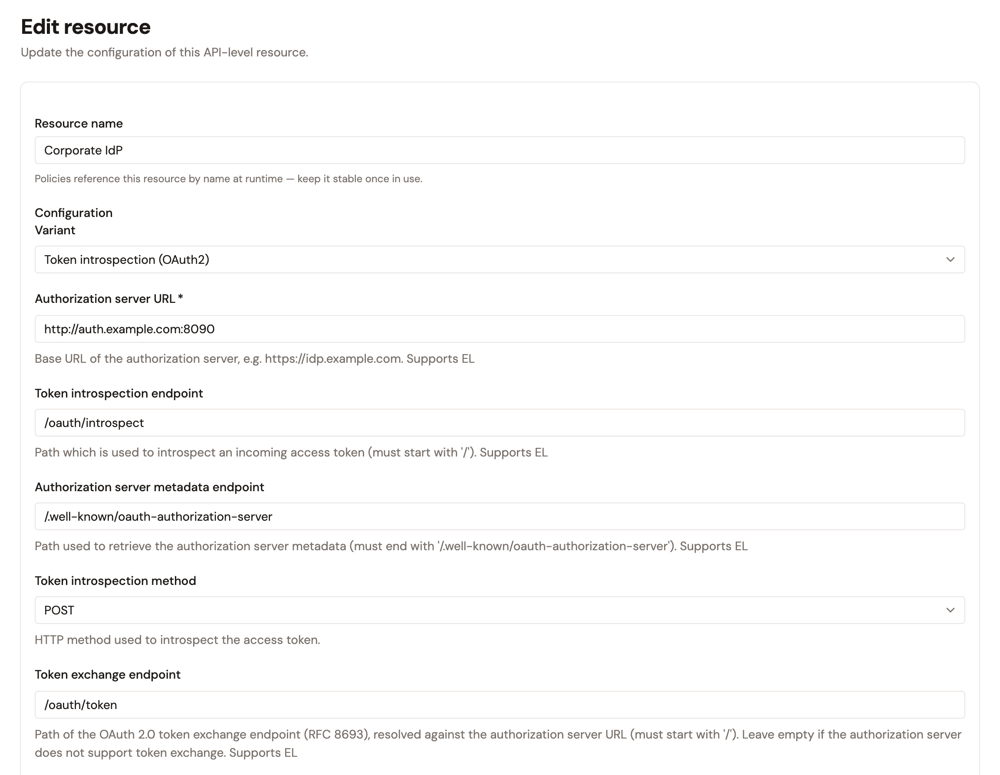
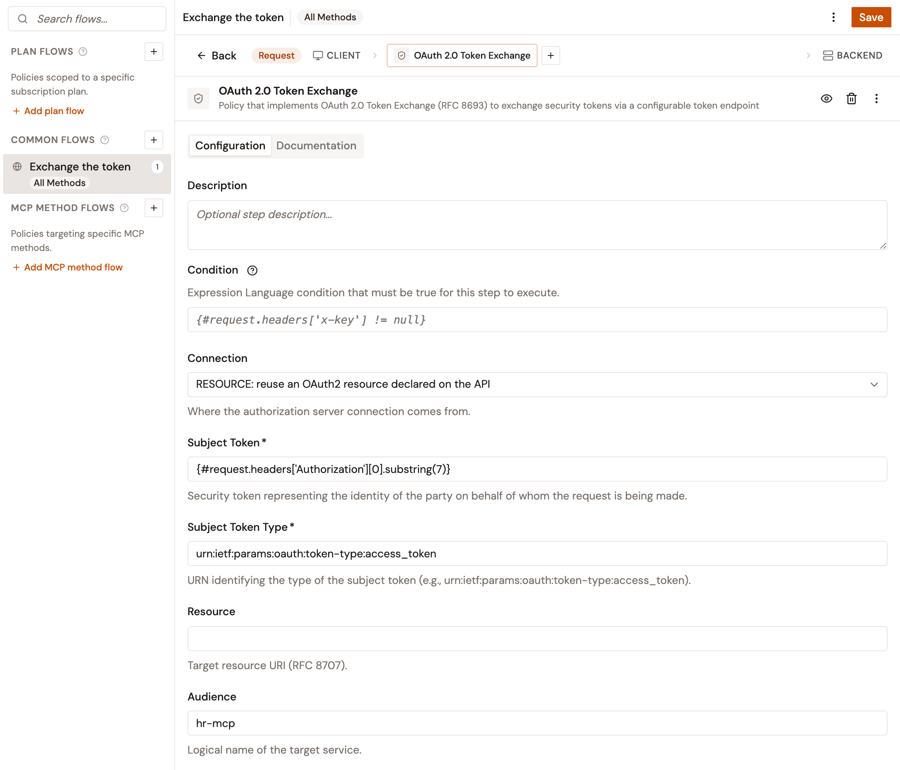

# Exchange tokens for upstream MCP servers

When the upstream MCP server accepts only tokens issued for it, add the **OAuth 2.0 Token Exchange** policy to the MCP Proxy. On each request, the policy sends the consumer's token to the token endpoint of an authorization server that supports [OAuth 2.0 Token Exchange](https://www.rfc-editor.org/rfc/rfc8693). The MCP Proxy then calls the MCP server with the issued token in the `Authorization` header, in place of the consumer's token.

## Prerequisites

Before you add the policy, confirm the following:

* Your license includes the **OAuth 2.0 Token Exchange** policy.
* Consumers call the MCP Proxy with an access token in the `Authorization` header, for example through an **OAuth 2.0** or a **JWT** plan.
* Your authorization server supports token exchange, and it has a client that's allowed to use the `urn:ietf:params:oauth:grant-type:token-exchange` grant type.
* The Gateway can reach the token endpoint of the authorization server.
* On the **Endpoint** page of the MCP Proxy, **Upstream authentication** is set to **No upstream auth**. A static credential sent in the `Authorization` header replaces the exchanged token.

## Choose how the policy reaches the authorization server

The **Connection** field of the policy offers two choices:

* **RESOURCE: reuse an OAuth2 resource declared on the API**. The policy calls the authorization server through an OAuth2 resource of the MCP Proxy, with the resource's connection and client credentials. When the authorization server that secures the MCP Proxy also issues the upstream token, reuse the resource that the creation wizard declared for the plan, if its type exchanges tokens.
* **INLINE: configure the authorization server on this policy**. The policy holds the token endpoint and the client credentials. Use it when another authorization server issues the upstream token, or when the MCP Proxy has no OAuth2 resource.

Not every OAuth2 resource type exchanges tokens:

| Resource type                           | Token exchange                                                                                              |
| --------------------------------------- | ----------------------------------------------------------------------------------------------------------- |
| **OAuth2 / OpenID Connect Provider**    | At the path set in its **Token exchange endpoint** field, which the creation wizard leaves empty.           |
| **Gravitee.io AM Authorization Server** | At the token endpoint of its security domain, with no change to the resource.                              |
| **Auth0**                               | Not supported. Every request fails with HTTP `502`.                                                         |
| **Microsoft Entra ID**                  | Not supported. Every request fails with HTTP `502`.                                                         |

For an **External Authorization Server** plan, the creation wizard declares an **OAuth2 / OpenID Connect Provider** resource when the **Provider** is **Keycloak** or **Other**. The resource is named **Keycloak**, or after the **Name** you entered for **Other**. With the **Auth0** provider, the wizard declares an **Auth0** resource. For a **Gravitee as Authorization Server** plan, it declares a **Gravitee.io AM Authorization Server** resource named `gravitee-am`.

## Add the policy

To exchange tokens through an **OAuth2 / OpenID Connect Provider** resource, set its token exchange endpoint first:

1. In the Gamma console, open **Agent Management**.
2. In the sidebar, under **Secure**, click **MCP Proxies**, and then click your MCP Proxy.
3. Under **Design**, click **Resources**.
4. Open the actions menu of the resource, and then click **Edit**.
5. In **Token exchange endpoint**, enter the path of the authorization server's token endpoint, for example `/oauth/token`. The path is resolved against **Authorization server URL**.

    <figure><figcaption></figcaption></figure>
6. Click **Save changes**.

Then add the policy to a common flow, so that it runs on every MCP request:

1. Under **Design**, click **Policy Studio**.
2. Next to **Common flows**, click **+**.
3. In **Flow name**, enter a name, and then click **Create**.
4. In **Request Phase**, click **Add policy**, and then click **OAuth 2.0 Token Exchange**.
5. In **Connection**, select **RESOURCE: reuse an OAuth2 resource declared on the API** or **INLINE: configure the authorization server on this policy**.
6. In **Subject Token**, enter the expression that reads the consumer's token from the `Authorization` header:

    ```
    {#request.headers['Authorization'][0].substring(7)}
    ```
7. In **Subject Token Type**, enter `urn:ietf:params:oauth:token-type:access_token`.
8. Optionally, enter the **Audience**, **Resource**, **Scopes**, or **Requested Token Type** that your authorization server expects for the MCP server.

    <figure><figcaption></figcaption></figure>
9. Complete the connection:
    * For **RESOURCE**, select the resource in **OAuth2 Resource**, at the end of the form.
    * For **INLINE**, enter the full URL of the token endpoint in **Token endpoint**, and the **Client ID** and **Client secret** of your client. The credentials are sent in a Basic `Authorization` header unless you turn off **Send credentials as a Basic header**.
10. Click **Save**.
11. In the **This API is out of sync** banner, click **Deploy**, and then click **Deploy** in the **Deploy your API** dialog.

In inline mode, the policy validates the certificate of the token endpoint. Turn on **Trust any certificate** only for an authorization server whose certificate the Gateway can't validate otherwise.

## How the exchanged token reaches the MCP server

By default, the policy writes `Authorization: <token type> <token>` on the request to the MCP server, with the token type that the authorization server returns, or `Bearer` when that type is `N_A`. The consumer's token doesn't reach the MCP server.

When you change **Header name**, or turn off **Set the Authorization header**, the consumer's token stays in the `Authorization` header and reaches the MCP server.

The policy exchanges the token on every request that it runs on. Each MCP request, including `initialize`, makes one call to the token endpoint.

## Troubleshoot a failed exchange

When the exchange fails, the consumer receives an HTTP error for every MCP request, with one of the following messages:

| Status | Message                                                                              | Cause                                                                                                |
| ------ | ------------------------------------------------------------------------------------ | ---------------------------------------------------------------------------------------------------- |
| `502`  | `OAuth 2.0 Token Exchange failed: tokenExchangeEndpoint is not configured`           | The **OAuth2 / OpenID Connect Provider** resource has no **Token exchange endpoint**.                |
| `502`  | `OAuth 2.0 Token Exchange failed: Token exchange is not supported by this OAuth2 resource` | The selected resource is an **Auth0** or a **Microsoft Entra ID** resource.                    |
| `502`  | `OAuth 2.0 Token Exchange failed:` followed by the status and the error that the authorization server returned | The authorization server rejected the exchange, for example because of the client credentials or the subject token. |
| `502`  | `OAuth 2.0 Token Exchange failed: Failed to create SSL connection`                   | In inline mode, the Gateway can't validate the certificate of the token endpoint.                    |
| `500`  | `No OAuth2 resource defined with name [<name>]`                                      | **OAuth2 Resource** names no resource of the MCP Proxy.                                              |

## Verification

To verify the token exchange is working as expected, follow these steps:

1. From an MCP client, connect to the MCP Proxy with a consumer token that its plan accepts.
2. Call a tool of the upstream MCP server. The call returns the tool's result instead of an authentication error from the MCP server.

## Next steps

* [Configure your MCP proxy](README.md). Set the upstream authentication of the MCP Proxy.
* [Configure resources for your proxies](../configure-resources-for-your-proxies.md). Manage the OAuth2 resources that the policy uses in resource mode.
