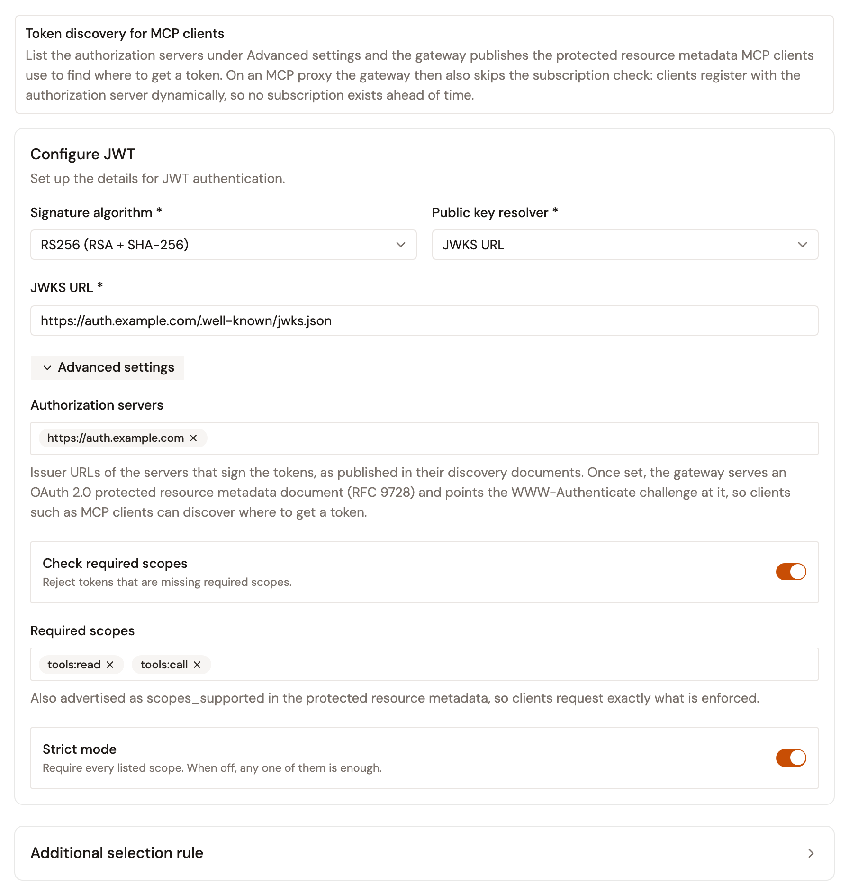
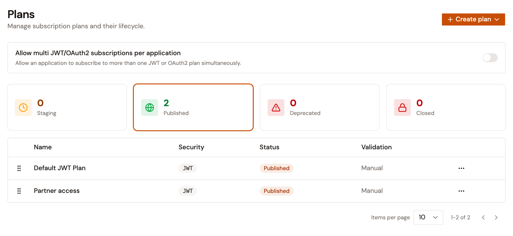

# Manage MCP Proxy plans

Each MCP Proxy and MCP Studio has a **Plans** page under **Consumers**. A plan sets how consumers authenticate to the proxy: **Keyless**, **API Key**, **OAuth2**, **JWT**, or **mTLS**. The gateway checks each call against the published plans of the proxy.

On an MCP Proxy, **Keyless** and **OAuth2** plans, and **JWT** plans that list an authorization server, don't need a subscription. A call goes through when the plan authenticates it.

The creation wizard creates and publishes one plan, for the method you choose in its **Secure** step. Use the **Plans** page to add plans, edit them, and retire them.

## Open the Plans page

1. In the Gamma console, open **Agent Management**.
2. Under **Secure**, select **MCP Proxies**.
3. Select your MCP Proxy or MCP Studio.
4. Under **Consumers**, select **Plans**.

## Plan lifecycle

A plan moves through the following statuses. The **Staging**, **Published**, **Deprecated**, and **Closed** cards filter the plan list by status.

* **Staging**. A plan you create on the **Plans** page starts in staging. Consumers can't subscribe to it.
* **Published**. Consumers can subscribe to the plan. A Keyless plan takes no subscriptions.
* **Deprecated**. The plan accepts no new subscriptions and isn't available on the Developer Portal anymore. The gateway still applies it, so existing subscriptions keep working, and a plan that doesn't need a subscription keeps accepting calls.
* **Closed**. Every subscription on the plan is closed. A closed plan can't be published or edited.

## Create a plan

To create a plan, follow these steps:

1. Click **Create plan**, and then select a security type. The **Create plan** page opens.
2. In the **General** step, enter a **Name** of up to 50 characters, and then click **Next**. Subscriptions wait for your approval unless you turn on **Auto validate subscription**.
3. In the **Security** step, complete the settings of the security type, and then click **Next**. A **Keyless** plan has no **Security** step. To choose between several plans of the same type, open **Additional selection rule**, and then enter an expression in **Selection rule**.
4. Optional: In the **Restrictions** step, turn on **Rate limiting**, **Quota**, or both, and then set the limits. You set restrictions only when you create a plan.
5. Click **Create plan**.

The plan is created in staging, and the **Plans** page opens on the **Staging** card.

### Configure an API Key plan

Choose how consumers send their API key:

* **Authorization: Bearer**. The consumer sends `Authorization: Bearer <api-key>`. This is the default.
* **Custom header**. The consumer sends the key in the request header that you enter in **Header name**.
* **Query parameter**. The consumer appends the key as the `api-key` URL query parameter.

Turn on **Propagate key to upstream** to forward the key to the upstream MCP server after validation.

### Configure a JWT plan

A JWT plan validates tokens signed by an issuer that you already run.

<figure><figcaption><p>The Security step of a JWT plan</p></figcaption></figure>

To configure a JWT plan, follow these steps:

1. Select the **Signature algorithm** of your tokens: an RSA algorithm, such as **RS256 (RSA + SHA-256)**, for an RSA key pair, or an HMAC algorithm, such as **HS256 (HMAC + SHA-256)**, for a shared secret.
2. Select the **Public key resolver**, and then complete its field:
    * **JWKS URL**. Enter the URL that the gateway fetches the signing keys from, or an expression that resolves to one.
    * **Given key (PEM, single key)**. In **Public key (PEM)**, paste the public key for an RSA algorithm, or the shared secret for an HMAC algorithm.
    * **Gateway keys (configured globally)**. No field. The gateway verifies tokens with the keys configured for it. See [JWT Validator](https://documentation.gravitee.io/apim/create-and-configure-apis/apply-policies/policy-reference/jwt-validator).
3. Optional: Click **Advanced settings**, and then set the following:
    * **Authorization servers**. Enter the issuer URL of each server that signs the tokens, such as `https://auth.example.com`, and press Enter. An issuer URL is an absolute `http` or `https` URL with no query string or fragment.
    * **Check required scopes**. Turn it on to reject a token that misses a required scope, and then add each scope under **Required scopes**. The gateway reads the scopes from the `scope` claim of the token, or from its `scp` claim.
    * **Strict mode**. It's on by default, so a token needs every required scope. Turn it off to accept a token that has any one of them.

The gateway fetches a JWKS URL directly, without a proxy server and without following redirects, and stops waiting after 2 seconds.

The plan accepts only a token that carries a client ID. The gateway reads it from the `azp` claim of the token, or else from its `aud` claim, or else from its `client_id` claim.

When you list at least one authorization server, the gateway serves the protected resource metadata document of the proxy at the following address:

```
https://<gateway-host>/<context-path>/.well-known/oauth-protected-resource
```

`https://<gateway-host>` is the address that your MCP clients use to reach the gateway, and `<context-path>` is the **Context path** of the proxy. The document lists the authorization servers and, when **Check required scopes** is on, the required scopes. The following also applies to the proxy:

* A call without a token that no other plan accepts receives a `401` response. Its `WWW-Authenticate` header points to the document, so an MCP client finds where to get a token.
* Consumers don't need a subscription.

Without an authorization server, a consumer subscribes to the plan with an application whose client ID matches the client ID in the token. See [Manage subscriptions](../../publish/manage-subscriptions.md).

### Configure an OAuth2 plan

An OAuth2 plan validates tokens with an OAuth2 resource declared on the proxy, and doesn't need a subscription. Declare the resource on the **Resources** page first. See [Configure resources for your proxies](../configure-resources-for-your-proxies.md).

To configure an OAuth2 plan, follow these steps:

1. In **OAuth2 resource**, enter the name of a resource declared on the proxy, or select it under **Declared on this proxy**. That list shows every resource of the proxy, so select an OAuth2 resource. The field also accepts an expression, which is resolved on each request.
2. Optional: Turn on **Check required scopes**, and then add at least one scope under **Required scopes**. **Strict mode** is on by default, so a token needs every required scope. Turn it off to accept a token that has any one of them.

The plan must name a resource declared on the proxy when you create it and when you publish it. An expression isn't checked until a request reaches the gateway.

### Configure an mTLS plan

An mTLS plan has no settings of its own. Clients present an X.509 certificate during the TLS handshake, and the gateway matches it against the certificate registered on the subscribing application. Configure the certificate authorities that the gateway trusts in its TLS settings. See [Configure your HTTP Server](https://documentation.gravitee.io/apim/prepare-a-production-environment/configure-your-http-server).

## Allow more than one JWT or OAuth2 subscription per application

By default, an application holds only one JWT or OAuth2 subscription on the proxy. To let an application subscribe to several JWT or OAuth2 plans, follow these steps:

1. Turn on **Allow multi JWT/OAuth2 subscriptions per application**.
2. In the **Allow multiple JWT/OAuth2 subscriptions?** dialog, click **Enable**.

Set a selection rule or sharding tags on those plans first. Otherwise, the plan that secures a request can't be predicted.

## Edit a plan

To edit a plan that isn't closed, click its name, or open its actions menu and click **Edit**. Change the settings, and then click **Save changes**. The **Edit plan** page has no **Restrictions** step, and the security type of a plan can't be changed. To use another type, create a new plan.

For a JWT plan with an HMAC algorithm and **Given key (PEM, single key)**, the shared secret isn't shown again. Leave **Public key (PEM)** blank to keep it, as long as the plan keeps **Given key (PEM, single key)** and an HMAC algorithm.

Saving changes to the plan that the creation wizard makes for **Gravitee as Authorization Server** or **External Authorization Server** fails with **Failed to save plan**. To change that plan, create a new OAuth2 plan, and then close the old one.

## Publish a plan

To publish a plan, open the actions menu of a staging plan, and then click **Publish**. The plan moves to the **Published** card.

When publishing is refused, a message shows the reason. For example, publishing is refused in the following cases:

* The plan is an OAuth2 plan that names a resource the proxy doesn't declare.
* The plan is a Keyless plan, and the proxy already has a published or deprecated Keyless plan.

## Deprecate a plan

To deprecate a plan, follow these steps:

1. Open the actions menu of a published plan, and then click **Deprecate**.
2. In the **Deprecate plan?** dialog, click **Deprecate plan**.

Existing subscriptions keep working, but the plan accepts no new subscriptions and isn't available on the Developer Portal anymore. A plan that doesn't need a subscription keeps accepting calls.

## Close a plan

Closing a plan closes every subscription on it, and can't be undone. To close a plan, follow these steps:

1. Open the actions menu of the plan, and then click **Close**.
2. In the **Close plan?** dialog, click **Close plan**.

Deploy the proxy to remove the plan from the gateway. Until then, a closed plan that doesn't need a subscription keeps accepting calls. To restore access for subscribers, create a new plan, and ask the consumers to subscribe again.

## Deploy the change

Publishing a plan, closing a plan, and changing the security settings of a published plan mark the proxy out of sync. Deploy the proxy to apply the change at the gateway. Creating or deprecating a plan doesn't need a deployment.

The proxy deploys only while it has at least one published plan.

To deploy the proxy, click **Deploy** on the **This API is out of sync** banner. In the **Deploy your API** dialog, optionally enter a label, and then click **Deploy**.

## Verification

To verify your plan is working as expected, follow these steps:

1. Publish the plan, and then deploy the proxy.
2. On the **Plans** page, select the **Published** card. The plan is listed.

    <figure><figcaption><p>Published JWT plans on the Plans page</p></figcaption></figure>
3. For a JWT plan with authorization servers, open the protected resource metadata address shown in [Configure a JWT plan](#configure-a-jwt-plan). The document lists your authorization servers.

## Next steps

* [Manage subscriptions](../../publish/manage-subscriptions.md). Approve the subscription requests to your plans, and find the credential each consumer uses.
* [Configure resources for your proxies](../configure-resources-for-your-proxies.md). Declare the OAuth2 resource that an OAuth2 plan names.
* [Create an MCP proxy](../create-an-mcp-proxy.md). Choose the security method of the first plan when you create the proxy.
