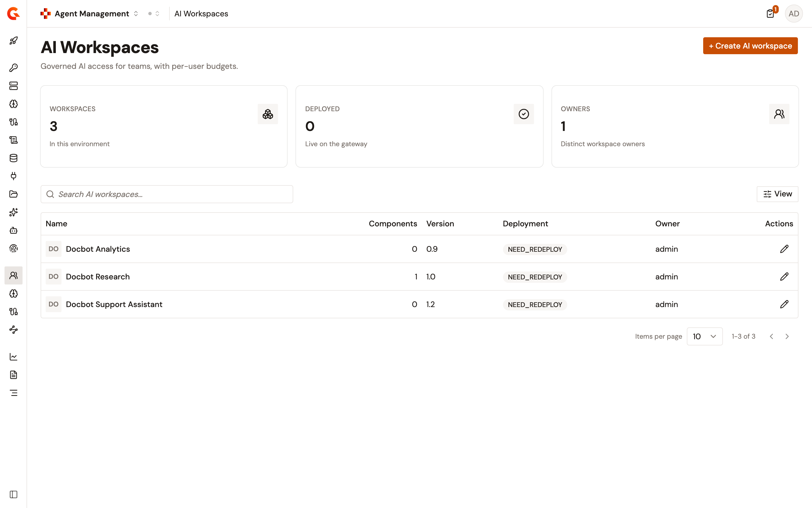
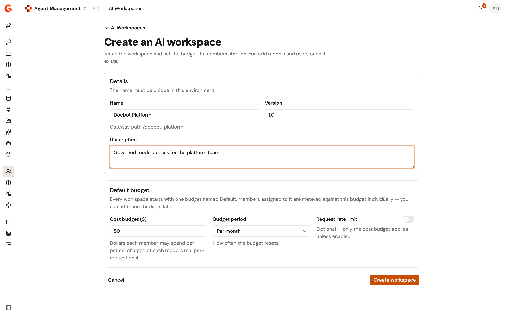
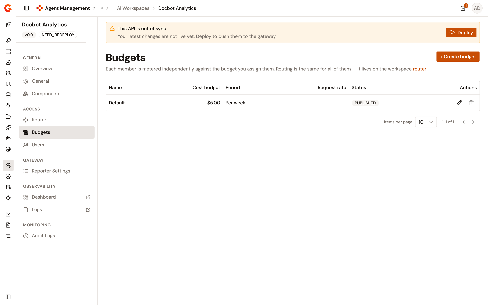

# Create an AI workspace

An AI Workspace packages the models a team may call, the budget its members spend against, and the per-member API keys that grant access. Creating one takes a name, a version, and a default budget. You add models and users afterward.

The name does more than label the workspace. The gateway path of the Default LLM Proxy is derived from it, so a name that produces a path already in use is refused.

## Create the workspace

To create an AI Workspace, complete the following steps:

1. From the Gamma console sidebar, select **Agent Management**.
2. Under **Secure**, select **AI Workspaces**.
3. Select **+ Create AI workspace**.

    <figure><figcaption>
The AI Workspaces list
</figcaption></figure>

4. In the **Details** section, complete the following fields:

    <table>
        <thead>
            <tr>
                <th width="167">Field</th>
                <th width="120">Required</th>
                <th>Description</th>
            </tr>
        </thead>
        <tbody>
            <tr>
                <td><strong>Name</strong></td>
                <td>Yes</td>
                <td>Identifies the workspace. The name is refused when another AI Workspace in the environment already uses it. The field shows the gateway path derived from the name as you type.</td>
            </tr>
            <tr>
                <td><strong>Version</strong></td>
                <td>Yes</td>
                <td>The version of the workspace. Pre-filled with <code>1.0</code>.</td>
            </tr>
            <tr>
                <td><strong>Description</strong></td>
                <td>No</td>
                <td>What the workspace is for.</td>
            </tr>
        </tbody>
    </table>

5. In the **Default budget** section, complete the following fields:

    <table>
        <thead>
            <tr>
                <th width="190">Field</th>
                <th width="120">Required</th>
                <th>Description</th>
            </tr>
        </thead>
        <tbody>
            <tr>
                <td><strong>Cost budget ($)</strong></td>
                <td>Yes</td>
                <td>The dollars each member assigned to this budget may spend per period, charged at each model's real per-request cost. Pre-filled with <code>50</code>, and accepts decimals.</td>
            </tr>
            <tr>
                <td><strong>Budget period</strong></td>
                <td>Yes</td>
                <td>How often the budget resets: <strong>Per hour</strong>, <strong>Per day</strong>, <strong>Per week</strong>, or <strong>Per month</strong>. Pre-filled with <strong>Per month</strong>.</td>
            </tr>
            <tr>
                <td><strong>Request rate limit</strong></td>
                <td>No</td>
                <td>Off by default, so only the cost budget applies. Turn the switch on to also cap how many requests each member sends per window, then enter the limit and choose <strong>Per second</strong>, <strong>Per minute</strong>, <strong>Per hour</strong>, or <strong>Per day</strong>. The limit is pre-filled with <code>60</code> per minute.</td>
            </tr>
        </tbody>
    </table>

    <figure><figcaption>
The AI Workspace creation form
</figcaption></figure>

6. Select **Create workspace**.

The console opens the new workspace on its **Overview** page. The workspace starts with one budget named `Default`, built from the values you entered.


A workspace is created without a Default LLM Proxy. Gravitee creates the proxy, and the gateway path that goes with it, when you add the first model. See [Add models to an AI workspace](add-models-to-an-ai-workspace.md).


## Why a name is refused

The **Name** field turns red and names the reason while you type. A name is refused for one of three reasons:

* An AI Workspace with that name already exists in the environment.
* A proxy already uses the identifier derived from that name.
* The gateway path derived from that name isn't available, for the reason the field reports.

## Edit the workspace

The **General** page of a workspace edits its name, description, and version after creation. Renaming a workspace runs the same three checks, against every workspace except the one you're renaming.

## Verification

To verify the AI Workspace was created as expected, follow these steps:

1. From the Gamma console sidebar, select **Agent Management**.
2. Under **Secure**, select **AI Workspaces**.
3. Confirm the workspace appears in the list.
4. Select the workspace.
5. On the **Overview** page, confirm the **Details** card shows the version you entered.
6. Under **Access**, select **Budgets**.
7. Confirm the list holds one budget named `Default`, with the cost budget and period you entered.

    <figure><figcaption>
The Default budget of a new workspace
</figcaption></figure>
