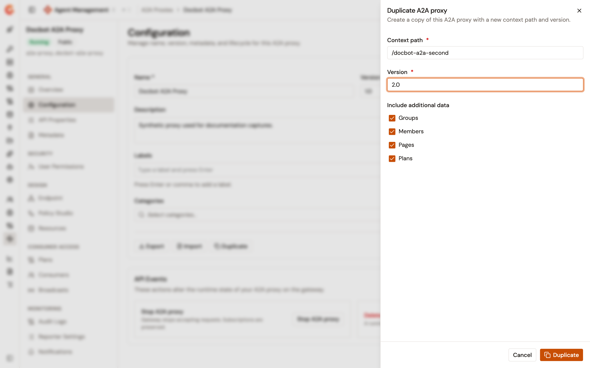
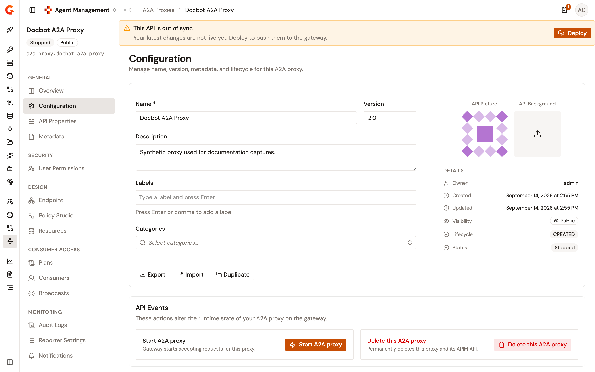

# Duplicate an A2A Proxy

## Overview

When you expose several agents behind a consistent set of plans and policies, it's faster to copy an A2A Proxy than to repeat the wizard. The **Duplicate** action creates a new A2A Proxy from the source proxy's configuration. It asks you for the context path and version that the copy can't share with its source.

Use **Duplicate** to copy a proxy inside one environment. To move a proxy to a different environment, export it and import the file there instead. For more information about exporting and importing an A2A Proxy, see [Export and import an A2A Proxy](export-and-import-an-a2a-proxy.md).

## Prerequisites

Before you begin, confirm that you have the following:

* An A2A Proxy. For more information, see [Expose your agent with the A2A Proxy](expose-agent-with-a2a-proxy.md).
* Permission to read the API definition of the proxy, and permission to create an API in the environment. The **Duplicate** action isn't shown on the **Configuration** page without both.

## Duplicate the proxy

To duplicate an A2A Proxy, complete the following steps:

1. From the Gamma console sidebar, select **Agent Management**.
2. Under **Secure**, select **A2A Proxies**.
3. Select the A2A Proxy that you want to copy.
4. Under **General**, select **Configuration**.
5. Select **Duplicate**.

    <figure><figcaption>
The Duplicate A2A proxy panel with the Context path and Version fields and the include checkboxes
</figcaption></figure>

6. In the **Duplicate A2A proxy** panel, complete the following fields:

    | Field            | Required | Description                                                                                                                                                                                                                  |
    | ---------------- | -------- | ------------------------------------------------------------------------------------------------------------------------------------------------------------------------------------------------------------------------------ |
    | **Context path** | Yes      | The path prefix that callers use to reach the copy. It starts with `/`, is longer than three characters, uses only letters, digits, and the `/`, `.`, `-`, and `_` characters, and holds no `//`. The source proxy's own path is shown as a hint. |
    | **Version**      | Yes      | The version of the copy, up to 32 characters. The source proxy's version is shown as a hint, and isn't used until you type a value.                                                                                            |

7. Under **Include additional data**, clear any of the **Groups**, **Members**, **Pages**, and **Plans** checkboxes you want to leave out of the copy. All four are selected by default.
8. Select **Duplicate**.

The console creates the copy and opens its **Configuration** page.

The copy takes the source proxy's name. Give it a distinct name from its **Configuration** page when you want to tell the two apart in the **A2A Proxies** list.

## What the copy carries

The copy is a new API built from the source proxy's definition, with the context path you gave it and the version you gave it. Its connection to the upstream agent, its policies, and its resources come from the source.

Each checkbox you leave selected copies that data across:

| Data        | What it covers                                                                    |
| ----------- | ------------------------------------------------------------------------------------ |
| **Groups**  | The groups the source proxy belongs to.                                              |
| **Members** | The members of the source proxy, each with their role on the source. A member who's the primary owner of the source gets the default API role on the copy instead. Your own membership isn't copied. |
| **Pages**   | The documentation pages of the source proxy.                                         |
| **Plans**   | The plans of the source proxy, recreated on the copy with their own identifiers.     |

The copy gets its own identifiers throughout, so the subscriptions of the source proxy stay with the source. Consumers of the source proxy aren't subscribed to the copy.

## Context path availability

The panel checks the context path against the other APIs of the environment as you type, with a short pause after your last keystroke. **Checking availability** appears while the check runs, and a path that's already in use is reported under the field.

The check runs again when you select **Duplicate**, so a path taken between your keystroke and your submission is still caught. If the check itself can't reach the platform, the panel doesn't block you and the platform enforces the path on submission.

## Start and deploy the copy

The copy is created stopped. To serve traffic on it, complete the following steps:

1. On the **Configuration** page of the copy, select **Start A2A proxy**.
2. Deploy the copy from the out-of-sync banner once its configuration is right. See [Configure A2A Proxy deployment](configure-a2a-proxy-deployment.md).


When you clear the **Plans** checkbox, the copy has no plan, and a proxy with no plan can't be consumed. Add a plan to the copy before you deploy it. See [Manage A2A Proxy plans](configure-your-a2a-proxy/manage-a2a-proxy-plans.md).



An OAuth2 plan names an identity provider that the proxy declares as a resource. The copy carries the resources of the source proxy, so a copied OAuth2 plan keeps naming a declared resource. See [Configure resources for your proxies](configure-resources-for-your-proxies.md).


## Verification

To verify the copy, complete the following steps:

1. Under **Secure**, select **A2A Proxies**. The list holds a second proxy with the source proxy's name.
2. Open the copy, and then under **Design**, select **Endpoint**. The target of the upstream agent matches the source proxy.
3. Under **Consumer Access**, select **Plans**. The plans are present when you left the **Plans** checkbox selected, and absent when you cleared it.
4. Under **General**, select **Configuration**, and then select **Start A2A proxy**.
5. Deploy the copy from the out-of-sync banner, and then fetch the agent card on the copy's own context path as described in [Expose your agent with the A2A Proxy](expose-agent-with-a2a-proxy.md). The gateway routes the request.

    <figure><figcaption>
The Configuration page of the duplicated A2A Proxy
</figcaption></figure>

## Next steps

* **Adjust the copy**. Change its endpoint, its policies, and its resources. See [Configure your A2A Proxy](configure-your-a2a-proxy/README.md).
* **Add plans to the copy**. See [Manage A2A Proxy plans](configure-your-a2a-proxy/manage-a2a-proxy-plans.md).
* **Move a proxy between environments**. See [Export and import an A2A Proxy](export-and-import-an-a2a-proxy.md).
