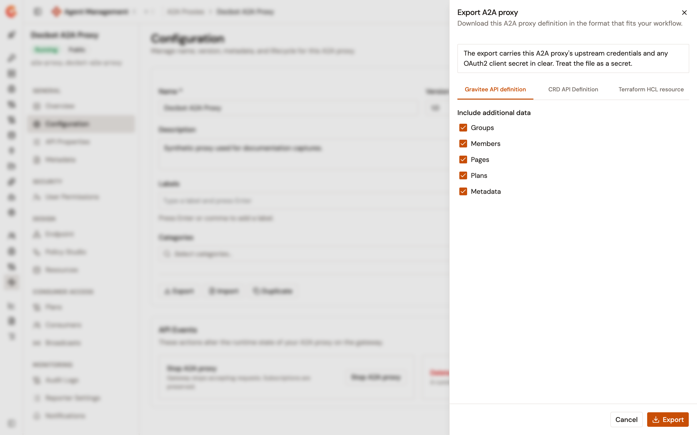
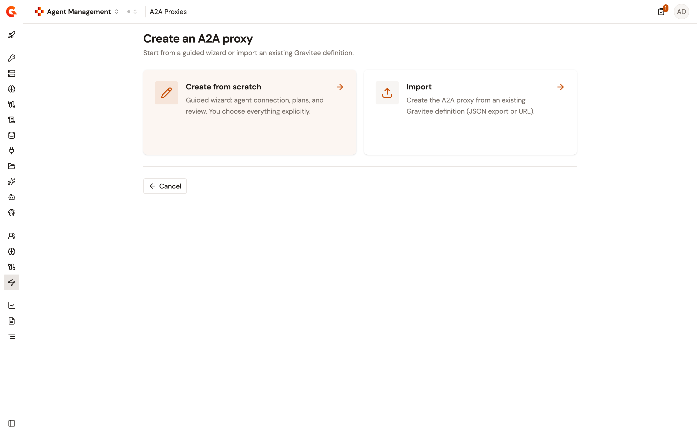
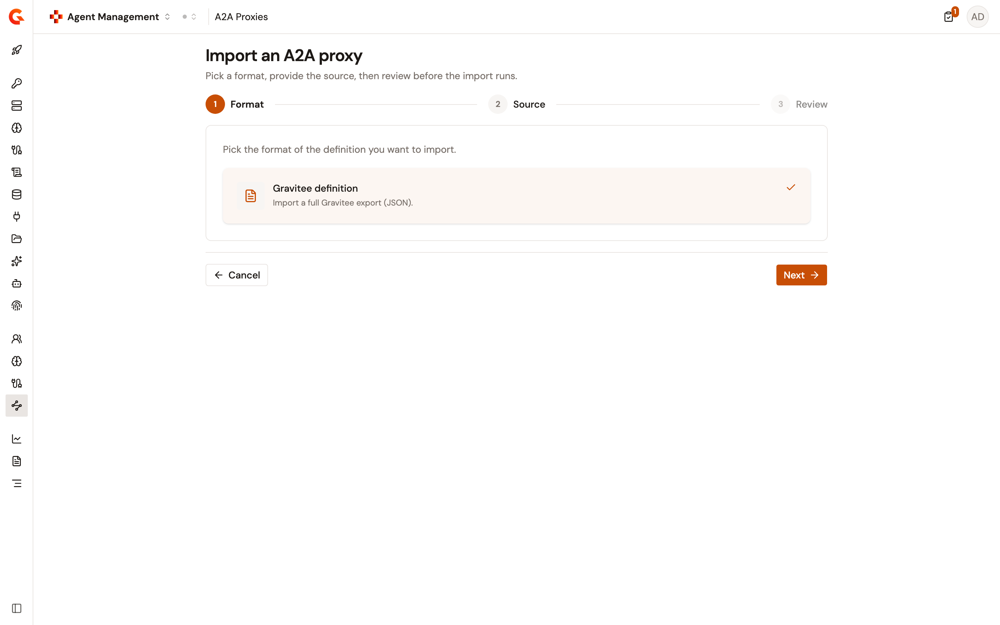
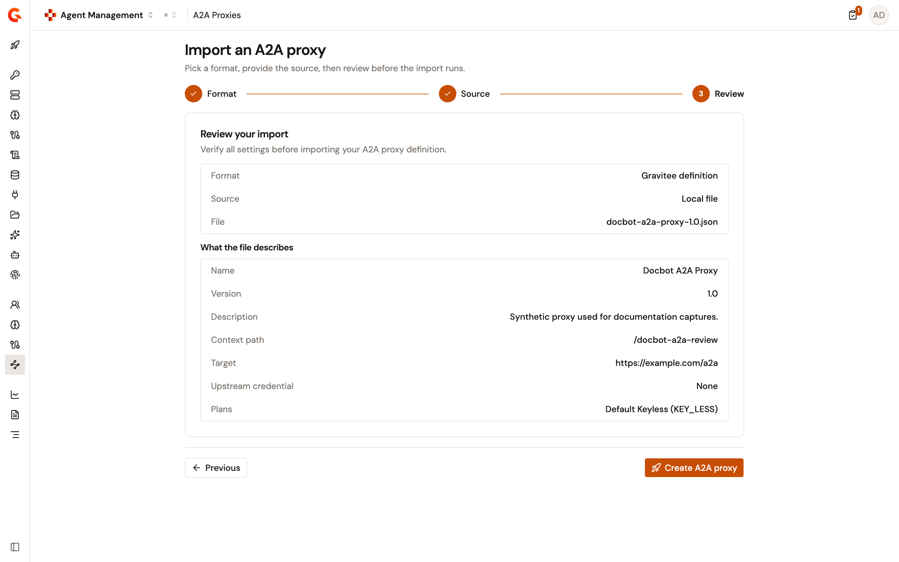
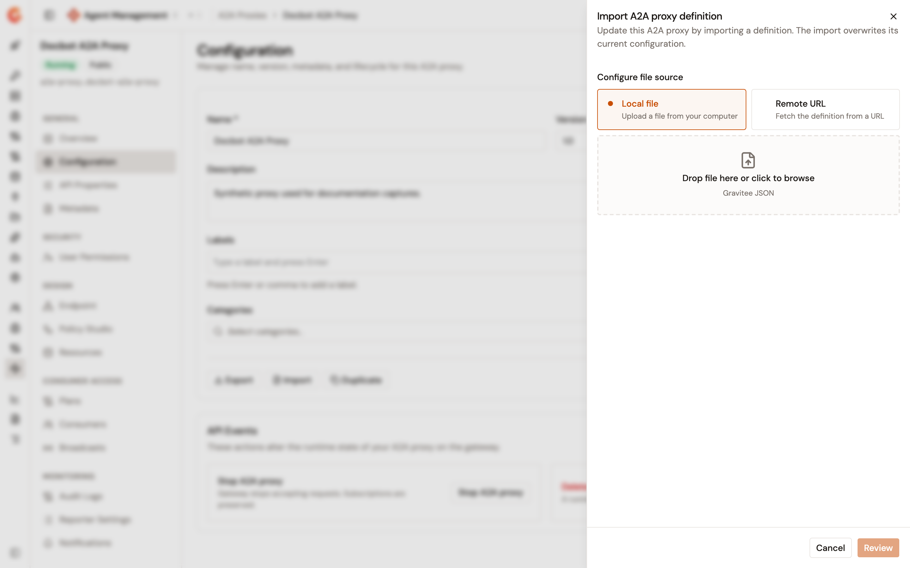

# Export and import an A2A Proxy

## Overview

An A2A Proxy exports as a Gravitee API definition, and a Gravitee API definition creates or updates an A2A Proxy. Together the two directions move a proxy between environments, keep a definition under version control, and rebuild a proxy without retyping its configuration.

The exported file is a standard Gravitee export with one addition, so the APIM Console reads it unchanged. Everything an A2A Proxy needs already travels in the standard part of the file. That covers the name and description, the context path, the target of the upstream agent and its upstream credential, and the OAuth2 resource that an OAuth2 plan names.

Both import directions read the file before they write anything, and show you what they read on a review step.

## Prerequisites

Before you begin, confirm that you have the following:

* An A2A Proxy. For more information, see [Expose your agent with the A2A Proxy](expose-agent-with-a2a-proxy.md).
* Permission to read the API definition of the proxy. The **Export** action isn't shown on the **Configuration** page without it.
* Permission to update the API definition of the proxy, to import a definition onto an existing proxy. The **Import** action isn't shown on the **Configuration** page without it.

## Export an A2A Proxy

The **Export** action downloads the A2A Proxy definition. To export a proxy, complete the following steps:

1. From the Gamma console sidebar, select **Agent Management**.
2. Under **Secure**, select **A2A Proxies**.
3. Select the A2A Proxy that you want to export.
4. Under **General**, select **Configuration**.
5. Select **Export**.

    <figure><figcaption>
The Export A2A proxy panel with the Gravitee API definition format selected
</figcaption></figure>

6. In the **Export A2A proxy** panel, select the format:

    | Format                      | Result                                                                                                                                                          |
    | --------------------------- | ----------------------------------------------------------------------------------------------------------------------------------------------------------------- |
    | **Gravitee API definition** | Downloads a JSON file named `<name>-<version>.json`. This is the format the import actions on this page accept.                                                    |
    | **CRD API Definition**      | Downloads a YAML file named `<name>-<version>-crd.yml` for the Gravitee Kubernetes Operator. The panel links to the Gravitee Kubernetes Operator documentation.     |
    | **Terraform HCL resource**  | Links to the Gravitee Terraform provider tutorial. The panel doesn't produce a file for this format, so it shows no **Export** button.                              |

7. For **Gravitee API definition**, clear any of the **Include additional data** checkboxes you want to leave out of the file. **Groups**, **Members**, **Pages**, **Plans**, and **Metadata** are all selected by default, and each cleared checkbox drops that data from the export.
8. Select **Export**.

The browser downloads the file. Whitespace and other non-word characters in the file name are replaced with hyphens.


The panel warns that the export carries the proxy's upstream credentials and any OAuth2 client secret in clear. A credential entered as a literal value is written into the file as that value. Treat an export that carries literal credentials as a secret, and prefer Expression Language references to secret-manager entries for proxies whose definitions you share.



When you clear the **Plans** checkbox, the file can update an existing A2A Proxy but can't create one. A create by import needs the plans, because it publishes them, and refuses a file that carries none rather than creating a proxy that no plan protects. Keep **Plans** selected when you plan to recreate the proxy elsewhere.


## Create an A2A Proxy by importing a definition

The create flow offers an import route beside the wizard. To create a proxy from a definition, complete the following steps:

1. From the Gamma console sidebar, select **Agent Management**.
2. Under **Secure**, select **A2A Proxies**.
3. Select **Create A2A proxy**.
4. On the **Create an A2A proxy** page, select **Import**.

    <figure><figcaption>
The Create an A2A proxy page with the Create from scratch and Import cards
</figcaption></figure>

5. On the **Format** step, keep the **Gravitee definition** card selected. This is the only format the A2A Proxy accepts, and it's selected for you.
6. Select **Next**.

    <figure><figcaption>
The Import an A2A proxy page on the Format step, with the Gravitee definition card selected
</figcaption></figure>

7. On the **Source** step, under **Configure file source**, select **Local file** or **Remote URL**:
   * For **Local file**, drop a file on the upload area or select it to browse. The picker accepts `.json` files.
   * For **Remote URL**, enter the **Definition URL** of the file, for example `https://example.com/api-definition.json`. The address must be an `http` or `https` URL.
8. Select **Next**.
9. On the **Review** step, check what the console read out of the file, and then select **Create A2A proxy**.

    <figure><figcaption>
The Review your import step, listing the chosen source and what the file describes
</figcaption></figure>

The console creates the proxy and opens its detail page.

### What the review shows

The **Review your import** step has two parts. The first restates what you chose: the **Format**, the **Source**, and the **File** or the **URL**.

The second, **What the file describes**, is what the console read out of the file itself, through the same reader the import uses. It lists the following:

| Row                     | Value                                                                                                     |
| ----------------------- | ------------------------------------------------------------------------------------------------------------ |
| **Name**                | The name the proxy is created under.                                                                         |
| **Version**             | The version in the file. A file that carries none is read as `1.0.0`.                                        |
| **Description**         | The description in the file. A file that carries none shows a dash.                                          |
| **Context path**        | The path the proxy answers on.                                                                               |
| **Target**              | The URL of the upstream agent.                                                                               |
| **Upstream credential** | **Included in the file** when the file carries a credential for the upstream agent, and **None** when it doesn't. The value itself is never shown or sent back. |
| **Plans**               | The name and security type of each plan in the file, or **None**.                                            |

A file the import would refuse is refused on this step, with the message the import would have given, before anything is written. **Create A2A proxy** stays unavailable until the review has shown you what the file describes.

### What the import rebuilds, and what it leaves behind

The import feeds the wizard's own write path, so it rebuilds what an A2A Proxy models. That covers the name, the version, the description, and the primary context path. It also covers the connection to the upstream agent, the plans with their security type, validation mode, and comment requirement, and the OAuth2 resource that those plans name.

The rest of a Gravitee definition has no A2A Proxy counterpart in Gamma and isn't re-created. That leaves behind API-level flows and properties, further listener paths, CORS, path mappings, and health checks. It also leaves behind other resources, tags, categories, groups, metadata, pages, and members. To bring such a file over whole, import it in the APIM Console instead.

The proxy is created stopped. Start it from its **Configuration** page with **Start A2A proxy** once you've checked what arrived.


An export carries the identifier of the proxy it came from, and the create reuses it rather than minting a new one. So a file imports as it is into another environment, and a create in the environment it came from is refused until you remove the identifier from the file. What has to be free either way is the context path.

The import doesn't check the proxy name. An import can therefore produce a second A2A Proxy with the name of an existing one.


### When an import is refused

The import reads the file before it writes anything, and reports what's wrong instead of creating a partial proxy:

| Condition                                                              | Result                                                                                    |
| ---------------------------------------------------------------------- | --------------------------------------------------------------------------------------------- |
| The content isn't valid JSON                                           | The import is refused as not an export envelope.                                              |
| The content parses but its root isn't a JSON object                    | The import is refused as not an export envelope.                                              |
| The file carries no `api` definition                                   | The import is refused, and the message names what's missing.                                   |
| The file describes another kind of API                                 | The import is refused, and the message names the type the file carries.                        |
| The `api` declares no name, or a blank one                             | The import is refused.                                                                         |
| The `api` declares no context path                                     | The import is refused.                                                                         |
| The context path is bound to a virtual host                            | The import is refused, because an A2A Proxy doesn't support one. Import the file in the APIM Console, or export it again without the host. |
| The context path overrides access                                      | The import is refused, for the same reason as a virtual host.                                  |
| The file declares no A2A Proxy endpoint                                | The import is refused as carrying no agent target.                                             |
| The A2A Proxy endpoint declares no target                              | The import is refused.                                                                         |
| The upstream credential in the file isn't an object                    | The import is refused.                                                                         |
| The file carries no plans                                              | The create is refused, and the message tells you to export it again without excluding them.    |
| The identifier in the file belongs to an API this environment already holds | The create is refused, and the message names the identifier. Remove the identifier from the file to create a second proxy from it. |
| The context path in the file is already in use in this environment     | The create is refused, and the message names the path.                                         |
| A plan declares a security type that an A2A Proxy doesn't offer        | The import is refused, and the message names the type.                                         |
| A plan declares no validation mode                                     | The import is refused.                                                                         |
| A plan declares a validation mode other than automatic or manual       | The import is refused, and the message names the value.                                        |
| A plan's security configuration can't be read                          | The import is refused, and the message names the security type.                                |
| The OAuth2 plans name more than one OAuth2 resource                    | The import is refused, because an A2A Proxy declares one identity provider.                    |
| An OAuth2 plan names a resource the file doesn't declare               | The import is refused, and the message names the resource it looked for.                       |
| An OAuth2 plan names its resource through an Expression Language value, and the file declares more than one OAuth2 resource | The import is refused, because an A2A Proxy declares one identity provider. |
| A named resource isn't an OAuth2 resource                              | The import is refused, and the message names the type the resource carries.                    |
| A named OAuth2 resource is missing a field it needs                    | The import is refused, and the message names what's incomplete.                                |

## Update an A2A Proxy by importing a definition

The **Import** action on the **Configuration** page replaces an existing proxy's configuration from a definition. To update a proxy, complete the following steps:

1. Open the A2A Proxy that you want to update.
2. Under **General**, select **Configuration**.
3. Select **Import**.

    <figure><figcaption>
The Import A2A proxy definition panel with the Local file source selected
</figcaption></figure>

4. Under **Configure file source**, select **Local file** or **Remote URL**, and provide the file or the **Definition URL**.
5. Select **Review**.
6. Check what the panel read out of the file, and then select **Import**.

The console confirms the import. The proxy keeps its identity, so its links, its subscriptions, and its gateway naming survive the update. The following table shows what the update takes from the file, and what it keeps from the proxy:

| The update takes from the file     | The update keeps from the proxy                                     |
| ---------------------------------- | ------------------------------------------------------------------- |
| The name, version, and description | The proxy's own identifier, whatever identifier the file carries     |
| The context path                   | The plans, and therefore their live subscriptions                    |
| The target of the upstream agent and its upstream credential |                                            |

An update by import accepts the same file shapes as a create, and refuses the same ones, with one difference. It accepts a file exported without its plans, because it never writes plans, and it never refuses a file over the plans it carries.

On the review of an update, the **Plans** row says that the plans are kept as they are, because an update never rewrites them. The plans in the file aren't listed. **Import** stays unavailable until the review has shown you what the file describes.


The update rewrites the proxy's configuration from the file rather than merging it. Its name, version, description, context path, target, and upstream credential all come from the file after the import.


## Import from a remote URL and the platform allowlist

The console never fetches the definition itself. It sends the address to the Management API, which fetches it and applies the same restrictions as the classic import-from-URL endpoints. Those restrictions come from the Management API `gravitee.yml`:

| Key                          | Default | Effect                                                                                                          |
| ---------------------------- | ------- | ------------------------------------------------------------------------------------------------------------------- |
| `imports.whitelist`          | Empty   | A list of address prefixes. When the list holds at least one entry, only addresses matching an entry are fetched. |
| `imports.allow-from-private` | `true`  | When `false`, addresses that resolve to a private network are refused.                                            |

The two aren't combined. When `imports.whitelist` holds at least one entry, only the whitelist applies and `imports.allow-from-private` is ignored, so a whitelisted address that resolves to a private network is still fetched.

The same restrictions apply to the review step, because the review reads the file the import would read.

## Verification

To verify that a proxy survives the round trip, complete the following steps:

1. Export the proxy with every **Include additional data** checkbox selected.
2. To import the file back into the same environment, delete the `id` field of the `api` object in the downloaded file, and change the context path. A create is refused while either one belongs to a proxy the environment already holds. An import into a different environment needs neither change.
3. Create a second proxy by importing the edited file, and check the **Review** step against the values you expect.
4. Under **Design**, select **Endpoint** on both proxies, and then compare the target of the upstream agent. The copy carries the same target.
5. Under **Consumer Access**, select **Plans** on the copy. The plans the file carried are present.
6. Under **General**, select **Configuration** on the copy, and then select **Start A2A proxy**. Deploy the copy from the out-of-sync banner, and then fetch its agent card on its own context path as described in [Expose your agent with the A2A Proxy](expose-agent-with-a2a-proxy.md). The gateway routes the request.

## Next steps

* **Copy a proxy inside one environment**. See [Duplicate an A2A Proxy](duplicate-an-a2a-proxy.md).
* **Deploy the imported proxy**. See [Configure A2A Proxy deployment](configure-a2a-proxy-deployment.md).
* **Adjust the plans of the imported proxy**. See [Manage A2A Proxy plans](configure-your-a2a-proxy/manage-a2a-proxy-plans.md).
