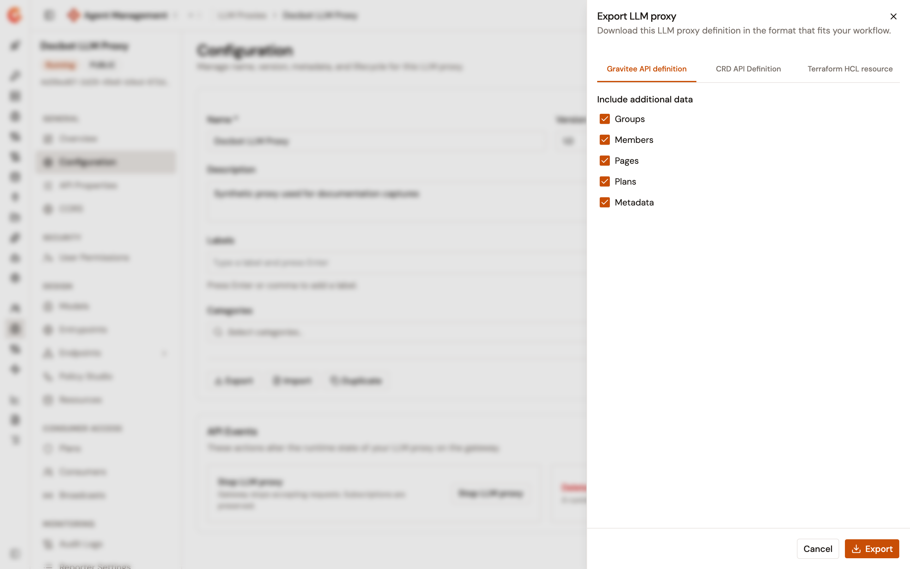
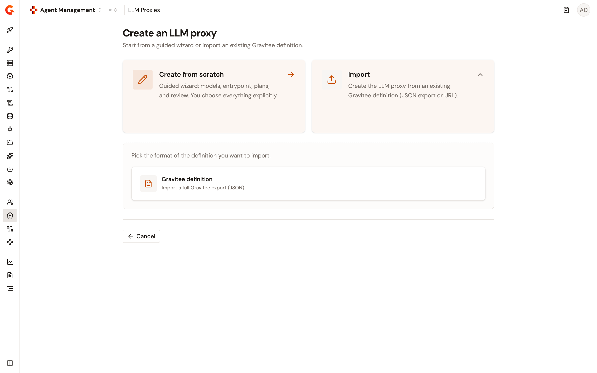
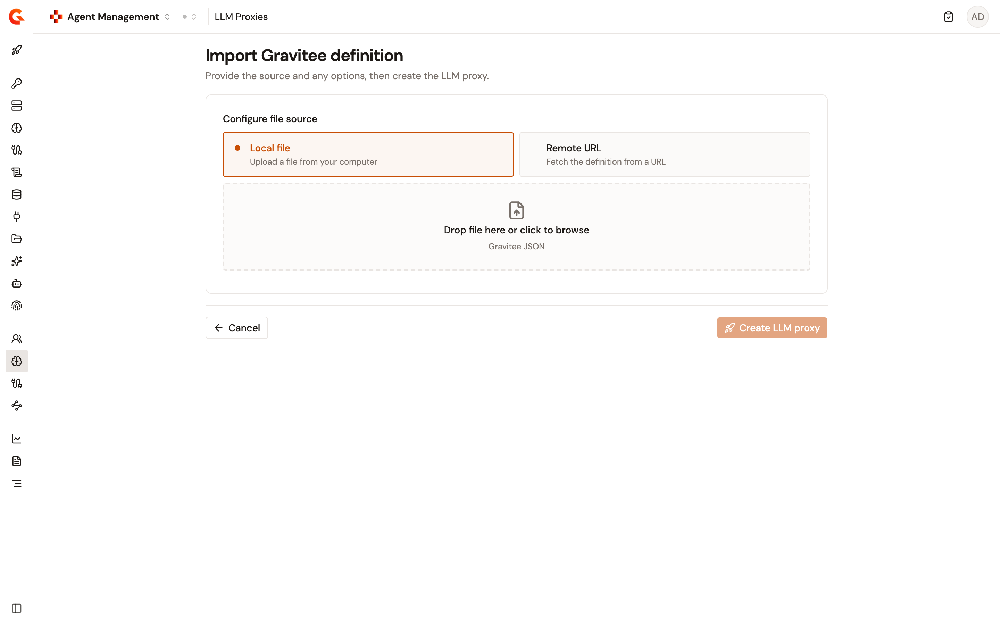
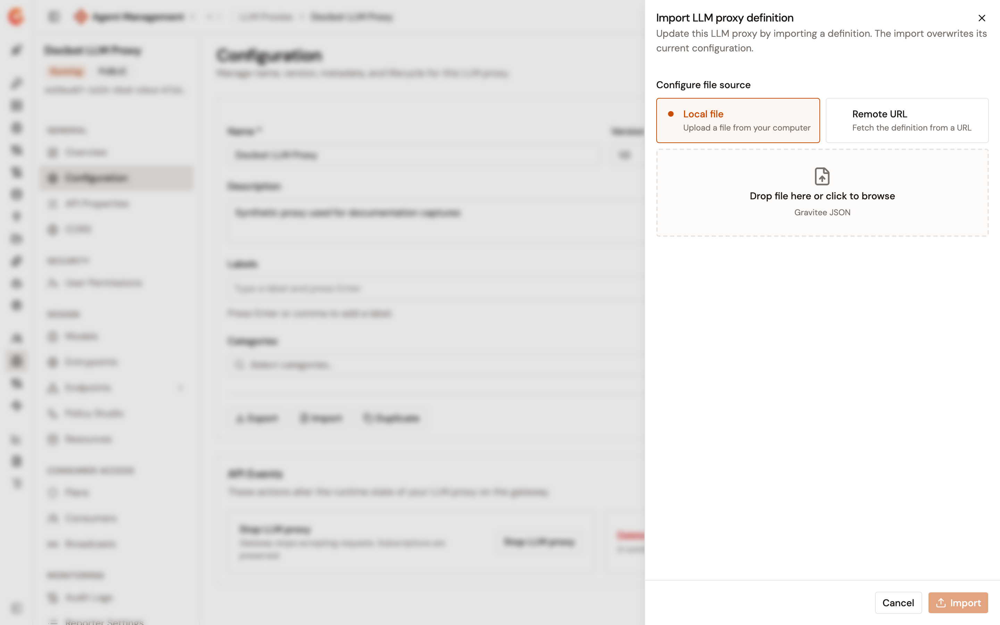
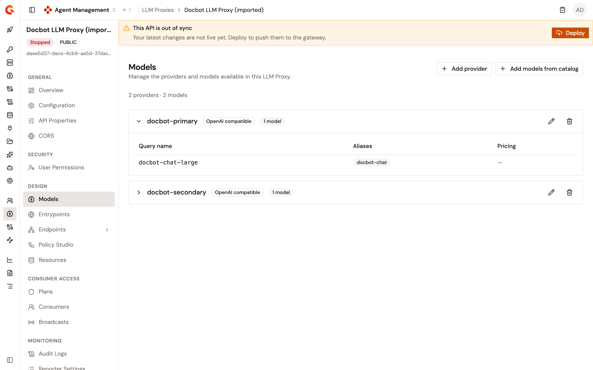

# Export and import an LLM Proxy

An LLM Proxy exports as a Gravitee API definition, and a Gravitee API definition creates or updates an LLM Proxy. Together the two directions move a proxy between environments, keep a definition under version control, and rebuild a proxy without retyping its configuration.

The exported file is a standard Gravitee export with one addition, so the classic Gravitee console reads it unchanged and the Gamma console reads the addition. The addition records each provider in the shape you configured it. An inline provider travels as a self-contained snapshot. A provider added from the catalog travels as a portable reference plus a snapshot.

## Export an LLM Proxy

The **Export** action downloads the LLM Proxy definition. To export a proxy, complete the following steps:

1. From the Gamma console sidebar, select **Agent Management**.
2. Under **Secure**, select **LLM Proxies**.
3. Select the LLM Proxy that you want to export.
4. Under **General**, select **Configuration**.
5. Select **Export**.

    <figure><figcaption>
The Export LLM proxy panel with the Gravitee API definition format selected
</figcaption></figure>

6. In the **Export LLM proxy** panel, select the format:

| Format                        | Result                                                                                                                                           |
| ----------------------------- | ------------------------------------------------------------------------------------------------------------------------------------------------ |
| **Gravitee API definition**   | Downloads a JSON file named `<name>-<version>.json`. This is the format the import actions on this page accept.                                    |
| **CRD API Definition**        | Downloads a YAML file named `<name>-<version>-crd.yml` for the Gravitee Kubernetes Operator. The panel links to the Kubernetes Operator documentation. |
| **Terraform HCL resource**    | Links to the Gravitee Terraform provider tutorial. The panel doesn't produce a file for this format, so it shows no **Export** button.               |

7. For **Gravitee API definition**, clear any of the **Include additional data** checkboxes you want to leave out of the file. **Groups**, **Members**, **Pages**, **Plans**, and **Metadata** are all selected by default, and each cleared checkbox drops that data from the export.
8. Select **Export**.

The browser downloads the file. Whitespace and other non-word characters in the file name are replaced with hyphens.


Clearing the **Plans** checkbox produces a file that can update an existing LLM Proxy but can't create one. A create by import needs the plans, because it publishes them, and refuses a file that carries none rather than creating a proxy that no plan protects. Keep **Plans** selected when you plan to recreate the proxy elsewhere.



Provider credentials travel in the file as they're stored. A credential entered as a literal value is written into the file as that value, and a credential entered as an Expression Language reference travels as the reference. Treat an export that carries literal credentials as a secret, and prefer Expression Language references to secret-manager entries for proxies whose definitions you share.


## Create an LLM Proxy by importing a definition

The create flow offers an import route beside the wizard. To create a proxy from a definition, complete the following steps:

1. From the Gamma console sidebar, select **Agent Management**.
2. Under **Secure**, select **LLM Proxies**.
3. Select **Create LLM proxy**.
4. On the **Create an LLM proxy** page, select **Import**.

    <figure><figcaption>
The Create an LLM proxy page with the Create from scratch and Import cards
</figcaption></figure>

5. Select the **Gravitee definition** card. This is the only format the LLM Proxy accepts.
6. Under **Configure file source**, select **Local file** or **Remote URL**:
   * For **Local file**, drop a file on the upload area or select it to browse. The picker accepts `.json` files.
   * For **Remote URL**, enter the **Definition URL** of the file, for example `https://example.com/api-definition.json`. The address must be an `http` or `https` URL.

    <figure><figcaption>
The Import Gravitee definition page with the Local file and Remote URL source cards
</figcaption></figure>

7. Select **Create LLM proxy**.

The console creates the proxy and opens its detail page. The import runs the same write path as the wizard's **Create only**, so the new proxy isn't deployed. Deploy it from the out-of-sync banner when you're ready to serve traffic.

### File shapes the import accepts

Both source options read the same file shapes and reject the same ones. The import accepts two:

* **A Gamma export.** Inline providers are recreated as they were, including the provider-specific settings of the Gemini Enterprise Agent Platform (formerly Vertex AI) format. Catalog references are re-linked to the catalog of the environment you're importing into, which is what lets one file create the proxy in a second environment.
* **A classic Gravitee export of an LLM Proxy.** The file carries no record of which providers came from a catalog, so every provider is rebuilt as an inline provider from the definition's endpoints.

The proxy type isn't carried by a Gravitee definition, so an import always produces a **Universal LLM Proxy**.

### When an import is refused

The import validates the file before it writes anything, and reports what's wrong instead of creating a partial proxy:

| Condition                                                                       | Result                                                                                              |
| ------------------------------------------------------------------------------- | ----------------------------------------------------------------------------------------------------- |
| The content isn't JSON, or its root isn't a JSON object                          | The import is refused as not an export file.                                                          |
| The file carries no `api` node                                                   | The import is refused, and the message asks you to re-export the proxy rather than assemble a file. |
| The file describes another kind of API                                           | The import is refused, and the message names the type the file carries.                              |
| A classic file's definition carries no LLM Proxy endpoint                        | The import is refused as carrying no providers.                                                       |
| A Gamma file's addition is malformed, or declares no providers                   | The import is refused as not a valid export.                                                          |
| The file carries no plans                                                        | The create is refused, and the message tells you to re-export with the plans or update an existing proxy instead. |
| The file's proxy name generates an **Entity ID** that this environment already holds | The create is refused, and the message names the Entity ID. The name in the file, not the file's own recorded Entity ID, decides the value. |
| The file's context path is already in use in this environment                    | The create is refused, and the message names the path.                                                 |
| A catalog reference names a source that this environment's catalog doesn't hold  | The import is refused, and the message names the source it looked for.                                 |
| A catalog reference matches more than one source in this environment             | The import is refused as ambiguous, and the message gives the number of matches.                       |
| A catalog reference names a model that this environment's catalog doesn't hold   | The import is refused, and the message names the model it looked for.                                  |
| A catalog reference names a model that belongs to a different source             | The import is refused as a mismatch.                                                                   |
| The catalog itself can't be read                                                 | The import is refused as temporarily unavailable. Retry once the catalog responds.                     |


To move a proxy that uses catalog providers into another environment, register the same catalog sources and models there first. The import links each reference to the local catalog entry by the source's kind and name, and by the model's identifier. It refuses the file when it can't find a match, and never creates the missing catalog entry for you.


## Update an LLM Proxy by importing a definition

The **Import** action on the **Configuration** page replaces an existing proxy's configuration from a definition. To update a proxy, complete the following steps:

1. Open the LLM Proxy that you want to update.
2. Under **General**, select **Configuration**.
3. Select **Import**.

    <figure><figcaption>
The Import LLM proxy definition panel with the Local file source selected
</figcaption></figure>

4. Under **Configure file source**, select **Local file** or **Remote URL**, and provide the file or the **Definition URL**.
5. Select **Import**.

The console confirms the import. The proxy keeps its identity, so its links, its subscriptions, and its gateway naming survive the update. What the file replaces, and what it leaves alone, is the following:

| The update takes from the file | The update keeps from the proxy |
| ------------------------------ | ------------------------------- |
| The name, version, and description | The proxy's own identifier and its gateway identity, even when the file carries different ones |
| The context path and the entrypoint token options | The plans, and therefore their live subscriptions |
| The providers and their models, replaced as a set | |

An update by import accepts the same file shapes as a create, and refuses the same ones, with two differences. It accepts a file exported without its plans, because it never writes plans. And it refuses a file that describes a different kind of API than the target, because a proxy can't change type through an import.

The context path comes from the file, like the rest of the entrypoint configuration. Re-importing one proxy's export onto a different proxy is refused while the source still holds that path. Change the path in the file, or free it on the source, before you import.

The update doesn't deploy. The proxy is left out of sync, exactly as a provider change leaves it, and you deploy it from the out-of-sync banner.


An import replaces the proxy's providers as a set rather than merging them. A provider that the file doesn't carry is gone from the proxy after the import.



Two people importing into the same proxy at the same time, or an import running at the same time as a provider change, both end with whichever write landed last. The other person's change is lost without an error. Coordinate imports on a shared proxy.


## Import from a remote URL and the platform allowlist

The console never fetches the definition itself. It sends the address to the Management API, which fetches it and applies the same restrictions as the classic import-from-URL endpoints. Those restrictions come from the Management API `gravitee.yml`:

| Key                          | Default | Effect                                                                                                                        |
| ---------------------------- | ------- | ------------------------------------------------------------------------------------------------------------------------------- |
| `imports.whitelist`          | Empty   | A list of address prefixes. When the list holds at least one entry, only addresses matching an entry are fetched.               |
| `imports.allow-from-private` | `true`  | When `false`, addresses that resolve to a private network are refused.                                                          |

An address the platform refuses, or one that can't be read, is reported as a fetch failure rather than as a problem with the file. When an update by import fails this way, the proxy is left exactly as it was.

## Verification

To verify that a proxy survives the round trip, follow these steps:

1. Export the proxy with every **Include additional data** checkbox selected.
2. Change the proxy name and the context path in the downloaded file. A create by import is refused when the name generates an **Entity ID** that the environment already holds, and refused when the context path is already in use. An import into a different environment needs neither change.
3. Create a second proxy by importing the edited file.
4. Under **Design**, select **Models** on both proxies, and compare the providers and models. The copy carries the same set.

    <figure><figcaption>
The Models page of the imported proxy, showing the providers the file carried
</figcaption></figure>

5. Deploy the copy from the out-of-sync banner, and send it a prompt as described in [Publish your LLM Proxy](../publish/publish-your-llm-proxy.md). The gateway routes the request.

## Next steps

* **Copy a proxy inside one environment**. See [Duplicate an LLM Proxy](duplicate-an-llm-proxy.md).
* **Deploy the imported proxy**. See [Configure LLM Proxy deployment](configure-llm-proxy-deployment.md).
* **Register catalog providers before a cross-environment import**. See [Connect integrations](../import/connect-integrations.md) and [Add an AI model](../import/add-an-ai-model.md).
