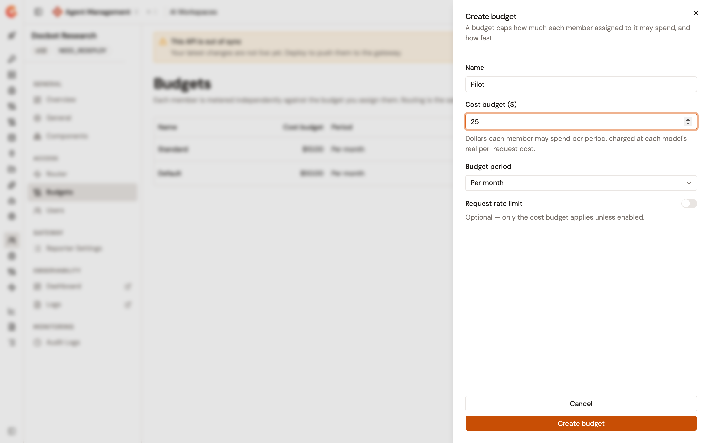
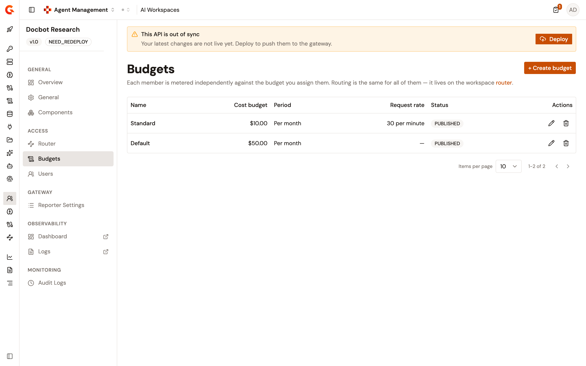

# Manage AI workspace budgets

A budget caps how much each member assigned to it may spend, and how fast. Every member assigned to a budget is metered independently against it, so a budget of fifty dollars per month gives each of ten members fifty dollars, not five each.

Every workspace starts with one budget named `Default`, created from the values you entered when you created the workspace. Add more budgets when different members need different ceilings.

## Create a budget

To create a budget, complete the following steps:

1. From the Gamma console sidebar, select **Agent Management**.
2. Under **Secure**, select **AI Workspaces**.
3. Select the workspace.
4. Under **Access**, select **Budgets**.
5. Select **+ Create budget**.
6. Complete the following fields:

    <table>
        <thead>
            <tr>
                <th width="190">Field</th>
                <th width="120">Required</th>
                <th>Description</th>
            </tr>
        </thead>
        <tbody>
            <tr>
                <td><strong>Name</strong></td>
                <td>Yes</td>
                <td>Identifies the budget in the list and in the budget selector on the <strong>Users</strong> page.</td>
            </tr>
            <tr>
                <td><strong>Cost budget ($)</strong></td>
                <td>Yes</td>
                <td>The dollars each member assigned to this budget may spend per period. Accepts decimals, so <code>0.05</code> is five cents and <code>50</code> is fifty dollars.</td>
            </tr>
            <tr>
                <td><strong>Budget period</strong></td>
                <td>Yes</td>
                <td>How often the budget resets: <strong>Per hour</strong>, <strong>Per day</strong>, <strong>Per week</strong>, or <strong>Per month</strong>. The window rolls from a member's first request rather than aligning to the calendar, and <strong>Per month</strong> is 30 days.</td>
            </tr>
            <tr>
                <td><strong>Request rate limit</strong></td>
                <td>No</td>
                <td>Off by default, so only the cost budget applies. Turn the switch on to also cap how many requests each member sends per window, then enter the limit and choose <strong>Per second</strong>, <strong>Per minute</strong>, <strong>Per hour</strong>, or <strong>Per day</strong>.</td>
            </tr>
        </tbody>
    </table>

    <figure><figcaption>
The Create budget panel
</figcaption></figure>

7. Save the budget.

The **Budgets** list shows the **Name**, **Cost budget**, **Period**, **Request rate**, and **Status** of each budget. A budget with no request rate limit shows a dash.

## How spend is charged

The cost budget is the enforced ceiling. Each request is charged at the cost the Default LLM Proxy computes from the prices configured on the models it serves.

Gravitee holds an estimate of the cost before the model is called, and reconciles it against the real cost once the response completes. The ceiling therefore holds under concurrent calls instead of lagging behind them.

Once a member exhausts the cost budget, the gateway refuses their next call with `429`. Every response carries the `X-Cost-Rate-Limit-Limit`, `X-Cost-Rate-Limit-Remaining`, and `X-Cost-Rate-Limit-Reset` headers, so a client can see the remaining allowance before it runs out.

A model with no configured price consumes nothing from the budget. Free, local, and unpriced catalog models therefore pass without spending the member's allowance.


The same cost accounting is available as a policy you can place on an LLM Proxy directly. See [Add the Cost Rate Limit policy](add-the-cost-rate-limit-policy.md).


## How a member's allowance is tracked

A member's spend is counted against their own application, scoped to the workspace. Two consequences follow:

* Moving a member to a different budget doesn't reset what they've already spent in the current period.
* Removing a member and adding them back reuses the same application, so they return to the allowance they had rather than to a fresh one.

## Edit or delete a budget

Editing a budget changes the ceiling for every member assigned to it. Editing the name, cost budget, period, or request rate limit from the **Budgets** list applies to the members on that budget from the next deployment.

A workspace always keeps at least one budget. Deleting the last remaining budget is refused.

## Deploy a budget change

Creating, editing, and deleting a budget saves the change without pushing it to the gateway. While changes are pending, the **This API is out of sync** banner appears on the workspace pages. Select **Deploy**, optionally enter a **Deployment label** of up to 32 characters, and confirm, so a run of budget edits costs one deployment rather than one each.

Adding and removing models don't use this banner. Gravitee deploys the Default LLM Proxy as part of the change. See [Add models to an AI workspace](add-models-to-an-ai-workspace.md).

## Routing a budget carries

Every budget carries the routing configured for the workspace. A member's calls run that routing alongside the cost budget and the request rate limit of the budget they're on. Creating a budget on this page copies the current routing of the workspace onto it. The `Default` budget a workspace starts with carries no routing, because the workspace has none to inherit yet.

The **Router** page under **Access** edits that routing for the workspace. Where a budget carries routing that differs from it, the page reports **Some budgets are running different routing** and names the budgets. Saving the router replaces what those budgets carry. Saving doesn't deploy, so the out-of-sync banner still applies.

## Verification

To verify a budget applies as expected, follow these steps:

1. Open the workspace.
2. Under **Access**, select **Budgets**, and confirm the budget shows the cost budget, period, and request rate you entered.
3. Deploy the workspace from the out-of-sync banner.
4. Under **Access**, select **Users**, and assign a member to the budget.
5. Call the workspace entrypoint with that member's API key, and confirm the response carries the `X-Cost-Rate-Limit-Remaining` header.
6. Keep calling until the cost budget is exhausted, and confirm the gateway answers `429`.

    <figure><figcaption>
The Budgets list of a workspace
</figcaption></figure>
