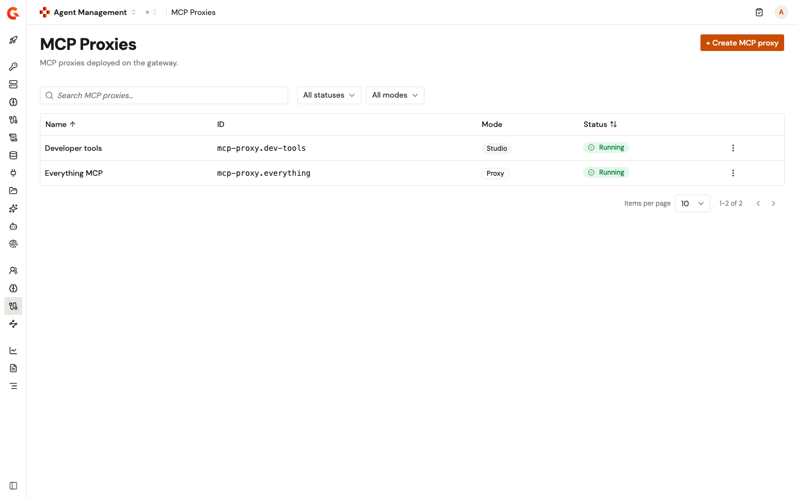

# Manage MCP proxies with the Automation API

Declare MCP proxies as JSON documents and apply them with the Automation API, from a CI/CD pipeline or a script. One declaration covers the proxy, the plans consumers subscribe to, the identity providers those plans authenticate against, the policy flows, and whether the proxy runs. Applying it again brings the proxy back in line with the declaration.

An MCP proxy has one of two modes:

* `PROXY` exposes one upstream MCP server at the proxy's context path.
* `STUDIO` exposes a set of tools picked from MCP servers registered in the Catalog.

To manage the same proxies as Kubernetes resources, use the [`McpProxy`](https://documentation.gravitee.io/gravitee-kubernetes-operator-gko/overview/custom-resource-definitions/mcpproxy) resource of the Gravitee Kubernetes Operator.

## Before you begin

* Agent Management is enabled on your installation.
* You have a bearer token for an account whose role lets it manage APIs in the environment.
* For `STUDIO` mode, the MCP servers the tools come from are registered in the Catalog. See [Register MCP servers with the Automation API](../import/register-mcp-servers-with-the-automation-api.md).

## Automation API access

The Automation API is served at the `/automation` base path on your Management API host. Send each request with a bearer token in the `Authorization` header and a JSON body. MCP proxies are addressed under `/automation/organizations/{orgId}/environments/{envId}/aim/mcp-proxies`.

## Declare an MCP proxy

A `PROXY` declaration names the upstream server and the plans that guard it. This one rate-limits tool calls and asks consumers for an API key:

```json
{
  "hrid": "docs-search",
  "entityId": "mcp-proxy.docs-search",
  "name": "Docs search",
  "contextPath": "/mcp/docs-search",
  "mode": "PROXY",
  "proxy": {
    "serverUrl": "https://mcp.example.com/mcp",
    "upstreamAuth": { "type": "BEARER", "token": "<token>" }
  },
  "flows": [
    {
      "name": "Rate limit tool calls",
      "selectors": [{ "type": "MCP", "methods": ["tools/call"] }],
      "request": [
        {
          "name": "Quota",
          "policy": "rate-limit",
          "configuration": { "rate": { "limit": 100, "periodTime": 1, "periodTimeUnit": "MINUTES" } }
        }
      ]
    }
  ],
  "plans": [
    { "name": "API key", "security": { "type": "API_KEY", "source": "HEADER" } }
  ]
}
```

A `STUDIO` declaration picks tools from registered MCP servers by the server's `hrid` and the tool's name, and gives each server an upstream credential:

```json
{
  "hrid": "dev-tools",
  "entityId": "mcp-proxy.dev-tools",
  "name": "Developer tools",
  "contextPath": "/mcp/dev-tools",
  "mode": "STUDIO",
  "studio": {
    "tools": [
      { "server": "docs-search", "tool": "search" },
      { "server": "docs-search", "tool": "get-page", "alias": "read_page" }
    ],
    "upstreamAuth": [
      { "server": "docs-search", "auth": { "type": "NONE" } }
    ]
  },
  "plans": [
    { "name": "API key", "security": { "type": "API_KEY", "source": "HEADER" } }
  ]
}
```

| Field | Required | Description |
|:------|:---------|:------------|
| `hrid` | Yes | Your ID for the proxy, used in the request path. 3 to 256 characters: letters, digits, `-`, and `_`, starting and ending with a letter or digit. |
| `entityId` | Yes | The proxy's identity, which authorization policies reference. Lowercase, dot-separated segments starting with `mcp-proxy.`, at most 255 characters, and unique in the environment. Fixed at creation. |
| `name` | Yes | Display name. |
| `description` | No | Description of the proxy. |
| `contextPath` | Yes | Path the Gateway serves the proxy on. Starts with `/` and is available in the environment. |
| `mode` | Yes | `PROXY` or `STUDIO`. Fixed at creation. Declare only the block of the mode you choose. |
| `proxy` | For `PROXY` | `serverUrl`, the upstream MCP server, and `upstreamAuth`, the credential the Gateway presents to it. |
| `studio` | For `STUDIO` | `tools`, `upstreamAuth`, and `enableFGA`. See [Studio tools](#studio-tools). |
| `state` | No | `STARTED`, the default, or `STOPPED`. See [Start and stop the proxy](#start-and-stop-the-proxy). |
| `flows` | No | Policy flows of the proxy, run after the flows of the plan the request matched. See [Policy flows](#policy-flows). |
| `flowExecution` | No | `mode`: `DEFAULT` runs every matching flow, `BEST_MATCH` runs the best match. `matchRequired`: `true` rejects a request no flow matches. |
| `identityProviders` | No | Authorization servers that `OAUTH2` plans reference. See [Plans and identity providers](#plans-and-identity-providers). |
| `plans` | Yes | At least one plan. See [Plans and identity providers](#plans-and-identity-providers). |

### Upstream authentication

`proxy.upstreamAuth`, and the `auth` of each `studio.upstreamAuth` entry, set `type` to one of these values:

| `type` | Fields |
|:-------|:-------|
| `NONE` | None. The Gateway passes the caller's credentials through. |
| `API_KEY` | `apiKeyHeader`, `apiKey` |
| `BEARER` | `token` |
| `BASIC` | `username`, `password` |
| `OAUTH2` | `authorizeUrl`, `tokenUrl`, `clientId`, `clientSecret`, and optional `scopes`. Through MCP elicitation, the user is sent to `authorizeUrl` to authorize access, and the code is exchanged at `tokenUrl`. |

A credential is a literal or a `secret://` reference to a configured secret provider. Credentials are never returned. Leaving out `proxy.upstreamAuth` removes the stored upstream authentication.

### Studio tools

* Each entry of `tools` names a registered server by its `hrid` and the tool by its name. `alias` renames a tool, and the names a Studio exposes are unique across it.
* `upstreamAuth` holds exactly one entry for each server the tools come from. Use `type: NONE` for a server that needs no credential.
* `enableFGA: true` adds the platform's fine-grained authorization to tool calls, with the called tool as the resource. Don't add the `authz-pep` policy to the flows yourself, because it's rejected.

### Plans and identity providers

Each plan has a `name` and a `security` block:

| `security.type` | Fields |
|:----------------|:-------|
| `KEY_LESS` | None. Not available in `STUDIO` mode, because a Studio calls tools on behalf of an authenticated consumer. |
| `API_KEY` | `source`: `HEADER`, `BEARER`, or `QUERY_PARAMETER`. Optional `apiKeyHeader` for a custom header, and `propagateApiKey` to forward the key upstream. |
| `OAUTH2` | `provider`: the `name` of one of the proxy's `identityProviders`. |

A plan can also carry `flows`, which run before the proxy's own flows.

An identity provider has a `name` that plans reference, and a `type`:

| `type` | Fields |
|:-------|:-------|
| `GRAVITEE_AM` | None. The domain, client, and resource are provisioned in Gravitee Access Management when the proxy is created, so set up the Access Management connection first. Declare at most one, and only when you create the proxy. |
| `OAUTH2_GENERIC` | `issuerUrl`, `introspectionEndpoint`, `introspectionEndpointMethod` (`GET` or `POST`), and optional `clientId`, `clientSecret`, and `userInfoEndpoint`. |
| `OAUTH2_AUTH0` | `domain`, `audience` |

### Policy flows

A flow has a `name`, optional `selectors`, and the steps it runs on the `request` and the `response`. A selector of `type: MCP` matches MCP methods such as `tools/call`, and a selector of `type: CONDITION` matches an expression. A flow without selectors applies to every request. Each step names a policy and its `configuration`, which is checked against the policy's own schema on every apply and dry run.

## Create the proxy

Preview the declaration, apply it, and then read it back:

1. Send the declaration with `PUT` to `/automation/organizations/{orgId}/environments/{envId}/aim/mcp-proxies?dryRun=true`. Nothing is saved. The response answers `200`, and lists any problems under `errors.severe` and `errors.warning`.
2.  Send the same request without `dryRun` to create the proxy:

    ```bash
    curl -X PUT "https://<management-api-host>/automation/organizations/DEFAULT/environments/DEFAULT/aim/mcp-proxies" \
      -H "Authorization: Bearer <token>" \
      -H "Content-Type: application/json" \
      -d @mcp-proxy.json
    ```

    A `200` response returns the proxy, with its `state` and, for a Studio, the `entityId` of each tool. A `400` response lists the problems that stopped it under `errors.severe`, and nothing is saved.
3. Send `GET` to `/automation/organizations/{orgId}/environments/{envId}/aim/mcp-proxies/{hrid}` to read the proxy back.

## Apply changes

Edit the declaration and apply it again with the same `hrid`. The proxy converges on what you declare:

* **Flows.** The declaration owns the proxy's flows and each plan's flows. Every apply replaces them, so a flow added in the console is removed unless the declaration carries it. Leaving out `flows` removes them all.
* **Plans.** Plans are matched by name. A new plan is created and published. A plan missing from the declaration is closed, which ends its subscriptions. A plan's `security` can't change in place: declare the new security under another name.
* **Identity providers.** Providers are matched by name. A new provider is added, and a provider you no longer declare stays on the proxy. Changing an existing provider's settings is rejected, except the `clientSecret` of an `OAUTH2_GENERIC` provider, which replaces the stored one.
* **Fixed fields.** A different `mode` or `entityId` is rejected. To change either one, delete the proxy and declare it again.

### Start and stop the proxy

With `state: STARTED`, the default, the Gateway runs the proxy and every apply that changes it is deployed. With `state: STOPPED`, the Gateway answers `404` on the context path, and changes are stored without being deployed until the next apply with `STARTED`.

When the Gateway side refuses a start or a deployment, the apply answers `500` with the technical code `gamma.mcp.lifecycle.failed`. The declaration is still stored, and the next apply tries again.

## Delete a proxy

Send `DELETE` to `/automation/organizations/{orgId}/environments/{envId}/aim/mcp-proxies/{hrid}`. Gravitee answers `204`, and a later `GET` answers `404`.

## Verification

To verify the MCP proxies are created as expected, follow these steps:

1. In the **Secure** group of the Agent Management sidebar, click **MCP Proxies**.
2.  Find each proxy you declared. The **ID** column shows its `entityId`, **Mode** shows **Proxy** or **Studio**, and **Status** shows **Running** for a started proxy.

    <figure><figcaption><p>MCP proxies declared through the Automation API.</p></figcaption></figure>
