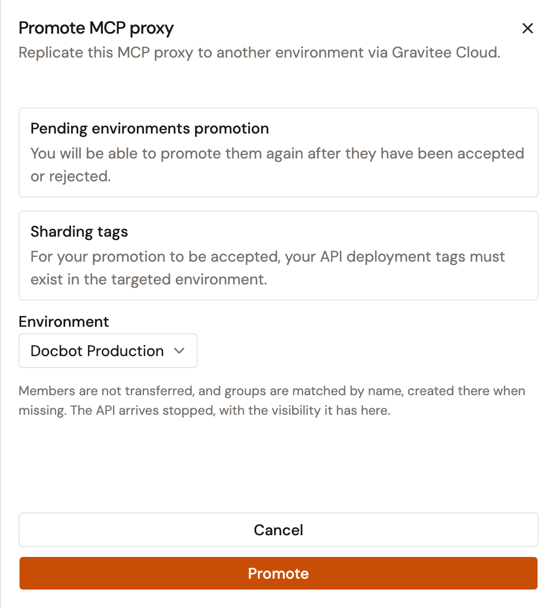
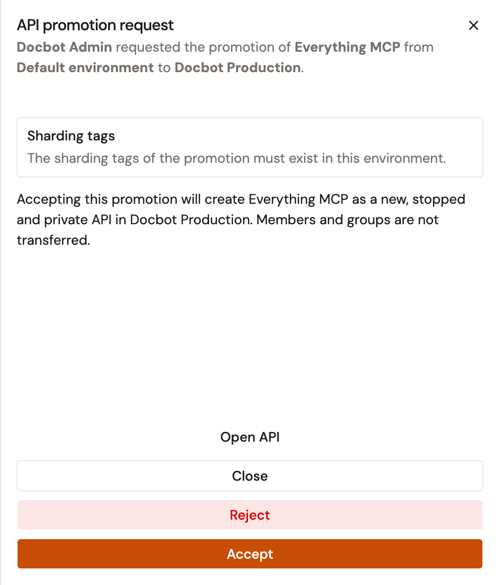
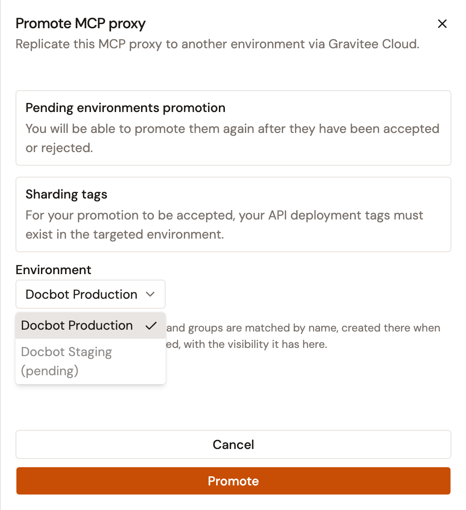

# Promote your proxies to another environment

## Overview

Promoting an LLM Proxy, MCP Proxy, or A2A Proxy sends a copy of it to another environment through Gravitee Cloud. Nothing changes in the target environment until someone there accepts the request.

Accepting a promotion creates the proxy in the target environment as the same type of proxy. It arrives stopped, with the visibility it has in the source environment. Members aren't copied. Groups are matched by name, and a group the target environment doesn't have is created there, empty.

## Prerequisites

Before you begin, confirm that you have the following:

* An installation registered with Gravitee Cloud and accepted there. Until it is, **Promote** opens **Meet Gravitee Cloud**, which links to Gravitee Cloud to create an account and register the installation.
* Permission to update the API definition of the proxy. Without it, **Promote** doesn't appear on the **Settings** page.
* Every sharding tag of the proxy available in the target environment. Accepting the promotion fails when the proxy uses a tag that the organization doesn't define. It also fails when a tag is restricted to groups that the person accepting isn't in, unless that person is an administrator of the environment. The error names the tags.

## Promote a proxy

**Promote** is unavailable in the following cases:

* The proxy is managed by the Kubernetes operator.
* The **Lifecycle** of the proxy is `DEPRECATED` or `ARCHIVED`.
* **Enable API Review** is on for the environment, and a reviewer hasn't accepted the proxy yet. The panel shows **Promotion not available**. For more information, see [Configure API Review](../../platform-management/configure-api-review.md).

To promote a proxy, follow these steps:

1. Under **Secure** in the module sidebar, select **LLM Proxies**, **MCP Proxies**, or **A2A Proxies**.
2. Select the proxy you want to promote.
3. Under **General**, select **Settings**.
4. Click **Promote**.
5. In the panel, select the target environment from the **Environment** list.

    <figure><figcaption>
The Promote MCP proxy panel
</figcaption></figure>

6. Click **Promote**.

**Promotion requested** confirms the request. When the request fails, the panel stays open and shows the error.

The **Environment** list holds the environments Gravitee Cloud returns for your installation. An environment that already has a promotion of this proxy waiting shows **(pending)** and can't be selected until that promotion is accepted or rejected.


When an LLM Proxy uses credentials saved in the Catalog, the panel adds a notice that the target environment needs the same Catalog items. After the promotion is accepted, deploying or starting the proxy in the target environment fails until that environment has a matching provider for each one the proxy uses. Each provider must be visible to the primary owner of the proxy. The error names the providers that are missing.


## Accept or reject a promotion

The request reaches the target environment as a task in **Tasks & Approvals**. A first promotion is listed for people who can create APIs in that environment. A promotion of a proxy that an earlier promotion already created there is listed for people who can update APIs there.

To accept or reject a promotion, follow these steps:

1. At the top right of the Gamma console, click the clipboard icon next to your avatar.
2. In the task's row, click **Review promotion**.
3. In the **API promotion request** panel, click **Accept**, or click **Reject** and then **Confirm reject**.

    <figure><figcaption>
The API promotion request panel
</figcaption></figure>

**API promotion accepted.** or **API promotion rejected.** confirms your choice. After a rejection, the environment can be selected again in the **Environment** list.


A promotion can't update a proxy that an earlier promotion created. When the target environment still holds that proxy, the panel says that accepting will update it, and accepting fails with an error. Once that copy is deleted, a new promotion creates the proxy again when it's accepted.


## Verification

To verify the promotion is working as expected, follow these steps:

1. On the **Settings** page of the proxy, click **Promote**.
2. Open the **Environment** list. The environment you promoted to shows **(pending)** until someone there accepts or rejects the request.

    <figure><figcaption>
An environment with a promotion waiting
</figcaption></figure>

3. After the request is accepted, open the proxy in the target environment. Under **General**, select **Settings**. **Status** shows **Stopped**.
