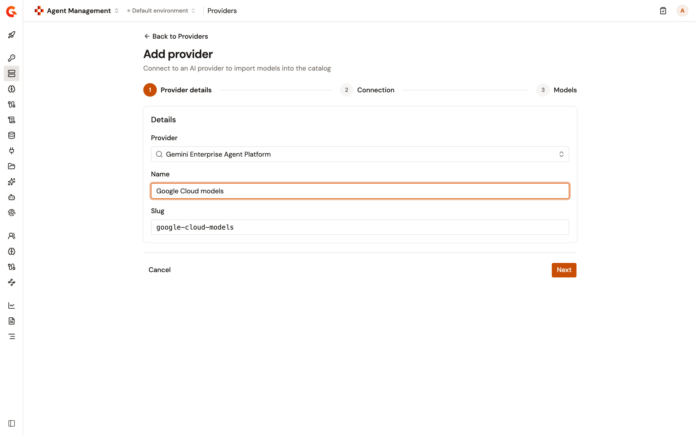
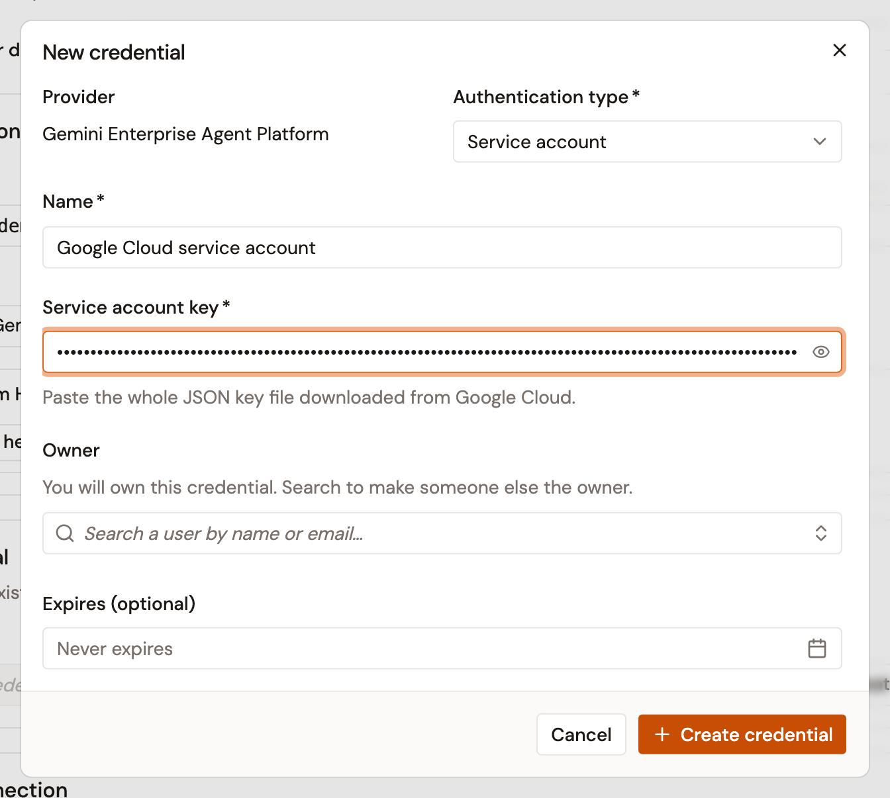
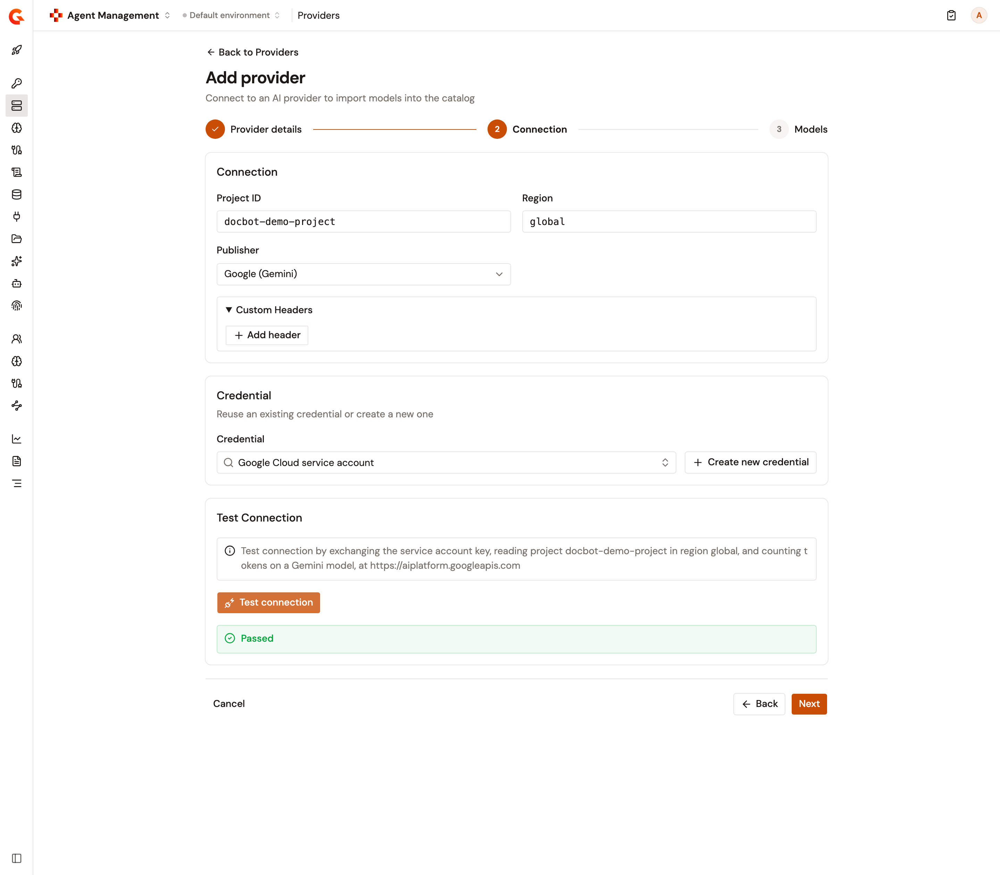
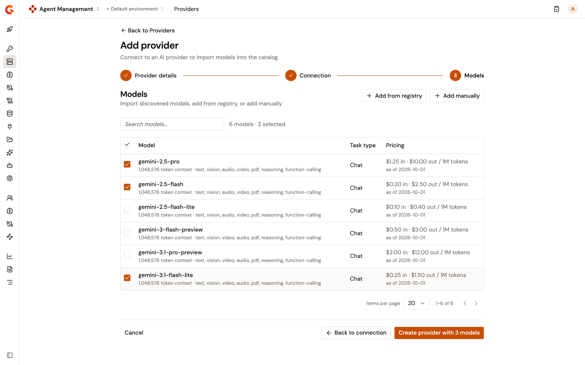
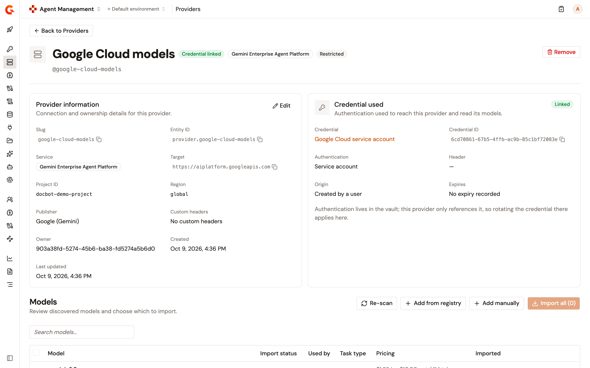
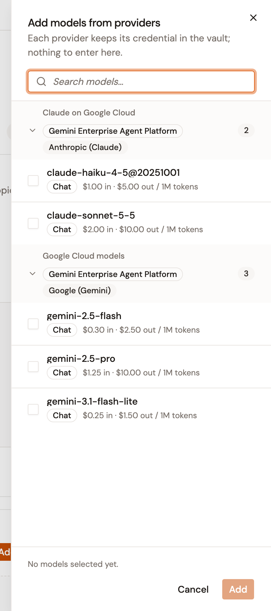
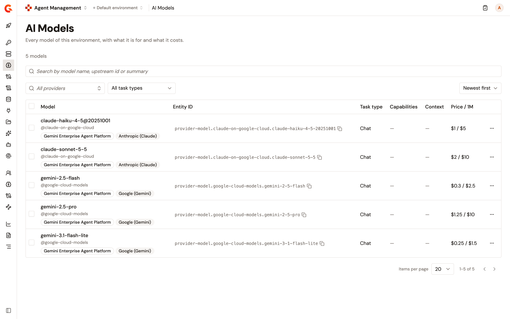

# Connect a Gemini Enterprise Agent Platform provider

A **Gemini Enterprise Agent Platform** provider connects the Catalog to the Gemini and Claude models a Google Cloud project serves. The provider is addressed by a **Project ID**, a **Region**, and a **Publisher** rather than a URL, and it reaches Google with a credential kept in the vault. Before the provider is saved, the connection test checks the credential, the project, the region, the publisher, and every selected model against Google. When something fails, the test names what to fix.

The models the provider imports appear in the **AI Models** list and can be added to LLM Proxies and AI Workspaces without entering the credential again.

## Before you begin

Make sure you have the following:

* A Google Cloud project with the **Vertex AI API** enabled. When it isn't, the connection test says so, names the project, and links to the page that enables it when Google reports one.
* A credential. A service account key file in JSON format, for a service account allowed to call models on the project, reaches both Gemini and Claude models. An API key reaches Gemini models only.
* For Claude models, the model enabled in Model Garden for the project, and a region that serves Claude models.
* The right to add entries to the Catalog. The **Add provider** button appears only when your role has it.

## Choose the credential type

The credential type decides which models the provider can serve and whether a **Project ID** is required:

| Credential type     | Models                                                                       | Project ID                                                                                                                                                                |
| ------------------- | ---------------------------------------------------------------------------- | ------------------------------------------------------------------------------------------------------------------------------------------------------------------------- |
| **Service account** | Gemini models with the **Google (Gemini)** publisher, and Claude models with the **Anthropic (Claude)** publisher. | Required. If it's empty, the wizard flags it when you test the connection or continue.                                                                                    |
| **API key**         | Gemini models only. With the **Anthropic (Claude)** publisher, an API key can't be selected.                      | Optional. Without a **Project ID**, the provider calls Google in express mode on the global host, and the **Region** isn't used. Google doesn't list models to an API key, so you add them from the registry or by hand. |

## Add the provider

To add a Gemini Enterprise Agent Platform provider, complete the following steps:

1. In the Gamma console, open **Agent Management**.
2. Under **Catalog**, select **Providers**.
3. Select **Add provider**.
4. On the **Provider details** step, in **Provider**, select **Gemini Enterprise Agent Platform**, and then enter a **Name**. The **Slug** is generated from the name, and you can change it.

    <figure><figcaption>
The Provider details step with Gemini Enterprise Agent Platform selected
</figcaption></figure>

5. Select **Next**.
6. On the **Connection** step, enter the **Project ID** of your Google Cloud project, keep or change the **Region**, which is `global` by default, and in **Publisher**, select **Google (Gemini)** for Gemini models or **Anthropic (Claude)** for Claude models.
7. Under **Credential**, select a credential for this provider. To store a new one, select **Create new credential**, and in the **New credential** dialog, enter a **Name**, select the **Authentication type**, enter the secret, and select **Create credential**. For a service account, paste the whole JSON key file in **Service account key**. The secret is kept in the vault and can't be viewed after it's saved.

    <figure><figcaption>
The New credential dialog with the Service account authentication type
</figcaption></figure>

8. Select **Test connection**. The text above the button says what the test calls for the credential you picked. The result reads **Passed**, or **Failed** with the reason, and the field at fault shows its error.

    <figure><figcaption>
The Connection step after a passed test
</figcaption></figure>

9. Select **Next**.
10. On the **Models** step, choose the models the provider serves. With a service account, the models Google lists for the publisher appear unselected, and you select the ones to import. **Add from registry** offers the Gemini or Claude models of the built-in price list, with Google's public list prices, and **Add manually** takes a model ID you type.

    <figure><figcaption>
The Models step with the models Google lists for the publisher
</figcaption></figure>

11. Select **Create provider with N models**, where N is the number of models you selected. Each selected model is called before the provider is saved. When a model isn't available, the error names every refused model, and nothing is saved.

The provider page opens. Its header shows **Credential linked**, and **Provider information** shows the **Project ID**, the **Region**, and the **Publisher**.

<figure><figcaption>
The provider page after creation
</figcaption></figure>

## What the connection test checks

The test runs a chain of calls, and the first one that fails says what to fix:

* With a service account, the test exchanges the key for an access token, reads the project in the region, counts tokens on a Gemini or Claude model there, depending on the publisher, and then lists the publisher's models.
* With an API key, the test counts tokens on a Gemini model, in the project and region when a **Project ID** is set, or in express mode otherwise. It lists nothing.

A failed test marks the field to fix and tells you what to check:

* **The key is rejected.** Check that an API key is current, not revoked, and allowed to call the API, or that a service account key hasn't been deleted or disabled and the service account still exists.
* **The API isn't enabled on the project.** Enable it in the Google Cloud console, then try again. If the key is a Google AI Studio key, use the **Google Gemini** provider instead.
* **The project isn't found, or the credential can't see it.** Check the **Project ID**.
* **The credential can't use the platform on the project.** Grant the credential the **Vertex AI User** role (`roles/aiplatform.user`), check the **Project ID**, and for Claude models, enable the model in Model Garden for the project.
* **The region isn't available.** Check the **Region**, or use `global`.
* **The model the test calls isn't available in that region.** For Gemini models, check the **Project ID** and use a region that serves them. For Claude models, enable the model in Model Garden and use a region that serves Claude models, such as `us-east5` or `europe-west1`. In express mode, check that the API key may use express mode, or enter the **Project ID** it belongs to.
* **The service account key can't be used.** Replace it with the key file Google issued. A key that names a token endpoint other than Google's is refused when you save the credential.
* **Google is rate-limiting the project.** Try again shortly, or raise the project's quota.
* **Google can't be reached.** Check that the management API can reach `*.googleapis.com` through any proxy or firewall, as the gateway must for proxy traffic, and try again later if Google is failing.

## Manage the provider

After the provider is saved, you manage it from its page:

* **Models**. **Re-scan** asks Google again for the publisher's models and is offered for a service account only, because Google lists models to a service account and not to an API key. **Add from registry**, **Add manually**, and **Import all** add models, and each model you add is called before it's saved. Google lists its whole catalog for a publisher rather than what your project serves, which is why each model is checked.
* **Edit**. Changing the connection or the credential re-tests the connection and checks each model before saving. While LLM Proxies use the provider, its credential can't be changed: remove the provider from those proxies first. A model an LLM Proxy serves can't be removed either.
* **Credential rotation**. The provider only references the credential, so rotating the secret in the vault applies to the provider and to the LLM Proxies that use it, with no re-save and no redeploy.
* **Connection changes**. A change to the connection redeploys the LLM Proxies that use the provider when they're in sync with the gateway. A proxy that's already out of sync keeps the change with its other undeployed changes, and it goes live with the proxy's next deploy.

## Use the models in LLM Proxies and AI Workspaces

The models of the provider appear in the **AI Models** list with a **Gemini Enterprise Agent Platform** badge and a publisher badge, **Google (Gemini)** or **Anthropic (Claude)**.

To add them to an LLM Proxy or an AI Workspace, open the **Add models from providers** panel. On the **Models** step of the LLM Proxy wizard, select **Add from providers**. On the **Models** page of an existing proxy or the **Components** page of a workspace, select **Add models from providers**. Each provider keeps its credential in the vault, so there's nothing to enter. The panel groups the models by provider, with the same badges.

<figure><figcaption>
The Add models from providers panel
</figcaption></figure>

The proxy sends requests to the project, region, and publisher of the provider. With a service account, the key is read on each request, so a rotated key applies without a redeploy. With an API key and no **Project ID**, requests use express mode. If your installation doesn't sync credentials to the gateway, the panel says so under the provider, and its models can't be added. The sync is the management API setting `modules.aim.credentials.gateway.enabled`, on by default. Whatever the setting, an LLM Proxy built on a provider needs every gateway on 4.13 or later. For the request formats, the parameters each publisher supports, and the errors a proxy returns, see [LLM Proxy provider support](../build/llm-proxy-provider-support.md#gemini-enterprise-agent-platform).

## Verification

To verify the provider is working as expected, follow these steps:

1. Under **Catalog**, select **AI Models**.
2. Find the models you imported. Each row shows the **Gemini Enterprise Agent Platform** badge and the publisher badge of its provider.

    <figure><figcaption>
The AI Models list with the imported models and their badges
</figcaption></figure>

3. Under **Catalog**, select **Providers**, and then select the provider. The header shows **Credential linked**, and the **Models** section lists the imported models.
