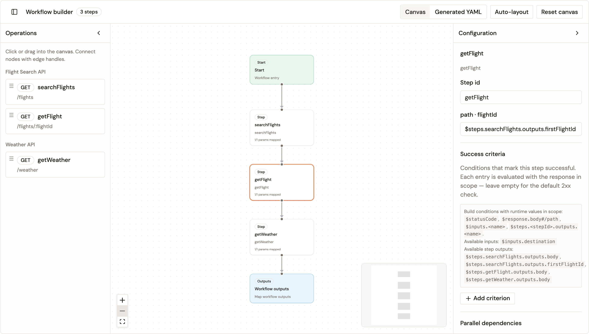
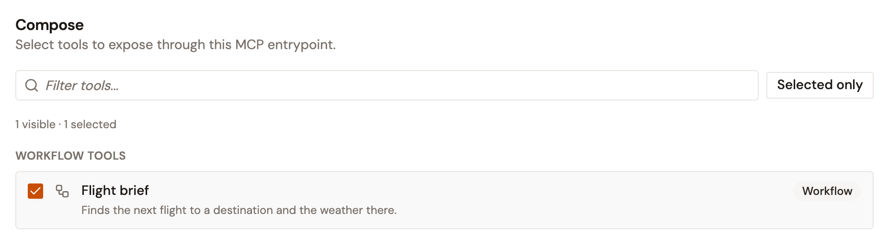
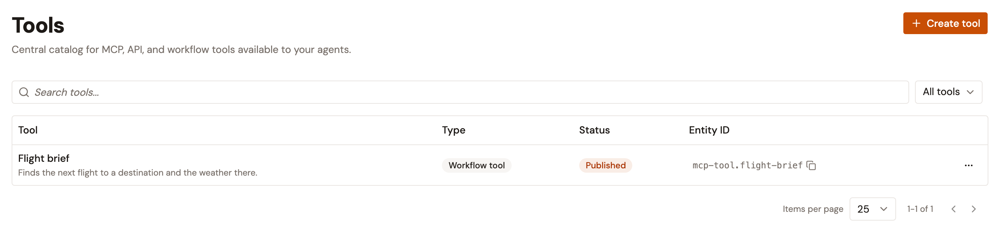

# Create workflow tools

A workflow tool is one MCP tool that the gateway runs as a sequence of API calls, defined as an [Arazzo workflow](https://spec.openapis.org/arazzo/latest.html). You pick operations from your APIs in API Management, connect them on a canvas, and publish the tool to the Catalog. Once an MCP Studio includes the tool, an agent calls it with its input values, and the gateway runs each step and returns the workflow outputs.

The examples on this page build **Flight brief**, a workflow tool that finds a flight to a destination and the weather there.

## Before you begin

* At least one HTTP API in API Management with OpenAPI documentation, in the same environment. The builder lists only these APIs, and the documentation doesn't need to be published.
* A backend for each API, reachable from the gateway. Each step calls the API's backend directly.
* The credentials each backend expects, if any.

## How a workflow tool calls your APIs

Each step calls the backend of its API directly, not the API's entrypoint on the gateway. The plans and policies of the API don't apply to these calls, and the API doesn't need to be started. The credentials a call carries are the ones the workflow tool sets for that API.

## Create a workflow tool

1. Open **Agent Management**.
2. In the **Catalog** group of the sidebar, click **Tools**.
3. Click **Create tool**.
4. Click **Workflow tool**.
5. Click **Create using Workflow Builder**.
6. Enter a **Name** and, optionally, a description. Agents see this name and description, unless an MCP Studio gives the tool an alias.
7. Click **Next**.
8. Select the APIs the workflow calls.
9. Click **Next**.
10. Select the operations the workflow uses. **Select all** selects every operation of an API.
11. Click **Next**.
12. For each API, select an **Auth method** and fill in the fields it shows:
    * **No upstream auth**: the calls carry no credentials. Each API starts with this method.
    * **Static credentials**: select a **Credential type**. **API key** sends the key in the header you name, `x-api-key` by default. **Bearer token** sends a bearer token, and **Basic auth** sends a username and a password.
    * **OAuth2 · Client credentials**: enter the **Token URL**, **Client ID**, and **Client secret**. The gateway gets a token from the token URL, caches it, and sends it as a bearer token.
13. Click **Continue to builder**.

The workflow tool and its credentials are saved the first time you click **Save as draft** or **Review & publish** on the canvas. Leaving the canvas before then discards both. Each credential appears in **Credentials**, named after the tool and the API, for example **Flight brief · Weather API**.

## Build the workflow

1. Click **Start**.
2. Click **Add input parameter** for each value the agent passes to the tool. Give each input a **Name** and a **Type**, and turn on **Required** for a value the agent has to send. The workflow inputs become the input schema agents see.
3. In **Operations**, click an operation to add it as a step. To place it yourself, drag it onto the canvas instead.
4. Connect the nodes in order, from **Start** through each step to **Workflow outputs**. Drag from the handle at the bottom of a node to the handle at the top of the next one.
5. In the **Map parameters** dialog that opens when you connect a step, enter a value for each parameter, and then click **Apply mappings**:
    * `$inputs.<name>` passes a workflow input, such as `$inputs.destination`.
    * `$steps.<stepId>.outputs.<name>` passes an output of an earlier step, such as `$steps.searchFlights.outputs.firstFlightId`.
6. Click **Workflow outputs**.
7. Click **Add output** for each value the tool returns to the agent, and enter an **Output name** and an **Expression**, such as `$steps.getFlight.outputs.body`.
8. Click **Save as draft**.

<figure><figcaption>
A workflow with three steps. The selected step maps its flightId parameter to an output of the step before it.
</figcaption></figure>

### Pass a value from one step to the next

Each step has an output named `body` that holds the whole response body. To pass one field of the response instead, select the step and click **Add output** under **Step outputs**. Enter an **Output name** and an **Expression** that points into the response, such as `$response.body#/flights/0/id` for the ID of the first flight in the list.

To change a mapping later, select the step. Its parameters are listed in the **Configuration** panel.

### Control what a step does next

Select a step to set how it succeeds and what follows it:

* **Success criteria**: the conditions that mark the step successful. Without any, the step succeeds on any 2xx response.
* **Branches (on success)**: **Goto step** jumps to another step, and **End workflow** stops the workflow. A branch with conditions applies only when they match, and the first branch that applies wins.
* **Failure actions**: **Retry** runs the step again after a wait in seconds, up to the **Retry limit**, and optionally runs a **Recovery step (optional)** first. If you leave the wait and the **Retry limit** empty, the gateway waits 1 second and retries up to 3 times. **End workflow** stops the workflow with an error.
* **Parallel dependencies**: the step runs only after the selected steps complete.

In conditions, use values such as `$statusCode`, `$response.body#/path`, `$inputs.<name>`, and `$steps.<stepId>.outputs.<name>`. The **Configuration** panel lists the inputs and step outputs available to the selected step.

The toolbar shows how many blocking issues the canvas has, and the message under the canvas describes them. **Reset canvas** removes every step, connection, and workflow output at once, without asking you to confirm.

## Publish the workflow tool

1. Click **Review & publish**.
2. Click **Validate YAML**.
3. Click **Publish to catalog**.

**Publish to catalog** stays unavailable until validation passes, the workflow has at least one step, and the canvas has no blocking issues. The review page also shows the **MCP tool contract**, the input schema agents see, built from the workflow inputs.

Publishing adds the tool to the Catalog. The gateway runs it only through an MCP Studio that includes it.

## Add the workflow tool to an MCP Studio

In the **Compose** step of the MCP Studio wizard, select the tool under **Workflow tools**. The **Connect** step doesn't ask for its credentials, because the workflow tool carries its own. For the full procedure, see [Create an MCP Studio](../build/create-an-mcp-studio.md).

<figure><figcaption>
A published workflow tool in the Compose step of the MCP Studio wizard.
</figcaption></figure>

## Change a workflow tool

To open a workflow tool, click its name in **Tools**. Click **Edit** to open the **Workflow builder**.

* **APIs** lists the APIs the workflow calls. Click **Add API** to add one, **Edit** to change its operations, display name, or authentication, or **Remove** to remove it. Each change is saved when you confirm it, and removing an API also removes the steps that use it.
* Secrets are never shown again. To keep a stored credential, leave the authentication untouched. Changing any of its fields replaces the whole credential, so enter the secret again.
* Once the tool is published, the builder has no **Save as draft**. Changes on the canvas are saved when you click **Republish** on the review page.
* After you republish, save each MCP Studio that includes the tool. Until then, those Studios keep running the previous version. The message after **Republish** names the Studios to save.

## Import an Arazzo specification

1. In **Tools**, click **Create tool**.
2. Click **Workflow tool**.
3. Click **Import Arazzo specification**.
4. Enter a **Name** and, optionally, a description.
5. Click **Upload a file** and choose a YAML, YML, or JSON file, or click **Paste specification** and paste the document.
6. Click **Import and open builder**.

The tool is saved as a draft and opens on its **Overview** page. Keep these points in mind:

* Arazzo 1.0 and 1.1 documents are supported.
* The tool runs the first workflow in the document.
* Each entry in `sourceDescriptions` points at an API in API Management, with a URL of the form `apim://api/<API ID>`. Publishing fails for any other URL.
* The imported APIs have no credentials. To add one, click **Edit** on the API in **APIs**. Its operations aren't selected on the **Capabilities** step, so select them again before **Next**.

## Remove a workflow tool

1. In **Tools**, open the menu at the end of the tool's row.
2. Click **Remove**.
3. Click **Remove tool**.

Removing a tool that an MCP Studio includes fails with **This tool is referenced by one or more MCP proxies and cannot be deleted.** Remove the tool from the Studio first. The credentials created for the tool stay in **Credentials**.

## Limits

* A workflow holds up to 100 steps.
* **Retry limit** accepts 1 to 10, and the wait before a retry accepts 0 to 3,600 seconds.
* Validation fails when branches, recovery steps, and parallel dependencies form a loop, or when a branch goes to its own step.
* The gateway doesn't follow a redirect from a backend. A step that gets one fails unless its success criteria accept the redirect status.

## Verification

To verify the workflow tool is working as expected, follow these steps:

1. In **Tools**, check that the tool shows **Workflow tool** in the **Type** column and **Published** in the **Status** column.

    <figure><figcaption>
A published workflow tool in the Tools list.
</figcaption></figure>
2. Call the tool through an MCP Studio that includes it, with a value for each required input. The response holds the workflow outputs and the result of each step.

## Next steps

* [Create an MCP Studio](../build/create-an-mcp-studio.md). Assemble the workflow tool with other Catalog tools into one MCP entrypoint for your agents.
* [Create API tools](create-api-tools.md). Choose API capabilities and publish them as one tool, without building a sequence.
