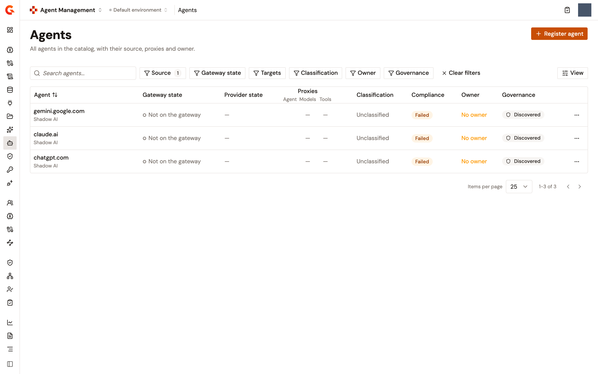
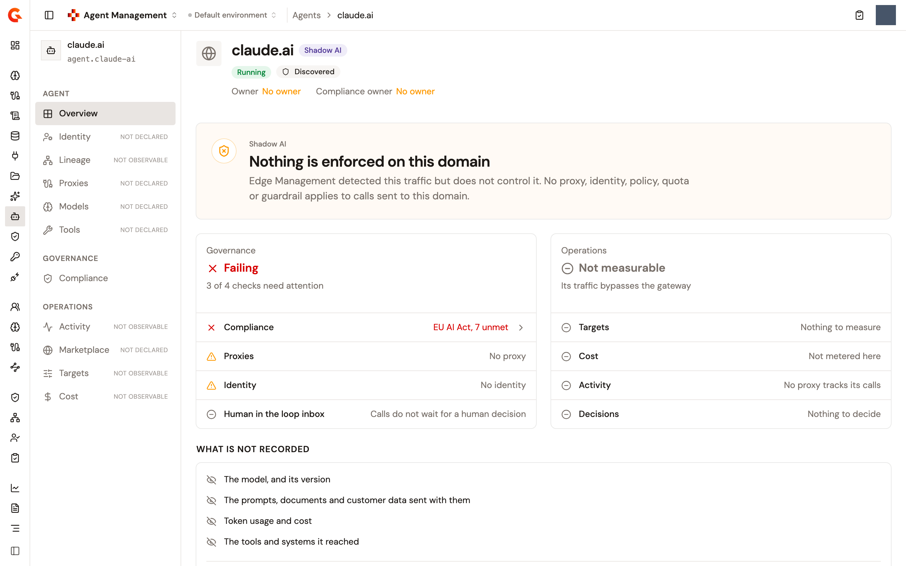

# Discover shadow AI agents from Edge Management

Edge Management's shadow AI detection reports the direct connections that employee devices make to monitored AI provider domains, bypassing the AI Gateway. Agent Management turns those detections into Catalog entries, so unsanctioned AI usage sits in the same list as the agents you govern. Each entry is one intercepted domain, and its page shows which processes and devices reached it.

A shadow AI agent is a domain and nothing more. Nobody registered it, no platform describes it, it publishes no agent card, and no traffic reaches it through the gateway. The Catalog holds its address, the risk classification and compliance details you record, and the dates it was created and last updated. It reads the detected traffic live when you open its page.

## Before you start

* Configure shadow AI monitoring in Edge Management, and deploy it to the devices to watch. Edge Management reports only the provider domains you list there. See [Set up Edge Management](../../edge-management/connect/set-up-edge-management.md#choose-the-domains-to-watch-for-shadow-ai).
* Shadow AI detection doesn't run on Windows devices. A Windows fleet reports nothing, which can be mistaken for a fleet with no shadow AI use.
* Make sure your enterprise license includes the `agent-management` pack and hasn't expired. The synchronization checks the license before every pass and imports nothing without it.
* Keep the synchronization on. It runs in the Management API out of the box, on the two schedules described in the next section. With both passes turned off, detected domains never reach the Catalog.

## Tune the synchronization

The synchronization runs inside the Management API on two schedules, and both are on out of the box: the incremental pass every 30 seconds and the full pass every hour. To change a delay or turn a pass off, set it in the `modules.aim.shadow-ai.sync` block of the Management API configuration. The values shown are the defaults:

```yaml
modules:
  aim:
    shadow-ai:
      sync:
        incremental:
          delay: 30
          unit: SECONDS
        full:
          delay: 60
          unit: MINUTES
```

<table>
    <thead>
        <tr>
            <th width="330">Property</th>
            <th>What it sets</th>
        </tr>
    </thead>
    <tbody>
        <tr>
            <td><code>modules.aim.shadow-ai.sync.incremental.delay</code></td>
            <td>How often the incremental pass runs. Defaults to 30 seconds. The incremental pass reads the detections reported since two minutes before the previous run and creates an entry for each new domain. It never removes anything.</td>
        </tr>
        <tr>
            <td><code>modules.aim.shadow-ai.sync.incremental.unit</code></td>
            <td>The unit of the incremental delay. Defaults to <code>SECONDS</code>.</td>
        </tr>
        <tr>
            <td><code>modules.aim.shadow-ai.sync.full.delay</code></td>
            <td>How often the full pass runs. Defaults to 1 hour. The full pass reads the last 30 days of detections, creates or updates an entry for each domain, and removes every entry whose domain had no detection in those 30 days. It removes nothing when the read returns no domain at all, so an unreachable telemetry store never empties the Catalog.</td>
        </tr>
        <tr>
            <td><code>modules.aim.shadow-ai.sync.full.unit</code></td>
            <td>The unit of the full delay. Defaults to <code>MINUTES</code>.</td>
        </tr>
    </tbody>
</table>

A delay set to `0` or to a negative number turns that pass off, and nothing else does. A delay that's absent or blank keeps the default, and one that isn't a number keeps the default and leaves a warning in the Management API log. A unit that isn't recognized falls back to the default unit. When both passes are off, the Management API logs that the shadow AI synchronization is disabled and imports nothing.

Three more rules govern when a pass runs:

* One node runs the synchronization. In a cluster, that's the primary node.
* An environment is synchronized only after the Management API has served an Agent Management request for it since the node started.
* The first pass for each environment on a node is a full pass, whichever schedule triggered it. This holds for an environment that becomes active long after the node started too. A restart therefore applies the 30-day retention rule even when only the incremental schedule is on, provided that first pass reads at least one domain.

## What a synchronization writes

Each detected domain becomes one agent under a source named **Shadow AI**. The first pass in each environment creates that source before it reads any detection, so the source exists even where Edge Management isn't deployed and nothing was detected. On the **Integrations** page, the source appears only under **All sources**, with **Agents** in its **Imports** column and **Remove** as its only action. Removing the source removes the agents imported through it. The next pass creates the source again and recreates an entry for each domain it reads, without the classification or compliance details recorded on the old entry. An incremental pass brings back only the domains reported since two minutes before the previous pass, and the rest return with the next full pass, up to an hour later on the default schedule.

The agent is named after the domain. A run reads at most 500 domains, and treats what it read as the complete set, so an environment with more distinct domains than that has the rest left out and can lose entries on a full pass. A pass that finds the domain again leaves the entry untouched, so the classification and compliance details you record survive every run. A full pass removes the entry once the domain has had no detection for 30 days, and removes the performance targets declared on it at the same time.

## Find shadow AI agents in the list

1. From the Gamma console sidebar, select **Agent Management**.
2. In the **Catalog** section of the sidebar, select **Agents**.

In the **Agents** list, the source reads under each agent's name: **Shadow AI** for a detected domain, **Manual** for an agent registered from the console, and the platform's name for an imported one. To list the detected domains alone, open the **Source** filter and select **Shadow AI**. A detected domain reads **Not on the gateway** in the **Gateway state** column, **No owner** in the **Owner** column, and **Discovered** in the **Governance** column. The **Compliance** column reads **Not assessed** until an activated framework applies to the domain, **Passed** when it meets every applicable framework, and **Failed** otherwise.

The actions menu at the end of the row offers **View details** and nothing else. A detected domain is neither edited nor removed from the list. Its entry leaves the Catalog when the retention rule removes it, or when its source is removed.

<figure><figcaption><p>The Agents list filtered to the Shadow AI source</p></figcaption></figure>

## Read a shadow AI agent's page

Click the domain in the **Agents** list to open it. The page is built around having only an address, so it carries less than a registered agent's page:

* The header shows the domain as the title with a **Shadow AI** badge, the **Running** and **Discovered** badges, and the **Owner** row, which reads **No owner**. A **Compliance owner** row appears beside it when the agent's compliance assessment includes the EU AI Act framework's **Accountable human** control, and it also reads **No owner** while nobody is named.
* The sidebar lists the same sections as a registered agent's page. A section nobody declared is marked **Not declared**, and a section the gateway would have to observe is marked **Not observable**. Opening one shows a sentence on why it's empty, for example that no identity is declared, so nothing can authenticate as the agent. **Compliance** opens as it does for a registered agent, under a notice titled **Unregistered agent**, which says that Edge Management detected the agent and it was never registered, so no compliance details have been recorded. You can still record them there as on a registered agent, including the **Accountable human** control that fills the **Compliance owner** row, and the synchronization keeps them. The notice stays after you do. **Overview** is adapted for a detected domain, as the next bullets describe. The bar of actions at the top of a registered agent's page isn't shown.
* A **Shadow AI** banner reads **Nothing is enforced on this domain** and explains that Edge Management detected the traffic but doesn't control it, so no proxy, identity, policy, quota, or guardrail applies to calls sent to the domain. Under it, the **Governance** card reads **Failing**. The **Operations** card appears only when performance targets are available in your installation, and then reads **Not measurable**, because the domain's traffic bypasses the gateway.
* The **What is not recorded** section lists what the gateway never recorded: the model and its version, the prompts, documents, and customer data sent with them, the token usage and cost, and the tools and systems it reached.
* The **Detected traffic** section holds the traffic that produced the entry.
* The **About** section opens with a note that devices in your fleet reached the domain directly, bypassing the gateway, and that no one has approved the service. Its card holds five rows: **Entity ID**, **Source**, which reads **Shadow AI**, **Classification**, **Created**, and **Updated**. The **Agent card** section reads **Not declared**, because the domain publishes no card.

<figure><figcaption><p>The top of a shadow AI agent's page</p></figcaption></figure>

### Rate the risk

**Classification** is the one field you set from a shadow AI agent's overview, and the synchronization keeps it. To rate the domain, click the **Classification** badge, select **Negligible risk**, **Limited risk**, **Moderate risk**, or **High risk** in the **Classification** panel, and then click **Save**. A rating can be changed but not cleared. When your role can update Catalog entries, the badge carries a pencil icon and opens the panel. Otherwise it's a plain badge.

### Read the detected traffic

The **Detected traffic** section reads the last 30 days of detections for the domain when the page opens, and it answers who inside the company is talking to the domain. Each monitored device lists its established connections at a fixed interval, and one observation is one connection seen in one pass, so a connection held open is counted in every pass it spans. The totals say how sustained the use is, not how many calls were made.

<table>
    <thead>
        <tr>
            <th width="180">Table</th>
            <th>Columns</th>
        </tr>
    </thead>
    <tbody>
        <tr>
            <td><strong>Processes</strong></td>
            <td><strong>Process</strong>, the process as it was seen on the device, which on most systems is a path, and <strong>Observations</strong>.</td>
        </tr>
        <tr>
            <td><strong>Devices</strong></td>
            <td><strong>Device</strong>, the device's identifier, <strong>OS</strong>, read from the device's own heartbeats, and <strong>Observations</strong>. A device that reached the domain but sent no heartbeat in the window keeps its row and shows a dash for the OS. The OS is read for a limited number of devices across the whole fleet, not only the devices that reached this domain, so in anything but a small fleet a device that did send heartbeats can show a dash too.</td>
        </tr>
    </tbody>
</table>

Each table lists up to 100 rows, heaviest first. When nothing reached the domain in the window, the tables read **No process reached this domain over the window.** and **No device reached this domain over the window.** When the telemetry can't be read, the section shows **Could not read what reached this domain** with the reason.

## Next steps

* [Monitor detected shadow AI](../../edge-management/observe/monitor-shadow-ai-traffic.md). Read the fleet-wide shadow AI view in Edge Management.
* [Set up Edge Management](../../edge-management/connect/set-up-edge-management.md). Change the domains to watch and how often a daemon reports what it saw.
* [Register an agent](import-an-agent.md). Bring a sanctioned agent into the Catalog from the agent card it publishes.
