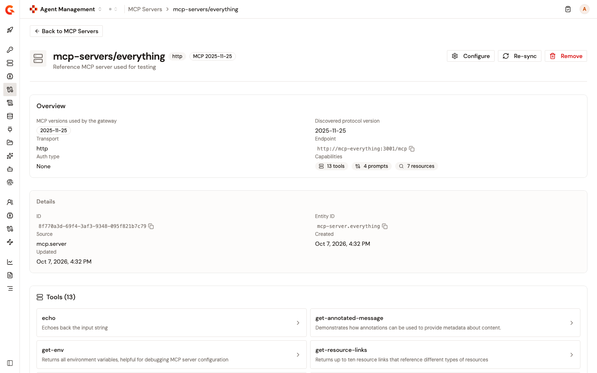

# Register MCP servers with the Automation API

Declare the MCP servers of the Catalog as JSON documents and apply them with the Automation API, from a CI/CD pipeline or a script. When you apply a declaration, Gravitee connects to the server and discovers its tools, prompts, and resources. Each one comes back with the entity ID that authorization policies reference.

To manage the same servers as Kubernetes resources, use the [`CatalogMcpServer`](https://documentation.gravitee.io/gravitee-kubernetes-operator-gko/overview/custom-resource-definitions/catalogmcpserver) resource of the Gravitee Kubernetes Operator.

## Before you begin

* Agent Management is enabled on your installation.
* You have a bearer token for an account whose role lets it manage the Catalog of the environment.
* The MCP server serves the Streamable HTTP transport at an `http` or `https` URL that resolves to a public address. A server on a private or loopback address is rejected with `MCP server discovery failed: Endpoint must not point to a private or loopback address`.

## Automation API access

The Automation API is served at the `/automation` base path on your Management API host. Send each request with a bearer token in the `Authorization` header and a JSON body. MCP servers are addressed under `/automation/organizations/{orgId}/environments/{envId}/aim/catalog/mcp-servers`.

## Declare an MCP server

A declaration gives the server an ID and an identity in the Catalog, and says how Gravitee reaches it:

```json
{
  "hrid": "docs-search",
  "entityId": "mcp-server.docs-search",
  "description": "Search tools for the product documentation",
  "connection": {
    "endpoint": "https://mcp.example.com/mcp",
    "transport": "HTTP",
    "auth": {
      "type": "HEADER",
      "name": "Authorization",
      "value": "Bearer <token>"
    }
  }
}
```

| Field | Required | Description |
|:------|:---------|:------------|
| `hrid` | Yes | Your ID for the server, used in the request path. 3 to 256 characters: letters, digits, `-`, and `_`, starting and ending with a letter or digit. |
| `entityId` | Yes | The server's identity in the Catalog, which authorization policies reference. Lowercase, dot-separated segments starting with `mcp-server.`, at most 255 characters, and unique in the environment. You can't change it once the server exists. |
| `description` | No | Description shown in the Catalog. |
| `connection.endpoint` | Yes | URL of the MCP server. |
| `connection.transport` | Yes | `HTTP`, the Streamable HTTP transport. |
| `connection.auth` | No | How Gravitee authenticates to the server. Leave it out for a server that needs no authentication. |

### Authentication to the MCP server

Set `connection.auth.type` to one of these values:

| `type` | Fields | Description |
|:-------|:-------|:------------|
| `NONE` | None | No authentication. |
| `HEADER` | `name`, `value` | A header sent on every request. Write the full value: `Bearer <token>` for a bearer token, `Basic <base64>` for basic credentials, or the key itself for an API key header. |
| `OAUTH2` | `clientId`, `clientSecret`, `tokenUrl`, `scope` | OAuth 2.0 client credentials. Gravitee gets a token from `tokenUrl` before it connects to the server. `scope` is optional and holds space-separated scopes. The `tokenUrl` uses `https` and resolves to a public address. |

A credential value, `value` or `clientSecret`, is a literal or a `secret://` reference to a configured secret provider. Credentials are never returned. Applying the declaration again without `connection.auth` removes the stored authentication.

## Register the server

Preview the declaration, apply it, and then read it back:

1. Send the declaration with `PUT` to `/automation/organizations/{orgId}/environments/{envId}/aim/catalog/mcp-servers?dryRun=true`. Nothing is saved. The response answers `200`, and lists any problems under `errors.severe` and `errors.warning`.
2.  Send the same request without `dryRun` to register the server:

    ```bash
    curl -X PUT "https://<management-api-host>/automation/organizations/DEFAULT/environments/DEFAULT/aim/catalog/mcp-servers" \
      -H "Authorization: Bearer <token>" \
      -H "Content-Type: application/json" \
      -d @mcp-server.json
    ```

    A `200` response returns the registered server. A `400` response lists the problems that stopped it under `errors.severe`, and nothing is saved.
3. Send `GET` to `/automation/organizations/{orgId}/environments/{envId}/aim/catalog/mcp-servers/{hrid}` to read the server back.

The response repeats your declaration without credentials, and adds what Gravitee discovered:

| Field | Description |
|:------|:------------|
| `id` | The server's ID. The server's page in the Catalog shows the same ID. |
| `lastSyncedAt` | When Gravitee last synced the server's tools, prompts, and resources. |
| `serverInfo` | The name and version the server reports. The Catalog lists the server under this name. |
| `protocolVersion` | The MCP protocol version negotiated with the server. |
| `tools`, `prompts`, `resources` | What the server exposes. Each item carries the `entityId` that policies reference, such as `mcp-tool.docs-search.search` for a tool of the server `mcp-server.docs-search`. |

## Change or remove a server

* To change a server, edit its declaration and apply it again with the same `hrid`.
* A different `entityId` is rejected with `entityId [...] cannot be changed`. To give the server another identity, delete it and declare it again.
* To remove a server, send `DELETE` to `/automation/organizations/{orgId}/environments/{envId}/aim/catalog/mcp-servers/{hrid}`. Gravitee answers `204`, and a later `GET` answers `404`.
* Removing a server doesn't change the MCP Studios that expose its tools. The next apply of such a Studio is rejected until you register the server again or remove its tools from the Studio.

## Verification

To verify the MCP server is registered as expected, follow these steps:

1. In the **Catalog** group of the Agent Management sidebar, click **MCP Servers**.
2. Click the server. It's listed under the name the server reports about itself.
3.  Check **Capabilities** for the number of tools, prompts, and resources Gravitee discovered.

    <figure><figcaption><p>An MCP server registered through the Automation API, with its discovered tools.</p></figcaption></figure>

## Next steps

* [Manage MCP proxies with the Automation API](../build/manage-mcp-proxies-with-the-automation-api.md). Compose an MCP Studio from the tools of the servers you registered.
