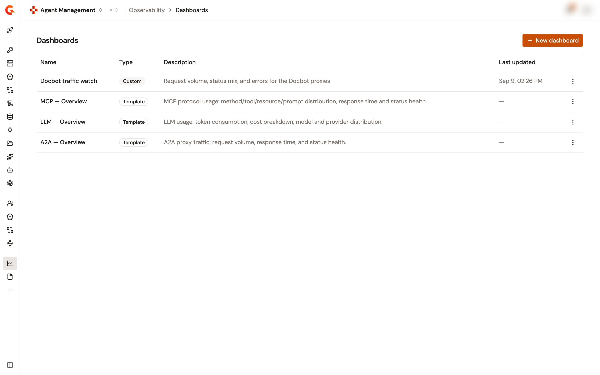
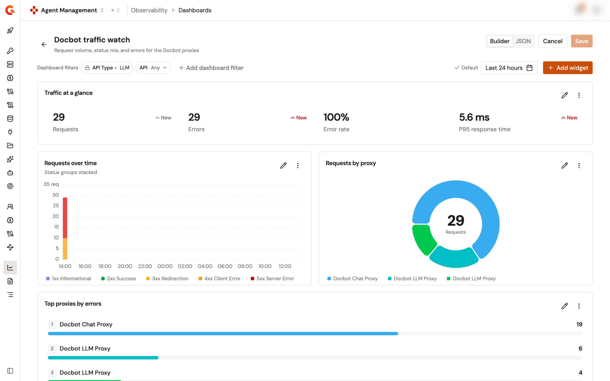
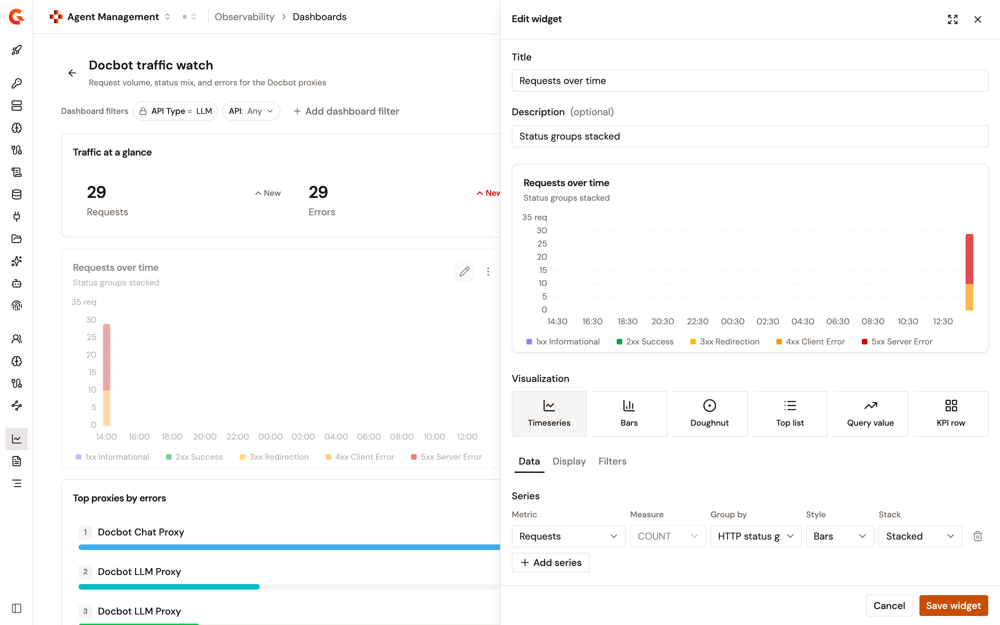
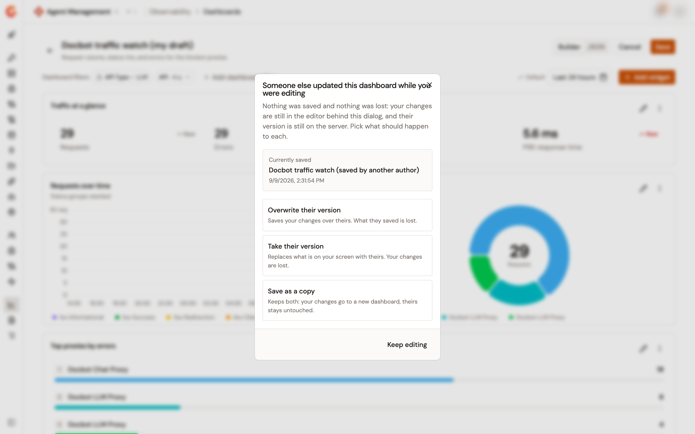

# Build a custom dashboard

The **Dashboards** page lists the dashboard templates Gravitee ships alongside the dashboards your own team builds. A custom dashboard is composed rather than read. Choose the visualization for each tile and the metric behind it, arrange the tiles on a grid, then pin the filters and time range every reader opens the dashboard with.

Templates stay read-only. To start from one, duplicate it into a custom dashboard and edit the copy.

## Before you begin

Custom dashboards are stored in the environment they're created in, so they survive a restart and reach everyone with access to that environment's dashboards. Automation reaches the same dashboards over the API. See [Save observability dashboards with the Gamma API](../../../platform-management/save-observability-dashboards.md).

The authoring actions (**New dashboard**, **Edit**, **Duplicate**, and **Delete**) appear when the environment's dashboards accept your account. If a request is refused, the console keeps what's on screen, names the refusal, and withdraws those actions until a later request succeeds. **Copy JSON** stays available either way, and reading templates is unaffected.

## Open the Dashboards list

1. From the Gamma console sidebar, select **Agent Management**.
2. In the **Observability** section of the sidebar, select **Dashboards**.

<figure><figcaption>
The Dashboards list
</figcaption></figure>

The list shows the dashboards your team saved first, then the templates. Each row carries:

| Column           | What it shows                                                                       |
| ---------------- | ----------------------------------------------------------------------------------- |
| **Name**         | The dashboard title, linking to the dashboard.                                       |
| **Type**         | A **Custom** badge for a dashboard your team saved, a **Template** badge for one Gravitee ships. |
| **Description**  | The description of the dashboard, or a dash when it has none.                        |
| **Last updated** | When the dashboard was last saved. A template has no save date, so the column shows a dash. |

## Create a dashboard

Create a dashboard from scratch, or duplicate an existing one.

### Start from an empty dashboard

1. Select **New dashboard**.

The editor opens on an empty draft titled `New dashboard` followed by the current date and time, with **Last 24 hours** as its time range and no widgets or filters. Nothing is stored until you select **Save**.

### Start from a template or another dashboard

1. Open the actions menu of the row you want to copy.
2. Select **Duplicate as custom dashboard** for a template, or **Duplicate** for a custom dashboard.

The copy is saved immediately under the original title followed by `(copy)`, and the editor opens on it. The original is untouched, so duplicating a template is the way to get an editable version of it.

The same actions sit in the actions menu of an open dashboard.

## Add and arrange widgets

Select **Add widget** to open the widget editor. On an empty dashboard, the **Create your first widget** placeholder does the same.

The grid is 12 columns wide. Drag a widget to move it, and drag its resize handle to change its size. Widgets are pushed up to close the empty space a move leaves behind. The action controls in a widget header don't start a drag.

<figure><figcaption>
The dashboard editor
</figcaption></figure>

Each widget carries two controls in its header:

* The pencil opens the widget editor.
* The **More actions** menu offers **Edit**, **Duplicate**, and **Delete**. A duplicated widget takes the original title followed by `(copy)` and lands directly below the original.

Edit the dashboard title and description in place from the editor header. An empty title reads `Untitled dashboard` until you type one.

## Configure a widget

The widget editor opens as a panel on the right, titled **New widget** or **Edit widget**. **Expand panel** widens it to the full window, and **Close** discards the working copy.

<figure><figcaption>
The widget editor
</figcaption></figure>

The panel is ordered top to bottom:

1. **Title** and **Description (optional)**. The description becomes the widget subtitle. Leaving the title empty derives one from the query when you add the widget.
2. A live preview that redraws shortly after each change.
3. **Visualization**, then the **Data**, **Display**, and **Filters** tabs.

Select **Add widget** to put a new widget on the grid, or **Save widget** to apply your changes to an existing one. **Cancel** drops the working copy.

### Choose a visualization

Six visualization types are available:

| Type              | What it draws                     | Default size on the grid |
| ----------------- | --------------------------------- | ------------------------ |
| **Timeseries**    | Lines, bars or areas over time    | 6 columns by 2 rows      |
| **Bars**          | Compare values across a dimension | 6 columns by 2 rows      |
| **Doughnut**      | Share of a total per bucket       | 4 columns by 2 rows      |
| **Top list**      | A ranked list, each row metered   | 6 columns by 2 rows      |
| **Query value**   | Single KPI with trend             | 3 columns by 1 row       |
| **KPI row**       | A row of several key metrics      | 12 columns by 1 row      |

Switching type keeps the widget's identity, position, size, title, description, and filters, and carries the query across wherever the new type expresses it.

### Select the data

The **Data** tab changes with the visualization type.

| Type                                    | What you configure                                                                                                     |
| --------------------------------------- | ---------------------------------------------------------------------------------------------------------------------- |
| **Timeseries**                          | A **Series** list, each series with **Metric**, **Measure**, **Group by**, **Style** (**Line**, **Area**, or **Bars**), and **Stack**. **Add series** adds another, and a second series brings a **Y axis** column for dual-axis charts. |
| **Bars**, **Doughnut**, and **Top list** | **Metric**, **Measure**, **Group by**, **Max buckets** (1 to 10), and **Keep** (**Highest** or **Lowest**). **Top list** adds **On hover**, **Break down by**, and **Colouring**. |
| **Query value**                         | **Metric**, **Measure**, **Label**, **Show trend**, and **Show sparkline**.                                             |
| **KPI row**                             | A **Metrics** list with one row per tile, each with **Metric**, **Measure**, **Label**, **Group**, and **Trend**.        |

**Metric** offers two groups:

| Group       | Metrics                                                                       |
| ----------- | ----------------------------------------------------------------------------- |
| **Gateway** | Requests, Errors, Error rate, Response time, Gateway latency                   |
| **LLM**     | Total tokens, Tokens sent, Tokens received, Total cost, Cost (sent), Cost (received) |

**Measure** offers only the aggregations the selected metric supports, and changing the metric moves the measure to a supported one. **Group by** offers API, HTTP method, HTTP status, and HTTP status group. LLM traffic adds LLM provider and LLM model, and MCP traffic adds MCP method, MCP tool, MCP prompt, and MCP resource.

Selecting a metric or dimension that belongs to one API type adds an **API Type** filter for that type to the widget. The filter is an ordinary widget filter, visible on the **Filters** tab, so widen it there when you mean to.

### Set display options

The **Display** tab holds the options that change how the widget is drawn rather than what it queries. **Query value** and **KPI row** have no **Display** tab.

| Type              | Options                                                                                                     |
| ----------------- | ------------------------------------------------------------------------------------------------------------ |
| **Timeseries**    | **Total in the tooltip** and its **Total label**. A total needs at least two series.                         |
| **Bars**          | **Orientation** (**Vertical bars** or **Horizontal bars**) and **Value label**.                              |
| **Doughnut**      | **Centre** (**Empty**, **Total of the slices**, or **Custom value**), the **Centre value**, and its **Caption**. |
| **Top list**      | **Representation** (**Ranked list** or **Stacked bar**), **Row order**, **Show rank**, **Show trend**, **Compact rows**, and **Collapse after**. |

### Filter one widget

The **Filters** tab holds filters applied to that widget alone, on top of the dashboard filters. The tab label carries the number of filters in place.

## Pin filters to the dashboard

Dashboard filters are saved in the definition and applied to every widget. Add one from **Add dashboard filter** in the editor, then open its chip to set the operator and the value.

Each chip carries an **Allow viewers to change value** checkbox that decides what a reader gets:

| Chip state                            | What a reader sees                                                                     |
| ------------------------------------- | ---------------------------------------------------------------------------------------- |
| Checkbox cleared, with a value        | A locked chip. The value is fixed and the chip can't be removed.                          |
| Checkbox selected, with a value       | A chip the reader re-values. The field stays fixed, and a marker shows when the value differs from the one you saved. |
| Empty value                           | A slot the reader fills, shown as `Any`. An empty filter is always re-valuable.           |

The chips in the editor are the chips the reader gets, so what you arrange here is what the dashboard opens with.

## Set the default time range

The time range control in the editor header drives the preview and every widget on the grid.

1. Select the range you want.
2. Select **Set as default**.

**Set as default** appears while the selected range differs from the saved default. Once they match, the header shows **Default** instead. A custom dashboard opens on its saved default range.

The editor pauses live refresh while you compose, so the preview holds still.

## Edit the definition as JSON

The **JSON** tab shows the dashboard definition as a document, for changes the visual builder doesn't reach and for moving widgets between dashboards.

The document carries the title, the description, the filters, the time range, and the widgets. The identifier and the creation and update dates aren't part of it, so editing here can't corrupt the dashboard's identity or its history.

* **Copy JSON** copies the document to the clipboard.
* **Apply changes** applies it to the builder. It stays disabled while the document is invalid or unchanged.

Every problem found is listed at once under **Invalid dashboard document**, rather than one error at a time. The document is rejected when:

* The title is missing or blank.
* A time range is neither a relative range with a known period nor an absolute range whose `from` is earlier than its `to`.
* A filter names an operator other than `eq`, `in`, `lte`, `gte`, or `contains`.
* Two filters in the same list name the same field. One condition per field.
* A widget's type isn't one of the six visualization types.
* A widget's `x`, `y`, `cols`, and `rows` aren't whole numbers that fit the 12-column grid.
* Two widgets share an identifier. A widget with no identifier is given one.

Switching back to **Builder** with changes you haven't applied applies them when the document is valid. When it isn't, the console keeps you on the **JSON** tab so nothing is lost.

## Save the dashboard

Select **Save**. On an existing dashboard, **Save** stays disabled until something changes. After the save, the editor closes and the dashboard opens.

**Cancel**, the back arrow, and closing the browser tab all check for unsaved work first, and offer **Keep editing** or **Discard changes**. JSON text you haven't applied and an open widget panel count as unsaved work, not only edits already on the grid.

## Resolve a clashing save

When someone else saved the same dashboard between the moment you opened it and the moment you saved, your save is refused. Nothing changes on either side: your edits stay in the editor and their version stays stored. The dialog names the stored dashboard and when it was saved, and offers three resolutions:

| Resolution                  | What happens                                                                      |
| --------------------------- | ----------------------------------------------------------------------------------- |
| **Overwrite their version** | Saves your changes over theirs. What they saved is lost.                            |
| **Take their version**      | Replaces what's on your screen with theirs. Your changes are lost. This one asks for a second confirmation, because the work it drops was never stored. |
| **Save as a copy**          | Keeps both. Your changes go to a new dashboard and theirs stays untouched.           |

**Keep editing** dismisses the dialog and leaves the editor exactly as it was.

If the dashboard was deleted while you had it open, the editor says so and offers **Save as a new dashboard**, which is the only resolution left.

<figure><figcaption>
A save refused because someone else saved first
</figcaption></figure>

## Delete a dashboard

1. Open the actions menu of the dashboard, either from the list or from the open dashboard.
2. Select **Delete**.
3. Confirm in the **Delete this dashboard?** dialog.

The dashboard is deleted permanently. Templates have no **Delete** action.

## Troubleshooting

**The editor warns that dashboard filters can't be queried.** The analytics API accepts the `eq`, `in`, `lte`, `gte`, and `contains` operators only, and the widgets affected by another operator stay empty. Change the operator from the widget's **Filters** tab or from the **JSON** tab.

**The editor warns that a widget ignores a locked dashboard filter.** A widget filter is applied after the dashboard filters, so on a shared field the widget's value is the one queried, whatever the locked chip shows the reader. The warning names the widget, its value, and the locked value. Either change the widget's filter or clear the lock on the dashboard chip. A widget that repeats the same value isn't flagged.

**The authoring actions aren't there.** A request was refused for your account, so the console withdrew them. Ask for access to the environment's dashboards, then reopen the section.

## Next steps

* [Save observability dashboards with the Gamma API](../../../platform-management/save-observability-dashboards.md). Create and maintain the same dashboards from a script or a pipeline.
* [Monitor your LLM proxy](../monitor-your-llm-proxy.md). Read the LLM template before you rebuild parts of it.
* [Monitor your MCP servers](../monitor-your-mcp-servers.md). The equivalent template for MCP Proxy traffic.
