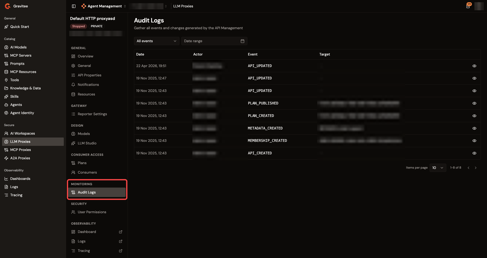
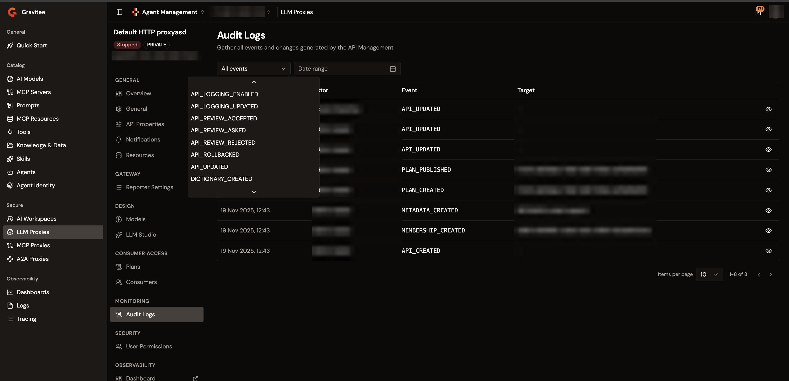

# Review audit logs

Each LLM Proxy, MCP Proxy, and A2A Proxy detail view includes an **Audit Logs** page that lists the audit events recorded for the proxy. Each entry records when a change happened, who made it, which event it was, and the object it applied to. Use the trail to trace configuration changes for governance reviews and troubleshooting.

## Open the Audit Logs page

1. From the Gamma console sidebar, select **Agent Management**.
2. Under **Secure**, select **LLM Proxies**, **MCP Proxies**, or **A2A Proxies**.
3. Select the proxy you want to inspect.
4. Under **Monitoring**, select **Audit Logs**.

<figure><figcaption>
The Audit Logs page
</figcaption></figure>

Until the first audit event is recorded for the proxy, the page shows an introduction to audit logs instead of the table.

## Read the audit trail

The table lists one row per audit event, with the following columns:

| Column     | Description                                                                        |
| ---------- | ---------------------------------------------------------------------------------- |
| **Date**   | When the event was recorded.                                                       |
| **Actor**  | The user who triggered the event.                                                  |
| **Event**  | The event type identifier.                                                         |
| **Target** | The properties of the object the event applied to, one `key: value` pair per line. |

The table shows 10 entries per page by default and supports page sizes of 25, 50, and 100.

## Filter the trail

1. To show a single event type, select it in the event type filter. The filter defaults to **All events**.

    <figure><figcaption>
The event type filter
</figcaption></figure>

2. To bound the trail in time, select a start and end date in the **Date range** picker. The end date is inclusive.
3. To clear the active filters, click **Reset**. The **Reset** button appears only while a filter is active.

Changing a filter returns the table to the first page.

## View the change as a JSON Patch

When an audit entry carries the JSON Patch of the change, a **View patch** button appears at the end of its row. Click it to open the **JSON Patch** panel, which shows the patch that the audited change applied.

## Verification

To verify the audit trail is working as expected, follow these steps:

1. Save a configuration change to the proxy.
2. Under **Monitoring**, select **Audit Logs**.
3. The trail lists a new entry for the change, with your user as the **Actor**.

<!-- TODO: Screenshot of the audit trail showing the new entry after a configuration change -->

<figure><figcaption>
The new audit entry
</figcaption></figure>
