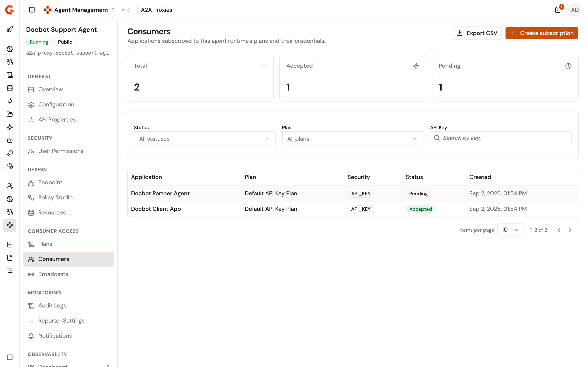
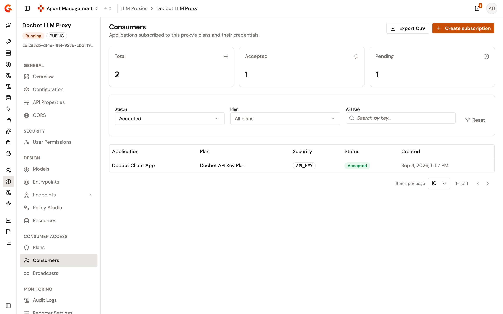
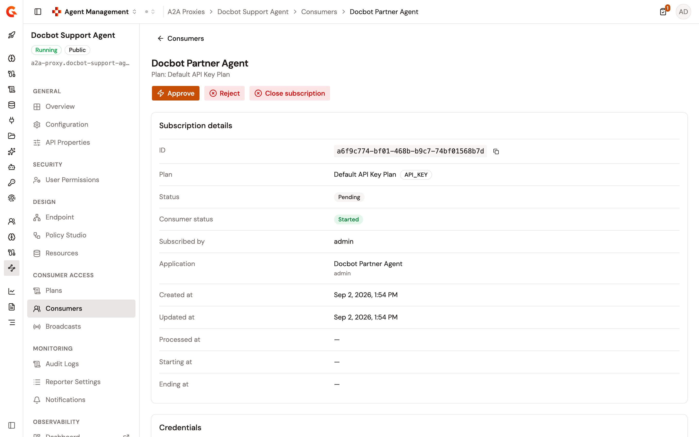

# Manage subscriptions

Consumers access your LLM Proxies, MCP Proxies, and A2A Proxies by subscribing to the published plans of the proxy. Each proxy detail view includes a **Consumers** page under **Consumer Access** that lists the subscriptions of the proxy, creates new ones, and manages each one through its lifecycle.

## Open the Consumers page

1. From the Gamma console sidebar, select **Agent Management**.
2. Under **Secure**, select **LLM Proxies**, **MCP Proxies**, or **A2A Proxies**.
3. Select the proxy.
4. Under **Consumer Access**, select **Consumers**.

<figure><figcaption>
The Consumers page
</figcaption></figure>

Until the proxy has a subscription, the page shows an introduction to consumers instead of the table.

If your role can't view subscriptions, the page shows **You don't have access to consumers**.

## Read the subscription list

Three tiles show the **Total**, **Accepted**, and **Pending** counts. **Total** counts the pending, accepted, and paused subscriptions of the proxy. The counts don't change when you filter the list.

Filter the list by **Status**, by **Plan**, or by **API Key**. **Reset** clears the filters. The **Status** filter opens on **All statuses**, and with no status selected the list shows the pending, accepted, and paused subscriptions. Select **Rejected** or **Closed** to see those subscriptions.

The table lists one row per subscription, with the following columns:

| Column          | Description                                                          |
| --------------- | -------------------------------------------------------------------- |
| **Application** | The subscribing application. Select it to open the subscription.     |
| **Plan**        | The plan the application subscribed to.                              |
| **Security**    | The security type of the plan.                                       |
| **Status**      | **Pending**, **Accepted**, **Paused**, **Rejected**, or **Closed**. |
| **Created**     | The creation date of the subscription.                               |

## Export the subscription list

**Export CSV** downloads the subscriptions that match the current filters as a CSV file. The file holds every matching subscription, not only the rows on the current page of the table, and the button reads **Exporting…** while the file is prepared.

<figure><figcaption>
Exporting the filtered subscription list
</figcaption></figure>

To export the list, follow these steps:

1. Filter the list by **Status**, by **Plan**, or by **API Key** to narrow the export. With no status selected, the export holds the pending, accepted, and paused subscriptions.
2. Click **Export CSV**.

The browser downloads the file as `subscriptions-agent-runtime.csv` for an A2A Proxy, `subscriptions-MCP-proxy.csv` for an MCP Proxy, or `subscriptions-proxy.csv` for an LLM Proxy.

The file is the same export the APIM Console produces for the subscriptions of an API. Values are separated by semicolons. After a header row, each row holds the plan name, the application name, the creation, processing, start, and end dates, and the status of the subscription. Dates use the `yyyy-MM-dd'T'HH:mm:ss.SSSZ` pattern, for example `2026-09-04T22:57:15.513+0000`, and a date the subscription doesn't have yet is left empty. The status is written as its uppercase value, for example `ACCEPTED`.

The button is shown when the list has at least one subscription. It isn't shown on the introduction the page displays before the first subscription, or when no subscription matches the filters. If the export fails, the console shows **Failed to export consumers** with the reason.

## Subscription lifecycle

A subscription moves through the following statuses:

* **Pending**. The subscription waits for your approval. A subscription to a plan with manual validation starts as pending. A subscription to a plan with automatic validation is accepted as soon as it's created.
* **Accepted**. The consumer can call the proxy. For an API Key plan, an API key is generated when the subscription is accepted.
* **Paused**. The consumer's access is suspended until you resume the subscription.
* **Rejected**. The request was refused. Closing a pending subscription rejects it.
* **Closed**. The consumer's access is revoked, and the API keys of the subscription are revoked with it.

Plans created on an A2A Proxy from the Gamma console use manual validation.

## Create a subscription

To subscribe an application on behalf of a consumer, follow these steps:

1. Click **Create subscription**.
2. Under **Select Application**, type a name to search for the application, and then select it. Applications are listed with their owner, so two applications with the same name can be told apart.
3. In **Subscription Plan**, select a plan. The list offers the published plans of the proxy, except Keyless plans. When the proxy has no published plan other than Keyless plans, the list reads **No subscribable plans**, and the panel states that subscriptions aren't required.
4. Check the **Subscription Summary**, and then click **Create subscription**.

A subscription to a JWT or OAuth2 plan requires the application to have a client ID. Without one, the panel shows the error message, and the subscription isn't created. An application can hold one JWT or OAuth2 subscription per proxy, so subscribe a second application to add another. An application can also hold only one pending or accepted subscription to the same plan.

## Approve, reject, or close a subscription

To act on a subscription, follow these steps:

1. In the table, select the **Application** of the subscription. The subscription page opens.
2. Click one of the following actions:
   * **Approve** or **Reject**, for a pending subscription.
   * **Close subscription**, for a pending, accepted, or paused subscription. In the **Close subscription?** dialog, click **Close subscription**.

A message confirms the result, for example **Subscription approved**.

Approving from the console doesn't ask for a start or end date. To bound an accepted subscription in time, click **Change end date**, and then select the date and time.

<figure><figcaption>
A pending subscription
</figcaption></figure>

## Review a subscription

The subscription page shows the following cards:

* **Subscription details**. The **ID**, **Plan**, **Status**, **Consumer status**, **Subscribed by**, and **Application** of the subscription, and its **Created at**, **Updated at**, **Processed at**, **Starting at**, and **Ending at** dates.
* **Credentials**. How the consumer authenticates. For an API Key plan, the card shows how the key is sent: as the `Authorization: Bearer` header, as a named header, or as the `api-key` query parameter. For a JWT or OAuth2 plan, it shows the **Client ID** of the application. For an mTLS plan, it shows the **Client certificate**.
* **API Keys**, for an API Key plan. The keys are generated when the subscription is accepted. Copy a key, set or clear its expiry with **Set expiry**, revoke it with **Revoke key**, or generate a new one with **Renew**.

An accepted subscription also offers **Transfer**, to move it to another plan of the proxy, **Change end date**, and **Pause**. A paused subscription offers **Resume** and **Change end date**.

## Next steps

* [Manage A2A Proxy plans](../build/configure-your-a2a-proxy/manage-a2a-proxy-plans.md). Create and publish the plans of an A2A Proxy.
* [Configure an LLM Proxy](../build/configure-an-llm-proxy.md). Add security plans to an LLM Proxy.
* [Publish your LLM Proxy](publish-your-llm-proxy.md). Deploy the LLM Proxy to the AI Gateway.
