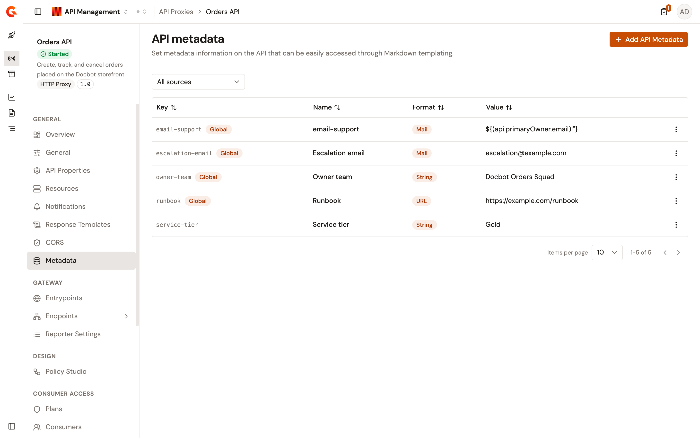
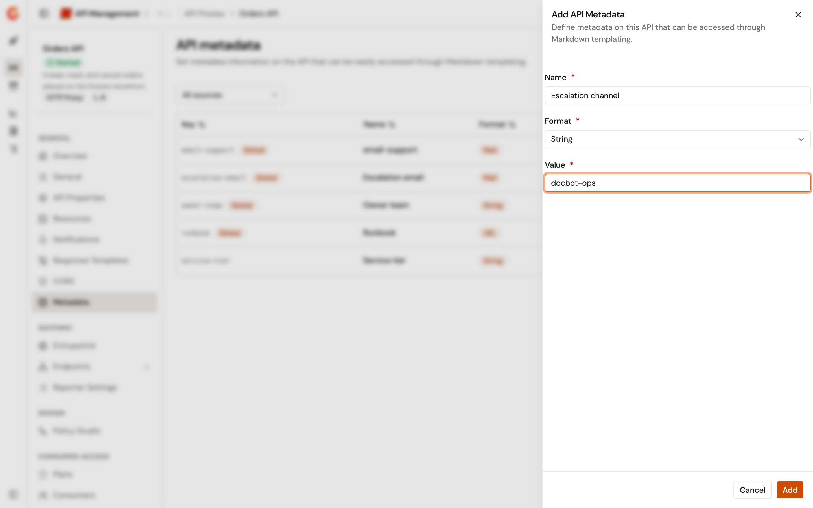
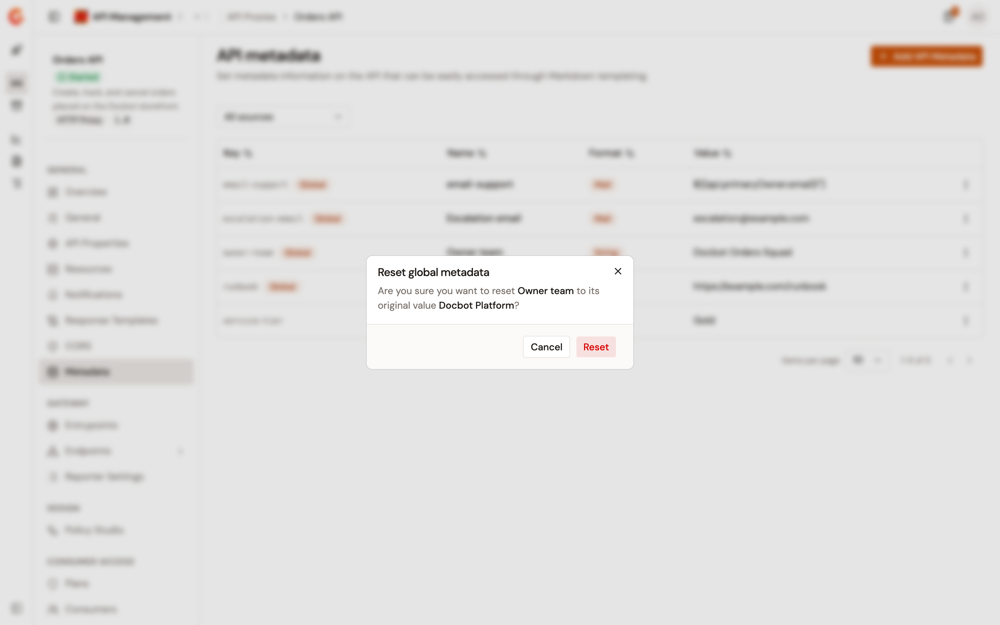

# Configure API metadata

API metadata is a set of key and value entries carried by a single API proxy. Every entry defined for the environment reaches each API in that environment as a default value. An API that sets its own value for the same key replaces the environment value for that API alone. An API can also hold entries of its own that no other API carries.

Each entry has four parts:

* **Key**. The identifier that other features use to reference the entry. Gravitee generates it from the name when the entry is created.
* **Name**. The label the console displays.
* **Format**. The kind of value the entry holds: String, Numeric, Boolean, Date, Mail, or URL.
* **Value**. The value this API carries for the key.

To open the page, follow these steps:

1. Click **API Proxies** in the module sidebar.
2. Select your API proxy.
3. Click **Metadata** in the API proxy sidebar.

**Metadata** sits in the **General** group of the API proxy sidebar. The item doesn't appear when your role doesn't grant read access to API metadata, and the page then reads **You don't have permission to view API metadata.**

<figure><figcaption>
The Metadata page lists the entries this API inherits from the environment alongside the entries it owns.
</figcaption></figure>

## Review the metadata list

The table displays the following columns:

| Column      | Description                                                                                                                                            |
| ----------- | ------------------------------------------------------------------------------------------------------------------------------------------------------ |
| **Key**     | The entry's generated identifier. An entry inherited from the environment also carries the **Global** badge, whose tooltip reads **Inherited global metadata**. |
| **Name**    | The entry's name.                                                                                                                                      |
| **Format**  | The entry's format: **String**, **Numeric**, **Boolean**, **Date**, **Mail**, or **URL**.                                                               |
| **Value**   | This API's value when it has one, the environment default when it doesn't, and **&#x2014;** when the entry has no value.                                |
| **Actions** | A row menu that holds the actions you can run on the entry. The column appears only when you can edit or delete entries and the API isn't read-only.    |

The list arrives sorted by key. Select any of the four column headers to sort by that column instead. Sorting and pagination cover every entry of the API, not only the rows on screen. The table paginates 10 rows at a time by default, and offers 25, 50, and 100.

Use **Filter by source** to narrow the list:

* **All sources**. Every entry.
* **Global**. Entries that have an environment default, whether this API overrides them or not.
* **API**. Entries that exist on this API alone.

Selecting a source reveals **Reset filters**, which clears both the filter and the sort.

When the API has no entries and no filter is applied, the table reads **No API metadata**, followed by **Add metadata to this API for Markdown templating and portal display.** When a filter matches nothing, it reads **No metadata found**, followed by **No metadata matches the selected source filter.**, and offers **Clear filters**.


When the API is managed by the Kubernetes operator, the page reads **This API is managed by the Kubernetes operator. Metadata is read-only.** and offers no add or row actions.


## Add an entry

To add an entry, complete the following steps:

1. Select **Add API Metadata**.
2. Enter the entry details described in the following table:

    | Field      | Description                                                                                                                    | Required |
    | ---------- | -------------------------------------------------------------------------------------------------------------------------------- | -------- |
    | **Name**   | The entry's name. Gravitee generates the entry's key from it.                                                                  | Yes      |
    | **Format** | **String**, **Numeric**, **Boolean**, **Date**, **Mail**, or **URL**. **String** is preselected, and the format is read-only once the entry exists. | Yes      |
    | **Value**  | The value this API carries. The field matches the format you selected, and changing the format resets it.                      | Yes      |

3. Select **Add**.

**Add** stays disabled until the name and the value are filled in and the value matches the selected format. A name that another entry on this API already uses is rejected, matched without regard to case, and the console reads **The metadata '\<name>' already exists.**

Gravitee builds the key from the name. Accents are stripped and the text is folded to lower case. Characters that aren't letters, digits, spaces, or dashes are removed, and each run of spaces and dashes becomes a single dash. **Support Email** becomes `support-email`.

<figure><figcaption>
The Add API Metadata panel takes a name, a format, and a value.
</figcaption></figure>

The following table describes what each format accepts:

| Format      | Value                                                                                                                                                     |
| ----------- | ----------------------------------------------------------------------------------------------------------------------------------------------------------- |
| **String**  | Any text.                                                                                                                                                 |
| **Numeric** | A number, entered in a number field.                                                                                                                      |
| **Boolean** | `true` or `false`, selected from a dropdown. Selecting the format sets the value to `false`.                                                               |
| **Date**    | A date, entered in a date field. Gravitee stores the date part alone, in `yyyy-MM-dd` form, and rejects a date that doesn't exist.                         |
| **Mail**    | An email address. The console reads **Invalid email** under the field while the value isn't one.                                                           |
| **URL**     | A URL. The console reads **Invalid URL** under the field while the value isn't URL-shaped. Enter the URL in full, including `http://` or `https://`, because Gravitee refuses a value it can't parse as a URL. |

An empty **Value** field shows no format error, and **Add** stays disabled until you fill it in.

## Use an expression as a value

A value that starts with `${` is treated as a FreeMarker expression and resolved against this API before the format is checked. An entry can therefore carry a value taken from the API itself, which the expression reaches through `api`. In the metadata list shown earlier, the `email-support` entry holds `${(api.primaryOwner.email)!''}`, which resolves to the email address of the API's primary owner.

A **Mail** or **URL** entry accepts an expression in the **Value** field, so **Invalid email** and **Invalid URL** don't appear while the value is an expression.

An entry is refused when the expression resolves to a value that doesn't match the format. A **Mail** entry is refused when its expression resolves to something other than an email address. An expression that resolves to an empty value passes the check for every format.

The table shows the expression as you entered it, because Gravitee stores the expression rather than the value it resolved to.

## Edit an entry

To change an entry's name or value, complete the following steps:

1. In the entry's row, open the actions menu.
2. Select **Edit**.
3. Update the **Name**, the **Value**, or both. **Key** and **Format** are read-only, and the panel reads **Format cannot be changed after creation.**
4. Select **Update**.

**Update** stays disabled until you change the name or the value.

Editing an entry that carries the **Global** badge creates an override on this API. The entry keeps its **Global** badge and its environment default, the **Value** column shows the value you entered, and the name you entered applies to this API alone. APIs that haven't overridden the key keep the environment value.

## Reset an overridden entry

Once an inherited entry holds an override, its row menu offers **Reset** in place of **Delete**. To drop this API's value and return the entry to the environment default, complete the following steps:

1. In the entry's row, open the actions menu.
2. Select **Reset**.
3. In the **Reset global metadata** dialog, select **Reset**.

The dialog names the entry and the value it returns to.

<figure><figcaption>
The Reset global metadata dialog names the entry and the environment value it returns to.
</figcaption></figure>

## Delete an entry

An entry that exists on this API alone is deleted rather than reset. To delete it, complete the following steps:

1. In the entry's row, open the actions menu.
2. Select **Delete**.
3. In the **Delete API metadata** dialog, select **Delete**.

The dialog names the entry and its key.

An entry inherited from the environment and never overridden offers neither **Reset** nor **Delete**, because this API holds no value of its own to remove. Taking it off this API means deleting the environment entry, which removes it from every API in the environment. That deletion also removes every API-level override of the same key, including overrides on APIs in other environments.

## Next steps

* [Manage environment metadata](../../../platform-management/manage-environment-metadata.md). Maintain the entries every API in the environment inherits.
