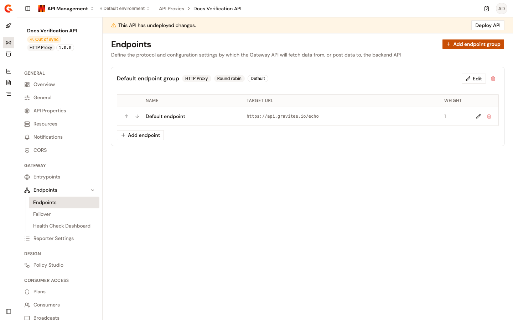
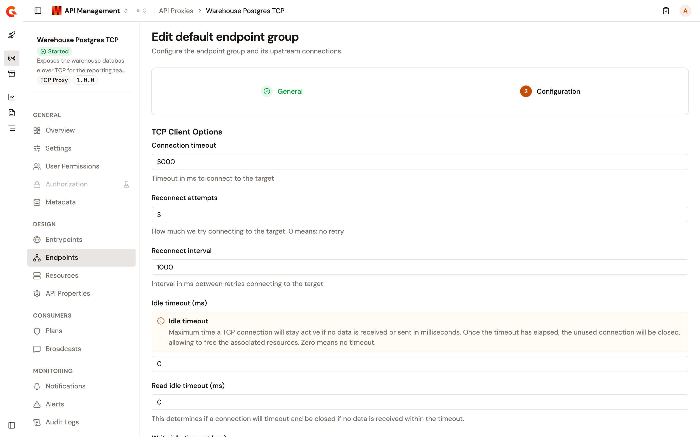
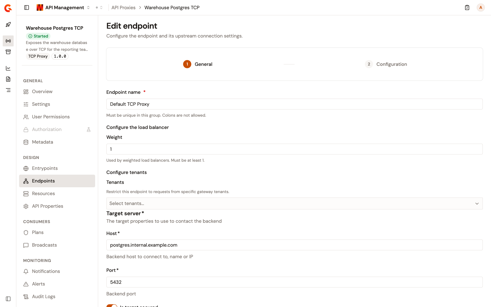
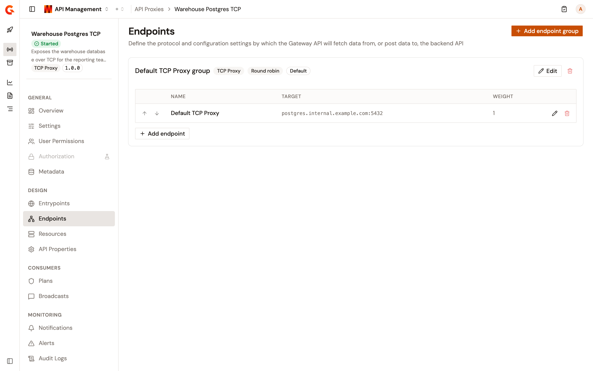

# Configure endpoints

Endpoints define where the API Gateway routes traffic after authentication. Each endpoint group points to one or more backend services and controls how the Gateway connects to them. An HTTP Proxy API's groups hold HTTP targets with their connection, proxy, SSL, and header settings. A TCP Proxy API's group holds a TCP target with its connection, proxy, and SSL settings.

## Endpoint groups

<figure><figcaption>
The Endpoints page shows all configured endpoint groups, their load-balancing type, and individual backend entries.
</figcaption></figure>

An endpoint group is a logical container for one or more backend endpoints that share common connection settings. Every API proxy has at least one endpoint group created by the creation wizard, and the first group listed is the default group of the API. The group card carries the type of the group, **HTTP Proxy** or **TCP Proxy**, and its load-balancing algorithm.

### Create an endpoint group

1. Click **API Proxies** in the module sidebar.
2. Select your API proxy.
3. Click **Endpoints** in the API proxy sidebar.
4. Click **Add endpoint group**.
5. Complete the wizard. The **General** and **Configuration** steps apply to every group. For HTTP Proxy APIs, a **Health-check** step follows, with the same fields as the [endpoint health-check step](#step-3-health-check).

**Add endpoint group** creates an HTTP proxy group. On a TCP Proxy API, click **Edit** on the **TCP Proxy** group the wizard created instead of adding a group.

#### Step 1: General

| Field                        | Description                                                                                                                                                                  | Default       |
| ---------------------------- | ---------------------------------------------------------------------------------------------------------------------------------------------------------------------------- | ------------- |
| **Name**                     | A name that is unique across all endpoint groups and endpoints of the API. Colons aren't allowed. An empty name reads **Name is required.**, a colon reads **Name must not contain colons.**, and a name in use reads **Name must be unique.** | (required)    |
| **Load balancing algorithm** | The algorithm used to distribute traffic across the endpoints of the group: **RANDOM**, **ROUND_ROBIN**, **WEIGHTED_RANDOM**, or **WEIGHTED_ROUND_ROBIN**.                 | `ROUND_ROBIN` |

The algorithms work as follows:

| Algorithm                | Description                                                                               |
| ------------------------ | ----------------------------------------------------------------------------------------- |
| **ROUND_ROBIN**          | Sends each request to the next endpoint in order.                                          |
| **RANDOM**               | Picks an endpoint at random for each request.                                             |
| **WEIGHTED_ROUND_ROBIN** | Cycles through the endpoints in order, giving each one a share of requests equal to its weight. |
| **WEIGHTED_RANDOM**      | Picks an endpoint at random, with a probability proportional to its weight.               |

The group card shows the algorithm as **Round robin**, **Random**, **Weighted round robin**, or **Weighted random**. Click **Validate general information** to go to the **Configuration** step.

#### Step 2: Configuration

The fields of this step follow the type of the group. When you add a group, the step starts with the target settings of the group's first endpoint, under a notice that the endpoints of the group inherit its configuration. The shared settings below apply to every endpoint of the group unless an endpoint overrides them.

**HTTP proxy groups**

**Security configuration** selects **HTTP 1.1** or **HTTP 2**, then lists the connection settings:

| Field                                      | Default | Notes                                                                                                                         |
| ------------------------------------------ | ------- | ----------------------------------------------------------------------------------------------------------------------------- |
| **Enable keep-alive**                      | On      | Reuses a persistent connection for several requests. Ignored for HTTP/2, which always keeps connections alive.                 |
| **Keep-alive timeout (ms)**                | 30000   | Maximum time a connection stays unused in the pool before it's evicted.                                                       |
| **Connection timeout**                     | 3000    | Time in milliseconds to connect to the target.                                                                                 |
| **Enable HTTP pipelining**                 | Off     | Writes requests to a connection without waiting for the previous responses. Ignored for HTTP/2.                                |
| **Read timeout (ms)**                      | 10000   | Maximum time given to the backend to complete the request, response included.                                                 |
| **Enable compression (`gzip`, `deflate`)** | On      |                                                                                                                               |
| **Propagate client Accept-Encoding header** | Off     | Can only be propagated when compression is disabled.                                                                          |
| **Propagate client Host header**           | Off     |                                                                                                                               |
| **Idle timeout (ms)**                      | 0       | Maximum time a connection stays active with no data sent or received. Zero means no timeout.                                  |
| **Follow HTTP redirects**                  | Off     |                                                                                                                               |
| **Max Concurrent Connections**             | 20      | Maximum pool size for connections.                                                                                            |
| **Max wait queue size**                    | -1      |                                                                                                                               |
| **Max connection lifetime (ms)**           | 0       |                                                                                                                               |

With **HTTP 2**, the following fields are added:

* **Allow h2c Clear Text Upgrade**, off by default.
* **Max concurrent stream for an HTTP/2 connection**, 25 by default.
* **Connection Window Size for an HTTP/2 connection**, 1048576 by default.
* **Stream initial window size for each HTTP/2 stream**, 262144 by default.
* **Max frame size for HTTP/2 stream data frame**, 16384 by default.

**HTTP Headers** lists the headers the Gateway adds or overrides on every request to the backend, with **KEY** and **VALUE** columns. Values support Expression Language and secrets.

**TCP proxy groups**

<figure><figcaption>
The <strong>Configuration</strong> step of a TCP Proxy group.
</figcaption></figure>

**TCP Client Options** lists the connection settings:

| Field                      | Default | Notes                                                                                                        |
| -------------------------- | ------- | ------------------------------------------------------------------------------------------------------------ |
| **Connection timeout**     | 3000    | Time in milliseconds to connect to the target.                                                                |
| **Reconnect attempts**     | 3       | Number of connection attempts to the target. 0 means no retry.                                               |
| **Reconnect interval**     | 1000    | Time in milliseconds between connection attempts.                                                            |
| **Idle timeout (ms)**      | 0       | Maximum time a TCP connection stays active with no data sent or received. Zero means no timeout.             |
| **Read idle timeout (ms)** | 0       | Closes the connection when no data is received within the timeout.                                          |
| **Write idle timeout (ms)** | 0      | Closes the connection when no data is sent within the timeout.                                              |

**Proxy Options and SSL Options**

Both group types end with the same two sections:

* **Proxy Options** chooses **No proxy**, **Use proxy configured at system level**, or **Use proxy for client connections**. The last choice takes a **Proxy Type**, a **Proxy host**, a **Proxy port**, and an optional **Proxy username** and **Proxy password**. An HTTP proxy group offers the **HTTP**, **SOCKS4**, and **SOCKS5** types and defaults to **HTTP**. A TCP proxy group offers **SOCKS4** and **SOCKS5** and defaults to **SOCKS5**.
* **SSL Options** holds the **Verify Host** switch (on by default), the **Trust all** switch (off by default, and the Gateway then trusts any certificate the backend presents), and the **Truststore** and **Key store** choices. Each store is **None**, **JKS with path**, **JKS with content**, **PKCS#12 / PFX with path**, **PKCS#12 / PFX with content**, **PEM with path**, or **PEM with content**, with the password, path, content, alias, and key password fields the choice needs.

Click **Save endpoint group** to save the group.

## Individual endpoints

Each endpoint within a group is one backend target. Endpoints inherit the group's shared configuration by default, and can override it.

### Add an endpoint to a group

1. On the **Endpoints** page, locate the target endpoint group.
2. Click **Add endpoint**.
3. Complete the endpoint form:

#### Step 1: General

| Field                  | Description                                                                                                                                                                                                             | Default    |
| ---------------------- | ----------------------------------------------------------------------------------------------------------------------------------------------------------------------------------------------------------------------- | ---------- |
| **Endpoint name**      | A name that is unique in the group. Colons aren't allowed. An empty name reads **Name is required.**, a colon reads **Name must not contain colons.**, and a name in use reads **This name is already used by another endpoint in this group.** | (required) |
| **Weight**             | Used by the weighted load balancers. Must be at least 1, or the field reads **Weight must be at least 1.**                                                                                                               | 1          |
| **Tenants**            | Restrict this endpoint to requests from specific gateway tenants.                                                                                                                                                       | None       |
| **Secondary endpoint** | HTTP Proxy APIs only. A secondary endpoint is left out of the load-balancer pool and only takes requests while the health check marks every primary endpoint as down.                                                     | Off        |

The target fields follow the type of the endpoint:

* An HTTP proxy endpoint takes a **Target url**, which is required and can't contain whitespace. It supports Expression Language and secrets.
* A TCP proxy endpoint takes the **Target server** fields: **Host** (the backend hostname or IP address), **Port** (a port from 1 to 65535), and the **Is target secured** switch, which connects to the backend over SSL and is off by default.

<figure><figcaption>
The endpoint form of a TCP Proxy group.
</figcaption></figure>

#### Step 2: Configuration

**Inherit configuration from the endpoint group** is on by default. Turn it off to set, for this endpoint alone, the same fields as the group's **Configuration** step.

#### Step 3: Health-check

The health-check step is offered on HTTP Proxy APIs only. The health-check service monitors the availability and health of your endpoints. The same step appears in the endpoint group wizard, and an individual endpoint either inherits the group configuration or overrides it.

| Field                       | Description                                                                                                          |
| --------------------------- | -------------------------------------------------------------------------------------------------------------------- |
| **Inherit configuration**   | Inherit the health check service configuration from the endpoint group. Shown when the group carries its own health-check settings. |
| **Enabled**                 | Turns the health-check service on. The service requires an API deployment, so deploy the API to start it.            |
| Schedule                    | A cron expression that sets the probe frequency.                                                                      |
| **Request**                 | The HTTP method, and the path or full URL of the probe. By default, the path is appended to the endpoint path.        |
| **Override endpoint path**  | When enabled, the path above replaces the endpoint path instead of being appended.                                    |
| **HTTP headers**            | Headers added to the health check request.                                                                            |
| **Assertion**               | An Expression Language expression evaluated on the health check response, for example `{#response.status == 200}`. Required. |
| **Success threshold**       | Consecutive successes before marking the endpoint available.                                                          |
| **Failure threshold**       | Consecutive failures before marking the endpoint unavailable.                                                         |

The results appear on the Health Check Dashboard. See [Monitor endpoint health](../../observe/monitor-endpoint-health.md).

4. Click **Add endpoint** (or **Save endpoint** when editing) to save.

The endpoint table of an HTTP proxy group shows each target under **Target URL**. The table of a TCP proxy group shows the host and port under **Target**. The last endpoint of a group and the last group of an API can't be deleted.

## Verification

To verify the endpoints of a TCP Proxy API are configured as expected, follow these steps:

1. Open the **Endpoints** page. The group card carries the **TCP Proxy** badge, and the **Target** column shows the backend host and port.
2. When the **This API is out of sync** banner shows, click **Deploy API**.
3. Open the **Overview** page. **Upstream Service** shows the same host and port.

<figure><figcaption>
The Endpoints page of a TCP Proxy API.
</figcaption></figure>

## Next steps

* [Establish consumer access](establish-consumer-access.md): Configure how consumers subscribe to and authenticate with your API.
* [Apply security policies](apply-security-policies.md): Add request/response policies on top of backend security.
