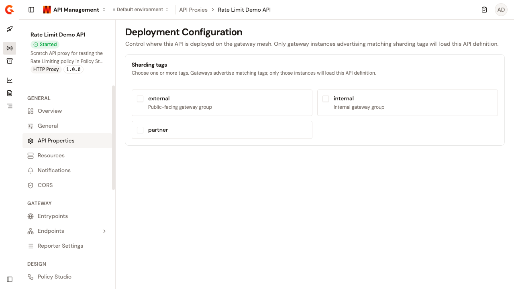
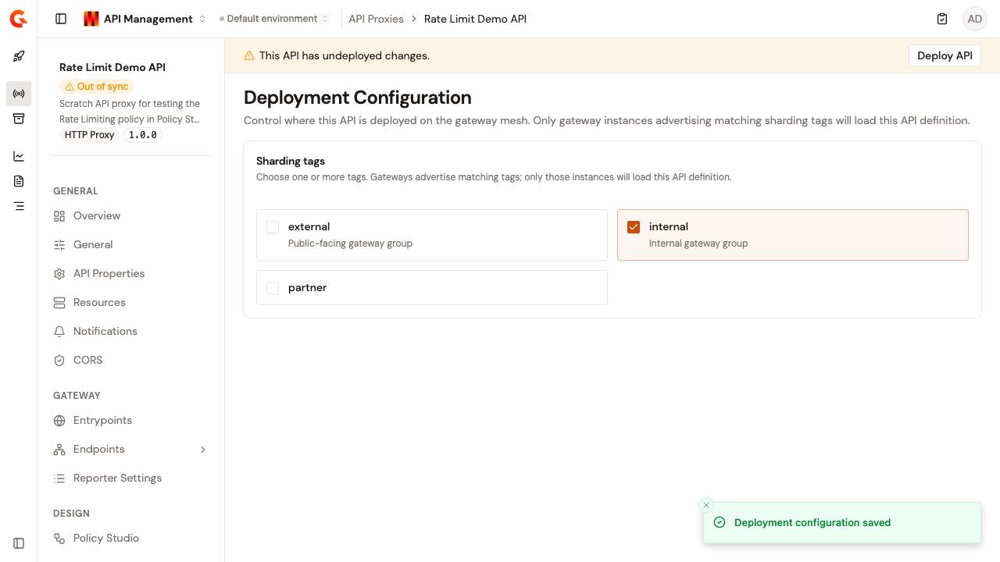

# Configure deployment

The **Deployment Configuration** page controls where this API is deployed on the gateway mesh. Only gateway instances advertising matching sharding tags load this API definition.

To open the page, follow these steps:

1.  Click **API Proxies** in the module sidebar.
2.  Select your API proxy.
3.  Click **Deployment** in the API proxy sidebar.
4.  Click **Configuration**.

    <figure><figcaption>
The Deployment Configuration page
</figcaption></figure>

## Assign sharding tags

The **Sharding tags** section lists the tags defined for your organization as a grid of cards, one card per tag. To assign them, follow these steps:

1. Select the checkbox on one or more tag cards. Gateways advertise matching tags, and only those instances load this API definition. Each card shows the tag name and, when the tag has one, its description.
2. Optional: to unassign a tag, clear its checkbox.
3. Click **Save changes**, or **Discard** to revert.

The **Discard** and **Save changes** buttons appear only once your selection differs from the saved value.

When no tags exist, the page reads **No sharding tags configured**. Sharding tags are managed at the organization level, on the **Entrypoints & Sharding Tags** page in Platform Management.

An assigned tag that no longer appears in the organization list isn't shown on this page, but it's preserved when you save.

To change sharding tags, you need the **API_DEFINITION** permission with the **UPDATE** access level. Without it, the tag cards are disabled and the page explains why.


When the API proxy is managed by the Gravitee Kubernetes Operator (GKO), the page shows **This API is managed by the Kubernetes operator. Sharding tags can only be changed from its source definition.**


## Verification

To verify the deployment configuration is working as expected, follow these steps:

1.  Assign a sharding tag that one of your gateway instances advertises, and click **Save changes**.

    <figure><figcaption>
A saved sharding tag selection
</figcaption></figure>

2.  Deploy the API.
3.  Send a request through a gateway instance advertising the tag. The request is served. Gateway instances without a matching tag don't load the API definition.
