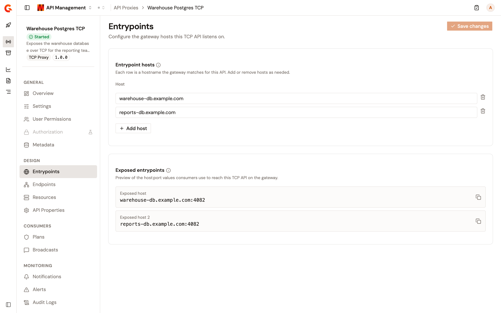

# Configure entrypoints

The **Entrypoints** page configures how consumers reach this API through the gateway. An HTTP Proxy API listens either on one or more context paths under the shared gateway host, or on virtual hosts, where each row maps a host to a path. A TCP Proxy API listens on one or more hostnames. See [Manage TCP hosts](#manage-tcp-hosts).

To open the page, follow these steps:

1. Click **API Proxies** in the module sidebar.
2. Select your API proxy.
3. Click **Entrypoints** in the API proxy sidebar.

When the API proxy is managed by the Kubernetes operator, the page is read-only.

<!-- TODO: Screenshot of the Entrypoints page in context-path mode -->

<figure><figcaption>
The Entrypoints page
</figcaption></figure>

## Manage context paths

The **Entrypoint context-paths** card defines the URL prefixes consumers use to reach this API through the gateway. Each row is served under the shared gateway host.

* Add a row with **Add context path**. Add more than one path when the API is exposed under several routes.
* Each **Context path** starts with `/`. An empty path shows **Path is required.**, and a path without a leading slash shows **Path must start with /.**
* Delete a row with its delete button. The last remaining row can't be deleted.
* Click **Save changes** to apply, or **Discard** to revert. A successful save shows **Configuration successfully saved!**

## Switch to virtual hosts

Turn on the **Enable virtual hosts** switch to map hosts instead of plain context paths. The **Virtual hosts** card carries one row per listener with the following fields:

| Field               | Description                                                        |
| ------------------- | ------------------------------------------------------------------ |
| **Virtual host**    | Host that must be set in the HTTP request to access this entrypoint. |
| **Context path**    | Path segment appended to the virtual host for this listener.       |
| **Override access** | Portal access URL override for this virtual host.                  |

Turning the switch off again opens the **Switch to context-path mode** dialog, which warns that all virtual-host configuration is lost while the paths you entered are preserved.

## Manage TCP hosts

On a TCP Proxy API, the page reads **Configure the gateway hosts this TCP API listens on.** and shows the **Entrypoint hosts** card in place of context paths and virtual hosts. Each **Host** row is a hostname consumers use to reach the API on the gateway's TCP port, matched against the server name indication (SNI) of the connection.

<figure><figcaption>
The Entrypoints page of a TCP Proxy API.
</figcaption></figure>

* Add a row with **Add host**. Delete a row with its delete button. The last remaining row can't be deleted.
* Each row is checked as you type. A message under the row says what's wrong:

| Condition                                                                                                                                                                                 | Message                                                                   |
| ----------------------------------------------------------------------------------------------------------------------------------------------------------------------------------------- | ------------------------------------------------------------------------- |
| The row is empty.                                                                                                                                                                         | **Host is required.**                                                     |
| The hostname is longer than 255 characters.                                                                                                                                               | **Max length is 255 characters**                                          |
| The hostname uses characters other than lowercase letters, digits, hyphens, and underscores, has a label longer than 63 characters, or has a label that starts or ends with a hyphen or an underscore. | **Host is not valid**                                                     |
| The same hostname is in another row.                                                                                                                                                      | **Duplicated hosts not allowed**                                          |
| Another API of the environment already listens on the hostname.                                                                                                                           | **Hosts [**_host_**] already exists**                                      |
| The console couldn't complete the check.                                                                                                                                                  | **Unable to verify this host. Save stays disabled until the check succeeds.** |

* **Save changes** stays disabled while a row shows a message or while a changed row is still being checked. Click **Discard** to revert. A successful save shows **Configuration successfully saved!**

## Preview the exposed entrypoints

The **Exposed entrypoints** card previews the gateway URLs derived from your context paths or virtual hosts. These are the same values consumers see in the Developer Portal. When nothing is configured, the card reads **No exposed entrypoints available.**

On a TCP Proxy API, the card lists one **Exposed host** per hostname, as the hostname and the TCP port, for example `warehouse-db.example.com:4082`. The port is the **Default TCP port** of the environment, which is 4082 until you change it. See [Manage entrypoints and sharding tags](../../../platform-management/manage-entrypoints-and-sharding-tags.md).

## Verification

To verify an entrypoint is working as expected, follow these steps:

1. Add a context path and click **Save changes**.
2. Deploy the API.
3. Call the URL shown in the **Exposed entrypoints** card. The gateway routes the request to your API.

<!-- TODO: Screenshot of the Exposed entrypoints card with a resolved gateway URL -->

<figure><figcaption>
The Exposed entrypoints card
</figcaption></figure>
