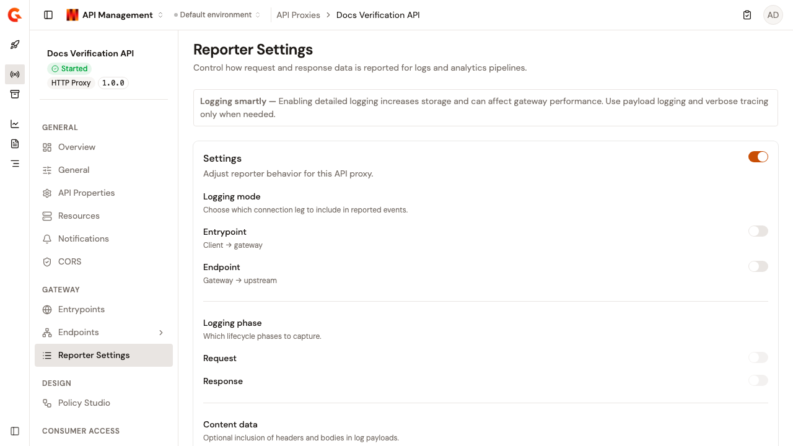
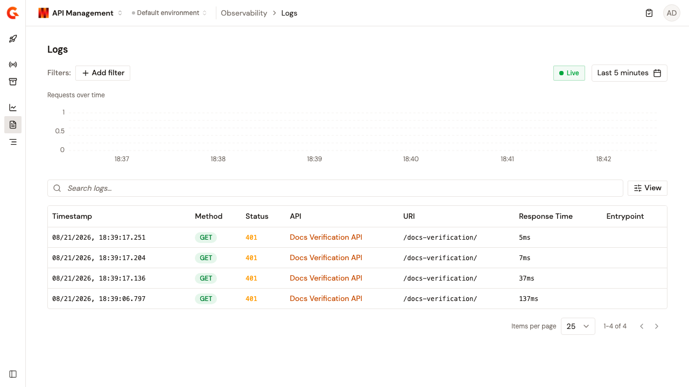

# Configure logging and tracing

The **Reporter Settings** page controls how request and response data is reported for logs and analytics pipelines, and configures OpenTelemetry tracing for this API.

To open the page, follow these steps:

1. Click **API Proxies** in the module sidebar.
2. Select your API proxy.
3. Click **Reporter Settings** in the API proxy sidebar.

When you change any setting, the **Discard** and **Save changes** buttons appear.

After you save, a confirmation notification appears and both buttons disappear until you edit the form again.

<figure><figcaption>
The Reporter Settings page
</figcaption></figure>


Detailed logging increases storage and can affect gateway performance. Use payload logging and verbose tracing only when needed.


## Configure the reporter

The **Settings** card adjusts reporter behavior for this API proxy. The card header carries a switch that enables analytics. While that switch is off, every other setting on the card is disabled. When you save with analytics turned off, tracing is disabled too.

The card groups the logging settings as follows:

| Group                  | Settings                     | Description                                                                                    |
| ---------------------- | ---------------------------- | ---------------------------------------------------------------------------------------------- |
| **Logging mode**       | **Entrypoint**, **Endpoint** | Which connection leg to include in reported events: client to gateway, or gateway to upstream. |
| **Logging phase**      | **Request**, **Response**    | Which lifecycle phases to capture.                                                             |
| **Content data**       | **Headers**, **Payload**     | Optional inclusion of headers and bodies in log payloads.                                      |
| **Display conditions** | **Request phase condition**  | An optional Expression Language filter for the request phase. Leave empty to log all requests. |

The phase, content, and condition settings stay disabled until at least one logging mode, **Entrypoint** or **Endpoint**, is enabled.

For example, the condition `{#request.headers['Content-Type'][0] == 'application/json'}` only logs JSON requests.

## Configure OpenTelemetry tracing

The **OpenTelemetry** card configures distributed tracing and OpenTelemetry log correlation through the following settings:

* **Trace enabled**. Enables OpenTelemetry tracing for this API. Tracing captures execution spans and conditions.
* **Verbose**. Adds detailed span events with headers, context attributes, and policy execution details. Requires **Trace enabled**. Enable it only for deep debugging, because it increases trace size significantly, and disable it after debugging is complete.
* **OTel Logs**. Emits request and response payloads as OpenTelemetry log records correlated to the active trace. This enables log-to-trace linking in Grafana and other OpenTelemetry-compatible backends. Requires **Trace enabled**.

When you turn off **Trace enabled**, **Verbose** is disabled too.

### Redact span attributes

With **Trace enabled** and **Verbose** both on, the **Span Attribute Redaction** section masks sensitive attribute values before spans are exported. Without rules, span attributes are exported as-is.

Each rule carries an **Attribute Name Pattern**, a **Masking Type**, and type-specific fields such as **Replacement Text**, **Prefix chars**, **Suffix chars**, and **Mask char**. A rule can also match on the attribute value with a partial-match regular expression.

Click **Save changes** to persist the rule list.

## Verification

To verify the reporter settings are working as expected, follow these steps:

1. Enable analytics, turn on the **Entrypoint** logging mode and the **Request** phase, and click **Save changes**.
2. Deploy the API and send a request to it.
3. Open the API logs. The request appears with the captured data. See [View API logs](../../observe/view-api-logs.md).

<figure><figcaption>
A logged request
</figcaption></figure>
