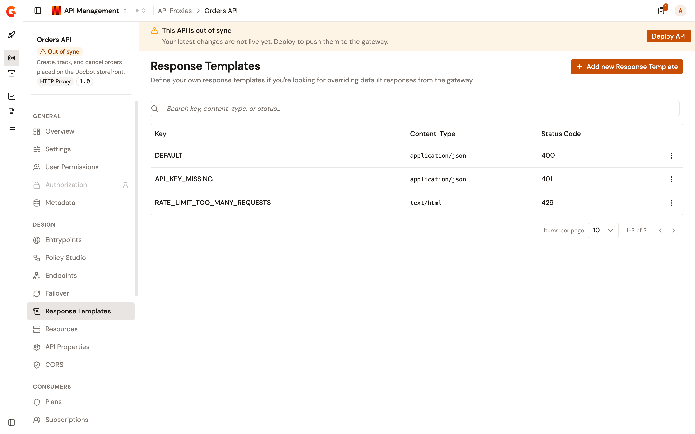
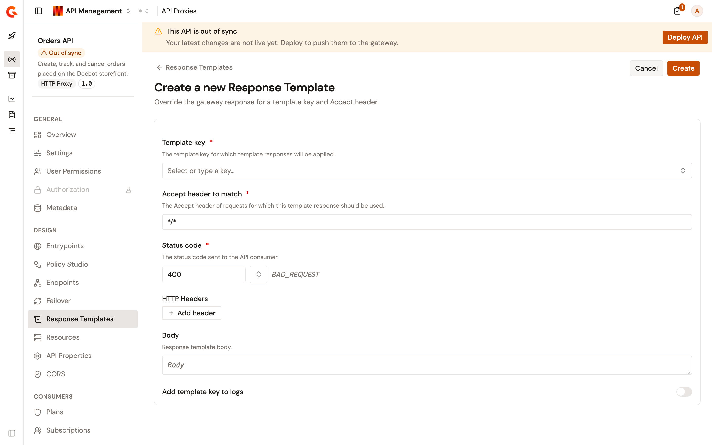

# Configure response templates

When the gateway refuses or fails a request, it answers with a default error payload. A response template replaces that payload for one error and one kind of client. You match on a template key and an Accept header, then return the status code, headers, and body of your choice.

Templates are stored on the API proxy and matched per request. One proxy can answer a browser with HTML and a service with JSON for the same error.

## Before you start

* You need an API proxy that serves HTTP traffic. Response templates aren't offered on TCP Proxy, MCP, or LLM Proxy APIs. See [Where response templates aren't offered](#where-response-templates-arent-offered).
* You need permission to update the API proxy. Without it the page opens read-only, with no way to add, edit, or delete a template.

## Open the Response Templates page

1. Open **API Management** in the Gamma console.
2. Click **APIs**.
3. Select your API proxy.
4. In the **Design** group of the sidebar, click **Response Templates**.

The page opens on the templates the proxy already carries. Each row shows its **Key**, its **Content-Type**, and its **Status Code**.

Type in **Search key, content-type, or status…** to narrow the list. When nothing matches, the table reads **No response templates found** with **No templates match your search.** underneath.

A proxy with no templates at all opens on an empty state titled **No Response Templates**, with an **Add new Response Template** button in the middle of it.

<figure><figcaption>
The Response Templates page of an API proxy
</figcaption></figure>

## Add a response template

1. Click **Add new Response Template**.
2. Set **Template key** to the error you're overriding. The field suggests **DEFAULT** and the gateway's own error keys, and it accepts a key you type yourself. When your text matches no suggestion, the list reads **No matching keys — your custom value will be used.**
3. Set **Accept header to match** to the Accept header of the requests this template answers, for example `application/json`. The field starts at `*/*`, which answers any Accept header.
4. Set **Status code** to the status the consumer receives. The field starts at `400`, and the name of the status you enter appears beside the field. Click the browse button to pick from the known status codes.
5. Optional: under **HTTP Headers**, click **Add header** and fill in the **Header name** and **Value**. The name field suggests standard HTTP header names and accepts your own. Repeat for each header. A new template starts with no header rows.
6. Optional: enter the payload in **Body**.
7. Optional: turn on **Add template key to logs** to record the template key alongside the request.
8. Click **Create**.

The console reports **Configuration successfully saved!** and returns to the list.

Saving a template changes the API definition, so the proxy is left out of sync until you deploy it. Click **Deploy API** on the banner at the top of the page to push the change to the gateway.

<figure><figcaption>
Creating a response template
</figcaption></figure>

### What the form refuses

**Template key**, **Accept header to match**, and **Status code** are all required, and each reports its own message when left empty:

<table>
    <thead>
        <tr>
            <th width="300">What you did</th>
            <th>What the form says</th>
        </tr>
    </thead>
    <tbody>
        <tr>
            <td>Left <strong>Template key</strong> empty</td>
            <td><strong>Template key is required.</strong></td>
        </tr>
        <tr>
            <td>Left <strong>Accept header to match</strong> empty</td>
            <td><strong>Accept header is required.</strong></td>
        </tr>
        <tr>
            <td>Used a key and Accept header another template already uses</td>
            <td><strong>Response template with key '&lt;key&gt;' and accept header '&lt;accept&gt;' already exists.</strong></td>
        </tr>
        <tr>
            <td>Left <strong>Status code</strong> empty</td>
            <td><strong>Status code is required.</strong></td>
        </tr>
        <tr>
            <td>Entered something that isn't an HTTP status code</td>
            <td><strong>Invalid status code: &lt;value&gt;.</strong></td>
        </tr>
        <tr>
            <td>Entered a header name containing a space</td>
            <td>The row is marked invalid and <strong>Create</strong> stays disabled.</td>
        </tr>
    </tbody>
</table>

The pair of a template key and an Accept header identifies a template, which is why the two together have to be unique on the proxy.

## Edit a response template

1. Open the actions menu at the end of the template's row.
2. Click **Edit**.
3. Change the fields you need.
4. Click **Save**.

## Delete a response template

1. Open the actions menu at the end of the template's row.
2. Click **Delete**.
3. In the **Delete a Response Template** dialog, click **Delete**.

The console reports that the template was deleted.

## When the page is read-only

The page opens without its editing controls in two cases, and each says why:

* **The API is managed by the Kubernetes operator.** A banner reads **This API is managed by the Kubernetes operator. Response templates are read-only.** Change the templates in the resource the operator applies.
* **You can't update this API proxy.** The add, edit, and delete controls aren't offered. Opening a template shows it under the title **View Response Template**.

A reader without permission to see templates at all gets the page title and **You don't have permission to view response templates.** instead of the list.

## Where response templates aren't offered

The **Response Templates** item isn't in the sidebar of a TCP Proxy API. Reaching the page anyway reads **Response Templates are not available for TCP Proxy APIs**, because a TCP Proxy API forwards raw traffic and has no HTTP response to override.

An MCP or LLM Proxy API reads **Response Templates are not available for MCP and LLM Proxy APIs**.

## Next steps

* [Apply security policies](apply-security-policies.md). The plans and policies that produce the errors a template answers.
* [Configure logging and tracing](configure-logging-and-tracing.md). What the proxy records about each request.
