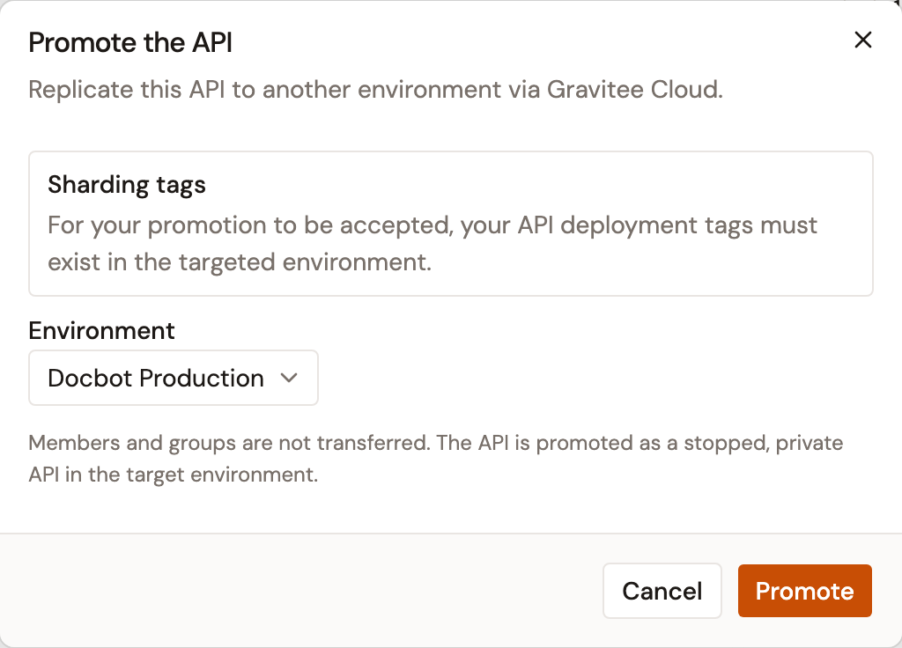
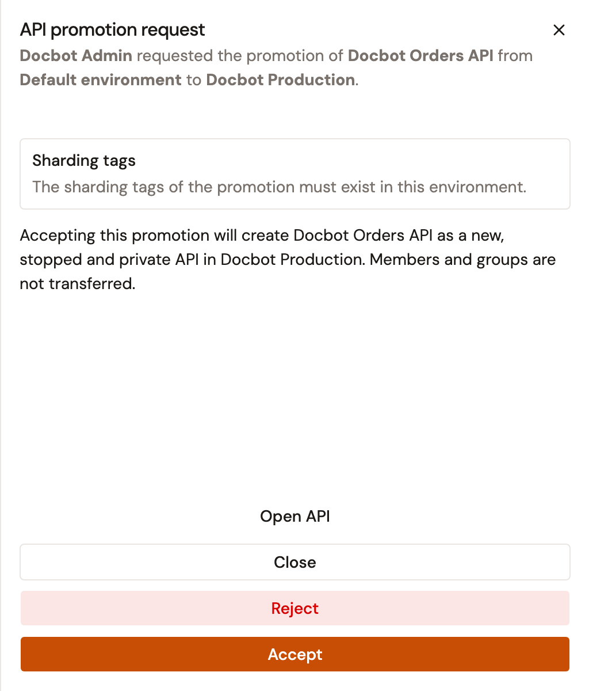

# Manage general settings

The **Settings** page groups the identity fields, images, metadata, and lifecycle actions of an API proxy.

To open the page, follow these steps:

1. Click **API Proxies** in the module sidebar.
2. Select your API proxy.
3. Under **General** in the API proxy sidebar, click **Settings**.

<!-- TODO: Screenshot of the Settings page of an API proxy -->

<figure><figcaption>
The Settings page of an API proxy
</figcaption></figure>


When the API proxy is managed by the Kubernetes operator, the page shows the banner **This API is managed by the Kubernetes operator. Configuration changes must be made in your Kubernetes manifests.** and every field is read-only.


## Edit the identity fields

The main card carries the following fields. Editing any of them reveals the **Discard** and **Save changes** buttons at the top of the page.

| Field           | Description                                                                                          |
| --------------- | ---------------------------------------------------------------------------------------------------- |
| **Name**        | The display name of the API proxy. Required.                                                          |
| **Version**     | The version string of the API proxy, up to 32 characters. Required.                                   |
| **Description** | A free-text description of what the API proxy does.                                                   |
| **Labels**      | Free-form tags. Type a label and press Enter to add it.                                               |
| **Categories**  | Categories defined for the environment. Select one or more from the list.                             |

The **Allow in API Products** switch sits under the identity fields. When enabled, this API can be bundled into API Products for grouped consumer access. See [API product configuration reference](../configure-your-api-product/api-product-configuration-reference.md).

## Manage the API images

The **Images** panel holds two images:

* **Picture**. The avatar of the API proxy, also shown in the API proxy sidebar header.
* **Background**. The background image of the API proxy.

Both accept PNG, JPG, and SVG files up to 500 KB.

## Review the API details

The **Details** panel is read-only and lists **Owner**, **Created**, **Updated**, **Visibility**, **Lifecycle**, and **Status**.

## Promote the API

Promoting an API proxy sends a copy of it to another environment through Gravitee Cloud. Nothing changes in the target environment until someone there accepts the request.

Promotion is available once your installation is registered with Gravitee Cloud and accepted there. Until then, **Promote** opens **Meet Gravitee Cloud**, which links to Gravitee Cloud to create an account and register the installation.

**Promote** appears when you can edit the API proxy, and never on a federated API. It's unavailable in the following cases:

* The API proxy is managed by the Kubernetes operator.
* The API lifecycle is `DEPRECATED`.
* **Enable API Review** is on for the environment, and the API carries one of its review banners, such as **This API is a draft.**

To promote the API proxy, follow these steps:

1. Click **Promote**.
2. In the **Promote the API** dialog, select the target environment from the **Environment** list.

    <figure><figcaption>
The Promote the API dialog
</figcaption></figure>

3. Click **Promote**.

The dialog closes and **Promotion requested** confirms the request. When the request fails, the dialog stays open and shows the error.

The **Environment** list holds the environments Gravitee Cloud returns for your installation. An environment that already has a promotion of this API waiting shows **(pending)** and can't be selected until that promotion is accepted or rejected. When there's no environment to promote to, the dialog shows **No environment is available to promote this API.**

### Accept or reject a promotion

The request reaches the target environment as a task in **Tasks & Approvals**. The task is listed for people who can create APIs in that environment. When an earlier promotion of the same API was accepted there and its API still exists, the request updates that API instead. The task is then listed for people who can update APIs there.

To accept or reject a promotion, follow these steps:

1. At the top right of the Gamma console, click the clipboard icon next to your avatar.
2. In the task's row, click **Review promotion**.
3. In the **API promotion request** panel, click **Accept**, or click **Reject** and then **Confirm reject**.

    <figure><figcaption>
The API promotion request panel
</figcaption></figure>

**API promotion accepted.** or **API promotion rejected.** confirms your choice. Accepting creates the API in the target environment, or updates the API an earlier promotion created there. The panel says which one before you choose. After a rejection, the environment can be selected again in the **Promote the API** dialog.

## Start or stop the API

The **API Events** card alters the runtime state of the API on the gateway:

* **Stop API**. Shown while the API is started. The gateway stops accepting requests. Subscriptions are preserved.
* **Start API**. Shown while the API is stopped. Starts the API and makes it available on all connected gateways.

While **Enable API Review** is on for the environment, the card offers **Ask for a review** instead of these two actions until a reviewer accepts the API proxy. A stopped API proxy that was never reviewed can't be started either. See [Review an API proxy](review-an-api-proxy.md).

## Delete the API

The **Delete this API** action in the **API Events** card permanently removes the API, all plans, subscriptions, and analytics data.

The action is unavailable in the following two cases:

* The API is started. Stop it first.
* The API lifecycle is `PUBLISHED`.

In both cases the card reads **A running or published API cannot be deleted.**

To delete the API, follow these steps:

1. Click **Delete this API**.
2. In the **Delete API permanently?** dialog, type the name of the API to confirm.
3. Click **Delete permanently**.


Deletion is permanent. The dialog deletes the API along with all plans, subscriptions, and analytics data, and the action can't be undone.


## Verification

To verify the general settings are working as expected, follow these steps:

1. Edit the **Description** field.
2. Click **Save changes**.
3. Reload the page. The **Description** field shows the new text, and the **Updated** row of the **Details** panel shows the current date.

<!-- TODO: Screenshot of the Details panel showing the refreshed Updated timestamp -->

<figure><figcaption>
The Details panel after a save
</figcaption></figure>
