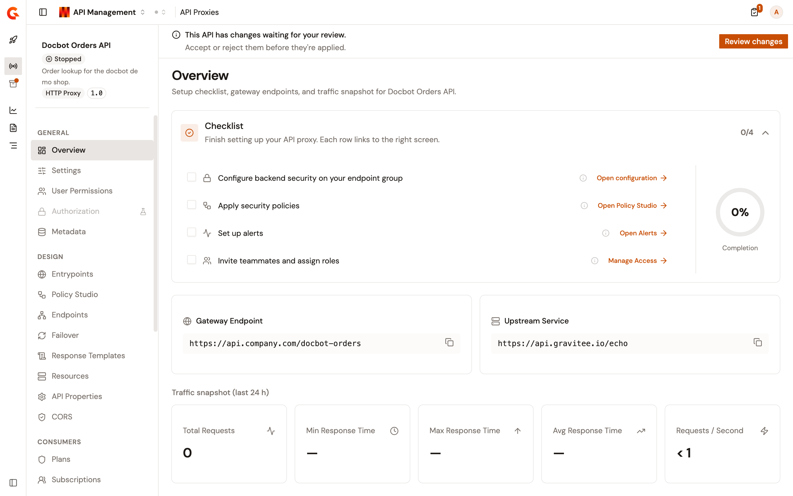
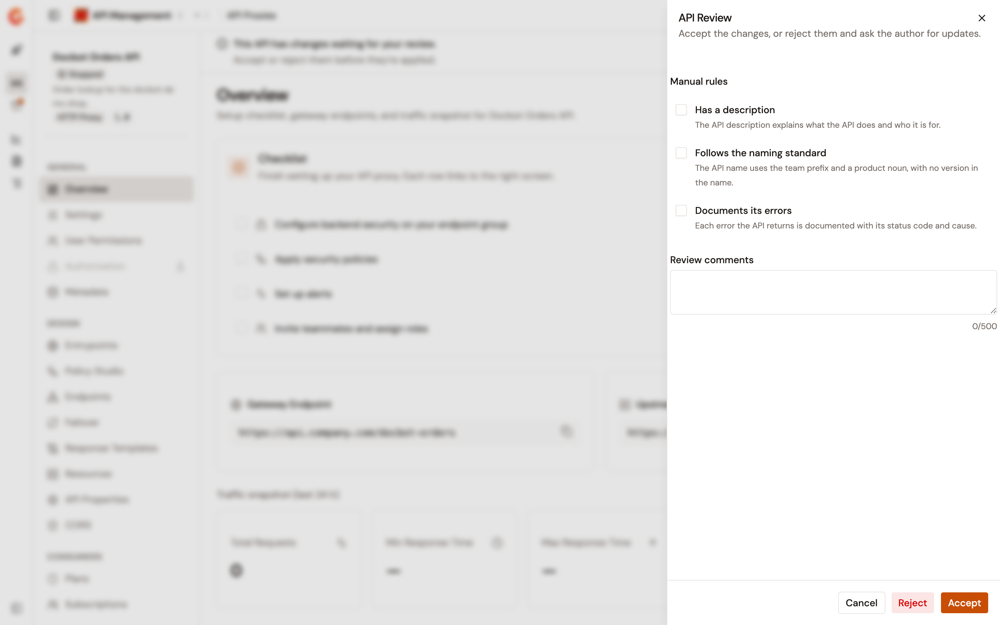
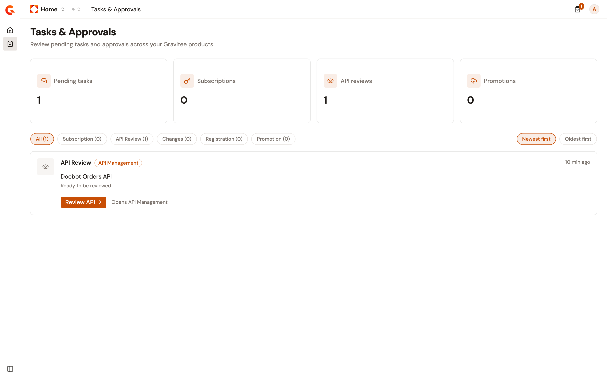

# Review an API proxy

While **Enable API Review** is on for the environment, an API proxy can't be started or published until a reviewer accepts it. The author asks for a review from the **Settings** page of the API proxy, or when creating it. The reviewer accepts or rejects from the banner at the top of the API proxy's pages. The **Tasks & Approvals** page lists the reviews that are waiting.

## Prerequisites

Before you ask for a review or give one, complete the following steps:

* Make sure API Review is on for the environment. To turn it on, and to define the manual rules reviewers check, see [Configure API Review](../../../platform-management/configure-api-review.md).
* To ask for a review, make sure your role on the API proxy lets you change its definition. A federated API can't be sent for review.
* To accept or reject, make sure you're a member of the API proxy, or of one of its groups, with a role that can review APIs. The built-in **REVIEWER** role can. To add members, see [Manage user permissions](manage-user-permissions.md).

## Read the review banner

While API Review is on, a banner at the top of every page of the API proxy tracks its review. It disappears once a reviewer accepts the API proxy, and it doesn't show for an API proxy that was never sent for review.

| Where the review stands | What authors read | What reviewers read |
| --- | --- | --- |
| A draft, created while API Review was on and not yet sent for review | **This API is a draft.** Ask for a review before you can publish or start this API. | The same, without the button. |
| Sent for review | **The API reviewer has been asked to review the changes.** Start, stop, and publish stay blocked until a reviewer accepts. | **This API has changes waiting for your review.** Accept or reject them before they're applied. |
| Rejected | **The API reviewer has asked for changes to be made on this API.** Address the feedback, then ask for a new review. | **As an API reviewer, you have rejected the changes made on this API.** Open the review to revisit your decision once the author has addressed it. |

Authors who can ask for a review see an **Ask for a review** button in the banner. Reviewers see **Review changes**. While a review is pending, the banner that offers to deploy an out-of-sync API proxy doesn't show either.

<figure><figcaption>
The review banner of an API proxy that waits for a reviewer's decision
</figcaption></figure>

## Ask for a review

To ask for a review of an existing API proxy, complete the following steps:

1. Click **API Proxies** in the module sidebar.
2. Select your API proxy.
3. Under **General** in the API proxy sidebar, click **Settings**.
4. In the **API Events** card, click **Ask for a review**. The same button sits in the review banner.
5. In the **Review API** dialog, click **Ask for review**. The console confirms with **Review has been asked.**

The button appears only while the API proxy is a draft, has never been reviewed, or has changes requested. It doesn't appear while a review is pending.

The reviewers of the API proxy receive an email, and the request appears on their **Tasks & Approvals** page.

To ask for a review as soon as you create an API proxy, keep **Ask for a review** on in the last step of the creation wizard. Then click **Create & ask for review**. See [Create an API proxy](../create-an-api-proxy.md).

## Accept or reject an API proxy

To review an API proxy, complete the following steps:

1. Open the API proxy. From the **Tasks & Approvals** page, click **Review API** on its row. From the API proxy itself, click **Review changes** in the banner.
2. In the **API Review** panel, under **Manual rules**, select each rule the API proxy meets. The rules are the ones defined for the environment, and the ones you select stay selected the next time this API proxy is reviewed.
3. Optional: Enter **Review comments**, up to 500 characters.
4. Click **Accept** or **Reject**. The console confirms with **API review saved.**

    <figure><figcaption>
The <strong>API Review</strong> panel of an API proxy under review
</figcaption></figure>

After **Accept**, the banner disappears and the author can start and publish the API proxy. After **Reject**, the author sees your comment on their **Changes Requested** task and has to ask for a new review once the changes are made. The API proxy stays blocked until then. If the manual rules can't be loaded, the panel says so and you can still accept or reject.

## What stays blocked during a review

While an API proxy is under review or has changes requested, the following holds:

* **Start API** and **Stop API** don't appear in the **API Events** card of the **Settings** page, and **Promote** is unavailable.
* The API proxy can't be published.
* A call that tries to start the API proxy anyway is refused with **API cannot be started without being reviewed**. The same applies to an API proxy that was never reviewed while API Review is on.

## Find reviews in Tasks & Approvals

To see the reviews that wait for you, complete the following steps:

1. At the top of the page, click the name of the product you're working in, then select **Home**.
2. In the sidebar, click **Tasks & Approvals**. The icon next to your avatar at the top of every page shows the number of pending tasks and opens the same list in a panel.

    <figure><figcaption>
An <strong>API Review</strong> task on the <strong>Tasks &#x26; Approvals</strong> page
</figcaption></figure>

The page shows two kinds of review rows:

* **API Review**, with **Ready to be reviewed** and a **Review API** button, for each API proxy that waits for your decision as a reviewer. The button opens the API proxy with the **API Review** panel already open.
* **Changes Requested**, with **Changes requested by reviewer**, the reviewer's comment, and an **Address feedback** button, for each of your API proxies that a reviewer rejected. The button opens the API proxy.

The **API reviews** counter at the top counts both kinds. Use the **API Review** and **Changes** filters to show one kind at a time.

## Verification

To verify the review workflow, complete the following steps:

1. On the **Settings** page of a stopped API proxy, click **Ask for a review**, then **Ask for review**.
2. Check that the banner reads **The API reviewer has been asked to review the changes.** and that **Start API** is gone from the **API Events** card.
3. As a reviewer, open **Tasks & Approvals**, click **Review API** on the row of the API proxy, and click **Accept**.
4. Check that the banner is gone and that **Start API** is back in the **API Events** card.
