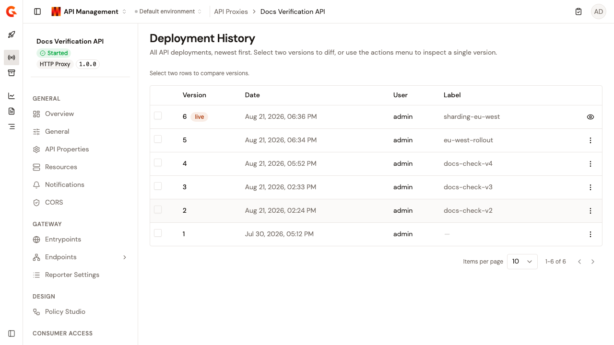
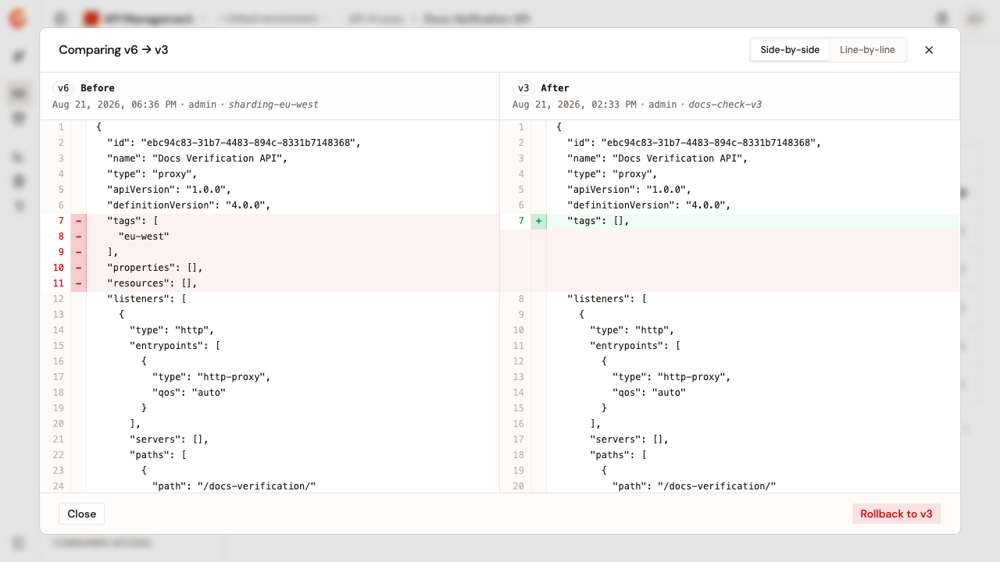

# Review deployment history

The **Deployment History** page lists all API deployments, newest first. Select two versions to diff them, or use the actions menu to inspect a single version.

To open the page, follow these steps:

1. Click **API Proxies** in the module sidebar.
2. Select your API proxy.
3. Click **Deployment** in the API proxy sidebar.
4. Click **History**.

<figure><figcaption>
The Deployment History page
</figcaption></figure>

The table lists each deployment's **Version**, **Date**, **User**, and **Label** columns. The most recent deployment carries the **live** badge. The label is the optional deployment label entered in the **Deploy your API** dialog. Before the first deployment, the page reads **No deployments yet**.

A missing version number or label appears as a dash. Optional: set the page size to 10, 25, 50, or 100 rows. Changing the page size returns you to the first page.

## Inspect a single version

To view the definition a deployment shipped, click **View definition** in the row's actions. For any version other than the live one, the actions menu also offers **Compare with live**.

## Compare two versions

Select the checkboxes of two versions. The toolbar tracks the selection, and once two versions are selected the diff view opens.

Only two versions can be selected at a time. With one version selected, the toolbar offers **Clear** to reset the selection. Closing the diff view also clears it.

The **Comparing** dialog shows the differences between the two definitions, with **Side-by-side** and **Line-by-line** view modes. When the definitions are identical, the dialog reads **No differences found between these two versions.** In that case, it shows neither the view modes nor the rollback control.

In side-by-side view, the **Before** and **After** panes show each version's number, date, initiator, and deployment label.

## Roll back to an earlier version

To roll back, you need the `API_DEFINITION` permission with Update access. The controls are shown to everyone who can open the page, but the request is rejected without that permission.

To roll back, follow these steps:

1. Compare the live version with the target version, for example with **Compare with live**.
2. In the diff dialog, click the **Rollback** button, which names the target version.
3. In the confirmation dialog, click **Confirm rollback**, or **Cancel** to abandon the rollback.

You can also start a rollback from the **View definition** dialog, where the rollback button runs immediately, without a confirmation step. If the rollback is rejected, the page shows a card with the reason, which stays until you start another rollback.


The rollback restores the API definition to the selected version, and can't be undone. It doesn't redeploy the API. The gateway keeps serving the live version, and the API is marked **Out of sync** until you deploy it again.


## Verification

To verify the deployment history is working as expected, follow these steps:

1. Deploy the API twice with different configurations, giving each deployment a label.
2. Open the **Deployment History** page. Both deployments appear with their labels, and the newest one carries the **live** badge.
3. Select both versions. The diff view shows the configuration change.

<figure><figcaption>
Comparing two deployed versions
</figcaption></figure>
