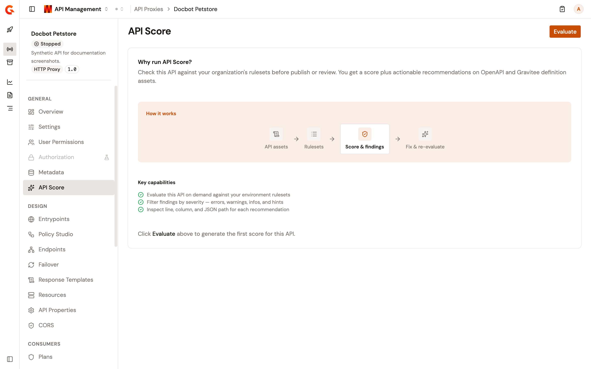
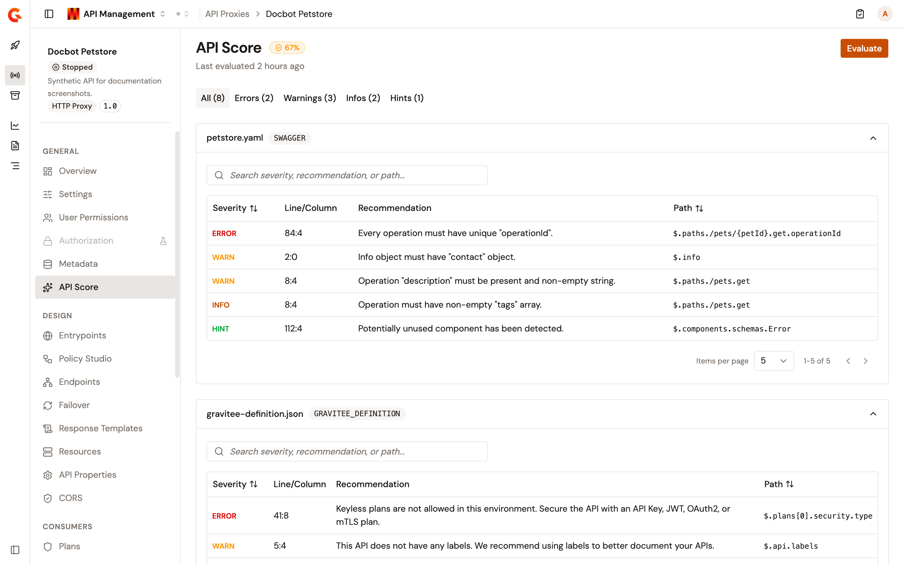

# Review the API Score

API Score rates an API proxy against the rulesets of its environment and lists what to fix. An evaluation checks the API definition and every OpenAPI or AsyncAPI documentation page of the API. It returns one score for the API, as a percentage, and the findings of each asset. You run an evaluation on demand, and the page shows the result of the latest one. The score doesn't update on its own. Editing the API, its documentation pages, or the rulesets of the environment doesn't change the score or **Last evaluated** until you click **Evaluate** again.

## Prerequisites

* API Score turned on for the environment. An administrator turns on **Enable API Score** on the **API Review** page of the **Environment** section in **Platform Management**, then clicks **Save changes**. Until then, the **API Score** item doesn't appear in the API proxy sidebar.
* An installation connected to Gravitee Cloud. Without that connection, an evaluation fails. For a self-hosted installation, see [Register installations](https://documentation.gravitee.io/gravitee-cloud/self-hosted/register-installations).

## Open API Score

To open the page, complete the following steps:

1. Click **API Proxies** in the module sidebar.
2. Select your API proxy.
3. Under **General** in the API proxy sidebar, click **API Score**.

**API Score** is also on the sidebar of a federated API.

Until an API is evaluated for the first time, the page explains how scoring works in place of a score, under **Why run API Score?** and **How it works**: **API assets**, **Rulesets**, **Score & findings**, and **Fix & re-evaluate**.

<figure><figcaption>
The API Score page of an API proxy that hasn't been evaluated yet.
</figcaption></figure>

## Evaluate the API

To evaluate the API, click **Evaluate**.

While the evaluation runs, the page shows **A request is currently processing, updated result will appear below once completed** and **Evaluate** stays disabled. You can leave the page: the evaluation keeps running, and the page picks it up again when you come back. When the evaluation finishes, the new result replaces the previous one. The time limit of an evaluation depends on how many assets and rulesets it checks, and never exceeds 15 minutes.

## Read the results

The header shows the score and when the API was last evaluated. The score is green from 80%, amber from 40%, and red below 40%.

Each finding has a severity of `ERROR`, `WARN`, `INFO`, or `HINT`. The severity filters above the assets count the findings across every asset, and selecting one narrows every asset to that severity. A filter with no findings is disabled.

Each asset has its own collapsible section, titled with the asset's name and type, with a table of its findings. **Line/Column** is where the finding starts in the asset, and **Path** is the JSON path of the element it concerns. The search field of a section matches the severity, the recommendation, and the path, and filters that section only.

When the evaluation finds nothing to fix, the page reads **All clear**. When the evaluation returns no score, the page says that the API's assets didn't match any rulesets.

## Troubleshoot an evaluation

A failed evaluation shows one of the following messages:

| Message                                        | Meaning                                                                                              |
| ---------------------------------------------- | ---------------------------------------------------------------------------------------------------- |
| **The last evaluation was failed at**          | The evaluation failed. The message gives the time of the evaluation, followed by the cause. Click **Evaluate** to retry.    |
| **Evaluation timed out at**                    | The evaluation didn't finish within its time limit. Click **Evaluate** to retry later.               |
| **Errors occurred while scoring this API:**    | One or more assets couldn't be scored. The message lists each asset with the code and path of each error. |

The first two messages show again each time you open the page, until an hour has passed since the evaluation failed or timed out.

## Verification

To verify API Score is working as expected, follow these steps:

1. Open **API Score** for your API proxy.
2. Click **Evaluate**.
3. Wait for **Evaluate** to become available again.

The header shows the score and **Last evaluated** with the time of your evaluation, and each asset lists its findings.

<figure><figcaption>
The API Score page after an evaluation, with the findings of each asset.
</figcaption></figure>
