# Create an API proxy

An API proxy is the core artifact in API Management. An HTTP Proxy API defines a context path or virtual host that consumers use to reach your API, forwards requests to an upstream backend, and applies security plans and policies at runtime through the API Gateway. A TCP Proxy API listens on one or more hostnames instead, and forwards raw TCP traffic to a backend host and port.

This page covers the from-scratch and template-based wizard flows, and every option each one exposes. To build the API proxy from an existing definition file instead, see [Import an API proxy](import-an-api-proxy.md).

Creating an API proxy needs the Create API permission on the environment. Without it, the **Create API Proxy** page reads **You don't have permission to create APIs**.


For a minimal quickstart, see [Create your first API](../get-started/create-your-first-api.md).


## Creation modes

<!-- TODO: one screenshot per task, see style-guide/05-formatting-and-document-structure/images-and-figures.md -->

<figure>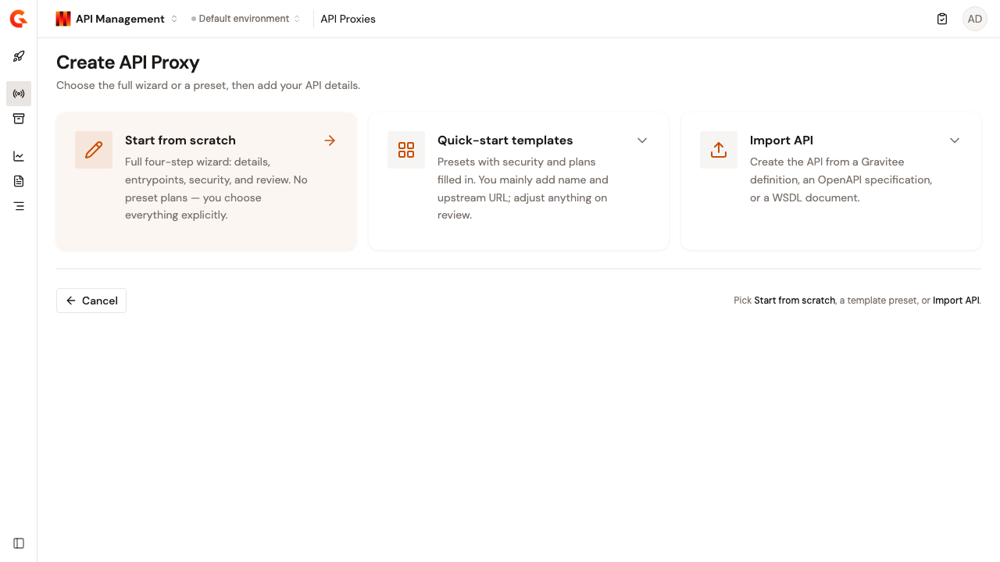<figcaption>
The <strong>Create API Proxy</strong> page offers three paths: <strong>Start from scratch</strong> for full control, <strong>Quick-start templates</strong> for common patterns, and <strong>Import API</strong> for an existing definition.
</figcaption></figure>

To open this page, go to **API Proxies** and click **Create New Proxy**. The Gamma console offers the following three paths:

* **Start from scratch**. This path opens the full four-step wizard for an HTTP Proxy or a TCP Proxy API, with no preset plans.
* **Quick-start templates**. This path opens a shorter wizard with security and plans preset from a template. Templates create HTTP Proxy APIs.
* **Import API**. This path creates the API from a Gravitee definition, an OpenAPI specification, or a WSDL document. See [Import an API proxy](import-an-api-proxy.md).

The rest of this page covers the two wizard flows:

#### From scratch

A four-step wizard that guides you through every configuration option:

1. **API Details**. This step collects the name, version, description, and API type.
2. **Configure Proxy**. For an HTTP Proxy API, this step collects the context path (or virtual hosts) and target URL. For a TCP Proxy API, it collects the gateway hosts and the backend host and port.
3. **Secure**. This step collects the security plan selection and configuration. A TCP Proxy API gets a Keyless plan.
4. **Review & Deploy**. This step shows the summary and the deployment option.

Use this mode when you need full control over every field, when no template matches your use case, or when you create a TCP Proxy API.

#### From template

A two-step wizard that preconfigures security and upstream settings for an HTTP Proxy API, based on a common pattern:

1. **Essentials**. This step combines identity, proxy configuration, and the plan name into one form.
2. **Review & Deploy**. This step shows the summary and the deployment option.

Templates preconfigure the security plan type, plan names, and authentication settings. You can override any preconfigured value before deploying.

Use this mode when your API matches a common pattern and you want to skip manual security configuration.

## Step 1: API details (scratch mode)

<figure>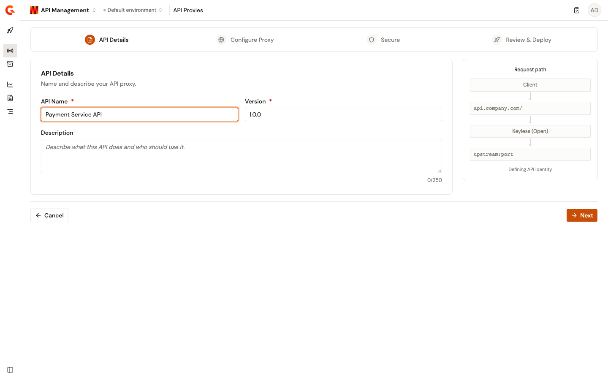<figcaption>
The API Details step collects the name, version, and optional description for your API proxy.
</figcaption></figure>

The following table describes the fields on the **API Details** step:

| Field           | Required | Description                                                                                                   |
| --------------- | -------- | ------------------------------------------------------------------------------------------------------------- |
| **API Name**    | Yes      | A human-readable name that identifies this API in the Gamma console and the Catalog.                          |
| **Version**     | Yes      | A free-text version label, for example `1.0` or `2.3.1`. Not enforced as semantic versioning.                 |
| **Description** | No       | Optional text describing the API's purpose, up to 250 characters. Displayed in the console and, if published, the Developer Portal. |

### Select API Type

Under **Select API Type**, choose how the proxy listens and forwards traffic:

* **HTTP Proxy**. Exposes an HTTP backend through context paths or virtual hosts. This card is selected by default and carries the **Default** badge.
* **TCP Proxy**. Exposes a TCP backend through host-based listeners. Only a Keyless plan is supported.

<figure>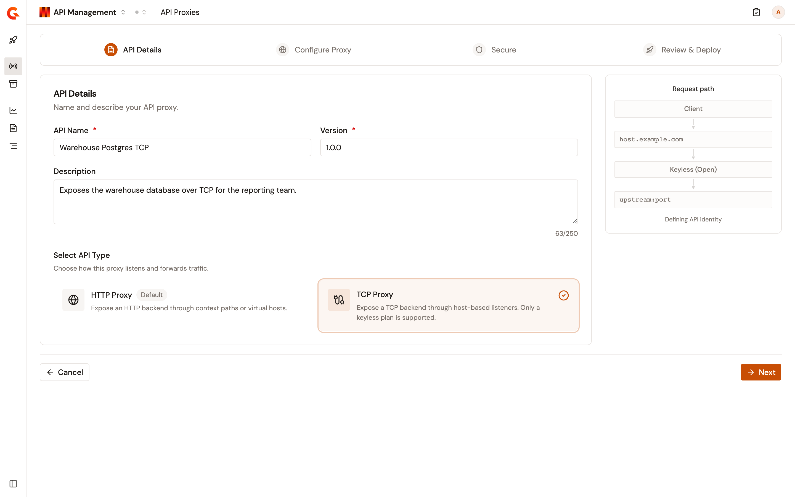<figcaption>
The <strong>TCP Proxy</strong> card selected under <strong>Select API Type</strong>.
</figcaption></figure>

A card reads **Not available** and can't be selected when your platform doesn't provide that proxy type. Switching between the two types clears the values of the other type's **Configure Proxy** fields, and choosing **TCP Proxy** sets the plan type to Keyless.

## Step 1: Essentials (template mode)

When you use a template, the first step combines identity, proxy configuration, and the plan name into a single form.

The following table describes the fields on the **Essentials** step:

| Field                          | Required | Description                                                                                                                                                                                                                                                     |
| ------------------------------ | -------- | --------------------------------------------------------------------------------------------------------------------------------------------------------------------------------------------------------------------------------------------------------------- |
| **API Name**                   | Yes      | Same as scratch mode.                                                                                                                                                                                                                                           |
| **Version**                    | Yes      | Same as scratch mode.                                                                                                                                                                                                                                           |
| **Description**                | No       | Same as scratch mode.                                                                                                                                                                                                                                           |
| **Context path**               | Yes      | The path segment appended to the Gateway URL that consumers use to reach this API. Must start with `/`, be more than 3 characters, and contain only letters, digits, hyphens, underscores, periods, and forward slashes. Double slashes (`//`) are not allowed. |
| **Target URL**                 | Yes      | The upstream backend URL the API Gateway forwards requests to.                                                                                                                                                                                                  |
| Plan name                      | Yes      | The name of the plan the template preconfigures. The field label follows the template's plan type, so the API Key template shows **API Key Plan Name**. Consumers see this name when they subscribe.                                                             |

The security plan type is fixed by the template. To change the plan type or its configuration, click **Customize** in the **SECURITY** section of the review step before deploying.

## Step 2: Configure the proxy (scratch mode, HTTP Proxy)

<figure>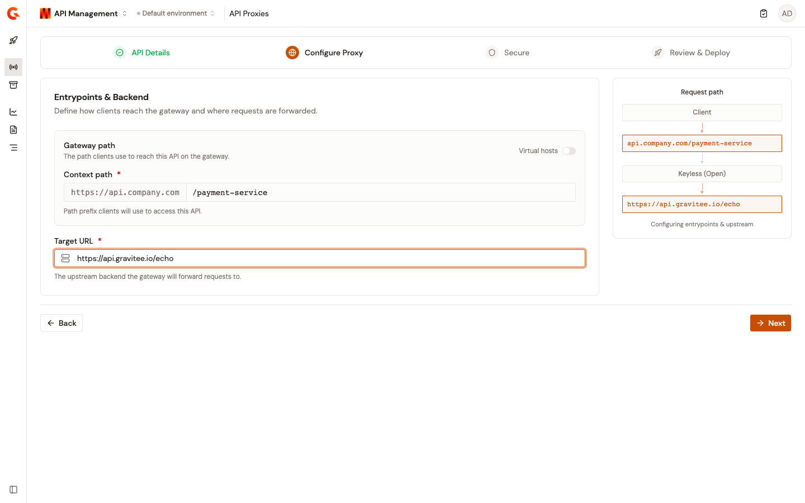<figcaption>
The Configure Proxy step defines the gateway path and upstream target URL.
</figcaption></figure>

The fields of the **Configure Proxy** step follow the API type you chose. This section covers an HTTP Proxy API. For a TCP Proxy API, see [Step 2: Configure the proxy (scratch mode, TCP Proxy)](#step-2-configure-the-proxy-scratch-mode-tcp-proxy).

### Context path

By default, consumers reach your API through a **Context path**, which is a path segment appended to the Gateway's base URL.

A context path must meet the following validation rules:

* It must start with `/`.
* It must be more than 3 characters.
* It can contain only the characters `a-z`, `A-Z`, `0-9`, `-`, `_`, `.`, and `/`.
* It must not contain double slashes (`//`).

For example, a context path of `/orders/v2` makes your API available at `https://<gateway-host>/orders/v2`.

### Virtual hosts

For advanced routing, enable the **Virtual hosts** toggle to route by both hostname and path.

The following table describes the fields on each virtual host row:

| Field    | Required | Description                                                                  |
| -------- | -------- | ---------------------------------------------------------------------------- |
| **Host** | Yes      | The hostname consumers use, for example `api.example.com`.                   |
| **Path** | No       | An optional path prefix under that hostname.                                 |

Click **Add virtual host** to configure multiple virtual host entries for a single API proxy.


The wizard configures only the host and path. To set a portal access URL override for a virtual host, open the proxy after creation and go to the **Entrypoints** page in the **Design** group, where each virtual host row also has an **Override access** field.


### Target URL

The **Target URL** is the upstream backend that the API Gateway forwards requests to, for example `https://backend.internal:8443/api`. This field is required for all HTTP Proxy APIs.

## Step 2: Configure the proxy (scratch mode, TCP Proxy)

<figure>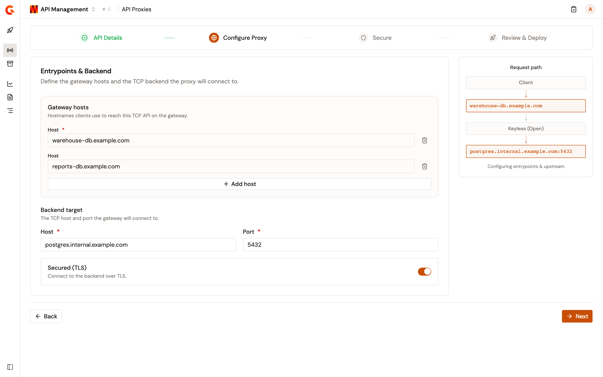<figcaption>
The Configure Proxy step of a TCP Proxy API collects the gateway hosts and the backend target.
</figcaption></figure>

When you selected **TCP Proxy**, the step collects the hostnames the gateway listens on and the backend it connects to.

### Gateway hosts

Each **Host** row under **Gateway hosts** is a hostname consumers use to reach this TCP API on the gateway. The first row is required. Click **Add host** to add a hostname, and the delete button at the end of a row to remove it. The last remaining row can't be removed.

A hostname must meet the following rules, and the step shows a message under the rows when one doesn't:

| Condition                                                                                                                                                      | Message                              |
| -------------------------------------------------------------------------------------------------------------------------------------------------------------- | ------------------------------------ |
| Every row is empty.                                                                                                                                            | **Host is required.**                |
| A hostname is longer than 255 characters.                                                                                                                      | **Max length is 255 characters**     |
| A hostname uses characters other than lowercase letters, digits, hyphens, and underscores, has a label longer than 63 characters, or has a label that starts or ends with a hyphen or an underscore. | **Host is not valid**                |
| The same hostname appears in two rows.                                                                                                                         | **Duplicated hosts not allowed**     |
| Another API of the environment already listens on the hostname.                                                                                                | **Hosts [**_host_**] already exists** |

The last check runs against the other APIs of the environment once the rows pass the other rules, and **Next** stays disabled while it runs.

### Backend target

The **Backend target** fields define the TCP host and port the gateway connects to:

| Field             | Required | Description                                                                                                                                   |
| ----------------- | -------- | --------------------------------------------------------------------------------------------------------------------------------------------- |
| **Host**          | Yes      | The backend hostname or IP address. The same hostname rules as the gateway hosts apply, with the same **Host is required.**, **Max length is 255 characters**, and **Host is not valid** messages. |
| **Port**          | Yes      | The backend port. An empty field reads **Port is required.**, and a value that isn't a number between 0 and 65535 reads **Port must be a number between 0 and 65535.** |
| **Secured (TLS)** | No       | Turn on the switch to connect to the backend over TLS. Off by default.                                                                        |

## Step 3: Security plan (scratch mode)

<figure>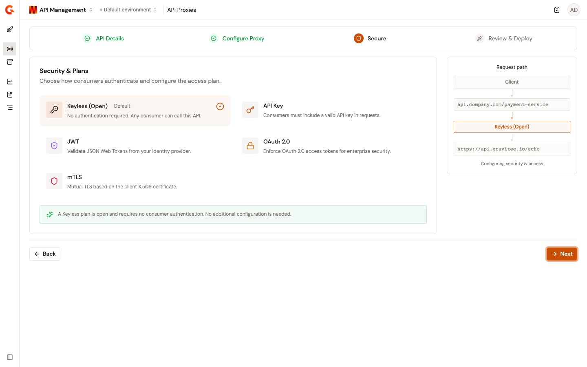<figcaption>
Choose a security plan type. Keyless (Open) is selected by default for open access.
</figcaption></figure>

A security plan defines how consumers authenticate when calling your API.

For a TCP Proxy API, the step reads **TCP proxies only support a Keyless plan. Consumers connect without HTTP authentication.** and offers no plan type to choose. The wizard creates one Keyless plan named **Default Keyless (UNSECURED)**.

<figure>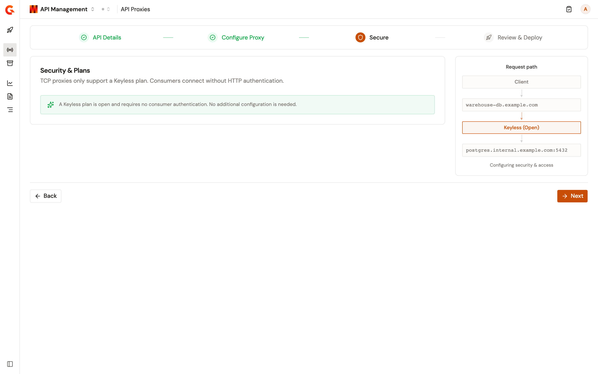<figcaption>
The Secure step of a TCP Proxy API.
</figcaption></figure>

For an HTTP Proxy API, the Gamma console supports five plan types:

#### Keyless (Open)

No authentication required. Any consumer can call the API without credentials. This is the default selection.

**Configuration:** None. Select **Keyless (Open)** and proceed.

**Use case:** Internal testing, health checks, public APIs with no consumer tracking.


Keyless plans provide no consumer identification. You can't track usage per consumer, revoke access, or enforce per-consumer rate limits. Don't use a Keyless plan for production APIs exposed externally.


#### API Key

Consumers authenticate by including an API key in the request header or query parameter.

The following table describes the fields for an API Key plan:

| Field                  | Required | Description                                                       |
| ---------------------- | -------- | ----------------------------------------------------------------- |
| **API Key Plan Name**  | Yes      | The name consumers see when they subscribe to the plan.           |

**Use case:** Consumer tracking, rate limiting per key, simple onboarding.

#### JWT

Consumers authenticate by presenting a signed JSON Web Token.

The following table describes the fields for a JWT plan:

| Field              | Required | Description                                                                                                                                                                                    |
| ------------------ | -------- | ---------------------------------------------------------------------------------------------------------------------------------------------------------------------------------------------- |
| **JWT Plan Name**  | Yes      | The name consumers see when they subscribe to the plan.                                                                                                                                        |
| **Signature**      | Yes      | The algorithm used to verify JWT signatures. Defaults to **RS256 (RSA + SHA-256)**.                                                                                                            |
| **JWKS Resolver**  | Yes      | How the Gateway resolves the public keys for signature verification. Choose **JWKS URL**, **Given key (PEM, single key)**, or **Gateway keys (configured globally)**.                           |
| Resolver value     | Yes      | The value the resolver needs. The field label follows your resolver choice, so it reads **JWKS URL**, **Public key**, or **Resolver parameter**. This field supports Expression Language.       |

**Use case:** Integration with external identity providers, fine-grained claims-based access control.

#### OAuth 2.0

Consumers authenticate by presenting an OAuth 2.0 access token.

The following table describes the fields for an OAuth 2.0 plan:

| Field                  | Required | Description                                                                                                                                       |
| ---------------------- | -------- | --------------------------------------------------------------------------------------------------------------------------------------------------- |
| **OAuth2 Plan Name**   | Yes      | The name consumers see when they subscribe to the plan.                                                                                           |
| **OAuth2 Provider**    | Yes      | The provider type, for example **Auth0**. The wizard creates a resource of this type on the API and uses it to validate OAuth 2.0 tokens.          |
| Provider settings      | Yes      | The connection details the selected provider requires, for example **Auth0 Domain** and **Audience**. An optional **User claim** field identifies the end user in analytics logs and defaults to `sub`. |

**Use case:** Enterprise SSO, delegated authorization, integration with identity platforms.

#### mTLS

Consumers authenticate by presenting a client TLS certificate during the TLS handshake.

The following table describes the fields for an mTLS plan:

| Field                | Required | Description                                              |
| -------------------- | -------- | -------------------------------------------------------- |
| **mTLS Plan Name**   | Yes      | The name consumers see when they subscribe to the plan.  |

**Use case:** Machine-to-machine communication, zero-trust network environments, internal service mesh.


The wizard creates one plan. After creation, add more plans to the same API proxy from the **Plans** page in the **Consumers** group, and set their order with the **Move up** and **Move down** arrows in the plans table. The API Gateway evaluates plans in that order and uses the first plan that matches the consumer's credentials. A TCP Proxy API accepts Keyless plans only.


## Step 4: Review and deploy

<figure>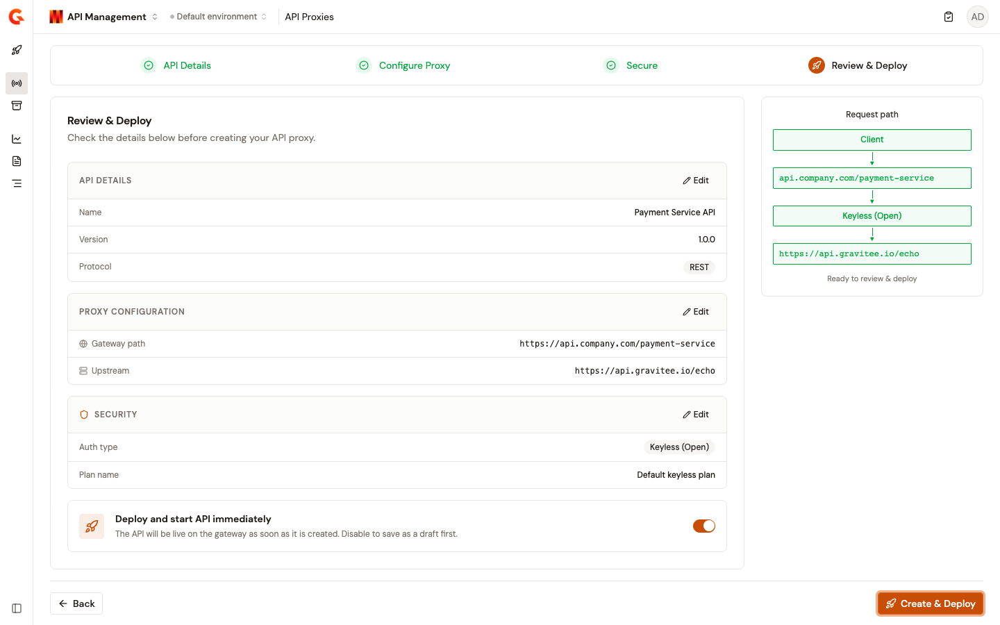<figcaption>
The Review &#x26; Deploy step shows the full configuration before creation. The <strong>Deploy and start API immediately</strong> toggle publishes the API as part of creation.
</figcaption></figure>

The final step summarizes your API proxy configuration in the following three sections, each with its own **Edit** action:

* **API DETAILS**. This section shows the name, version, the description when you entered one, and the **Type** badge, which reads **HTTP Proxy** or **TCP Proxy**.
* **PROXY CONFIGURATION**. For an HTTP Proxy API, this section shows the **Gateway path** and the **Upstream** URL. For a TCP Proxy API, it shows the first gateway host as the **Gateway host** and the backend host and port as the **Upstream**.
* **SECURITY**. This section shows the **Auth type** and the **Plan name**. For a TCP Proxy API, they read **Keyless (Open)** and **Default Keyless (UNSECURED)**.

<figure>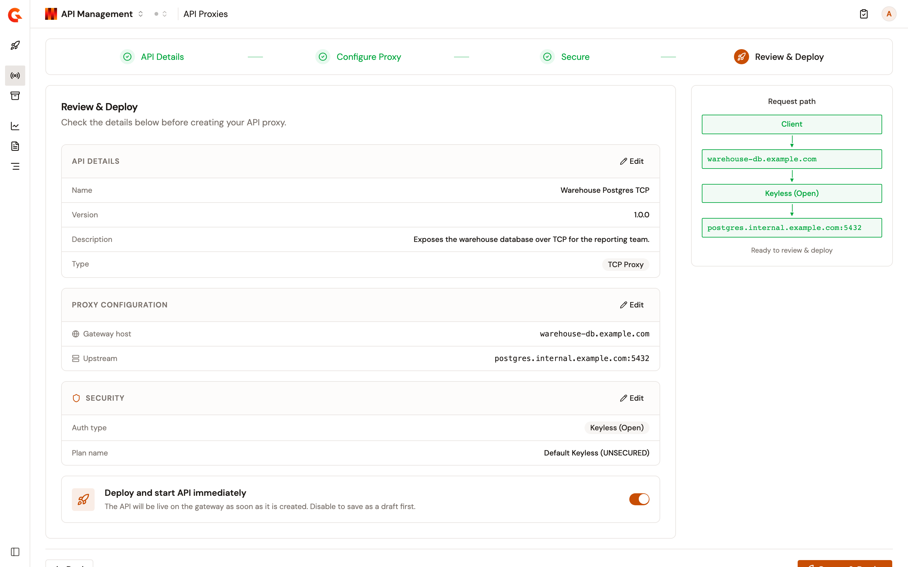<figcaption>
The Review &#x26; Deploy step of a TCP Proxy API.
</figcaption></figure>

### Deploy and start API immediately

The **Deploy and start API immediately** toggle publishes the API proxy to the API Gateway as part of creation. The console creates the API definition, attaches the security plan, and pushes the configuration to the Gateway in one step.

This toggle is enabled by default, and the create button reads **Create & Deploy**. If you disable it, the button reads **Create API** and the API proxy is created in a draft state. You can deploy it later from the API detail page.

While **Enable API Review** is on for the environment, the toggle reads **Ask for a review** instead, and it's on by default. The API proxy is then saved as a draft and sent for review, and the button reads **Create & ask for review**. Turn the toggle off to save the draft without asking, and the button reads **Create API**. Either way the API proxy can't be started until a reviewer accepts it. See [Review an API proxy](configure-your-api-proxy/review-an-api-proxy.md).

## Verification

To verify a TCP Proxy API was created as expected, follow these steps:

1. Go to **API Proxies**. The API is listed with **TCP Proxy** in the **API Type** column, and the **API Type** filter narrows the list to **TCP Proxy** APIs.
2. Select the API. The badge under its name in the sidebar reads **TCP Proxy**.
3. Click **Entrypoints** in the **Design** group. The **Exposed entrypoints** card lists each gateway host with the TCP port consumers connect to. See [Configure entrypoints](configure-your-api-proxy/configure-entrypoints.md#manage-tcp-hosts).

<figure>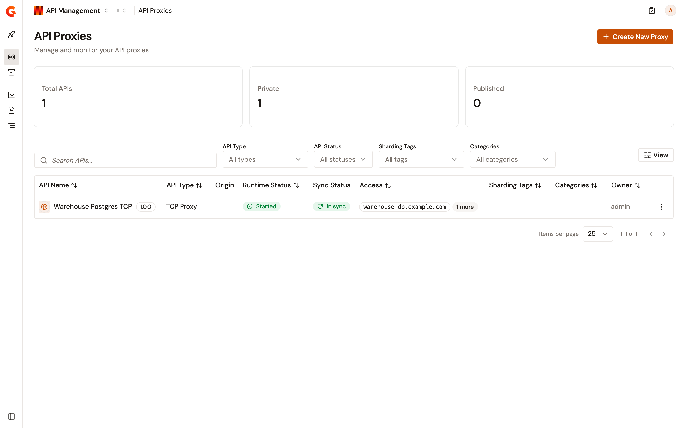<figcaption>
A TCP Proxy API in the <strong>API Proxies</strong> list.
</figcaption></figure>

## After creation

Once your API proxy is created, the console opens the **Overview** page for that proxy. To return to it later, go to **API Proxies**, select your API, and open **Overview** in the **General** group. This page summarizes setup progress, endpoint details, and traffic.

### What a TCP Proxy API offers

A TCP Proxy API forwards raw traffic, so the HTTP-only pages aren't offered. Its sidebar leaves out **Policy Studio**, **Failover**, **Response Templates**, and **CORS** in the **Design** group, and **Subscriptions** in the **Consumers** group. It also leaves out **Health Check Dashboard** in the **Monitoring** group, and the **Observability** group with its **Dashboard** and **Logs** links. Opening one of those pages by its URL reads that the page isn't available for TCP Proxy APIs. The **Plans** page offers Keyless plans only. See [Secure your API proxy](secure-your-api-proxy.md#plan-types).

### Overview page layout

<figure>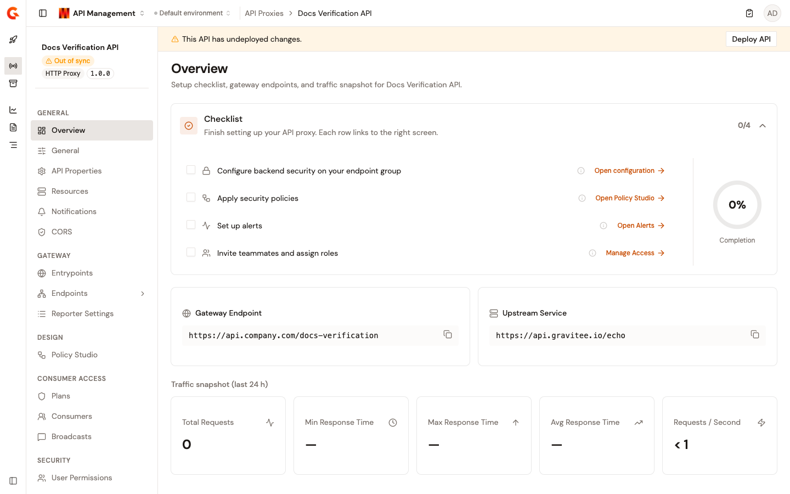<figcaption>
The Overview page shows setup progress, gateway and upstream endpoints, and a traffic snapshot.
</figcaption></figure>

The Overview page includes the following sections:

* **Checklist**. This is a guided list of recommended next steps. Each item links to the relevant configuration screen. You can mark items complete to track progress, and a completion percentage reflects how many checklist items you have finished.
* **Gateway Endpoint**. This is the URL consumers use to call your API through the Gateway, derived from your context path or virtual hosts. For a TCP Proxy API, it's the first gateway host with the TCP port.
* **Upstream Service**. This is the target URL the Gateway forwards requests to. For a TCP Proxy API, it's the backend host and port.
* **Traffic snapshot (last 24 h)**. These are recent metrics for the proxy. The snapshot shows **Total Requests**, **Min Response Time**, **Max Response Time**, **Avg Response Time**, and **Requests / Second**.

### Overview checklist

The checklist helps you finish configuring a new API proxy. Work through the items in any order. Each row includes a shortcut action in the console.

The following table describes the checklist items and where each one is configured:

| Checklist item                                        | What it covers                                                                                              | Where to configure                                                     |
| ----------------------------------------------------- | ----------------------------------------------------------------------------------------------------------- | ---------------------------------------------------------------------- |
| **Configure backend security on your endpoint group** | Set up SSL/TLS or authentication between the gateway and your upstream service.                              | The **Endpoints** page in the **Design** group. Click **Open configuration**. |
| **Apply security policies**                           | Use the Policy Studio to add rate limiting, transformations, or custom security policies to your API flows. Not shown on a TCP Proxy API. | The **Policy Studio** page in the **Design** group. Click **Open Policy Studio**. |
| **Set up alerts**                                     | Get notified when your API exceeds error thresholds or latency spikes.                                      | The **Alerts** page in the **Monitoring** group. Click **Open Alerts**. |
| **Invite teammates and assign roles**                 | Collaborate on the API and control who can view, edit, deploy, or own the proxy.                            | The **User Permissions** page in the **General** group. Click **Manage Access**. |


The checklist is optional tracking. Click **Collapse checklist** when you no longer need the guided list. Consumer access, which covers plans, applications, and subscriptions, has its own **Consumers** group in the API proxy sidebar. See [Establish consumer access](configure-your-api-proxy/establish-consumer-access.md).


### Related configuration

After reviewing the Overview checklist, continue with the following pages:

* [Configure backend security](configure-your-api-proxy/configure-backend-security.md). This page covers upstream TLS and backend credentials.
* [Establish consumer access](configure-your-api-proxy/establish-consumer-access.md). This page covers plans, applications, and subscriptions.
* [Apply security policies](configure-your-api-proxy/apply-security-policies.md). This page covers the Policy Studio and request/response policies.
* [Dashboard and metrics](../observe/api-dashboard.md). This page covers the homepage dashboard and per-module metrics.
* [View API logs](../observe/view-api-logs.md). This page covers individual request logs.
