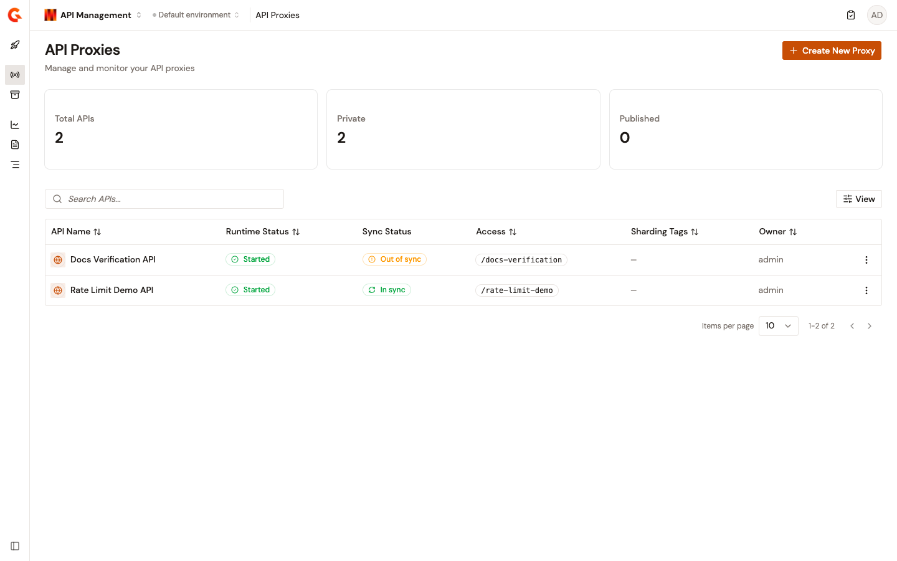

# API Management overview

API Management is Gravitee's product line for governing HTTP traffic. Gravitee doesn't host your services. It sits in front of the backends you already run, so consumers reach them through a governed endpoint instead of a hostname and a credential passed around by hand.

Within Gamma, API Management provides a dedicated console for creating API proxies, securing them with plans, applying policies to them, and observing the traffic they carry.

<figure><figcaption>
The API Proxies page. Each proxy reports whether it's running, whether the deployed configuration matches the saved one, and the path consumers call it on.
</figcaption></figure>

## Why API Management exists

A backend service can be published without a gateway. It's the second service, and the second consumer, that create the problems API Management solves:

* **Security is reimplemented per service.** Each team writes its own key check, its own token validation, and its own rate limiter, so the same control exists in as many versions as there are services and drifts between the copies.
* **Access is granted out of band.** A team that needs an API receives a URL and a credential over chat. Nothing approves the request, nothing revokes it, and nothing records who holds what.
* **The backend's shape reaches the consumer.** Hostnames, ports, and protocols leak into client configuration, so moving or splitting a service breaks every caller.
* **Traffic is invisible until it fails.** Without a common enforcement point, there's no one place that answers which consumer called what, how often, and with what errors.

## What API Management does

API Management sits between the consumers that call your APIs and the backend services that fulfill those requests. The **API Gateway** enforces runtime policy on every request, including authentication, rate limiting, transformation, and routing. The **Gamma console** provides the control plane where you design, secure, publish, and observe your APIs.

API Management provides the following key capabilities:

* **API proxy creation.** Define a proxy with a context path or virtual hosts, an upstream target, and a security plan. Build it from scratch, start from a preset, or import an existing definition. See [Create an API proxy](../build/create-an-api-proxy.md).
* **Security plans.** Attach one or more plans to decide who can call the API and how they authenticate. A plan carries its own rate limits and quotas, so tiers are expressed as plans rather than as separate APIs. See [Secure your API proxy](../build/secure-your-api-proxy.md).
* **Policy enforcement.** Apply policies to the request and response phases of a flow, scoped by path, method, or condition, and reuse a chain across many APIs instead of rebuilding it. See [Apply security policies](../build/configure-your-api-proxy/apply-security-policies.md) and [Reuse policies with shared policy groups](../build/shared-policy-groups.md).
* **Consumer access.** Manage the subscriptions that tie an application to a plan, so access is approved, paused, and revoked per consumer rather than per credential. See [Establish consumer access](../build/configure-your-api-proxy/establish-consumer-access.md).
* **Observability.** Track request volume, latency, and error rates for a deployed proxy, inspect individual transactions, and read the audit trail of who changed what. See [Dashboard and metrics](../observe/api-dashboard.md).

## The building blocks

Five objects carry the whole model, and each one builds on the one before it:

| Building block | What it is | Start here |
| --- | --- | --- |
| **API proxy** | The client-facing endpoint Gravitee manages. It carries the entrypoints consumers connect to, the endpoints that reach your backend, and the policy flows applied to every request. | [Create an API proxy](../build/create-an-api-proxy.md) |
| **Plan** | The access tier on a proxy. A plan decides how a consumer authenticates, whether a subscription is approved automatically or by hand, and what rate limits and quotas apply. One proxy can carry several. | [Secure your API proxy](../build/secure-your-api-proxy.md) |
| **Subscription** | The link between one application and one plan. It's what issues the credential, and what you pause or close to withdraw access without touching the proxy. | [Establish consumer access](../build/configure-your-api-proxy/establish-consumer-access.md) |
| **Application** | The consumer identity that holds subscriptions. Applications are environment-scoped and shared across every API in that environment. | [Manage applications](../../platform-management/manage-applications.md) |
| **API Product** | A bundle of several proxies published together, with its own plans and its own subscriptions, so a consumer subscribes once rather than per API. | [Create API Products](../build/api-products.md) |

Gravitee doesn't run your backends, so every one of these objects depends on a service that's already reachable from the Gamma platform.

## Where each task lives in the console

The API Management sidebar groups its pages by what you do with them:

| Sidebar group | Page | What it covers |
| --- | --- | --- |
| **General** | **Quick Start** | Counts of API proxies and API Products, quick-action cards for the common tasks, and a guided tour of the module. |
| **Manage** | **API Proxies** | Every proxy in this environment, with its runtime status, whether the deployed configuration matches the saved one, and the path it answers on. |
| **Manage** | **API Products** | The bundles composed from those proxies, and their deployment state. |
| **Observability** | **Dashboards** | Request volume, latency, and error rates across the environment's proxies. |
| **Observability** | **Logs** | What a single transaction carried and how it was handled. |
| **Observability** | **Tracing** | How one request moved through the gateway, as a span timeline. |

API Products is a licensed feature, and the page appears only when your license includes it.

## How an API proxy is created

The **Create API Proxy** page offers three routes to the same object, and they differ only in how much the wizard fills in for you:

| Route | What it gives you |
| --- | --- |
| **Start from scratch** | The full four-step wizard: details, entrypoints, security, and review. Nothing is preset, so you choose the plan type and its configuration explicitly. |
| **Quick-start templates** | A preset with the security and plan already filled in. You supply a name and an upstream URL, and adjust anything else on the review step. |
| **Import** | An existing definition, read from a file or fetched from a URL. |

The quick-start templates cover the four common REST patterns: **REST API with API Key**, **REST API with JWT**, **REST API with OAuth 2.0**, and **REST API with Keyless plan**.

Import accepts three formats:

| Format | What it's for |
| --- | --- |
| **Gravitee definition** | A proxy exported from another Gravitee environment, recreated as-is. |
| **OpenAPI specification** | A spec that becomes a proxy, optionally with its documentation attached and an OpenAPI validation policy added to the flow. |
| **WSDL** | A SOAP service description, optionally with a REST-to-SOAP policy added so consumers call it as REST. |

Whichever route you take, entrypoints are configured as either a context path on the shared gateway hostname or a set of virtual hosts, each with its own host and path. See [Configure entrypoints](../build/configure-your-api-proxy/configure-entrypoints.md).

## Security plans for an API proxy

A plan decides how a client authenticates and how its subscription is approved. The following plan types are available:

| Plan type | How the consumer authenticates |
| --- | --- |
| **Keyless** | No credential. Open access to the API, and no subscription is required. |
| **API Key** | A key issued to the application when its subscription is accepted. |
| **JWT** | A signed token the client presents, validated against a JWKS endpoint. |
| **OAuth2** | A token issued by an authorization server, checked by introspection. |
| **mTLS** | A client certificate presented at the TLS handshake. |

An API Product carries plans of its own, and its range is narrower: **API Key**, **JWT**, and **mTLS**. A Keyless or OAuth2 plan can be created on a proxy but not on a product.

Each plan also sets its own rate limits and quotas, which is what makes tiered access a matter of publishing a second plan rather than a second API. Subscription validation is either automatic or manual, and a Keyless plan is always automatic because there's nothing to approve.

## Plan and subscription lifecycle

A plan moves through four statuses, and only a published plan is open to new subscribers:

| Plan status | What it means |
| --- | --- |
| **Staging** | Saved but not offered. Use it to stage and review a plan before consumers can see it. |
| **Published** | Open to new subscriptions and enforced on traffic. |
| **Deprecated** | Closed to new subscriptions. Existing subscriptions keep working. |
| **Closed** | Withdrawn. The subscriptions on it are closed with it. |

A subscription has its own status, so access can be withdrawn from one consumer without touching the plan everyone else is on:

| Subscription status | What it means |
| --- | --- |
| **Pending** | Requested, and waiting on manual validation. |
| **Accepted** | Approved and active. The credential, where the plan issues one, is available to the application. |
| **Rejected** | Declined at validation. No credential is issued. |
| **Paused** | Temporarily suspended. The gateway rejects the consumer's calls, and the subscription can be resumed. |
| **Resumed** | Returned to service after a pause. |
| **Closed** | Ended. The credential stops working and isn't reinstated. |

## Use cases for API Management

Each of the following tables pairs an outcome with the feature that delivers it.

### Publish a backend you already run

| Outcome | Feature |
| --- | --- |
| An existing HTTP service is reachable through a governed endpoint that authenticates callers and applies policy, rather than through a hostname handed out by hand. | [Create an API proxy](../build/create-an-api-proxy.md) |
| An OpenAPI specification becomes a working proxy, with request validation enforced against the same spec. | [Create an API proxy](../build/create-an-api-proxy.md) |
| A SOAP service is consumed as REST, without a change to the service itself. | [Create an API proxy](../build/create-an-api-proxy.md) |
| One proxy fronts several backend instances, with load balancing across them and failover when one stops answering. | [Configure failover](../build/configure-your-api-proxy/configure-failover.md) |

### Secure and publish consumer access

| Outcome | Feature |
| --- | --- |
| Consumers authenticate against an API with a Keyless, API Key, JWT, OAuth2, or mTLS plan. | [Secure your API proxy](../build/secure-your-api-proxy.md) |
| A subscription ties one application to one plan, so access is approved, paused, and revoked per consumer. | [Establish consumer access](../build/configure-your-api-proxy/establish-consumer-access.md) |
| Free and paid tiers of the same API differ only by the plan a consumer is on, rather than by which API they call. | [Secure your API proxy](../build/secure-your-api-proxy.md) |
| Several APIs are published together as one product, with a shared plan and a single subscription. | [Create API Products](../build/api-products.md) |
| A change that affects consumers reaches them in the console rather than over chat. | [Broadcast messages to consumers](../build/configure-your-api-proxy/broadcast-messages-to-consumers.md) |

### Apply policy without touching the backend

| Outcome | Feature |
| --- | --- |
| A policy chain runs on the request and response phases of a flow, scoped to a path, a method, or a condition. | [Apply security policies](../build/configure-your-api-proxy/apply-security-policies.md) |
| A chain written once is reused across the flows of many APIs, and updated in one place. | [Reuse policies with shared policy groups](../build/shared-policy-groups.md) |
| Which flow wins when several match a request is decided by an explicit rule rather than by ordering. | [Control how policy flows are matched to requests](../build/configure-your-api-proxy/configure-flow-execution.md) |
| A policy reads configuration values that change per environment, without the policy itself changing. | [Configure API properties](../build/configure-your-api-proxy/configure-api-properties.md) |
| Browser clients on another origin can call the API, under rules you set rather than the backend's. | [Configure CORS](../build/configure-your-api-proxy/configure-cors.md) |

### Move an estate onto Gravitee

| Outcome | Feature |
| --- | --- |
| An API estate running on another gateway moves to Gravitee without a rewrite of every proxy. | [Plan a gateway migration](../migrate/plan-a-gateway-migration.md) |
| The constructs of the source gateway are mapped to their Gravitee equivalents before any of them are rebuilt. | [Source gateway reference](../migrate/source-gateway-reference.md) |
| A migration runs in stages, with both gateways serving traffic until the last route has moved. | [Migrate an API estate to Gravitee](../migrate/migrate-an-api-estate-to-gravitee.md) |

### See what the traffic is doing

| Outcome | Feature |
| --- | --- |
| Request volume, latency, and error rates for a deployed proxy are visible without instrumenting the backend. | [Dashboard and metrics](../observe/api-dashboard.md) |
| Which applications call an API, how often, and with what errors is answered per consumer. | [Monitor API usage](../observe/monitor-api-usage.md) |
| Whether the backends behind an API are answering is checked continuously rather than discovered from a support ticket. | [Monitor endpoint health](../observe/monitor-endpoint-health.md) |
| A single transaction is inspected, including what it carried and how the gateway handled it. | [View API logs](../observe/view-api-logs.md) |
| Who changed which API configuration, and when, is on the record. | [Review audit logs](../observe/review-audit-logs.md) |

## How API Management fits into Gamma

Gamma unifies its product lines under one platform: API Management, Event Stream Management, Agent Management, and Authorization Management. They share the following foundations:

* **A common Catalog.** This catalog holds APIs, events, tools, agents, MCP servers, and models.
* **A common authorization engine.** [Authorization Management](../../authorization-management/get-started/authorization-management-overview.md) defines fine-grained policies against those cataloged assets, and an API proxy enforces them alongside its own plans and policy chains.
* **Common enforcement points.** The AI Gateway, API Gateway, and Event Gateway evaluate the same policies at the wire level.

API Management contributes REST, GraphQL, gRPC, and WebSocket APIs to the Catalog. Because the Catalog is shared, those APIs can be exposed as **API Tools** in [Agent Management](../../agent-management/get-started/ai-management-overview.md), which makes an accumulated enterprise API estate reachable from the agent layer without redevelopment. [Event Stream Management](../../event-stream-management/get-started/event-stream-management-overview.md) contributes Kafka streams to the same Catalog through the same route.

For the platform as a whole, and for the modules API Management sits beside, see the [Gamma overview](../../platform-management/overview.md).

## Next steps

If you're new to API Management, work through the following in order:

1. [**Create your first API**](create-your-first-api.md). Publish a proxy in front of a backend and enforce a security plan, in under five minutes.
2. [**Secure your API proxy**](../build/secure-your-api-proxy.md). Add the plans that decide who reaches it and how they authenticate.
3. [**Establish consumer access**](../build/configure-your-api-proxy/establish-consumer-access.md). Subscribe an application and issue it a credential.

For the full reference on creation options, including the scratch and template wizards and every import format, see [Create an API proxy](../build/create-an-api-proxy.md).

To install or configure the platform underneath, see the [installation guides](../../platform-management/install/README.md).
