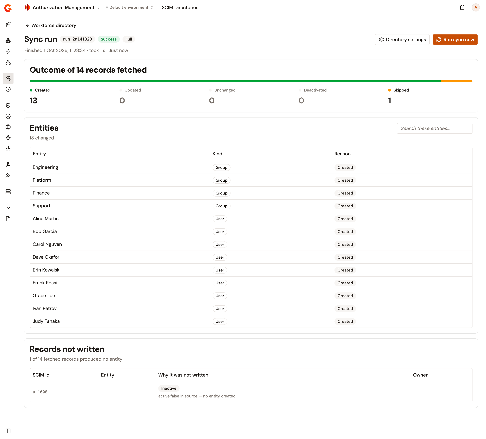
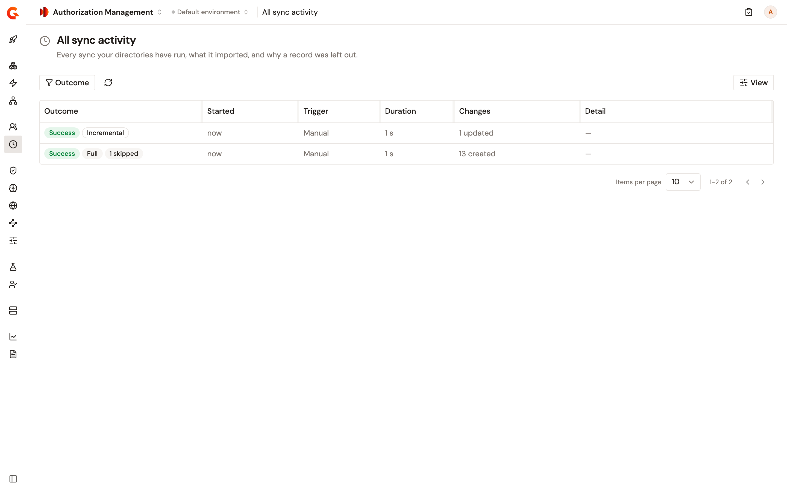

# Review SCIM sync runs

Every sync of a SCIM directory, started by hand or by its schedule, leaves a report. **All sync activity** lists the syncs of every directory in the environment, newest first. The **Sync History** section of a directory lists its own syncs. By default, each directory keeps the reports of its last 50 syncs, and deleting a directory deletes its reports.

## Open a sync report

To open the report of a sync, complete the following steps:

1. In the Authorization Management sidebar, select **All sync activity** in the **Directories** group.
2. Optional: Narrow the list with the **Outcome** filter. When there's more than one directory, the **Directory** filter narrows it too.
3. Click the outcome of a sync.

A sync that succeeds but reports warnings reads **Completed with warnings**, and its report lists each warning. For example, the sync waited out a rate limit, or keyed some users on their SCIM `id` because they hold no value for the identifier attribute.

<figure><figcaption>
The report of a directory's first sync.
</figcaption></figure>

## Read a sync report

A report counts what the sync did with the records it fetched. A sync rewrites only the principals whose data changed, and counts the principals it leaves as they were as **Unchanged**. Below the counts, the report holds two lists:

* **Entities** lists the principals the sync handled, each with a reason: **Created**, **Updated**, **Parents reconciled**, **Deactivated**, or **Unchanged**. **Parents reconciled** marks a user that the sync didn't read, whose group memberships it updated from the groups. When the list is full, changes take the place of unchanged principals.
* **Records not written** lists the records counted as **Skipped**, each with the reason. Most of them produced no principal.

Each list shows up to 100 records. The line under **Entities** says how many changes it doesn't list, and the line under **Records not written** says how many records it doesn't list.

## Fix the records not written

The following table describes each reason a record appears under **Records not written**, and what to do about it:

| Reason | What happened | What to do |
| --- | --- | --- |
| **Owned by another source** | An entity with the same ID already exists from another source, which the **Owner** column names. | Delete that entity for the directory's next sync to import the record. |
| **Inactive** | The directory marks the user `active: false`, and the directory has no principal for the user yet, so none is created. | Activate the user in the directory if the user needs a principal. |
| **Invalid id** | The record's entity ID isn't valid. A user's entity ID is the value of its identifier attribute, or its SCIM `id` when it has no value for it, and a group's entity ID is its SCIM `id`. A valid entity ID holds at most 255 characters, isn't `.` or `..`, and holds no whitespace, control character, double quote, backslash, `/`, `%`, `;`, `?`, or `#`. | Choose an identifier attribute whose values meet these rules. A group, or a user with no value for the identifier attribute, keeps the SCIM `id` the directory gives it. |
| **Duplicate id** | Another record of the same sync resolved to the same entity ID. | Choose an identifier attribute whose values are unique across the directory. |
| **Circular group nesting** | Nested groups form a loop. These groups are imported without their parent groups. | Break the loop in the directory. |

## Read a sync that didn't complete

A sync that doesn't complete ends in one of the following outcomes:

* **Failed**: the sync hit an error.
* **Timed out**: by default, a sync stops when it's still running an hour after it started.
* **Canceled**: someone canceled the sync.

The report says why the sync stopped. **The run failed before it wrote anything** means no principal changed, and **The run stopped part way** means the sync wrote some changes before it stopped.

## Cancel a running sync

To cancel a sync, complete the following steps:

1. Open the report of the running sync.
2. Click **Cancel**.

The sync stops at its next page, and everything it has already imported stays.

## Verification

To verify that sync reports are recorded, follow these steps:

1. In **SCIM Directories**, click the name of a directory.
2. Click **Sync now**.
3. In the Authorization Management sidebar, select **All sync activity** in the **Directories** group.

    The sync is listed first, with its outcome, the trigger **Manual**, and the changes it made.

    <figure><figcaption>
All sync activity after a directory's first two syncs.
</figcaption></figure>

## Next steps

* [Sync principals from a SCIM directory](sync-principals-from-a-scim-directory.md). Add a directory, set its schedule, and decide what a sync deactivates.
