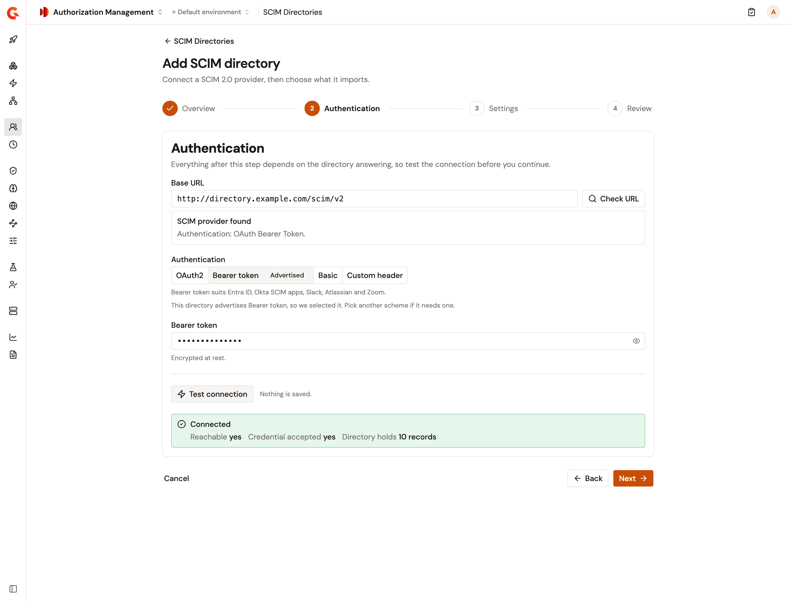
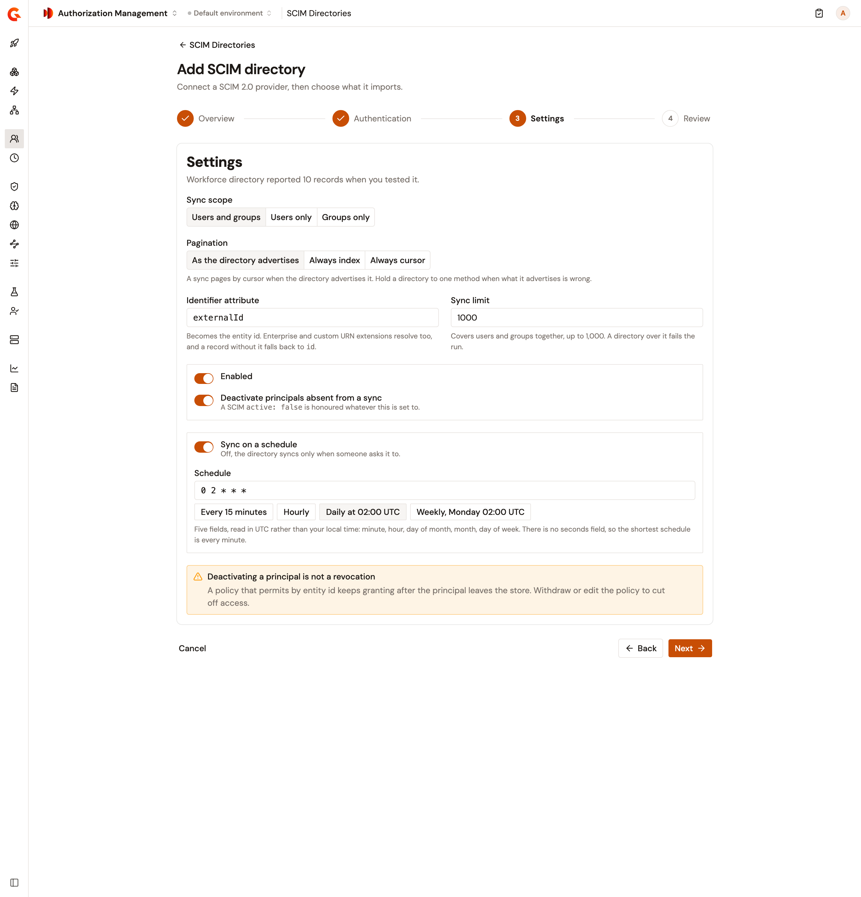
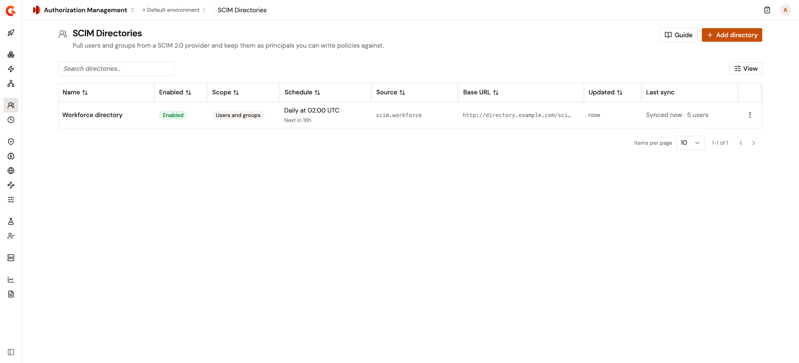
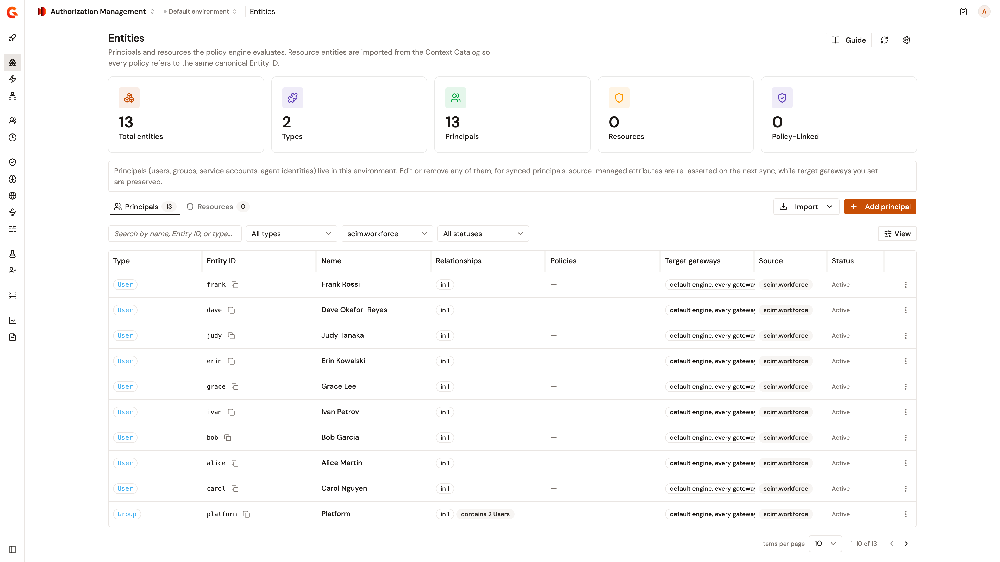

# Sync principals from a SCIM directory

A SCIM directory imports the users and groups of an identity provider that serves a SCIM 2.0 API, and keeps them as principals for your policies. Gravitee reads the directory from the base URL you give it, and nothing is imported until a sync runs. A sync runs when you start it, or on the schedule you set for the directory.

## Prerequisites

Before you add a directory, make sure of the following:

* You have the base URL of the identity provider's SCIM 2.0 API, and a credential that reads its users and groups.
* Gravitee reaches the directory over the network. By default, Gravitee refuses a directory or an OAuth2 token endpoint at a local or private network address, and says so when you check the URL or test the connection.

## Add a directory

To add a directory, complete the following steps:

1. In the Authorization Management sidebar, select **SCIM Directories** in the **Directories** group.
2. Click **Add directory**.
3. In **Display name**, enter a name for the directory.
4. Optional: In **Slug**, change the slug suggested from the name. Principals import with the source `scim.<slug>`, and the slug locks when you create the directory.
5. Click **Next**.
6. In **Base URL**, enter the base URL of the directory's SCIM API, starting with `http://` or `https://` and without a query string.
7. Click **Check URL**.

    Gravitee reads the configuration the directory publishes, without a credential. When the directory advertises one authentication scheme that Gravitee supports, that scheme is selected and marked **Advertised**.
8. Under **Authentication**, select the scheme the directory accepts, and then complete its fields:

    | Scheme | Fields |
    | --- | --- |
    | **OAuth2** | **Token endpoint**, **Client ID**, and **Client secret**, plus an optional **Scope**. Gravitee requests its own access token from the token endpoint with the client credentials grant, and sends the client ID and secret with HTTP Basic authentication. By default, Gravitee sends the client secret only to a token endpoint that uses `https://`. |
    | **Bearer token** | **Bearer token**. |
    | **Basic** | **Username** and **Password**. |
    | **Custom header** | **Header name** and **Value**, plus an optional **Value prefix** that precedes the value, separated by a space. |

    Gravitee stores the secret encrypted, and never shows it again.
9. Click **Test connection**.

    **Next** stays unavailable until the directory answers and accepts the credential. The test saves nothing.

    <figure><figcaption>
The Authentication step after Check URL and Test connection.
</figcaption></figure>
10. Click **Next**.
11. Review the settings described in the following table, and change the ones your directory needs:

    | Setting | Description | Default |
    | --- | --- | --- |
    | **Sync scope** | What each sync reads: **Users and groups**, **Users only**, or **Groups only**. | **Users and groups** |
    | **Pagination** | How a sync pages through the directory. **As the directory advertises** pages by cursor when the directory advertises cursor paging, and by index otherwise. **Always index** and **Always cursor** hold the directory to one method. | **As the directory advertises** |
    | **Identifier attribute** | The SCIM attribute whose value becomes each user's entity ID. A user with no value for it is keyed on its SCIM `id` instead. For an attribute of an enterprise or custom extension, write the extension's schema URN first, for example `urn:ietf:params:scim:schemas:extension:enterprise:2.0:User:employeeNumber`. | `externalId` |
    | **Sync limit** | The most users and groups, counted together, that a sync accepts. A directory larger than the limit fails the sync before anything is written. The limit stays within the maximum your installation allows, which is 1,000 by default. | The installation's maximum |
    | **Enabled** | A disabled directory doesn't sync, by hand or on its schedule. | On |
    | **Deactivate principals absent from a sync** | Deactivates the principals the directory no longer returns. For details, see [What a sync deactivates](#what-a-sync-deactivates). | On |
    | **Sync on a schedule** | Runs a sync on the **Schedule**, a cron expression of five fields read in UTC: minute, hour, day of month, month, and day of week. The shortest schedule is every minute. | Off |

    <figure><figcaption>
The Settings step with a daily schedule.
</figcaption></figure>
12. Click **Next**.
13. Click **Create directory**.

    The directory opens on its **Overview** section. Nothing is imported until the first sync runs.

## What a sync imports

A sync imports the users and the groups its **Sync scope** covers as principals, of type `User` or `Group`, with the source `scim.<slug>`:

* A user's entity ID is the value of its **Identifier attribute**, or its SCIM `id` when the user has no value for it. A group's entity ID is its SCIM `id`.
* When the sync scope includes groups, each principal gets the groups that list it as a member as its parents. Each such sync rewrites these memberships, so a membership the directory drops disappears at the next sync. A **Users only** sync reads no groups, so the users it writes carry no group memberships.
* A sync rewrites only the principals whose data changed.

A user principal carries the following attributes. An attribute whose value the directory doesn't send is left out:

| Attribute | Value |
| --- | --- |
| `scimId` | The user's SCIM `id` |
| `enabled` | Always `true`. Deactivating the principal doesn't change it. |
| `username` | `userName` |
| `displayName` | The formatted name, or `displayName` when the user has no formatted name |
| `email` | The primary email address, or the first one listed |
| `externalId` | `externalId` |

Other SCIM attributes, including those of enterprise and custom extensions, aren't imported. An extension attribute is read only when it's the **Identifier attribute**. A group principal carries its display name, or its SCIM `id` when it has none, as `name` and `displayName`. It also carries its SCIM `id` as `scimId`, and its `externalId`.

A sync never takes over an entity from another source. An entity that already exists with the same ID stays as it is, such as a principal created locally, synced from Access Management, or imported by another directory. The sync reports the record as **Owned by another source**. To import the record from this directory, delete that entity before the directory's next sync.

## Sync a directory

A directory with a schedule syncs on it. To start a sync yourself, complete the following steps:

1. In **SCIM Directories**, click the name of the directory.

    <figure><figcaption>
The SCIM Directories list.
</figcaption></figure>
2. Click **Sync now**.

    The sync runs in the background. To read its report, see [Review SCIM sync runs](review-scim-sync-runs.md).

When the latest sync of a directory failed or timed out, its schedule reads **Retrying after a failure**, and the directory is held off its schedule. By default, the wait is 5 minutes after the first failure and doubles after each failure in a row, up to an hour. A sync that succeeds or is canceled clears the wait.

### Full and incremental syncs

An **Incremental** sync asks the directory only for the users changed after the date in the **Synced up to** row of the directory's **Overview** section. It also reads every group in its **Sync scope**. A sync reads the whole directory, and is **Full**, in the following cases:

* The **Synced up to** row reads **Never**, as it does before a first successful sync and after a change to the **Base URL**, the **Identifier attribute**, or the **Sync scope**.
* You click **Full resync** on the directory.
* The last full sync is more than a day old, by default. The **Last full sync** row of the **Overview** section shows its date.
* The directory syncs **Groups only**.
* The **Synced up to** row reads **Not used: this directory never updates last modified dates**.

An incremental sync doesn't tell a user who left the directory from a user who didn't change, so absent users are deactivated only by a full sync. When the directory refuses the first request to filter users by when they changed, the sync reads every user, and says so in a warning.

### What a sync deactivates

A sync deactivates principals in the following cases:

* The directory marks a user inactive with `active: false`. The principal is deactivated whatever **Deactivate principals absent from a sync** is set to. An inactive user who has no principal yet isn't imported.
* The directory no longer returns a principal, and **Deactivate principals absent from a sync** is on. A sync deactivates only the kinds of principal its **Sync scope** reads, so a **Users only** sync never deactivates groups.

Deactivation runs after a sync has read the whole directory, so a sync that fails while reading deactivates nobody. A deactivated principal stays on the **Entities** page with the **Inactive** status, and Gravitee withdraws it from your PDP gateways. When the directory returns the user as active again, the next sync that reads the user reactivates its principal.


Deactivating a principal isn't a revocation. A policy that permits a principal by its entity ID keeps granting after the principal is deactivated. Withdraw or edit the policy to cut off access.


## Edit a directory

To change a directory, complete the following steps:

1. In **SCIM Directories**, click the name of the directory.
2. In the directory's sidebar, select **Overview**, **Authentication**, or **Settings**.
3. Click **Edit**.
4. Change the values, and then click **Save changes**.

The slug stays locked. The saved secret is never shown: leave it to keep it, or click **Replace** to enter a new one. Changing the **Base URL** or the **Token endpoint** requires a new secret and a passing **Test connection** before **Save changes** is available. Changing the authentication scheme requires a new secret.

Changing the **Identifier attribute** gives the directory's users new entity IDs. The next sync, a full one, creates their principals under the new IDs, and deactivates the old principals only when **Deactivate principals absent from a sync** is on. Policies that name the old IDs keep naming them. Narrowing the **Sync scope** leaves the principals of the kind the directory no longer reads as they are.

## Delete a directory

To delete a directory, complete the following steps:

1. In **SCIM Directories**, click the name of the directory.
2. Click **Delete**.
3. In the **Delete SCIM directory?** dialog, click **Delete**.

Deleting a directory removes it, its stored secret, and its sync history. The principals it imported stay, marked inactive, and deleting the directory doesn't revoke anyone's access. A directory isn't deleted while one of its syncs is running. Its slug stays taken while its principals exist, so a new directory takes the slug only after you delete them.

## Verification

To verify the directory imports its principals as expected, follow these steps:

1. In **SCIM Directories**, click the name of the directory.
2. Click **Sync now**.
3. In the sync's report, check that the outcome reads **Success**, and that **Records not written** lists no record you expected to import.
4. In the Authorization Management sidebar, select **Entities** in the **Policy Structure** group.
5. On the **Principals** tab, open the **All sources** list, and select the directory's source, `scim.<slug>`.

    The directory's users and groups are listed with that source and the **Active** status.

    <figure><figcaption>
Principals imported by a directory with the slug workforce.
</figcaption></figure>

## Next steps

* [Review SCIM sync runs](review-scim-sync-runs.md). Check what each sync imported and changed, and why a record was left out.
* [Create, update, and delete policies](../configure/create-update-delete-policies.md). Write policies for the principals a directory imports.
