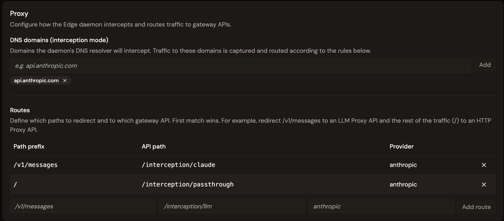
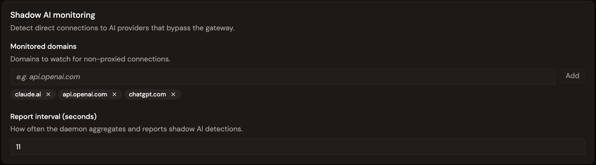

# Configure Edge Management

## Overview

Edge Management is configured from a single **Configuration** page in the Gamma console. The page is split into the following sections: Gateway, Proxy, Shadow AI monitoring, and a Daemon Deployment section used to deploy the daemon to devices. For more information about using Kandji to deploy the Edge Daemon, see [Configure Kandji to deploy the Edge Daemon](configure-kandji-daemon.md).

The first time you open the page, there is no configuration. Configure the fields, and then save to create the configuration. When you save the configuration, the corresponding Edge API is published on the Gateway so the daemon's traffic can be captured.

To manage the configuration, you need the **Edge Manager** environment role, which grants `EDGE_CONFIGURATION` with the `CREATE`, `READ`, `UPDATE`, and `DELETE` access levels. The role also grants `ENVIRONMENT_API` with the `CREATE` and `READ` access levels, so an Edge manager can create the default gateway API that backs an unmapped interception route.

## Configure Edge Management

To configure Edge Management, complete the following steps:

1. [Configure the Gateway](configure-edge-management.md#configure-the-gateway)
2. [Configure the Proxy](configure-edge-management.md#configure-the-proxy)
3. [Configure Shadow AI monitoring](configure-edge-management.md#configure-shadow-ai-monitoring)
4. [Save the configuration](configure-edge-management.md#save-the-configuration)

### Configure the Gateway

The Edge Daemon uses connection URLs to communicate with the Gravitee API Gateway and the Edge Reactor. To configure the Edge Daemon for the Gateway, complete the following fields:

<figure><figcaption>
The Gateway and Reactor URLs are locked once the configuration is created.
</figcaption></figure>

The following table describes each field:

| Field           | Description                                                                                   |
| --------------- | --------------------------------------------------------------------------------------------- |
| **Gateway URL** | Base URL of the Gravitee API Gateway that the daemon routes traffic to.                       |
| **Reactor URL** | URL of the Edge Reactor that serves daemon configuration and collects heartbeats and metrics. |


The Gateway URL and Reactor URL are locked after the configuration is first created. They cannot be changed afterwards.


### Configure the Proxy

Configure how the daemon intercepts traffic and routes it to gateway APIs.

<figure><figcaption>
DNS domains to intercept, and routes mapping each path to a gateway API.
</figcaption></figure>

Configure the following settings:

* **DNS domains (interception mode).** The domains the daemon's DNS resolver intercepts. For example, `api.anthropic.com`. Traffic to these domains is captured and routed according to the route configuration.
* **Routes.** Ordered rules that map a request path to a Gateway API. **First match wins.** Each route has the following properties:
  * A **path prefix**. For example, `/v1/messages`.
  * An **API path**. The gateway API endpoint that handles it. For example, `/interception/claude`.
  * A **provider**. This property is optional. For example, `anthropic`.

A typical Claude Code setup uses the following two routes:

| Path prefix    | API path                    | Provider    | Captured by    |
| -------------- | --------------------------- | ----------- | -------------- |
| `/v1/messages` | `/interception/claude`      | `anthropic` | LLM Proxy API  |
| `/`            | `/interception/passthrough` | `anthropic` | HTTP Proxy API |

LLM calls to `/v1/messages` are routed to the **LLM Proxy API**. All other traffic reaches the **HTTP Proxy API**.

You can also group interception rules per application. Each app declares the backend domains it talks to, the request paths it intercepts, the gateway API path that matched traffic is forwarded to, and the vendor and usage-decoder format used for token accounting. This app-centric structure replaces the flat DNS domains and routes lists, which remain supported for backward compatibility.

Configure the following settings for each app:

* **Name.** A human-readable application identifier. For example, `Claude Code` or `Cursor`. Apps with a missing or blank name are dropped from the configuration served to the Edge Daemon.
* **Domains.** The vendor backend hostnames the app talks to. For example, `api.anthropic.com`. These hostnames are intercepted for the app.
* **Routes.** One mapping per intercepted request path. Set **Path** to the incoming request path, and set **API Path** to the gateway path that matched traffic is forwarded to. Both values are required.
* **Format.** The usage-decoder format used to parse token usage from the response. For example, `anthropic-messages` or `openai-chat`.
* **Vendor.** The vendor label reported upstream for accounting and attribution.

**Format** and **Vendor** are independent of each other, and each is omitted from the served configuration when it isn't set. App routes don't carry a provider, because vendor attribution is declared once per app through **Format** and **Vendor**.

**Path** accepts the following three forms:

| Form           | Example         | Behavior                                                            |
| -------------- | --------------- | ------------------------------------------------------------------- |
| Bare path      | `/v1/messages`  | Exact match on the path only. Query parameters are excluded.        |
| `*`-suffixed   | `/v1/messages*` | Prefix match on the substring before the `*`.                       |
| Catch-all      | `*` or `/*`     | Sends all of the app's traffic to its API path.                     |

Traffic that matches no route isn't intercepted. It's forwarded to its original backend, so an app intercepts only what it explicitly declares.

The flat DNS domains and routes lists are deprecated, but they're still accepted, so you can migrate incrementally. A configuration that contains both shapes retains both. To migrate, complete the following steps:

1. Move each hostname from the DNS domains list into the **Domains** list of the app that owns it.
2. Move each top-level route into the **Routes** list of the owning app, using **Path** for the value previously set as the path prefix.
3. Replace the per-route provider value with the app-level **Vendor** field, and set **Format** for the app.
4. Remove the emptied DNS domains and routes lists.

### Configure Shadow AI monitoring

Detect direct connections to AI providers that bypass the Gateway.

<figure><figcaption>
Monitored domains and report interval for shadow AI detection.
</figcaption></figure>

Configure the following settings:

* **Monitored domains.** Domains to watch for non-proxied direct connections. For example, `api.openai.com`. Detection is based on TCP connection monitoring. No traffic content is inspected.
* **Report interval (seconds).** How often the daemon aggregates and reports detections. The minimum is 10 seconds and the default is 120 seconds.

### Save the configuration

The **Configuration** page has a single save action. Depending on whether a configuration already exists, the button displays one of the following labels:

* **Create configuration**. This label appears the first time you configure Edge Management. Select it to create and deploy the configuration.
* **Save changes**. This label appears when you edit an existing configuration. Select it to update and redeploy the configuration.

To discard unsaved edits and restore the last saved values, select **Reset**.

Saving always deploys the configuration. The DNS domains, routes, and shadow AI settings are pushed to daemons the next time they poll the Edge Reactor for configuration. The configuration applies without restarting the daemon.

## Next steps

* **Deploy the Edge Daemon.** See [Configure Kandji to deploy the Edge Daemon](configure-kandji-daemon.md).
* **Connect AI tools.** See [Connect Claude Code to the Edge Daemon](../connect-claude-code-to-daemon.md).
