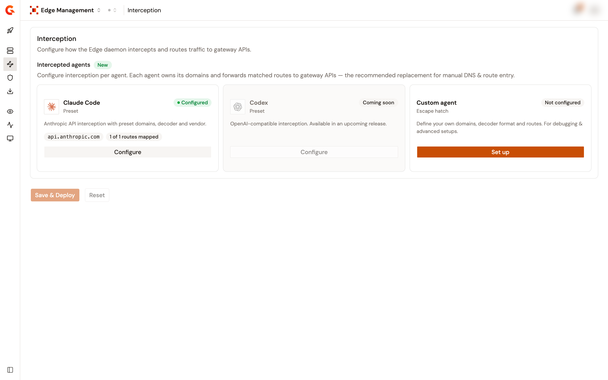
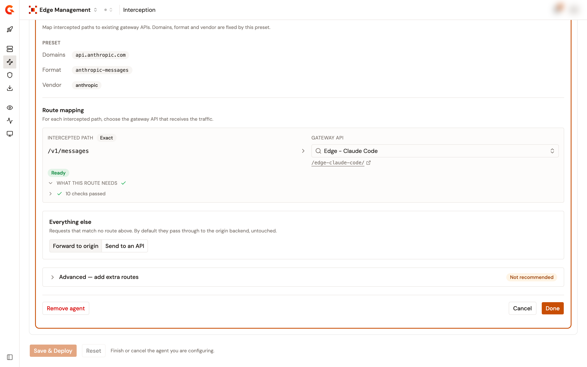
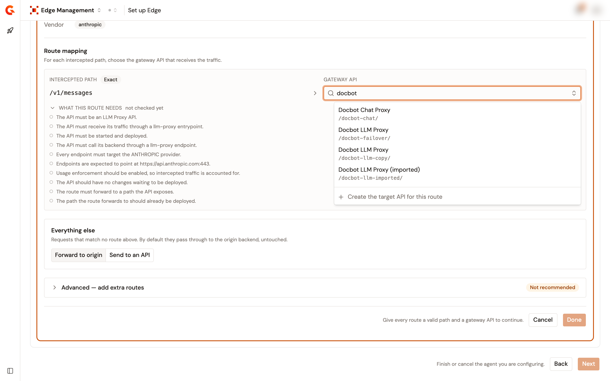
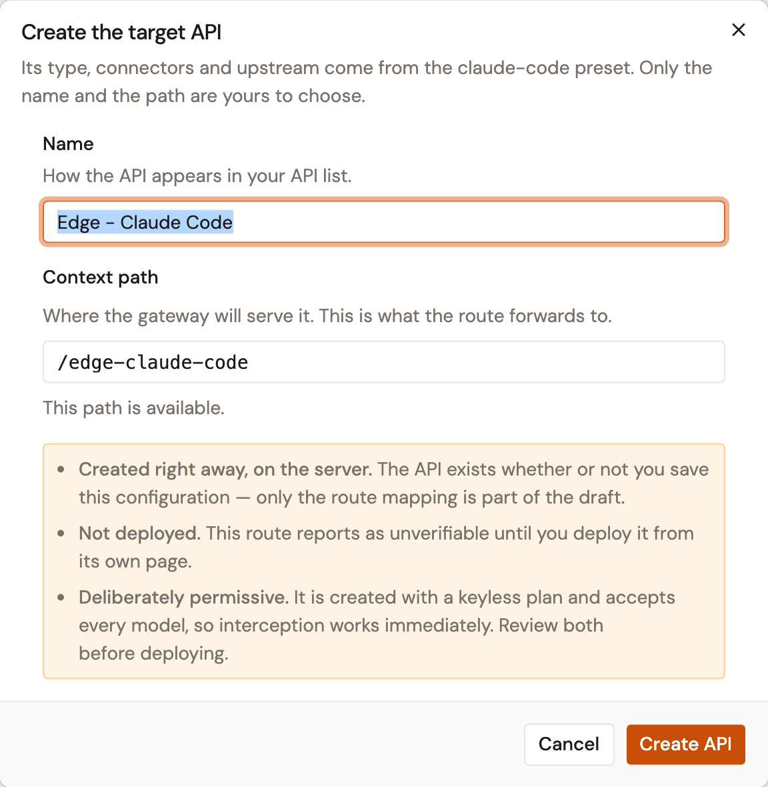
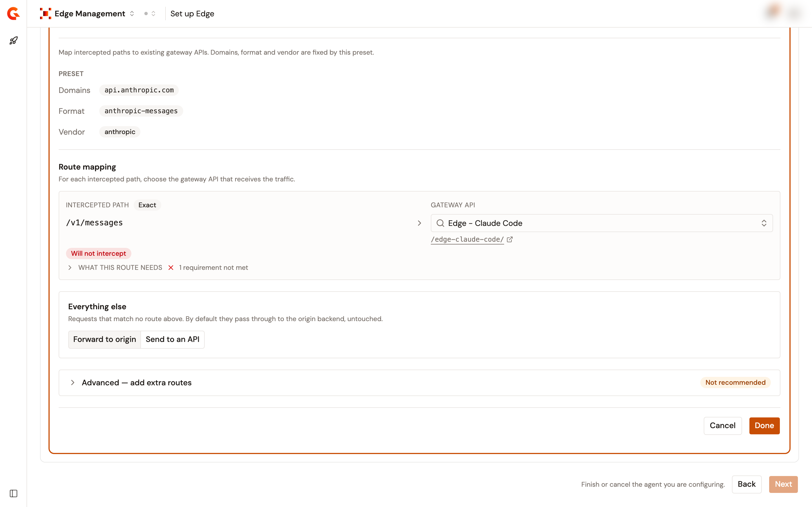
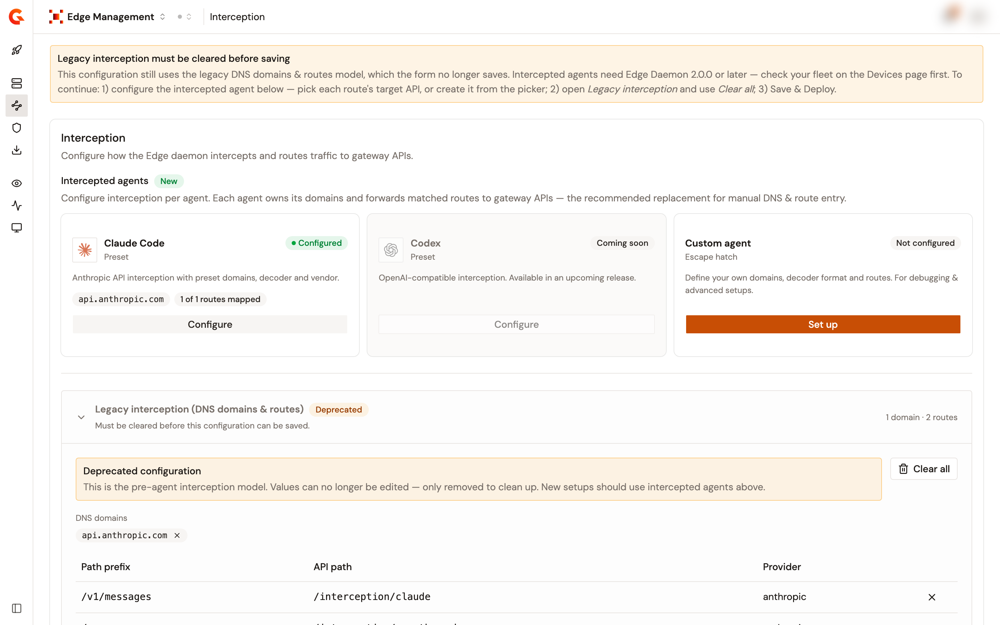
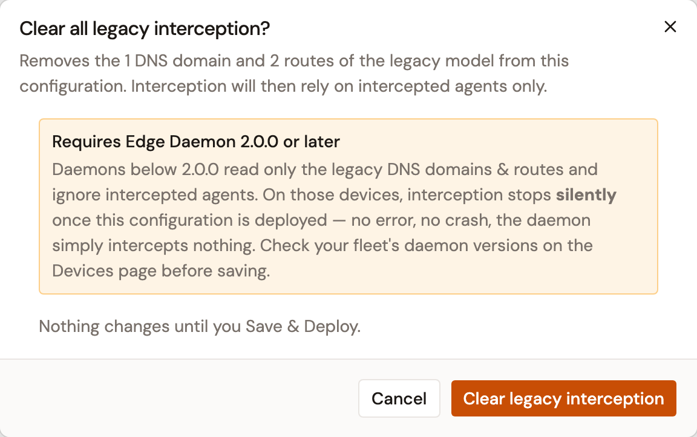

# Configure interception

## Overview

Interception is configured per intercepted agent, from the **Interception** page of Edge Management. An agent owns the domains it calls and the routes under those domains, and each route names the target API on the gateway that receives its traffic. Requests to an agent's domains that match none of its routes pass through to the provider untouched, unless you send everything else to an API.

The **Interception** page saves its own part of the configuration. A change here never re-sends your shadow AI settings.

<figure><figcaption>
The Interception page with one configured agent.
</figcaption></figure>

To configure interception, complete the following steps:

1. [Configure an agent](#configure-an-agent)
2. [Choose the target API of a route](#choose-the-target-api-of-a-route)
3. [Understand the route verdicts](#understand-the-route-verdicts)
4. [Save and deploy](#save-and-deploy)

## Configure an agent

Agents are shown as cards. Each card shows the state of the agent: **Not configured**, **Configured**, or, for a deployed configuration, the verdict of its routes, such as **Will not intercept**.

1. Open **Edge Management**.
2. Click **Interception**.
3. Click **Set up** on the card of the agent, or **Configure** if the agent is already configured. The form opens under the row of cards, one agent at a time.
4. Fill in the form as described in the following sections, then click **Done** to hand the agent to the page. **Cancel** discards the changes, and **Remove agent** removes a configured agent.

The following agents are available:

* **Claude Code** is a preset. Its domain, `api.anthropic.com`, its decoder format, `anthropic-messages`, and its vendor, `anthropic`, are fixed, and it declares one route, `/v1/messages`, with an exact match. You choose the target API of that route.
* **Custom agent** is for tools that have no preset, and for debugging. You enter a name, the domains to intercept, the decoder format, an optional vendor used as a reporting label, and every route yourself, with **Add route**.
* **Codex** is listed as coming soon and can't be configured.

<figure><figcaption>
The Claude Code form, with its route mapped to a target API that passes every check.
</figcaption></figure>

### Routes

A route pairs an intercepted path with the target API that receives it. The path matches exactly, unless it ends with `*`, which matches the path and everything under it. The `*` is only allowed at the end of the path.

| Match  | How to write it | What it intercepts                 |
| ------ | --------------- | ---------------------------------- |
| Exact  | `/v1/messages`  | This path only.                    |
| Prefix | `/v1/messages*` | This path and everything under it. |

Custom agents declare their routes with **Add route**. The routes of a preset are fixed. Unfold **Advanced** to add extra routes to a preset when a specific path needs a different target API. The page marks this as not recommended, because the routes of the preset already cover normal interception.

### Everything else

Requests that match none of the routes above are handled by the **Everything else** control:

* **Forward to origin**, the default. They reach the provider directly, untouched, and nothing goes through the gateway.
* **Send to an API**. They're forwarded to a target API you pick.


If you choose **Send to an API**, that API receives every request the routes didn't claim, such as the telemetry and authentication calls that an agent makes on the same domains. It must be built to handle this traffic, and requests it doesn't expect may fail.


## Choose the target API of a route

The picker under **Gateway API** searches the APIs of the environment.

1. Click the **Search a gateway API** field of the route and start typing the name of the API. The picker lists one entry per matching API, with the path it exposes. An API that exposes several paths shows how many, and picking it opens its paths as a second level.
2. Select the API, or the path, that the route forwards to. The name of the API is shown in the field, and its path is shown as a link to the API.

<figure><figcaption>
The target API picker with the APIs that match the search.
</figcaption></figure>

What is stored is the pairing. The path is what the daemon forwards to, and the API is remembered so that its name can be shown again. If the API is later deleted, the route shows the raw path with an **API not found** notice. If the API no longer serves that path, the route asks you to pick a path again.

The picker lists at most 20 APIs per search. When more APIs matched than the list shows, the picker says so and asks you to refine the search. When some matching APIs can't be a target, the picker says how many, and why: a target must be a v4 API that exposes a path on the gateway itself, not on a virtual host.


**An API published on a virtual host can't be intercepted, and its path isn't offered.** A route names a path and nothing else, so it has no way of selecting a virtual host on the gateway. The virtual host disqualifies the path, not the API. An API that exposes one path on a virtual host and another on a plain path stays selectable through the plain one.


### Create the target API from the picker

If no suitable API exists, click **Create the target API for this route** at the bottom of the picker. The dialog builds an API from the preset of the agent: its type, connectors, and upstream come from the preset, and only the **Name** and the **Context path** are yours to choose. The path is checked for availability as you type.

<figure><figcaption>
The dialog that creates the target API of a route.
</figcaption></figure>

Three things are decided the moment you click **Create API**:

* **The API is created right away, on the server.** It exists even if you don't go on to save the configuration. Only the route mapping is part of the draft.
* **The API is created stopped and undeployed.** The gateway doesn't serve it until you start and deploy it from its own page, and until then the route reports as **Will not intercept**.
* **The API is permissive by design.** It's created with a published keyless plan and accepts every model, so that interception works as soon as the API is deployed. Review both before you deploy it.

For what the created API contains, see [Target API reference](proxy-api-reference.md).

## Understand the route verdicts

Each route of a preset is checked against what its target API is on the gateway, and the verdict is shown under the route. The verdict follows your selection as you change it, it's checked again before a save, and the **Overview** page shows the verdict of the deployed configuration.

| Verdict                | Meaning                                                                                                                                                                                     |
| ---------------------- | ------------------------------------------------------------------------------------------------------------------------------------------------------------------------------------------- |
| **Ready**              | Every requirement of the route is met.                                                                                                                                                       |
| **Check**              | Every blocking requirement is met, but a recommendation isn't. The route works, and something is worth looking at.                                                                            |
| **Will not intercept** | A blocking requirement isn't met. The daemon forwards the traffic, and the API doesn't serve it.                                                                                             |
| **Not verified**       | An API is selected, but the check couldn't read it. The API may have been deleted, or you may not have the rights to see it.                                                                  |
| **Not checked**        | The route isn't one the module describes, so it has no requirements to check against. This is the case for the routes of a custom agent and for the extra routes added to a preset.        |

Unfold **What this route needs** to list the requirements and, for each unmet one, the reason. See [Target API reference](proxy-api-reference.md) for the requirements.

<figure><figcaption>
A route mapped to a target API that hasn't been deployed yet.
</figcaption></figure>


**A verdict never blocks a save.** You can save and deploy a configuration whose routes won't intercept. A dialog names the agents concerned and the reason first, and **Save & Deploy anyway** lets you through. An unmet requirement is usually fixed on the page of the API itself.


A target API and the configuration that points at it have separate lifecycles. An API can be stopped, renamed, or have its path changed long after a route was mapped to it. The **Overview** page carries an **Interception readiness** card that shows the current verdict of each configured agent, so you don't have to reopen the agent to find out.

## Save and deploy

1. Click **Done** on the agent form. The page can't be saved while an agent form is open.
2. Click **Save & Deploy**. The configuration is saved and the Edge API of the environment is deployed again, so the daemons receive the change the next time they fetch their configuration from the Edge Reactor.

To discard the unsaved changes and restore the last saved values, click **Reset**.

## Migrate from the legacy interception model

A configuration created before intercepted agents existed carries a flat list of DNS domains and routes. This model is deprecated. It's shown read-only under **Legacy interception**, the page no longer saves while it still has entries, and a banner at the top of the page explains the steps to follow.

<figure><figcaption>
The Interception page of a configuration that still carries the legacy model.
</figcaption></figure>

To migrate, complete the following steps:

1. Configure the intercepted agent, and pick the target API of each route, or create it from the picker.
2. Unfold **Legacy interception** and click **Clear all**.
3. In the confirmation dialog, click **Clear legacy interception**. The entries stay on screen, marked as cleared, until you save.
4. Click **Save & Deploy**.

Nothing changes until that last step, and **Reset** brings the legacy entries back as they were.

<figure><figcaption>
The confirmation shown before the legacy entries are cleared.
</figcaption></figure>


**Intercepted agents require Edge Daemon 2.0.0 or later.** Daemons below 2.0.0 read only the legacy DNS domains and routes, and ignore intercepted agents. On those devices, interception stops once the migrated configuration is deployed, with no error and no crash: the daemon intercepts nothing. Check the daemon versions of your fleet on the **Devices** page before you save. See [Monitor your devices](../observe/monitor-devices.md).


## Next steps

* **Check what a target API must be.** See [Target API reference](proxy-api-reference.md).
* **Watch the traffic.** See [Monitor proxied traffic](../observe/monitor-proxied-traffic.md).
