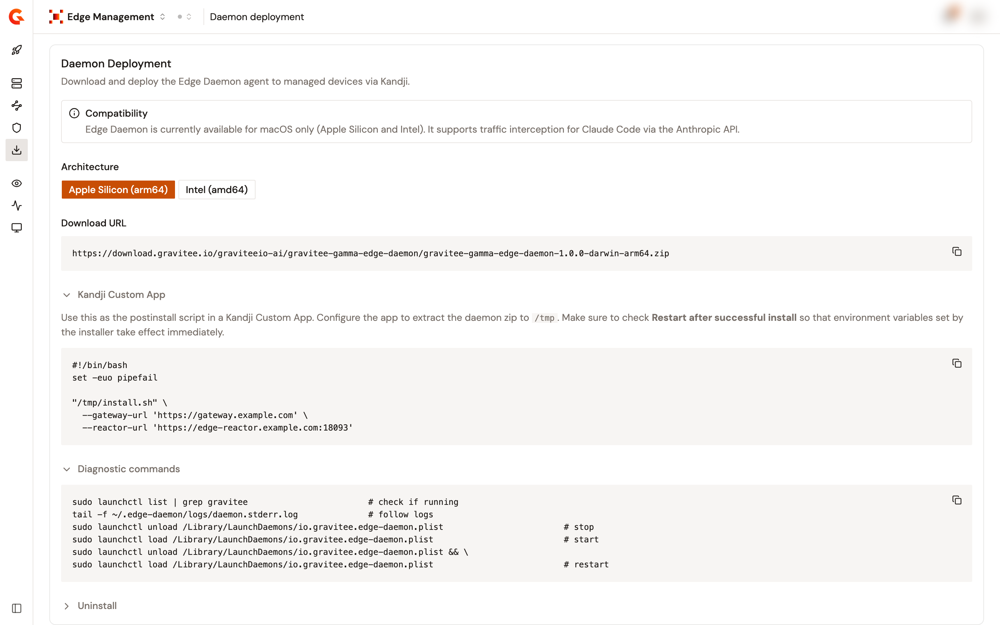

# Configure Kandji to deploy the Edge Daemon

Deploy the Edge Daemon to your device fleet with Kandji. The **Daemon deployment** page of Edge Management generates the download URL of the daemon and the Kandji post-install script for you, with the gateway addresses of the environment filled in.

For an overview of the Edge Daemon, see the [Edge Management overview](../get-started/edge-management-overview.md). To create the configuration of the environment first, see [Set up Edge Management](set-up-edge-management.md).


**Compatibility.** The Edge Daemon is available for macOS only, on Apple Silicon and Intel. It supports traffic interception for Claude Code through the Anthropic API.


## Prerequisites

Ensure the following are in place before continuing:

* Access to a running Gamma console with Edge Management enabled.
* An Edge Management configuration already created for the environment. See [Set up Edge Management](set-up-edge-management.md).
* A Kandji account with admin access to your device fleet.
* Devices that run macOS.
* The gateway-side endpoints reachable from your devices. In particular, the Edge Reactor port, `18093` by default, must be exposed. See [Gateway-side requirements](../get-started/edge-management-overview.md#gateway-side-requirements).

To deploy the Edge Daemon with Kandji, complete the following steps:

1. [Open the Daemon deployment page](#open-the-daemon-deployment-page)
2. [Select the architecture](#select-the-architecture)
3. [Create the Kandji Custom App](#create-the-kandji-custom-app)
4. [Verify your deployment](#verify-your-deployment)

## Open the Daemon deployment page

1. In the Gamma console, open **Edge Management**.
2. Click **Daemon deployment**.

<figure><figcaption><p>The Daemon deployment page generates the download URL and the Kandji post-install script.</p></figcaption></figure>

## Select the architecture

* Under **Architecture**, click the architecture that matches your devices: **Apple Silicon (arm64)** or **Intel (amd64)**.

The page generates the matching **Download URL** of the daemon package. Here is an example for Apple Silicon:

```text
https://download.gravitee.io/graviteeio-ai/gravitee-gamma-edge-daemon/gravitee-gamma-edge-daemon-1.0.0-darwin-arm64.zip
```

## Create the Kandji Custom App

Under **Kandji Custom App**, the page generates a post-install script prefilled with the Gateway URL and the Reactor URL of the environment. It looks like the following example:

```bash
#!/bin/bash
set -euo pipefail

"/tmp/install.sh" \
  --gateway-url 'https://gateway.example.com' \
  --reactor-url 'https://edge-reactor.example.com:18093'
```

To deploy the script, complete the following steps:

1. In the Kandji admin console, create a new **Custom App**.
2. Configure the app to extract the daemon package to `/tmp`.
3. Paste the generated script as the post-install script.
4. Enable **Restart after successful install** so that the environment variables set by the installer take effect immediately.
5. Assign the Custom App to the appropriate device blueprints. Kandji then distributes and installs the Edge Daemon on all assigned devices.


The page also carries collapsible **Diagnostic commands** and **Uninstall** sections, with the commands to check that the daemon runs, to follow its logs, to stop and start it, and to remove it from a device.


## Verify your deployment

As your devices receive and start the daemon, they send heartbeats to the Edge Reactor and appear in Edge Management. To verify your deployment, complete the following step:

* Click **Devices** and confirm that your devices report as **Active**. See [Monitor your devices](../observe/monitor-devices.md).

## Next steps

* **Connect AI tools.** Check what, if anything, you have to do on a device. See [Connect Claude Code to the Edge Daemon](../connect-claude-code-to-daemon.md).
* **Watch the traffic.** See [Monitor proxied traffic](../observe/monitor-proxied-traffic.md).
