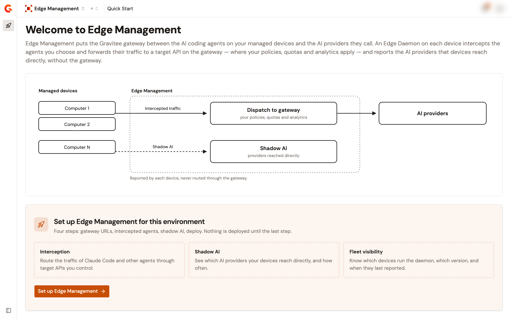
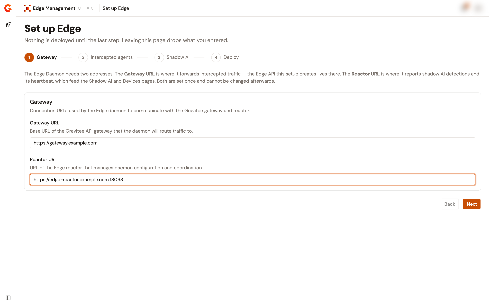
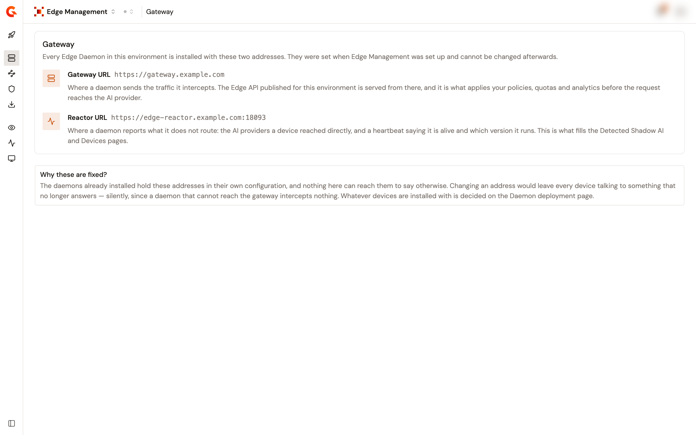
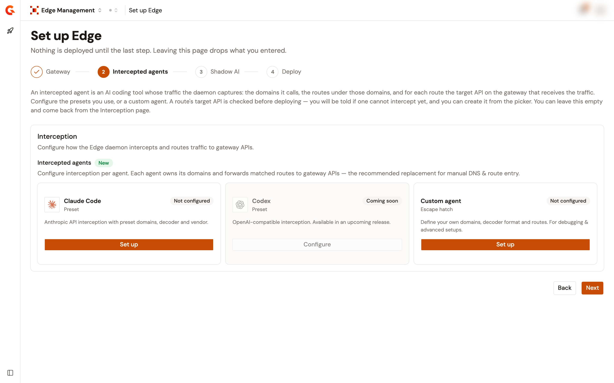
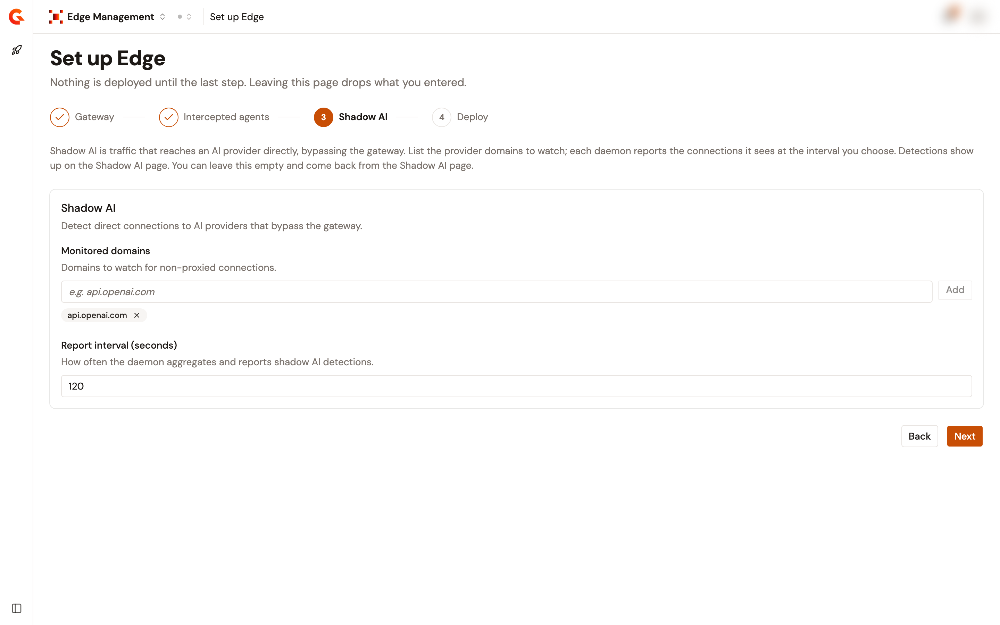
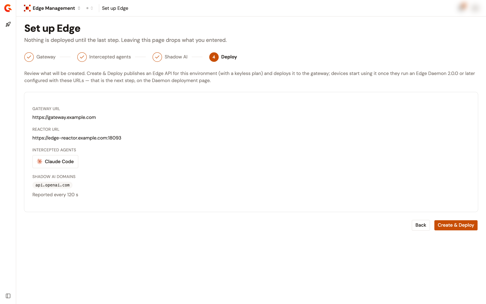
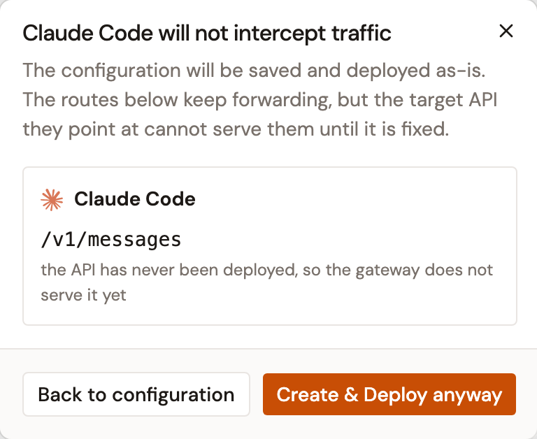

# Set up Edge Management

## Overview

Edge Management is configured per environment, and the configuration is created once, through a guided setup. Until it exists, the module offers a single page, **Quick Start**, which explains what Edge Management does and opens the setup.

<figure><figcaption>
The Quick Start page of an environment that has no configuration yet.
</figcaption></figure>

The setup has four steps: **Gateway**, **Intercepted agents**, **Shadow AI**, and **Deploy**. Nothing is deployed until the last step, you can move back and forth with **Back** and **Next**, and leaving the page drops what you entered.

After the setup, each part of the configuration is edited on its own page and saved on its own, so a change to one part never re-sends another.

## Before you start

* An environment of the Gamma console with Edge Management enabled.
* The permission to update the Edge configuration. The default `EDGE_MANAGER` environment role grants it. Without it, Quick Start tells you to ask an administrator to set up Edge for the environment, and the configuration pages are shown read-only.
* The two gateway-side addresses the daemons will use. See [Gateway-side requirements](../get-started/edge-management-overview.md#gateway-side-requirements).

To set up Edge Management, complete the following steps:

1. [Enter the gateway addresses](#enter-the-gateway-addresses)
2. [Choose the agents to intercept](#choose-the-agents-to-intercept)
3. [Choose the domains to watch for shadow AI](#choose-the-domains-to-watch-for-shadow-ai)
4. [Review and deploy](#review-and-deploy)

## Enter the gateway addresses

1. Open **Edge Management**.
2. On the **Quick Start** page, click **Set up Edge Management**.
3. Enter the two addresses that every Edge Daemon of the environment is installed with.

<figure><figcaption>
Step 1 of the guided setup.
</figcaption></figure>

The following table describes each field:

| Field           | Description                                                                                                                                                                                                                                   |
| --------------- | --------------------------------------------------------------------------------------------------------------------------------------------------------------------------------------------------------------------------------------------- |
| **Gateway URL** | Base URL of the Gravitee API gateway that the daemon routes traffic to. The Edge API published for this environment is served from there, and it applies your policies, quotas, and analytics before the request reaches the AI provider. |
| **Reactor URL** | URL of the Edge Reactor. The daemon reports its heartbeat and the AI providers the device reached directly there, which is what fills the **Detected Shadow AI** and **Devices** pages.                                                    |

Both addresses are required, and both must start with `http://` or `https://`.


**These two addresses are locked once the configuration is created.** The daemons already installed hold them in their own configuration, and nothing in the console can reach them to say otherwise. A daemon that can't reach the gateway intercepts nothing. What the devices are installed with is decided on the **Daemon deployment** page.


Once the configuration exists, the **Gateway** page shows the two addresses and explains what each one does. It has no save action.

<figure><figcaption>
The Gateway page of a configured environment.
</figcaption></figure>

4. Click **Next**.

## Choose the agents to intercept

An intercepted agent is an AI coding tool whose traffic the daemon captures: the domains it calls, the routes under those domains, and for each route the target API on the gateway that receives the traffic.

<figure><figcaption>
Step 2 of the guided setup.
</figcaption></figure>

1. Click **Set up** on the **Claude Code** card, or on the **Custom agent** card for any other tool. The **Codex** card is listed as coming soon and can't be configured.
2. Map each route to its target API, or create the target API from the picker. Everything this form offers is described in [Configure interception](configure-edge-management.md), which is also where you come back to change it later.
3. Click **Done** to hand the agent to the setup.
4. Click **Next**.

You can leave this step empty and configure agents afterward from the **Interception** page. An environment with no intercepted agent intercepts nothing.

## Choose the domains to watch for shadow AI

Shadow AI is traffic that reaches an AI provider directly, bypassing the gateway. Each daemon watches for connections to the domains you list here and reports what it sees.

<figure><figcaption>
Step 3 of the guided setup.
</figcaption></figure>

1. Enter a provider domain, for example `api.openai.com`, and click **Add**. Repeat for each domain to watch.
2. Set the **Report interval (seconds)**. The default is 120 seconds and the minimum is 10 seconds.
3. Click **Next**.

The following table describes each field:

| Field                         | Description                                                                                                                                  |
| ----------------------------- | -------------------------------------------------------------------------------------------------------------------------------------------- |
| **Monitored domains**         | The provider domains to watch for non-proxied connections. Detection is based on TCP connection monitoring. No traffic content is read. |
| **Report interval (seconds)** | How often a daemon aggregates and reports its shadow AI detections.                                                                          |

Detections show up on the **Detected Shadow AI** page. You can leave this step empty and come back later from the **Shadow AI** page, which offers the same two fields and saves on its own.


Watching a domain for shadow AI and intercepting it are independent. Shadow AI detection tells you that a device reached a provider directly. It doesn't route anything, and it doesn't require the provider to be one of your intercepted agents.


## Review and deploy

The last step lists what will be created.

<figure><figcaption>
Step 4 of the guided setup.
</figcaption></figure>

1. Check the gateway addresses, the intercepted agents, and the shadow AI domains.
2. Click **Create & Deploy**. This publishes an Edge API for the environment, with a keyless plan, and deploys it to the gateway.

If an agent's target API can't serve its route yet, a dialog names the agent, the route, and the reason before you commit. It's a warning, not a refusal: click **Create & Deploy anyway** to create the configuration and fix the API afterward, or **Back to configuration** to change the route first. See [Understand the route verdicts](configure-edge-management.md#understand-the-route-verdicts).

<figure><figcaption>
The warning shown when a route's target API can't serve it yet.
</figcaption></figure>


**A deployed configuration intercepts nothing until the devices run the daemon.** Creating the configuration publishes the Edge API on the gateway. It doesn't touch a single device. Installing the daemon is a separate procedure.


## Next steps

* **Install the daemon on your devices.** The **Daemon deployment** page carries the download URL for each architecture, a ready-made post-install script for Kandji, and the commands to check that the daemon runs. See [Configure Kandji to deploy the Edge Daemon](configure-kandji-daemon.md).
* **Configure interception.** Map each agent's routes to the target APIs that receive their traffic. See [Configure interception](configure-edge-management.md).
