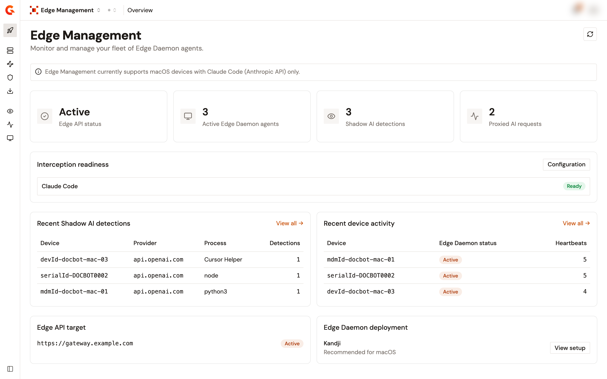

# Edge Management overview

Edge Management puts the Gravitee gateway between the AI coding agents that run on your managed devices and the AI providers they call. An Edge Daemon installed on each device intercepts the agents you choose and forwards their traffic to a target API on the gateway, where your policies, quotas, and analytics apply. The same daemon reports the AI providers that a device reaches directly, without the gateway.


The Edge Reactor listener is plain HTTP, and the Edge API that Edge Management publishes for an environment uses a keyless plan. The connections between a daemon and the gateway are neither encrypted by the reactor nor authenticated. Don't expose these endpoints over networks you don't trust. Restrict them to a private network, a VPN, or an IP-allowlisted corporate network.


## How the traffic flows

Once Edge Management is set up and the daemon runs on a device, the AI traffic that leaves the device takes one of two paths.

| Path                    | What happens                                                                                                                                                                                                                                            |
| ----------------------- | ------------------------------------------------------------------------------------------------------------------------------------------------------------------------------------------------------------------------------------------------------- |
| **Intercepted traffic** | The daemon captures the request and forwards it to the target API you chose on the gateway. The gateway applies your policies, quotas, and analytics, then relays the request to the AI provider. This traffic appears on the **Proxied Traffic** page. |
| **Shadow AI**           | The device reached an AI provider directly, without the gateway. The daemon reports that the connection happened. No traffic content is read. These connections appear on the **Detected Shadow AI** page.                                            |

Interception works per domain. The daemon captures every request that an intercepted agent sends to one of its domains, and what happens next depends on the routes you declared for that agent. A request whose path matches a route is forwarded to that route's target API. A request that matches no route passes through to the provider untouched, unless you choose to send everything else to an API. See [Configure interception](../connect/configure-edge-management.md).

On the device, the daemon installer sets up a DNS resolver that answers for the intercepted domains, a listener on port 443, and a certificate authority that the daemon uses for those connections. The installer also sets `NODE_EXTRA_CA_CERTS` so that Node.js tools such as Claude Code trust that certificate authority. No manual trust step is required. See [Connect Claude Code to the Edge Daemon](../connect-claude-code-to-daemon.md).

## What you configure

Interception is configured per intercepted agent. An agent owns the domains it calls and the routes under those domains, and each route names the target API on the gateway that receives its traffic.

* **Claude Code** is a preset. Its domain, decoder format, and vendor are fixed, and it declares one route, `/v1/messages`. You choose the target API of that route.
* **Custom agent** lets you declare the domains, the decoder format, the vendor, and the routes yourself.
* **Codex** is listed as coming soon and can't be configured yet.

A target API is a standard API on your gateway. Pick one you already have, or let Edge Management create one from the picker. See [Target API reference](../connect/proxy-api-reference.md).

Shadow AI detection has its own configuration: a list of provider domains to watch. Watching a domain and intercepting it are independent. A detection tells you that a device reached a provider directly, and nothing is routed.

## Where things live in the console

Edge Management is a module of the Gamma console. Its pages are grouped by what you do with them.

| Group             | Pages                                                                                                                                                                                                                                                                       |
| ----------------- | --------------------------------------------------------------------------------------------------------------------------------------------------------------------------------------------------------------------------------------------------------------------------- |
| **General**       | **Quick Start** while the environment has no configuration, then **Overview**: a dashboard with the Edge API status, the active daemons, the recent shadow AI detections, the recent device activity, and an **Interception readiness** card that shows the verdict of each configured agent. |
| **Configuration** | **Gateway**, **Interception**, **Shadow AI**, and **Daemon deployment**.                                                                                                                                                                                                    |
| **Analytics**     | **Detected Shadow AI**, **Proxied Traffic**, and **Devices**.                                                                                                                                                                                                              |

Until the environment has a configuration, the sidebar offers only **Quick Start**. See [Set up Edge Management](../connect/set-up-edge-management.md).

<figure><figcaption>
The Overview page of a configured environment.
</figcaption></figure>

## Gateway-side requirements

The daemon connects to two endpoints on the gateway side. Both must be reachable from the devices.

| Connection      | Purpose                                                                                                                                                                                                                                                           |
| --------------- | ----------------------------------------------------------------------------------------------------------------------------------------------------------------------------------------------------------------------------------------------------------------- |
| **Gateway URL** | Where the daemon sends the traffic it intercepts. The Edge API published for the environment and the target APIs are served from there.                                                                                                                          |
| **Reactor URL** | Where the daemon fetches its configuration, sends its heartbeat, and reports its metrics and its shadow AI detections. The Edge Reactor listens on its own port, `18093` by default. Set `edge.server.port` in the gateway configuration to change it. |

The Edge Reactor listener is separate from the gateway's main HTTP port, so it must be exposed explicitly. On Kubernetes, see [Configure Edge Ingress](../connect/configure-edge-ingress.md).

## Compatibility

The Edge Daemon is available for macOS only, on Apple Silicon and Intel. It supports interception for Claude Code through the Anthropic API.

## Next steps

* **Set up the environment.** Create the configuration through the guided setup. See [Set up Edge Management](../connect/set-up-edge-management.md).
* **Deploy the Edge Daemon.** Distribute the daemon to your device fleet with Kandji. See [Configure Kandji to deploy the Edge Daemon](../connect/configure-kandji-daemon.md).
* **Connect Claude Code.** Check what, if anything, you have to do on the device. See [Connect Claude Code to the Edge Daemon](../connect-claude-code-to-daemon.md).
