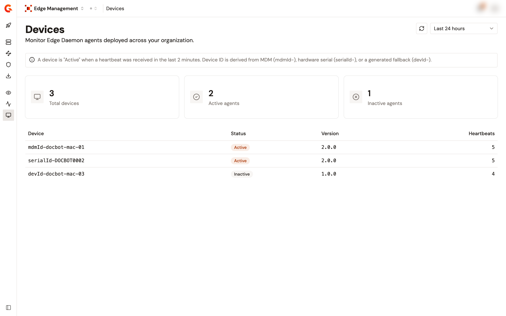

# Monitor your devices

## Overview

The **Devices** page is the state of your fleet: which managed devices run an Edge Daemon, whether each one still reports, and which version it runs. A device appears here as soon as its daemon sends a heartbeat to the Edge Reactor.

This is the page to open before any change that depends on what the fleet runs, in particular before you migrate away from the legacy interception model.

<figure><figcaption>
The Devices page.
</figcaption></figure>

## Read the page

1. Open **Edge Management**.
2. Click **Devices**.
3. Select a time range: **Last 24 hours**, the default, **Last 7 days**, or **Last 30 days**.

Three cards summarize the range:

| Card                | What it shows                                              |
| ------------------- | ---------------------------------------------------------- |
| **Total devices**   | Every device that sent at least one heartbeat over the range. |
| **Active agents**   | How many of them are still reporting now.                  |
| **Inactive agents** | The rest.                                                  |

The table lists the devices:

| Column         | Description                                          |
| -------------- | ---------------------------------------------------- |
| **Device**     | The device identifier.                               |
| **Status**     | **Active** or **Inactive**.                          |
| **Version**    | The Edge Daemon version the device runs.             |
| **Heartbeats** | How many heartbeats it sent over the selected range. |

Device identifiers carry the same prefixes as on the **Detected Shadow AI** page. See [Identify a device](monitor-shadow-ai-traffic.md#identify-a-device).


**A device is Active when a heartbeat was received in the last 2 minutes.** The time range decides which devices are listed and how many heartbeats each one shows. It doesn't change what **Active** means.


## What Inactive means

A device that reported over the range and has gone quiet since is **Inactive**. The daemon may have been stopped or uninstalled, the device may be off, or the daemon may no longer reach the Reactor URL.

That last case is the one worth knowing about. A daemon that can't reach the gateway intercepts nothing, and nothing surfaces on the device.

## Check the fleet before migrating

Intercepted agents require Edge Daemon 2.0.0 or later. Daemons below that version read only the legacy DNS domains and routes, and ignore intercepted agents.

The **Version** column is how you find out what you have before you clear the legacy model. On any device still below 2.0.0, interception stops the moment the migrated configuration is deployed, with no error and no crash: the daemon intercepts nothing. See [Migrate from the legacy interception model](../connect/configure-edge-management.md#migrate-from-the-legacy-interception-model).
