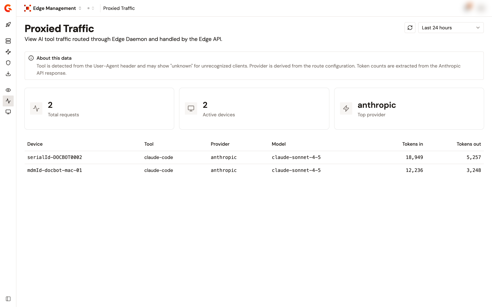

# Monitor proxied traffic

## Overview

The **Proxied Traffic** page shows the AI requests that were intercepted on a managed device and forwarded to the gateway, which is the traffic that went through your policies, quotas, and analytics. It's the counterpart of the **Detected Shadow AI** page, which shows what didn't.

A request appears here when a device runs the Edge Daemon, the agent that made the request is configured as an intercepted agent, and the path of the request matched one of the routes of that agent.

<figure><figcaption>
The Proxied Traffic page.
</figcaption></figure>

## Read the page

1. Open **Edge Management**.
2. Click **Proxied Traffic**.
3. Select a time range: **Last 24 hours**, the default, **Last 7 days**, or **Last 30 days**.

Three cards summarize the range:

| Card               | What it shows                                                |
| ------------------ | ------------------------------------------------------------ |
| **Total requests** | The number of entries in the table below.                    |
| **Active devices** | How many distinct devices appear in the table.              |
| **Top provider**   | The provider with the most tokens, input and output combined. |

The table lists one row per device, provider, and model over the range, with the rows that carry the most tokens first:

| Column         | Description                                                                                                 |
| -------------- | ----------------------------------------------------------------------------------------------------------- |
| **Device**     | The device the requests came from.                                                                          |
| **Tool**       | The AI tool of the device, detected from the `User-Agent` header of its requests. It reads `unknown` for a client the module doesn't recognize. |
| **Provider**   | The AI provider the traffic was relayed to, derived from the route configuration.                          |
| **Model**      | The model the requests used.                                                                                |
| **Tokens in**  | The input tokens of the requests, extracted from the response of the provider.                              |
| **Tokens out** | The output tokens of the requests, extracted from the response of the provider.                             |

Device identifiers carry the same prefixes as on the **Detected Shadow AI** page. See [Identify a device](monitor-shadow-ai-traffic.md#identify-a-device).

## When a column is empty

| What you see                             | Why                                                                                                                                                                                                                                                  |
| ---------------------------------------- | ---------------------------------------------------------------------------------------------------------------------------------------------------------------------------------------------------------------------------------------------------- |
| **Tool** reads `unknown`                 | The `User-Agent` header of the request matched no tool the module recognizes. The request was still intercepted and forwarded.                                                                                                                       |
| The token counts are empty               | Token usage is read from the response of the provider by the target API. Check that the endpoint of the API targets the expected provider and that usage enforcement is on. See [Target API reference](../connect/proxy-api-reference.md).          |
| A request you expected is missing        | Either it wasn't intercepted at all, in which case look at the **Detected Shadow AI** page, or it matched no route and passed through to the provider untouched.                                                                                      |


This page reports what the Edge Daemon forwarded. Whatever your policies then did with a request is reported by the target API itself, on its own analytics.

