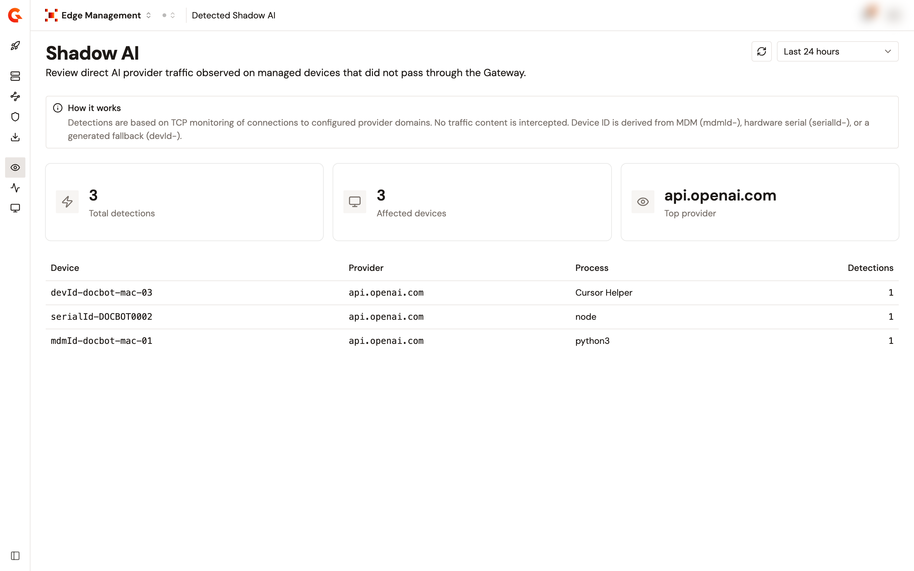

# Monitor detected shadow AI

## Overview

The **Detected Shadow AI** page lists the connections that your managed devices made to an AI provider directly, without the gateway. Nothing on this page was routed or governed. It's what happened outside your policies, so you can decide what to bring under them.

Detections come from the domains listed under **Shadow AI** in the configuration. Each daemon watches for connections to those domains and reports what it sees at the interval you set. Detection is based on TCP connection monitoring. No traffic content is read. See [Choose the domains to watch for shadow AI](../connect/set-up-edge-management.md#choose-the-domains-to-watch-for-shadow-ai).

<figure><figcaption>
The Detected Shadow AI page.
</figcaption></figure>

## Read the page

1. Open **Edge Management**.
2. Click **Detected Shadow AI**.
3. Select a time range: **Last 24 hours**, the default, **Last 7 days**, or **Last 30 days**.

Three cards summarize the range:

| Card                 | What it shows                                              |
| -------------------- | ---------------------------------------------------------- |
| **Total detections** | The number of detections reported over the range.          |
| **Affected devices** | How many distinct devices reported at least one detection. |
| **Top provider**     | The provider with the most detections.                     |

The table breaks the same range down:

| Column         | Description                                          |
| -------------- | ---------------------------------------------------- |
| **Device**     | The device that made the connection.                 |
| **Provider**   | The AI provider it reached.                          |
| **Process**    | The process on the device that opened the connection. |
| **Detections** | How many detections were reported for that row.      |

## Identify a device

A device identifier carries a prefix that says where it comes from:

| Prefix      | Source                                                        |
| ----------- | ------------------------------------------------------------- |
| `mdmId-`    | An identifier supplied by your MDM.                           |
| `serialId-` | The hardware serial number of the device.                     |
| `devId-`    | A generated fallback, when neither of the above is available. |

## Bring a detection under control

A detection tells you that a tool on a device is reaching a provider outside your governance. To bring that traffic under your policies, complete the following steps:

1. Configure the tool as an intercepted agent, with the domain among the domains of the agent. Use a preset when the tool has one, and a custom agent otherwise.
2. Give each route you declare a target API on the gateway.
3. Confirm that the traffic now appears on the **Proxied Traffic** page.

See [Configure interception](../connect/configure-edge-management.md).
