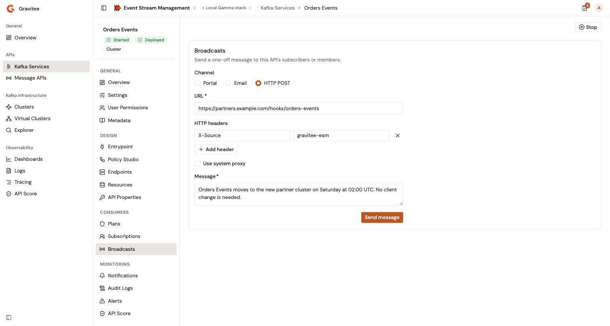

# Broadcast messages to consumers

A broadcast sends a one-off message about a Kafka Service to the people who consume it, for example to announce maintenance or a plan change. It goes out as a portal notification, by email, or as an HTTP POST request to a URL.

## Prerequisites

* Permission to send messages about the Kafka Service. Without it, the **Broadcasts** item doesn't appear in the Kafka Service sidebar.

## Send a broadcast

1. From the Gamma console, open **Event Stream Management**.
2. In the **APIs** group of the sidebar, click **Kafka Services**.
3. Click the name of the Kafka Service.
4. In the **Consumers** group of the Kafka Service sidebar, click **Broadcasts**.
5. Complete the following fields:

<table>
    <thead>
        <tr>
            <th width="160">Field</th>
            <th>Description</th>
        </tr>
    </thead>
    <tbody>
        <tr>
            <td><strong>Channel</strong></td>
            <td><strong>Portal</strong> sends the message as a portal notification. <strong>Email</strong> sends it by email. <strong>HTTP POST</strong> posts it to a URL. The default is <strong>Portal</strong>.</td>
        </tr>
        <tr>
            <td><strong>URL</strong></td>
            <td><strong>HTTP POST</strong> only. Required. The absolute <code>http</code> or <code>https</code> address that receives the message. An empty field shows <strong>URL is required.</strong>, and another kind of address shows <strong>URL is not valid.</strong></td>
        </tr>
        <tr>
            <td><strong>HTTP headers</strong></td>
            <td><strong>HTTP POST</strong> only. Optional. Click <strong>Add header</strong>, then enter the name and the value of a header to send with the request. A row without a name is ignored.</td>
        </tr>
        <tr>
            <td><strong>Use system proxy</strong></td>
            <td><strong>HTTP POST</strong> only. Sends the request through the system proxy of the Management API.</td>
        </tr>
        <tr>
            <td><strong>Title</strong></td>
            <td><strong>Portal</strong> and <strong>Email</strong> only. Required. The title of the notification, or the subject of the email.</td>
        </tr>
        <tr>
            <td><strong>Message</strong></td>
            <td>Required. The text of the message. With <strong>HTTP POST</strong>, it's the body of the request.</td>
        </tr>
        <tr>
            <td><strong>Recipients</strong></td>
            <td><strong>Portal</strong> and <strong>Email</strong> only. Required: select one or more. <strong>API subscribers</strong> addresses the subscribers of the Kafka Service. The console also offers one option per application role, for example <strong>Members with the Owner role on subscribed applications</strong>, which addresses the members that hold that role on the applications subscribed to the Kafka Service.</td>
        </tr>
    </tbody>
</table>

6. Click **Send message**.

The message goes out at once, without a confirmation step. The page doesn't keep a history of broadcasts. Once the message is sent, the **Title**, **Message**, **URL**, and **HTTP headers** fields clear. When a required field is missing, the form shows the error under the field, for example **Title is required.** or **Recipient scope is required.**, and sends nothing. When the delivery fails, the page shows **Send failed** with the reason.

<figure><figcaption>
A broadcast sent to a URL
</figcaption></figure>

## Verification

To verify that the broadcast was sent, follow these steps:

1. Check the confirmation under the form. It reads **Message sent** and **Delivered to `<number>` recipient(s).**
2. If the number is 0, check the recipients. With **HTTP POST**, a delivered message counts 1 recipient. For example, **API subscribers** reaches no one on a Kafka Service without subscriptions.
