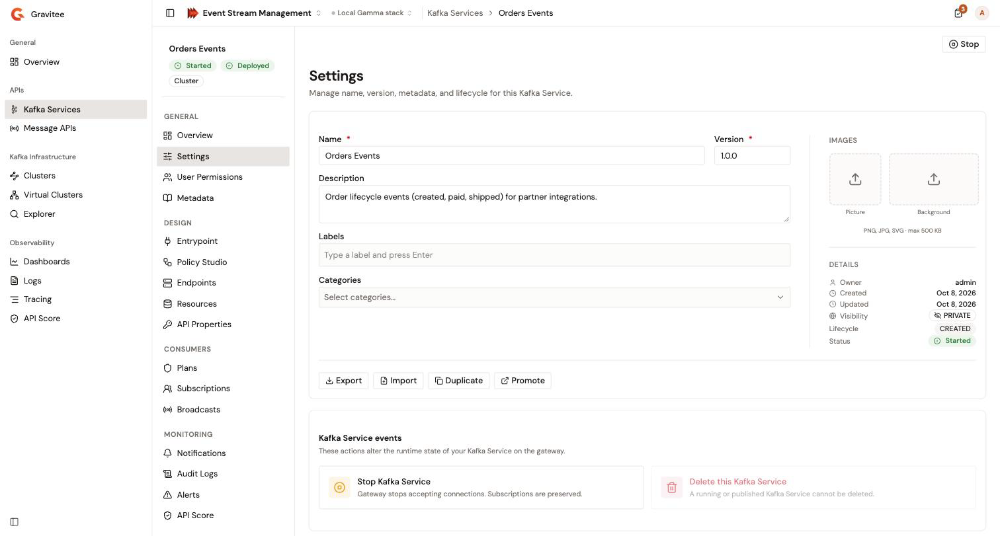

# Manage general settings

The **Settings** page of a Kafka Service holds its name, version, description, labels, categories, and images. It also exports, imports, and duplicates the definition of the Kafka Service. Its **Kafka Service events** card starts, stops, deploys, detaches, and deletes the Kafka Service, and its **Publication** card unpublishes a published Kafka Service.

## Open the settings

1. From the Gamma console, open **Event Stream Management**.
2. In the **APIs** group of the sidebar, click **Kafka Services**.
3. Click the name of the Kafka Service.
4. In the **General** group of the Kafka Service sidebar, click **Settings**.

Without permission to change the Kafka Service, the fields and the images are read-only, and the **Import**, **Duplicate**, and **Promote** buttons are hidden. **Export** needs permission to read the API definition. The **Kafka Service events** card shows only the actions that your role allows.

A Kafka Service managed by the Gravitee Kubernetes Operator is read-only, whatever your role. See [Detach a Kubernetes-managed Kafka Service](#detach-a-kubernetes-managed-kafka-service).

<figure><figcaption>
The <strong>Settings</strong> page of a Kafka Service
</figcaption></figure>

## Edit the general information

1. Change the fields you need:

<table>
    <thead>
        <tr>
            <th width="160">Field</th>
            <th>Description</th>
        </tr>
    </thead>
    <tbody>
        <tr>
            <td><strong>Name</strong></td>
            <td>Required.</td>
        </tr>
        <tr>
            <td><strong>Version</strong></td>
            <td>Required. Up to 32 characters.</td>
        </tr>
        <tr>
            <td><strong>Description</strong></td>
            <td>Optional.</td>
        </tr>
        <tr>
            <td><strong>Labels</strong></td>
            <td>Optional. Type a label, then press Enter or type a comma.</td>
        </tr>
        <tr>
            <td><strong>Categories</strong></td>
            <td>Optional. Select categories of the environment.</td>
        </tr>
    </tbody>
</table>

2. At the top of the page, click **Save changes**. **Save changes** and **Discard** appear once you change a field. **Save changes** stays disabled while **Name** or **Version** is empty.

The console confirms with **Kafka Service updated**. When the save fails, the reason shows above the form.

To drop your changes instead, click **Discard**.

## Set the images

The **Images** section holds the **Picture** and the **Background** of the Kafka Service. Each accepts a PNG, JPG, or SVG file of up to 500 KB.

* To set an image, click it and select a file.
* To clear an image, click **Remove**.

An image change applies at once, without **Save changes**.

The **Details** section below the images shows the **Owner**, the **Created** and **Updated** dates, the **Visibility**, the **Lifecycle**, and the **Status** of the Kafka Service. When the environment uses the API review workflow, it also shows the **Review** state. The visibility is read-only on the Kafka Service pages. The only lifecycle change they offer is **Unpublish**. See [Unpublish the Kafka Service](#unpublish-the-kafka-service) and [Review a Kafka Service](publish-and-review-a-kafka-service.md).

## Export the definition

1. Click **Export**.
2. In the **Export Kafka Service** panel, select a format:
    * **Gravitee API definition**. A JSON file. Under **Include additional data**, clear the data you want to leave out: **Groups**, **Members**, **Pages**, **Plans**, or **Metadata**.
    * **CRD API Definition**. A YAML file of the Kafka Service as a Kubernetes custom resource, for the Gravitee Kubernetes Operator.
    * **Terraform HCL resource**. A link to the Gravitee Terraform provider tutorial. This format has no export.
3. Click **Export**.

The browser downloads the file, named after the Kafka Service: `<name>.json` or `<name>-crd.yml`. When the export fails, the panel shows the reason.

## Import a definition over the Kafka Service

Importing updates the Kafka Service from the content of a Gravitee API definition.

1. Click **Import**.
2. In the **Import API Definition** panel, choose the source of the definition:
    * **Local file**. Drop the JSON file on the drop zone, or click it to browse. The console accepts only a v4 definition of a Kafka Service, and shows why when the file doesn't fit.
    * **Remote URL**. Enter the http or https address of the definition in **Definition URL**. The Management API fetches the definition itself, so the address must be reachable from the Management API and allowed by its import allow list.
3. Click **Import**.

The console confirms with **Kafka Service definition imported**.

Closing the panel after you picked a file or typed a URL asks **Discard unsaved changes?**. Click **Discard** to close it, or **Keep editing** to stay.

To create a new Kafka Service from a definition instead, use **Import** on the **Kafka Services** list. See [Import a Kafka Service](create-a-kafka-service-with-a-registered-cluster.md#import-a-kafka-service).

## Duplicate or promote the Kafka Service

**Duplicate** creates a copy of the Kafka Service under a new name, version, and listener host prefix. See [Duplicate a Kafka Service](duplicate-a-kafka-service.md).

**Promote** opens a dialog that explains that promotion to another environment goes through Gravitee Cloud. It doesn't promote the Kafka Service.

## Start, stop, or deploy the Kafka Service

The **Kafka Service events** card changes the runtime state of the Kafka Service on the gateway:

<table>
    <thead>
        <tr>
            <th width="200">Tile</th>
            <th>Effect</th>
        </tr>
    </thead>
    <tbody>
        <tr>
            <td><strong>Start Kafka Service</strong></td>
            <td>Starts a stopped Kafka Service on every connected gateway. The console confirms with <strong>Kafka Service started</strong>.</td>
        </tr>
        <tr>
            <td><strong>Stop Kafka Service</strong></td>
            <td>Opens the <strong>Stop &lt;name&gt;?</strong> confirmation. Click <strong>Stop Kafka Service</strong>: the gateway stops accepting connections for the Kafka Service, and its subscriptions are kept. The console confirms with <strong>Kafka Service stopped</strong>.</td>
        </tr>
        <tr>
            <td><strong>Deploy changes</strong></td>
            <td>Appears while the Kafka Service is <strong>Out of sync</strong>. Opens the <strong>Deploy your API</strong> dialog, where you can type an optional <strong>Deployment label</strong> of up to 32 characters. Click <strong>Deploy</strong> to push the saved configuration to the connected gateways. The console confirms with <strong>Deployment triggered</strong>.</td>
        </tr>
        <tr>
            <td><strong>Detach the Kafka Service</strong></td>
            <td>Appears only for a Kafka Service managed by the Gravitee Kubernetes Operator. See <a href="#detach-a-kubernetes-managed-kafka-service">Detach a Kubernetes-managed Kafka Service</a>.</td>
        </tr>
    </tbody>
</table>

The page header offers the same actions as **Start**, **Stop**, and **Deploy** buttons. When the environment uses the API review workflow, the start and stop actions disappear until a reviewer accepts the Kafka Service. A Kafka Service bound to a Virtual Cluster that isn't deployed can't start: the **Start Kafka Service** tile is disabled and reads **This Kafka Service is bound to a Virtual Cluster that is not deployed. Deploy it before starting the service.**

## Unpublish the Kafka Service

A Kafka Service published to the Developer Portal can't be deleted. When the Kafka Service is published, the **Settings** page shows a **Publication** card with an **Unpublish** button.

1. On the **Publication** card, click **Unpublish**.
2. In the **Unpublish?** dialog, click **Unpublish**.

The console confirms with **Kafka Service updated**, and the Kafka Service leaves the Developer Portal. When the change fails, the card shows the reason.

The **Publication** card appears only when you have permission to change the Kafka Service. When the environment uses the API review workflow, it stays hidden while a review is pending or rejected. The Kafka Service pages don't publish or deprecate a Kafka Service, and don't change its visibility.

## Detach a Kubernetes-managed Kafka Service

A Kafka Service created by the Gravitee Kubernetes Operator is read-only in Event Stream Management, as it is in the APIM Console. No banner announces it, but:

* **Settings**, **User Permissions**, **Metadata**, **Entrypoint**, **Policy Studio**, **Endpoints**, **Resources**, **API Properties**, **Plans**, **Sharding Tags**, and **Reporter Settings** are read-only.
* The **Start**, **Stop**, **Import**, **Duplicate**, **Unpublish**, and **Delete** actions disappear from the Kafka Service pages.
* **Deploy**, **Promote**, the rollback of a deployment, the API Score evaluation, **Subscriptions**, **Broadcasts**, **Notifications**, and **Alerts** stay available.

To edit the Kafka Service in Event Stream Management, detach it from the Kubernetes Operator:

1. On the **Settings** page, scroll to the **Kafka Service events** card.
2. Click **Detach the Kafka Service**. The tile appears only when you have permission to change the definition of the Kafka Service.
3. In the **Detach API** dialog, under **Type <name> to confirm**, type the name of the Kafka Service.
4. Click **Yes, detach it**.

The console confirms with **The API has been detached from its automation source.**, and the Kafka Service becomes editable. When the detach fails, the dialog shows the reason.


Any change you make while the Kafka Service is detached is lost when the Kubernetes Operator attaches it again.


## Delete the Kafka Service

Deleting a Kafka Service removes it, with its plans and subscriptions.


Deleting a Kafka Service can't be undone.


1. Stop the Kafka Service. A started Kafka Service can't be deleted.
2. If the Kafka Service is published, unpublish it. See [Unpublish the Kafka Service](#unpublish-the-kafka-service).
3. On the **Settings** page, scroll to the **Kafka Service events** card.
4. Click **Delete this Kafka Service**. While the Kafka Service is started or published, the tile is disabled and reads **A running or published Kafka Service cannot be deleted.** It appears only when you have permission to delete the Kafka Service.
5. In the **Delete Kafka Service?** dialog, under **Type <name> to confirm**, type the name of the Kafka Service. You can select and copy the name from the prompt.
6. Keep **Also close and delete its plans (required if the Kafka Service has active plans)** checked.
7. Click **Delete Kafka Service**.

The console confirms with **Kafka Service deleted** and returns to the **Kafka Services** list. When the deletion fails, the dialog shows **Delete failed** with the reason.

The **Delete** action of the Kafka Service's row in the **Kafka Services** list opens the same confirmation. While the Kafka Service is started or published, that action is disabled and reads **Stop and unpublish it first**.

## Verification

To verify that the settings are saved, follow these steps:

1. Reload the **Settings** page.
2. Check that the fields show the values you saved.
