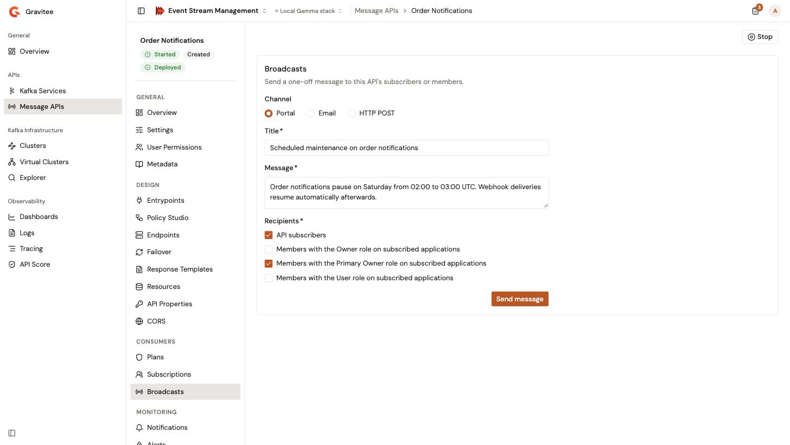

# Broadcast messages to consumers

A broadcast sends a one-off message about a Message API to the people who consume it, for example to announce maintenance or a deprecation. It goes out as a portal notification, by email, or as an HTTP POST request to a URL.

## Prerequisites

* Permission to send messages about the Message API. Without it, the **Broadcasts** item doesn't appear in the Message API sidebar.

## Send a broadcast

1. From the Gamma console, open **Event Stream Management**.
2. In the sidebar, click **Message APIs**.
3. Click the name of the Message API.
4. In the **Consumers** group of the Message API sidebar, click **Broadcasts**.
5. In **Channel**, select how the message goes out: **Portal** sends it as a portal notification, **Email** by email, and **HTTP POST** as a POST request to a URL. The default is **Portal**.
6. Complete the fields of the channel:

<table>
    <thead>
        <tr>
            <th width="160">Field</th>
            <th width="140">Channel</th>
            <th>Description</th>
        </tr>
    </thead>
    <tbody>
        <tr>
            <td><strong>URL</strong></td>
            <td>HTTP POST</td>
            <td>Required. The http or https address that receives the message.</td>
        </tr>
        <tr>
            <td><strong>HTTP headers</strong></td>
            <td>HTTP POST</td>
            <td>Optional. Click <strong>Add header</strong>, then enter the name and the value of each header to send.</td>
        </tr>
        <tr>
            <td><strong>Use system proxy</strong></td>
            <td>HTTP POST</td>
            <td>Optional. Sends the request through the proxy configured for the Management API.</td>
        </tr>
        <tr>
            <td><strong>Title</strong></td>
            <td>Portal, Email</td>
            <td>Required. The title of the message. By email, it's the subject.</td>
        </tr>
        <tr>
            <td><strong>Message</strong></td>
            <td>Every channel</td>
            <td>Required. The text of the message.</td>
        </tr>
        <tr>
            <td><strong>Recipients</strong></td>
            <td>Portal, Email</td>
            <td>Required. Select one or more groups. <strong>API subscribers</strong> sends the message to the users who subscribed to the Message API, whatever the status of their subscription. The other options target one application role each, for example <strong>Members with the Owner role on subscribed applications</strong>, which sends the message to the members that hold that role on the applications with an accepted subscription to the Message API.</td>
        </tr>
    </tbody>
</table>

<figure><figcaption>
The Broadcasts page of a Message API
</figcaption></figure>

7. Click **Send message**. When a required field is empty or invalid, the field shows the problem, for example **Title is required.** or **URL is not valid.**, and nothing is sent.

The message goes out at once, without a confirmation step. When the sending fails, the page shows **Send failed** with the reason.

The Management API sends the HTTP POST request itself, so the URL must be reachable from the Management API. See [Limitations and considerations](limitations-and-considerations.md#network-paths).

## Verification

To verify that the broadcast was sent, follow these steps:

1. Check the confirmation under the form. It reads **Message sent**, with the number of recipients that the message was addressed to. An HTTP POST counts as one recipient.
2. If the number is 0, check the recipients. For example, **API subscribers** reaches no one on a Message API without subscriptions.
