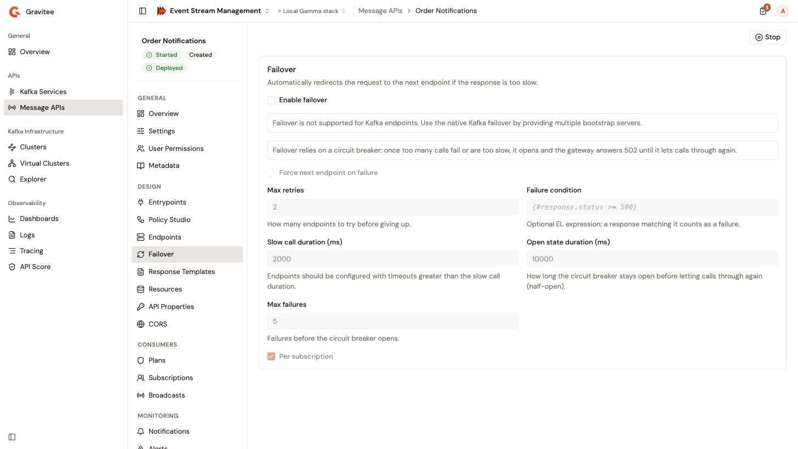

# Configure endpoints and failover

The endpoints of a Message API are the backends that it produces to and consumes from, such as a Kafka cluster or an MQTT broker. Endpoints sit in endpoint groups: a group holds the connector, the load balancing algorithm, and the connection settings that its endpoints share, and each endpoint holds its own settings. Failover retries a failed call to the backend and stops calling a backend that keeps failing.

## Open the endpoints

1. From the Gamma console, open **Event Stream Management**.
2. In the sidebar, click **Message APIs**.
3. Click the name of the Message API.
4. In the **Design** group of the Message API sidebar, click **Endpoints**.

<figure><figcaption>
The Endpoints page of a Message API
</figcaption></figure>

The **Endpoints** card lists the endpoint groups. Each group shows its name, its connector, its load balancing algorithm, and a table of its endpoints with their **Name**, **Weight**, and, when set, **Tenants**. The endpoints of a Kafka group also show their **Bootstrap servers**.

The first group carries the **Default** badge: the Message API uses it to produce and consume. The other groups serve, for example, as the dead letter queue of an entrypoint. See [Configure entrypoints](configure-entrypoints.md#send-failed-messages-to-a-dead-letter-queue).

Without permission to change the Message API's definition, or when the Gravitee Kubernetes Operator manages the Message API, the page is read-only. Each group then offers **View**, and each endpoint a view icon, which open the forms with every field disabled. See [Manage general settings](manage-general-settings.md#kubernetes-managed-message-apis).

Every change on this page is saved as soon as you confirm it, and the console confirms with **API updated**. When a save fails, the card shows **Save failed** with the reason, and the form keeps your input. A change reaches the gateway at the next deployment, and until then the Message API shows **Out of sync**. See [Start, stop, and deploy a Message API](start-stop-and-deploy-a-message-api.md).

## Add an endpoint group

1. Click **Add endpoint group**.
2. Under **Endpoint group type**, select a connector, for example **Kafka**, **MQTT 5.x**, **Solace**, **RabbitMQ**, or **Mock**. The cards cover only the connectors that support the quality of service of every entrypoint of the Message API.
3. In **Group name**, keep the proposed name, `Default <connector> group`, or enter another one.
4. In **Load balancing algorithm**, select **Round robin**, **Random**, **Weighted round robin**, or **Weighted random**. The default is **Round robin**.
5. Complete the `<connector> connection` form, which the endpoints of the group inherit, and the **Endpoint configuration** form of the first endpoint. A **Mock** group has neither form, and shows **Configuration is disabled for Mock endpoint groups.**
6. Click **Create endpoint group**. The button stays disabled while a required field is empty or invalid.

The new group goes to the bottom of the list, with one endpoint named `Default <connector>`. **Back to list** leaves the form without saving.

A group name and an endpoint name are required, can't contain `:`, and must be unique across the groups and the endpoints of the Message API: **Names must be unique across groups and endpoints.** When the proposed name is taken, the console adds a number to it, for example `Default Kafka group-2`.

For **Kafka**, the connection form shows only the producer settings, the consumer settings, or both, depending on what the entrypoints of the Message API need. An entrypoint that receives messages from clients, such as **HTTP POST**, needs a producer. An entrypoint that delivers messages to clients, such as **HTTP GET**, **Server-Sent Events**, or **Webhook**, needs a consumer.

## Manage the groups

* To change a group, click its **Edit** button. Change **Group name**, **Load balancing algorithm**, or the `<connector> connection` form, then click **Save group**.
* To reorder the groups, click the up and down arrows of a group. The group at the top becomes the **Default** group.
* To delete a group, click its delete icon, then click **Delete** in the **Delete endpoint group?** dialog. A Message API keeps at least one endpoint group, so the delete icon is disabled while only one remains, and shows **A Message API needs at least one endpoint group.**

When **Enable failover** is selected on the **Failover** page, each Kafka group shows **Failover is enabled but it is not supported for Kafka endpoints. Use the native Kafka failover by providing multiple bootstrap servers.**

### Groups used as a dead letter queue

An entrypoint can send the messages that it fails to push to a group or to an endpoint of this page. The page keeps the entrypoints in step:

* Renaming a group or an endpoint that serves as a dead letter queue updates the entrypoints that use it. The form says so under the name.
* Deleting it disables the dead letter queue of those entrypoints. The delete dialog names them.
* The default group isn't meant to serve as a dead letter queue. When it does, for example after a reorder, the card says so and names the entrypoints concerned. Move another group to the top, or pick another dead letter queue on the **Entrypoints** page.

## Manage the endpoints of a group

* To add an endpoint, click **Add endpoint** under the group, configure it, then click **Add endpoint**.
* To change an endpoint, click its edit icon, change the fields, then click **Save endpoint**.
* To reorder the endpoints, click the up and down arrows of an endpoint.
* To delete an endpoint, click its delete icon, then click **Delete** in the **Delete endpoint?** dialog. While the Message API has a single group, its last endpoint can't be deleted, and the delete icon shows **At least one endpoint is required.**

### Configure an endpoint

An endpoint has the following fields:

<table>
    <thead>
        <tr>
            <th width="220">Field</th>
            <th>Description</th>
        </tr>
    </thead>
    <tbody>
        <tr>
            <td><strong>Endpoint name</strong></td>
            <td>Required. A new endpoint is named <code>&lt;group name&gt; endpoint</code>.</td>
        </tr>
        <tr>
            <td><strong>Endpoint configuration</strong></td>
            <td>The settings of the endpoint itself, built from the connector. A <strong>Mock</strong> endpoint doesn't have it.</td>
        </tr>
        <tr>
            <td><strong>Weight</strong></td>
            <td>Required. A whole number of 1 or more, used by the <strong>Weighted round robin</strong> and <strong>Weighted random</strong> algorithms. The default is 1.</td>
        </tr>
        <tr>
            <td><strong>Tenants</strong></td>
            <td>Optional. A gateway that runs with one of the selected tenants uses this endpoint. Leave it empty to make the endpoint available to every gateway.</td>
        </tr>
        <tr>
            <td><strong>Inherit configuration from the endpoint group</strong></td>
            <td>Selected for a new endpoint: the endpoint uses the connection settings of its group. Clear it to show the <strong>Connection override</strong> form, prefilled with the connection settings of the group, and change them for this endpoint only. The checkbox appears for the connectors that have group connection settings.</td>
        </tr>
    </tbody>
</table>

## Configure failover

<figure><figcaption>
The failover settings of a Message API
</figcaption></figure>

1. In the **Design** group of the Message API sidebar, click **Failover**.
2. Select **Enable failover**. The other fields become editable.
3. Complete the following fields. A field that the Message API doesn't set shows its default value.

<table>
    <thead>
        <tr>
            <th width="220">Field</th>
            <th>Description</th>
        </tr>
    </thead>
    <tbody>
        <tr>
            <td><strong>Force next endpoint on failure</strong></td>
            <td>Retries a failed call on the next endpoint of the group, instead of the endpoint that the load balancer picks. The first attempt always uses the load balancer. Cleared by default.</td>
        </tr>
        <tr>
            <td><strong>Max retries</strong></td>
            <td>How many times the gateway retries a failed call to the backend before it fails the request. 0 or more. The default is 2.</td>
        </tr>
        <tr>
            <td><strong>Failure condition</strong></td>
            <td>Optional. An expression, for example <code>{#response.status >= 500}</code>. A response that matches it counts as a failure.</td>
        </tr>
        <tr>
            <td><strong>Slow call duration (ms)</strong></td>
            <td>How long each attempt to reach the backend can run before the gateway abandons it and retries. A call that takes longer than this in total, retries included, counts as slow. 50 or more. The default is 2000. Configure the endpoints with timeouts greater than this duration.</td>
        </tr>
        <tr>
            <td><strong>Open state duration (ms)</strong></td>
            <td>How long the circuit breaker stays open before the gateway tries the backend again with a single call. 500 or more. The default is 10000.</td>
        </tr>
        <tr>
            <td><strong>Max failures</strong></td>
            <td>How many recent calls the circuit breaker weighs. When that many calls have all failed, or have all run slow, the circuit breaker opens, and the gateway stops calling the backend. 1 or more. The default is 5.</td>
        </tr>
        <tr>
            <td><strong>Per subscription</strong></td>
            <td>Keeps a separate circuit breaker for each subscription instead of one for the whole Message API. Selected by default.</td>
        </tr>
    </tbody>
</table>

4. In the save bar at the bottom of the page, click **Save changes**.
5. If **Per subscription** is cleared, the **Use a global circuit breaker?** dialog warns that one circuit breaker is shared by every consumer. Click **Yes, update it**.

While the circuit breaker is open, the gateway answers `502`. A number field that is empty, not a whole number, or under its minimum shows **A whole number is required.** or **Must be <minimum> or more.**, and **Save changes** doesn't save until you fix it.

When the Message API has a Kafka endpoint group, the page shows **Failover is not supported for Kafka endpoints. Use the native Kafka failover by providing multiple bootstrap servers.**

The console confirms with **API updated**. Like the endpoints, failover reaches the gateway at the next deployment.

Clearing **Enable failover** keeps the other values, so they're back the next time you select it.

Without permission to change the Message API's definition, or when the Gravitee Kubernetes Operator manages the Message API, the **Failover** page is read-only.

## Verification

To verify that the endpoints and failover are saved, follow these steps:

1. Reload the **Endpoints** page, and check that each endpoint group lists the endpoints you expect, with their weight and tenants.
2. Click **Edit** on a group, and check that the connection form shows the settings you entered.
3. Open **Failover**, and check that **Enable failover** and the values you entered are still set.
4. Check that the header of the Message API sidebar shows **Out of sync** until you deploy.
